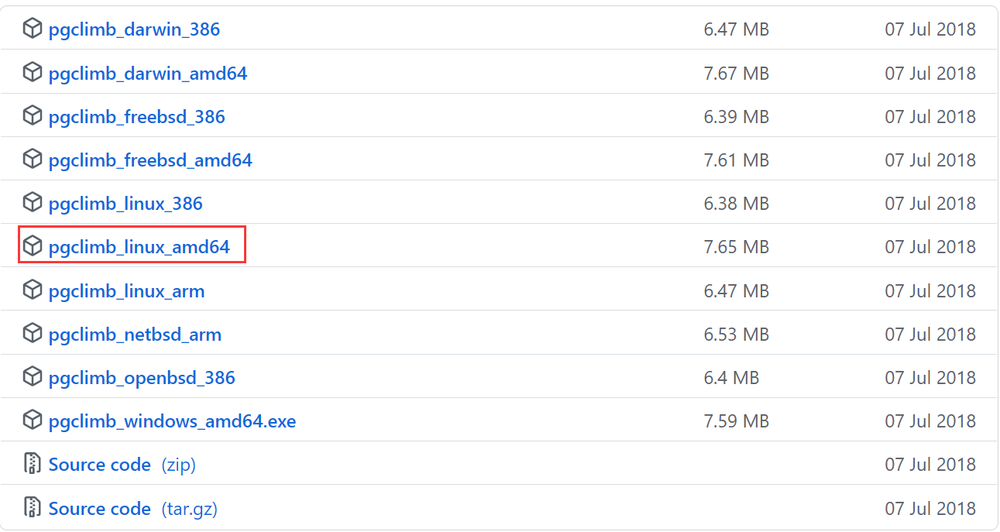
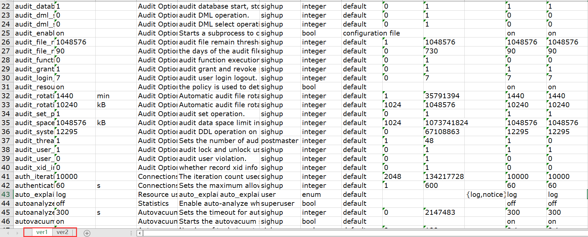
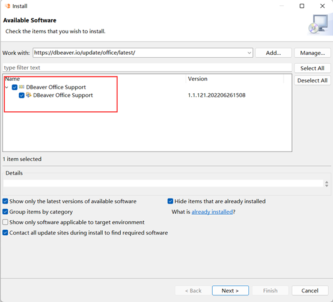
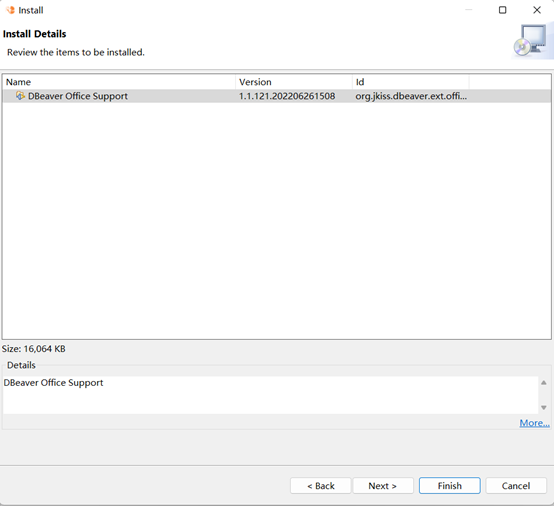
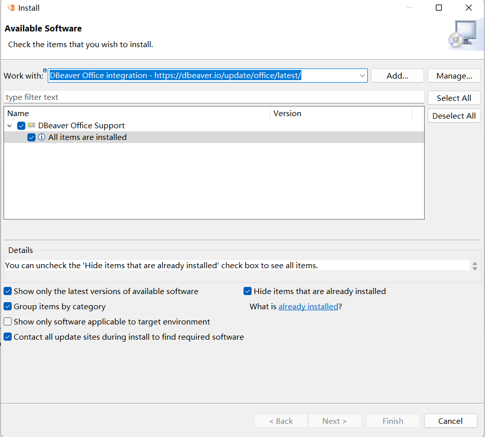
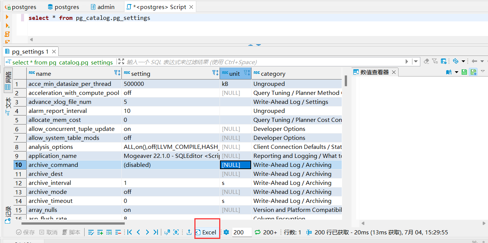

# MogDB 3.0 数据库导出 Excel

本文出处：[https://www.modb.pro/db/428155](https://www.modb.pro/db/428155)

MogDB 3.0 已于 6 月 30 号正式发布，下载地址：[https://www.mogdb.io/download](https://www.mogdb.io/download)

本文将介绍 MogDB 数据库两种导出 Excel 的方法

### 一、使用 pgclimb 工具

pgclimb 的地址为：[https://github.com/lukasmartinelli/pgclimb](https://github.com/lukasmartinelli/pgclimb)：

我们直接下载对应平台的二进制文件。

这里解压重命名为 pgclimb

```
$ ./tools/pgclimb --version
pgclimb version 0.2
```

下面通过查询语句导出 pg_settings 到 pg_settings.xlsx

```
./tools/pgclimb --host=192.168.137.250 --port=3000 \
--dbname=postgres --username=admin --password=Admin@1234 \
--output=pg_settings.xlsx \
--query="select * from pg_settings" \
xlsx --sheet "ver1"
```

然后我们也可以继续在 pg_settings.xlsx 文件追加导出新的 sheet

```
./tools/pgclimb --host=192.168.137.250 --port=3000 \
--dbname=postgres --username=admin --password=Admin@1234 \
--output=pg_settings.xlsx \
--query="select * from pg_settings" \
xlsx --sheet "ver2"
```

这样我们导出的 pg_settings.xlsx 将包括 ver1 和 ver2 两个表格，如下图：


### 二、使用 Mogeaver 图形工具安装 POI 插件

#### 安装插件

打开 Mogeaver 图形工具，点击“帮助”–>“Install New Software…”
输入地址：https://dbeaver.io/update/office/latest/

选择上面的插件，然后点击“Next”

点击“Finish”开始下载 jar 进行安装，中间弹出 jar 包是否对其 Trust，需要点击 Trust 信任，最后重启图形工具。

#### 确认插件安装成功

可以再次点击“帮助”–>“Install New Software…”，然后下拉找到 DBeaver Office integration - [https://dbeaver.io/update/office/latest/](https://dbeaver.io/update/office/latest/)
看到如下图：All items are installed


#### 查询导出 Excel

打开 SQL 编辑器，查询数据后可以看到下图有个 Excel 按钮，点击该按钮会导出 Excel 本地文件。

