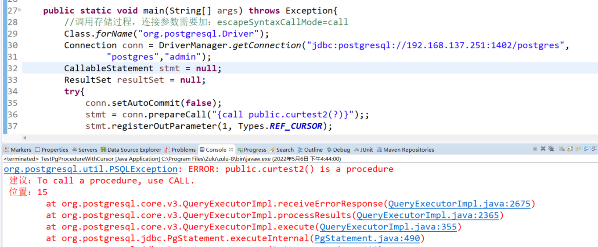
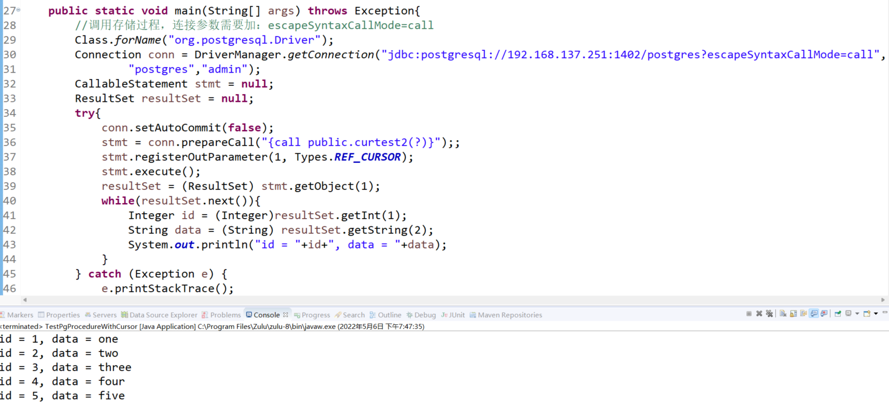
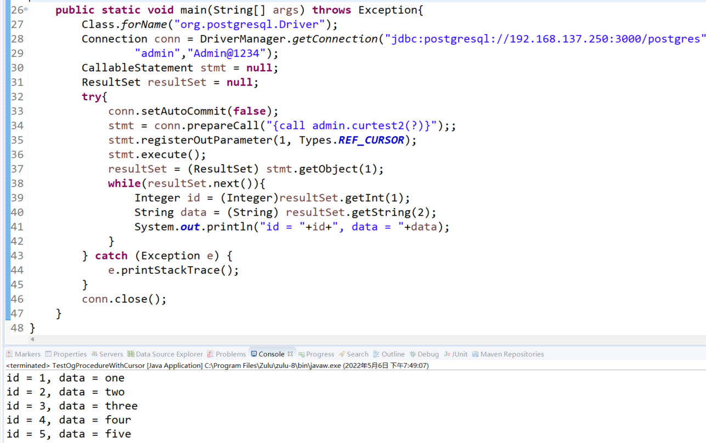
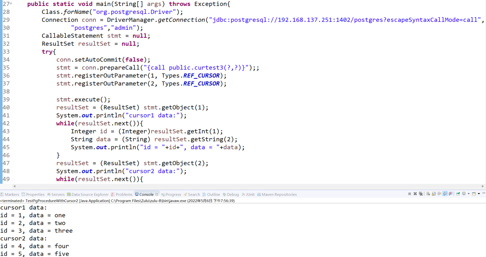
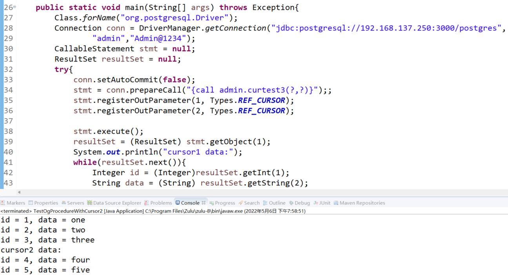

# 当 JDBC 遇上返回 Cursor

本文出处：[https://www.modb.pro/db/400426](https://www.modb.pro/db/400426)

使用 jdbc 访问 PostgreSQL 或者 MogDB(openGauss)数据库里的 cursor 游标时，官方文档可查的资料较少，下面的示例供参考。

### 测试环境

- JDBC：postgresql-42.3.5.jar
- PG: 14.2
- MogDB(openGauss): 3.0.0

### 测试背景

针对 function 和 procedure 返回 cursor 游标类型，通过 jdbc 如何调用。

测试 function：curtest1，通过 returns 返回游标类型

```
create or replace function curtest1()
returns refcursor
language plpgsql
as $function$
declare
    cur refcursor;
begin
    open cur for select id,data from fiverows;
    return cur;
end;
$function$;
```

测试 procedure：curtest2，通过 out 参数返回游标类型

```
create or replace procedure curtest2(out cur refcursor)
language plpgsql
as $procedure$
begin
    open cur for select id,data from fiverows;
end;
$procedure$;
```

测试 procedure：curtest3，通过 out 参数返回多个游标类型

```
create or replace procedure curtest3(out cur1 refcursor,out cur2 refcursor)
language plpgsql
as $procedure$
begin
    open cur1 for select id,data from fiverows where id between 1 and 3;
    open cur2 for select id,data from fiverows where id between 4 and 5;
end;
$procedure$;
```

表结构及数据

```
create table fiverows(id serial primary key,data text);
insert into fiverows(data) values('one'),('two'),
                       ('three'),('four'),('five');
```

### 测试一：function 通过 returns 返回游标

function 返回游标在 PostgreSQL 或者 MogDB(openGauss)数据库里访问的代码参考如下：

```
	public static void main(String[] args) throws Exception{
	    Class.forName("org.postgresql.Driver");
	    Connection conn = DriverManager.getConnection("jdbc:postgresql://192.168.137.251:1402/postgres","postgres","admin");
	    CallableStatement stmt = null;
	    ResultSet resultSet = null;
            try{
        	conn.setAutoCommit(false);
        	stmt = conn.prepareCall("{? = call public.curtest1()}");;
        	stmt.registerOutParameter(1, Types.REF_CURSOR);
        	stmt.setCursorName("mycur1");
        	stmt.execute();
        	resultSet = (ResultSet) stmt.getObject(1);
        	while(resultSet.next()){
        		Integer id = (Integer)resultSet.getInt(1);
        		String data = (String) resultSet.getString(2);
        		System.out.println("id = "+id+", data = "+data);
        	}

            } catch (Exception e) {
                e.printStackTrace();
            }
            conn.close();
	}
```

注意下面这几点： 1.使用 CallableStatement 2.使用 Types.REF_CURSOR 注册输出参数
3.Statement 执行后，再通过 Statement 获取结果集

### 测试二：procedure 通过 out 参数返回游标

procedure 返回游标在 PostgreSQL 或者 MogDB(openGauss)数据库里有一点差异：主要是 escapeSyntaxCallMode 参数。

#### PostgreSQL

procedure 返回游标的 jdbc 代码跟上面 function 测试类似：

```
	public static void main(String[] args) throws Exception{
	    Class.forName("org.postgresql.Driver");
	    Connection conn = DriverManager.getConnection("jdbc:postgresql://192.168.137.251:1402/postgres?escapeSyntaxCallMode=call", "postgres","admin");
	    CallableStatement stmt = null;
	    ResultSet resultSet = null;
            try{
        	conn.setAutoCommit(false);
        	stmt = conn.prepareCall("{call public.curtest2(?)}");;
        	stmt.registerOutParameter(1, Types.REF_CURSOR);

        	stmt.execute();
        	resultSet = (ResultSet) stmt.getObject(1);
        	while(resultSet.next()){
        		Integer id = (Integer)resultSet.getInt(1);
        		String data = (String) resultSet.getString(2);
        		System.out.println("id = "+id+", data = "+data);
        	}
            } catch (Exception e) {
                e.printStackTrace();
            }
            conn.close();
	}
```

不过执行上面的代码客户端会报下面的错误：


错误信息提示并不是很明确，查找资料发现大概与 escapeSyntaxCallMode 参数有关，该参数的官方链接如下：https://jdbc.postgresql.org/documentation/head/connect.html

> Specifies how the driver transforms JDBC escape call syntax into underlying SQL, for invoking procedures or functions. In escapeSyntaxCallMode=select mode (the default), the driver always uses a SELECT statement (allowing function invocation only). In escapeSyntaxCallMode=callIfNoReturn mode, the driver uses a CALL statement (allowing procedure invocation) if there is no return parameter specified, otherwise the driver uses a SELECT statement. In escapeSyntaxCallMode=call mode, the driver always uses a CALL statement (allowing procedure invocation only).

自 PostgreSQL v11 开始支持 procedure，PostgreSQL JDBC 驱动也配套引入了 escapeSyntaxCallMode 参数，该参数有三种值，默认是第一种 func，系统理解为 function 来调用；第二种是 call，系统理解为 procedure 来调用；第三种是系统根据定义自动猜测。

上面的 connection 连接串加上 escapeSyntaxCallMode 参数，修改成：

```
jdbc:postgresql://192.168.137.251:1402/postgres?escapeSyntaxCallMode=call
```

则可正常执行



#### MogDB(openGauss)

procedure 返回游标的 jdbc 代码与 function 测试类似，并且也不需要设置 escapeSyntaxCallMode 参数。


procedure 创建语法有差异，代码如下：

```
create or replace procedure curtest2(out cur refcursor)  as begin     open cur for select id,data from fiverows; end;
```

### 测试三：procedure 通过 out 参数返回多个游标

返回多个游标与测试二类似，也是同样支持，在 PostgreSQL 也是需要设置 escapeSyntaxCallMode 参数，MogDB(openGauss)不需要设置。

#### PostgreSQL

jdbc 代码如下：

```
	public static void main(String[] args) throws Exception{
	    Class.forName("org.postgresql.Driver");
	    Connection conn = DriverManager.getConnection("jdbc:postgresql://192.168.137.251:1402/postgres?escapeSyntaxCallMode=call","postgres","admin");
	    CallableStatement stmt = null;
	    ResultSet resultSet = null;
            try{
        	conn.setAutoCommit(false);
        	stmt = conn.prepareCall("{call public.curtest3(?,?)}");;
        	stmt.registerOutParameter(1, Types.REF_CURSOR);
        	stmt.registerOutParameter(2, Types.REF_CURSOR);
        	stmt.execute();
        	resultSet = (ResultSet) stmt.getObject(1);
        	System.out.println("cursor1 data:");
        	while(resultSet.next()){
        		Integer id = (Integer)resultSet.getInt(1);
        		String data = (String) resultSet.getString(2);
        		System.out.println("id = "+id+", data = "+data);
        	}
        	resultSet = (ResultSet) stmt.getObject(2);
        	System.out.println("cursor2 data:");
        	while(resultSet.next()){
        		Integer id = (Integer)resultSet.getInt(1);
        		String data = (String) resultSet.getString(2);
        		System.out.println("id = "+id+", data = "+data);
        	}

            } catch (Exception e) {
                e.printStackTrace();
            }
            conn.close();
	}
```

测试结果如下：


#### MogDB(openGauss)

与测试二类似，不需要设置 escapeSyntaxCallMode 参数。


procedure 创建语法有差异，代码如下：

```
create or replace procedure curtest3(out cur1 refcursor,out cur2 refcursor)
as
begin
    open cur1 for select id,data from fiverows where id between 1 and 3;
    open cur2 for select id,data from fiverows where id between 4 and 5;
end;
```

结论通过 jdbc 访问 function 里的 returns cursor 或者 procedure 里的 out cursor 类型都支持。
区别在于 procedure 的 out cursor 类型，在 PostgreSQL 需要设置 escapeSyntaxCallMode=call，MogDB(openGauss)数据库不需要。
