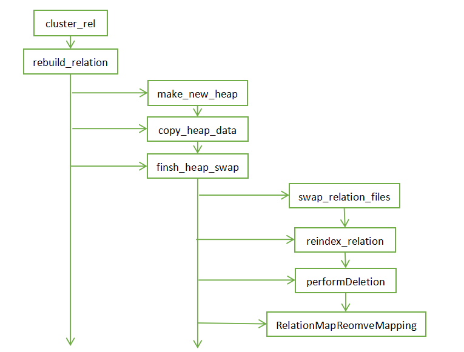
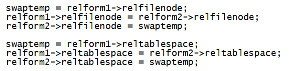

# openGauss/PostgreSQL vacuum full 源码解析<a name="ZH-CN_TOPIC_0291959525"></a>

PostgreSQL 和 opengauss 通过 vacuum 过程来清理无效的元组，普通的 vacuum 只清理死元组，释放的页面空闲空间新元组可以使用，但不会反映到磁盘上，而 vacuum full 会进行重组，保留页面最小大小，释放磁盘空间。

在源码中普通 vacuum 和 vacuum full 并不是放在一起的，vacuum full 是和 cluster 过程放在一起的。在 pg 中 vacuum full 相关过程在 src/backend/commands/cluster.c 中，opengauss 则在 src/gausskernel/optimizer/commands/cluster.cpp 中，在 cluster.c 开头有如下描述：cluster.c CLUSTER a table on an index. This is now also used for VACUUM FULL.

我整理了一下 vacuum full 的大体函数结构和调用关系，这里只列出对于一个普通表的 vacuum full 操作的主要步骤，当然对于分区表和 toast 表有一些额外的处理，不再列出。



```
cluster_rel(){

    rebuild_relation(){

        make_new_heap()

        copy_heap_data()

        finsh_heap_swap(){

            swap_relation_files()

            reindex_relation()

            performDeletion()

            RelationMapRemoveMapping()

        }

    }

}
```

从上面的流程可以看到 vacuum full 的过程，主函数是 cluster_rel，cluster_rel 调用 rebuild_relation，所以 vacuum full 其实是表重建的一个过程，rebuild_relation 函数会调用三个大的步骤，make_new_heap-\>copy_heap_data-\>finsh_heap_swap，先创建新的临时表，然后拷贝数据，最后调用 finsh_heap_swap 函数完成切换，finsh_heap_swap 又分为交换数据文件、重建索引、清理临时表、清除映射关系几个步骤。

从源码中看 make_new_heap 会调用 heap_create_with_catalog\(\)函数进行新的临时表创建，表名为 pg_temp\_%u。

copy_heap_data 函数的过程是：初始化新旧元组，置 use_wal 标识（copy 过程需要记录 wal 日志），计算 freezexid 用以剔除死元组，置新表 relfrozenxid 值，通过优化器评估使用 indexscan 还是 seqscan 算法进行扫描，扫描元组，记录日志，加排他锁，写入新堆表。由于代码太长，不再贴进来。

拷贝完数据后调用 finsh_heap_swap 函数完成切换，第一步 swap_relation_files 切换表的 oid、tablespace 等信息。



再调用 reindex_relation 函数进行索引的重建，这里很有意思，因为之前我曾遇到一个现象，在我之前进行对象异常测试的时候，我模拟过几个场景：第一个是在并发创建索引（create index concurrently）的过程中模拟异常，关于并发创建索引的过程可以参考我之前这篇文章：《PostgreSQL 在线创建索引你不得不注意的"坑"》，这样就会留下一个 invaild 的索引，这个索引是无法使用的，但是在数据表更新的时候这个索引依然会维护，消耗资源，在发生这个情况后我做了一个 vacuum full，做完之后竟然惊奇的发现这个索引（索引名没变，索引 oid 变了）变成了可用的索引，查询也能正常走到索引，看了源码后现在就明白了，vacuum full 中途会进行索引的重建。

另外一个场景也很有意思，我模拟索引文件的丢失，通过索引 oid 找到索引对应的磁盘文件，磁盘文件按照 1G 一个进行分割，这边模拟删除一个文件，如果使用\\di+查看索引的大小你会发现索引也小了这么多，但是正常的那部分索引依旧可用，只影响丢的那部分，但是有一个例外情况，如果丢失的是索引的第一个文件，那么查询如果使用到索引的时候会报出如下文件找不到的报错：ERROR: could not open file "base/16385/74149": No such file or directory，因为一些文件头信息丢失了。

最后就是删除临时表，同时删除临时表的 map 信息。
