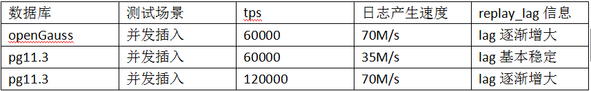

# openGauss 中的并行回放以及和 PG 的对比<a name="ZH-CN_TOPIC_0291959521"></a>

openGauss 在非极致 rto 特性下通过 recovery_max_workers 和 recovery_parallelism 参数控制并行回放的线程数。下面测试一下效果，可以通过停止备库来模拟主库 xlog 堆积，此处统一模拟堆积到 1000 个 xlog 后启动备库，来进行应用和回放，最终统计回放完成时间。可以通过比对 receiver_replay_location 和 receiver_flush_location 之间的差距来判断是否回放完成。

由于 recovery_max_workers 和 recovery_parallelism 参数具有联动性，设置一个另外一个会自动设置为相同的值，此处只设置 recovery_max_workers。

## recovery_max_workers=1<a name="section92269010480"></a>

停止备库，启动压测程序，待 xlog 达到 1000 时关闭压测程序。

```
[omm@db01 gaussdata]$ ll pg_xlog/ |wc -l
1000
[omm@db02 pg_xlog]$ gs_ctl start -M standby
[omm@db02 pg_xlog]$ date
Wed Sep 16 15:26:53 CST 2020
```

可以看到处于 catchup 过程：

```
[omm@db02 pg_xlog]$ gs_ctl query
[2020-09-16 15:27:12.958][213287][][gs_ctl]: gs_ctl query ,datadir is (null)
 HA state:
        local_role                     : Standby
        static_connections             : 2
        db_state                       : Catchup
        detail_information             : Normal


 Senders info:
No information
 Receiver info:
        receiver_pid                   : 211639
        local_role                     : Standby
        peer_role                      : Primary
        peer_state                     : Normal
        state                          : Catchup
        sender_sent_location           : 3C/28800000
        sender_write_location          : 3D/EE528328
        sender_flush_location          : 3D/EE528328
        sender_replay_location         : 3D/EE528328
        receiver_received_location     : 3C/28000000
        receiver_write_location        : 3C/27000000
        receiver_flush_location        : 3C/27000000
        receiver_replay_location       : 3A/8F4A9910
        sync_percent                   : 97%
        channel                        : 192.168.1.2:48458<--192.168.1.1:5533
```

过一段时间发现追平了，但是 receiver_replay_location 和 receiver_flush_location 之间有差距，持续观察：

```
[omm@db02 pg_xlog]$ gs_ctl query[2020-09-16 15:32:08.432][237296][][gs_ctl]: gs_ctl query ,datadir is (null) HA state:                   local_role                     : Standby        static_connections             : 2        db_state                       : Normal        detail_information             : Normal Senders info:       No information Receiver info:              receiver_pid                   : 211639        local_role                     : Standby        peer_role                      : Primary        peer_state                     : Normal        state                          : Normal        sender_sent_location           : 3D/FC647630        sender_write_location          : 3D/FC647630        sender_flush_location          : 3D/FC647630        sender_replay_location         : 3D/FC647630        receiver_received_location     : 3D/FC647630        receiver_write_location        : 3D/FC647630        receiver_flush_location        : 3D/FC647630        receiver_replay_location       : 3D/FC647630        sync_percent                   : 100%        channel                        : 192.168.1.2:48458<--192.168.1.1:5533


[omm@db02 pg_xlog]$ date
Wed Sep 16 15:32:09 CST 2020
```

总共耗时：316s

## recovery_max_workers=8<a name="section9472142075310"></a>

```
[omm@db01 gaussdata]$ ll pg_xlog |wc -l
1002
```

启动一个备库，开始追数和回放。

```
[omm@db02 gaussdata]$ date
Thu Sep 17 09:32:59 CST 2020
[omm@db02 gaussdata]$ gs_ctl query
[2020-09-17 09:33:02.663][53466][][gs_ctl]: gs_ctl query ,datadir is (null)
 HA state:
        local_role                     : Standby
        static_connections             : 2
        db_state                       : Catchup
        detail_information             : Normal


 Senders info:
No information
 Receiver info:
        receiver_pid                   : 53065
        local_role                     : Standby
        peer_role                      : Primary
        peer_state                     : Normal
        state                          : Catchup
        sender_sent_location           : 44/65800000
        sender_write_location          : 47/A600A858
        sender_flush_location          : 47/A600A858
        sender_replay_location         : 47/A600A858
        receiver_received_location     : 44/65800000
        receiver_write_location        : 44/65000000
        receiver_flush_location        : 44/65000000
        receiver_replay_location       : 44/432AFCC8
        sync_percent                   : 95%
        channel                        : 192.168.1.2:38322<--192.168.1.1:5533
```

稳定后：

```
[omm@db02 gaussdata]$ gs_ctl query
[2020-09-17 09:41:05.963][93661][][gs_ctl]: gs_ctl query ,datadir is (null)
 HA state:
        local_role                     : Standby
        static_connections             : 2
        db_state                       : Normal
        detail_information             : Normal


 Senders info:
No information
 Receiver info:
        receiver_pid                   : 53065
        local_role                     : Standby
        peer_role                      : Primary
        peer_state                     : Normal
        state                          : Normal
        sender_sent_location           : 47/AF961308
        sender_write_location          : 47/AF961308
        sender_flush_location          : 47/AF961308
        sender_replay_location         : 47/AF961308
        receiver_received_location     : 47/AF961308
        receiver_write_location        : 47/AF961308
        receiver_flush_location        : 47/AF961308
        receiver_replay_location       : 47/AF961308
        sync_percent                   : 100%
        channel                        : 192.168.1.2:38322<--192.168.1.1:5533


[omm@db02 gaussdata]$ date
Thu Sep 17 09:41:07 CST 2020
```

总耗时：428s

可以看到并行回放并没有起到作用，甚至开启多线程回放后反而回放变慢了。

测试过程中大致看了下日志产生速度：70M/s，插入的数据每秒 6 万条，而 pg 中在插入每秒 6 万条的时候，日志产生速度只有 35M/s 左右，是 openGauss 的一半，这块也需要优化。在极限测试情况下，在 150 并发时，pg 的日志产生速度大概 70M/s，tps 大概是每秒 13 万行的插入，此时 replay_lag 确实在逐渐增大，说明在这个大小的日志产生速度下，pg 已经回放不过来这么大量的日志。openGauss 在 6 万 tps 插入时已经达到这么大日志量。



所以从上面的表格以及测试结果可以看到首先开启并行回放参数不会加快回放速度，甚至回放速度回变慢，openGauss 备库回放跟不上的原因并不在于 openGauss 的回放速度比 pg 慢，回放速度他俩是差不多的，而在于 openGauss 在插入同样的数据时产生的日志量是 pg 的两倍，这样造成它的回放跟不上。这个日志量的问题需要解决。
