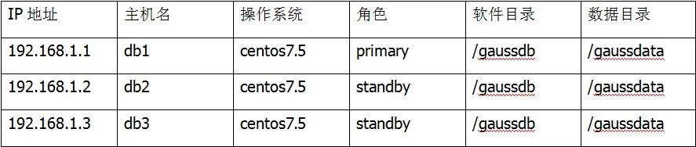

# 不使用 om 工具如何手工部署 openGauss 主从流复制环境<a name="ZH-CN_TOPIC_0293240559"></a>

## 背景<a name="section84151858112416"></a>

PostgresSQL 在 9.1 之后引入了主从的流复制机制，所谓流复制，就是从服务器通过 tcp 流从主服务器中同步相应的数据。这样当主服务器数据丢失时从服务器中仍有备份。与基于文件日志传送相比，流复制允许保持从服务器更新。从服务器连接主服务器，其产生的流 WAL 记录到从服务器， 而不需要等待主服务器写完 WAL 文件。

同步复制必须等主服务器和从服务器都写完 WAL 后才能提交事务。这样在一定程度上会增加事务的响应时间。配置同步复制仅需要一个额外的配置步骤：synchronous_standby_names 必须设置为一个非空值。

备注:主从服务器所在节点的系统、环境等最好一致。openGauss 版本也最好一致，否则可能会有问题。

**图 1** 系统环境信息<a name="fig1787320451873"></a>  


## 二进制安装 openGauss<a name="section750720910815"></a>

首先在三台机器上分别部署 openGauss 二进制安装包，直接解压配置环境变量就可以使用。

解压，配置环境变量。

```
tar zxvf openGauss-1.0.0-CentOS-64bit.tar.bz2
vi ~/.bashrc
export LD_LIBRARY_PATH=/gaussdata/opendb/lib:$LD_LIBRARY_PATH
export PATH=/gaussdata/opendb/bin:$PATH
```

## 流复制搭建<a name="section1428144895"></a>

配置 pg_hba.conf 文件-主备，修改 pg_hba.conf，添加各对端白名单。

```
host    all         all           192.168.1.1/32         trust
host    all         all           192.168.1.2/32         trust
host    all         all           192.168.1.3/32         trust
```

配置 postgresql.conf 文件-主备。

**表 1** postgresql.conf 文件-主备

<a name="table934014314420"></a>

<table><thead ><tr id="row19341731542"><th class="cellrowborder"  width="33.33333333333333%" id="mcps1.2.4.1.1"><p id="p2341231642"><a name="p2341231642"></a><a name="p2341231642"></a>参数</p>
</th>
<th class="cellrowborder"  width="33.33333333333333%" id="mcps1.2.4.1.2"><p id="p734112311947"><a name="p734112311947"></a><a name="p734112311947"></a>参数（供参考，按实际配置）</p>
</th>
<th class="cellrowborder"  width="33.33333333333333%" id="mcps1.2.4.1.3"><p id="p73411931841"><a name="p73411931841"></a><a name="p73411931841"></a>参数描述</p>
</th>
</tr>
</thead>
<tbody><tr id="row1434112315420"><td class="cellrowborder"  width="33.33333333333333%" headers="mcps1.2.4.1.1 "><p id="p7360192014616"><a name="p7360192014616"></a><a name="p7360192014616"></a>listen_addresses</p>
</td>
<td class="cellrowborder"  width="33.33333333333333%" headers="mcps1.2.4.1.2 "><p id="p7360122020612"><a name="p7360122020612"></a><a name="p7360122020612"></a>*</p>
</td>
<td class="cellrowborder"  width="33.33333333333333%" headers="mcps1.2.4.1.3 "><p id="p23608201069"><a name="p23608201069"></a><a name="p23608201069"></a>监听所有IP</p>
</td>
</tr>
<tr id="row13342131044"><td class="cellrowborder"  width="33.33333333333333%" headers="mcps1.2.4.1.1 "><p id="p736012201466"><a name="p736012201466"></a><a name="p736012201466"></a>port</p>
</td>
<td class="cellrowborder"  width="33.33333333333333%" headers="mcps1.2.4.1.2 "><p id="p1836092016619"><a name="p1836092016619"></a><a name="p1836092016619"></a>5432</p>
</td>
<td class="cellrowborder"  width="33.33333333333333%" headers="mcps1.2.4.1.3 "><p id="p93601620969"><a name="p93601620969"></a><a name="p93601620969"></a>监听端口</p>
</td>
</tr>
<tr id="row53425311446"><td class="cellrowborder"  width="33.33333333333333%" headers="mcps1.2.4.1.1 "><p id="p10361142010615"><a name="p10361142010615"></a><a name="p10361142010615"></a>local_bind_address</p>
</td>
<td class="cellrowborder"  width="33.33333333333333%" headers="mcps1.2.4.1.2 "><p id="p1036162018617"><a name="p1036162018617"></a><a name="p1036162018617"></a>监听IP地址</p>
</td>
<td class="cellrowborder"  width="33.33333333333333%" headers="mcps1.2.4.1.3 "><p id="p163616201069"><a name="p163616201069"></a><a name="p163616201069"></a>本机监听地址</p>
</td>
</tr>
<tr id="row83421311048"><td class="cellrowborder"  width="33.33333333333333%" headers="mcps1.2.4.1.1 "><p id="p836132013617"><a name="p836132013617"></a><a name="p836132013617"></a>pgxc_node_name</p>
</td>
<td class="cellrowborder"  width="33.33333333333333%" headers="mcps1.2.4.1.2 "><p id="p10361520567"><a name="p10361520567"></a><a name="p10361520567"></a>DN的nodename</p>
</td>
<td class="cellrowborder"  width="33.33333333333333%" headers="mcps1.2.4.1.3 "><p id="p436102020612"><a name="p436102020612"></a><a name="p436102020612"></a>-</p>
</td>
</tr>
<tr id="row103431316414"><td class="cellrowborder"  width="33.33333333333333%" headers="mcps1.2.4.1.1 "><p id="p636102011611"><a name="p636102011611"></a><a name="p636102011611"></a>enable_data_replicate</p>
</td>
<td class="cellrowborder"  width="33.33333333333333%" headers="mcps1.2.4.1.2 "><p id="p23613201666"><a name="p23613201666"></a><a name="p23613201666"></a>off</p>
</td>
<td class="cellrowborder"  width="33.33333333333333%" headers="mcps1.2.4.1.3 "><p id="p1736220200616"><a name="p1736220200616"></a><a name="p1736220200616"></a>-</p>
</td>
</tr>
<tr id="row9343103117414"><td class="cellrowborder"  width="33.33333333333333%" headers="mcps1.2.4.1.1 "><p id="p1236218204620"><a name="p1236218204620"></a><a name="p1236218204620"></a>replication_type</p>
</td>
<td class="cellrowborder"  width="33.33333333333333%" headers="mcps1.2.4.1.2 "><p id="p536220209618"><a name="p536220209618"></a><a name="p536220209618"></a>1</p>
</td>
<td class="cellrowborder"  width="33.33333333333333%" headers="mcps1.2.4.1.3 "><p id="p18362172010615"><a name="p18362172010615"></a><a name="p18362172010615"></a>-</p>
</td>
</tr>
<tr id="row33442315414"><td class="cellrowborder"  width="33.33333333333333%" headers="mcps1.2.4.1.1 "><p id="p536214201560"><a name="p536214201560"></a><a name="p536214201560"></a>application_name</p>
</td>
<td class="cellrowborder"  width="33.33333333333333%" headers="mcps1.2.4.1.2 "><p id="p11362120465"><a name="p11362120465"></a><a name="p11362120465"></a>DN的nodename</p>
</td>
<td class="cellrowborder"  width="33.33333333333333%" headers="mcps1.2.4.1.3 "><p id="p3362152019611"><a name="p3362152019611"></a><a name="p3362152019611"></a>-</p>
</td>
</tr>
<tr id="row19468156616"><td class="cellrowborder"  width="33.33333333333333%" headers="mcps1.2.4.1.1 "><p id="p10362102020619"><a name="p10362102020619"></a><a name="p10362102020619"></a>replconninfo1</p>
</td>
<td class="cellrowborder"  width="33.33333333333333%" headers="mcps1.2.4.1.2 "><p id="p636317201667"><a name="p636317201667"></a><a name="p636317201667"></a>localhost=192.168.1.1 localport=5433 localservice=5434 remotehost=192.168.1.3 remoteport=5433 remoteservice=5434</p>
</td>
<td class="cellrowborder"  width="33.33333333333333%" headers="mcps1.2.4.1.3 "><p id="p43631920563"><a name="p43631920563"></a><a name="p43631920563"></a>主备的流复制参数，最多支持6个备机，因此最多可配6个通道。无论准备，分别配置对端的所有DN的复制通道，无先后顺序区别。</p>
</td>
</tr>
<tr id="row1748151517619"><td class="cellrowborder"  width="33.33333333333333%" headers="mcps1.2.4.1.1 "><p id="p1636319201361"><a name="p1636319201361"></a><a name="p1636319201361"></a>replconninfo2</p>
</td>
<td class="cellrowborder"  width="33.33333333333333%" headers="mcps1.2.4.1.2 "><p id="p6363172013611"><a name="p6363172013611"></a><a name="p6363172013611"></a>localhost=192.168.1.1 localport=5433 localservice=5434 remotehost=192.168.1.2 remoteport=5433 remoteservice=5434</p>
</td>
<td class="cellrowborder"  width="33.33333333333333%" headers="mcps1.2.4.1.3 "><p id="p23640201367"><a name="p23640201367"></a><a name="p23640201367"></a>-</p>
</td>
</tr>
<tr id="row34891510619"><td class="cellrowborder"  width="33.33333333333333%" headers="mcps1.2.4.1.1 "><p id="p1836413202611"><a name="p1836413202611"></a><a name="p1836413202611"></a>max_connections</p>
</td>
<td class="cellrowborder"  width="33.33333333333333%" headers="mcps1.2.4.1.2 "><p id="p1836414205613"><a name="p1836414205613"></a><a name="p1836414205613"></a>800</p>
</td>
<td class="cellrowborder"  width="33.33333333333333%" headers="mcps1.2.4.1.3 "><p id="p15364520267"><a name="p15364520267"></a><a name="p15364520267"></a>这个设置要注意下，从库的max_connections必须要大于主库的</p>
</td>
</tr>
<tr id="row6493151468"><td class="cellrowborder"  width="33.33333333333333%" headers="mcps1.2.4.1.1 "><p id="p3364142016613"><a name="p3364142016613"></a><a name="p3364142016613"></a>remote_read_mode</p>
</td>
<td class="cellrowborder"  width="33.33333333333333%" headers="mcps1.2.4.1.2 "><p id="p4364120665"><a name="p4364120665"></a><a name="p4364120665"></a>non_authentication</p>
</td>
<td class="cellrowborder"  width="33.33333333333333%" headers="mcps1.2.4.1.3 "><p id="p63641320366"><a name="p63641320366"></a><a name="p63641320366"></a>因为不带om安装不会安装ssl控件，该参数必须设置为不认证，否则以-M primary/standby方式启动主备库会因为启动复制线程认证失败而造成数据库无法启动。</p>
</td>
</tr>
</tbody>
</table>

重启数据库实例 。

```
gs_ctl stop -D gaussdata
gs_ctl start -D gaussdata -M primary
gs_ctl start -D gaussdata -M standby
gs_ctl start -D gaussdata -M standby
```

备机执行 build，首次配置主备，备机需要执行全量 build。

```
[gauss@db3 ~]$ gs_ctl build -D gaussdata/ -b full
2020-07-25 16:17:45  17913 gs_ctl:gs_ctl full build ,datadir is -D "/gaussdata"
waiting for server to shut down.... done
server stopped
[2020-07-25 16:17:46.732][17913][single_node_3][gs_ctl]:check connect to server success
[2020-07-25 16:17:47.040][17913][single_node_3][gs_ctl]:clear old target dir success
......
2020-07-25 16:17:57  17913 gs_ctl: done
2020-07-25 16:17:57  17913 gs_ctl:server started (/gaussdata)
```

## 查看流复制状态<a name="section7756352175016"></a>

```
gs_ctl query -D gaussdata/
2020-07-25 10:13:04  38232 gs_ctl:gs_ctl query ,datadir is -D "/gaussdata"
 HA state:
local_role                     : Primary
static_connections             : 2
db_state                       : Normal
detail_information             : Normal
Senders info:
sender_pid                     : 55270
local_role                     : Primary
peer_role                      : Standby
peer_state                     : Normal
state                          : Streaming
sender_sent_location           : 0/1002E430
sender_write_location          : 0/1002E430
sender_flush_location          : 0/1002E430
sender_replay_location         : 0/1002E430
receiver_received_location     : 0/1002E430
receiver_write_location        : 0/1002E430
receiver_flush_location        : 0/1002E430
receiver_replay_location       : 0/1002E430
sync_percent                   : 100%
sync_state                     : Sync
sync_priority                  : 1
sync_most_available            : Off
channel                        : 192.168.1.2:5433-->192.168.1.3:56956
sender_pid                     : 4589
local_role                     : Primary
peer_role                      : Standby
peer_state                     : Normal
state                          : Streaming
sender_sent_location           : 0/1002E430
sender_write_location          : 0/1002E430
sender_flush_location          : 0/1002E430
sender_replay_location         : 0/1002E430
receiver_received_location     : 0/1002E430
receiver_write_location        : 0/1002E430
receiver_flush_location        : 0/1002E430
receiver_replay_location       : 0/1002E430
sync_percent                   : 100%
sync_state                     : Potential
sync_priority                  : 1
sync_most_available            : Off
channel                        : 192.168.1.2:5433-->192.168.1.1:35524
Receiver info:
2020-07-25 10:13:04  38232 gs_ctl:No information
```

**pg_stat_get_wal_senders**

在主节点上执行：

```
postgres=# \x
Expanded display is on.
postgres=# select pg_stat_get_wal_senders();
-[ RECORD 1 ]-----------+---------------------------------------------------------------------------------------------------------------------------------------------------------------------------------------------------------------------------------------------------------------------------
pg_stat_get_wal_senders | (281469756571152,40036,Primary,Standby,Normal,Streaming,"2020-07-25 15:43:33.380714+08","2020-07-25 15:43:33.485774+08",0/6844CCE0,0/6844CCE0,0/6844CCE0,0/6844CCE0,0/6844CCE0,0/6844CCE0,0/6844CCE0,0/6844CCE0,100%,Sync,1,Off,192.168.1.3:5433-->192.168.1.2:34610)
-[ RECORD 2 ]-----------+---------------------------------------------------------------------------------------------------------------------------------------------------------------------------------------------------------------------------------------------------------------------------
pg_stat_get_wal_senders | (281469722885648,15979,Primary,Standby,Normal,Streaming,"2020-07-25 15:43:33.380597+08","2020-07-25 15:43:33.493195+08",0/6844CCE0,0/6844CCE0,0/6844CCE0,0/6844CCE0,0/6844CCE0,0/6844CCE0,0/6844CCE0,0/6844CCE0,100%,Potential,1,Off,192.168.1.3:5433-->192.168.1.1:37190)
```

**数据同步验证**

主库创建测试表并插入测试数据。

```
postgres=# create database test1;
CREATE DATABASE
postgres=#
postgres=#
postgres=# \c test1;
Non-SSL connection (SSL connection is recommended when requiring high-security)
You are now connected to database "test1" as user "gauss".
test1=# create table t1(id int);
CREATE TABLE
test1=# insert into t1 values(1);
INSERT 0 1
```

备库验证数据同步

```
test1=# select * from t1;
 id
----
  1
(1 row)
```

## 主备切换<a name="section11724630165511"></a>

关闭主库，在主库执行 gs_ctl stop 模拟主库宕机。

```
[gauss@db3 ~]$ gs_ctl stop -D gaussdata/
2020-07-25 15:56:30  23806 gs_ctl:gs_ctl stopped ,datadir is -D "/gaussdata"
waiting for server to shut down.... done
server stopped
```

备库状态

```
[gauss@db1 data]$ gs_ctl query -D gaussdata/
2020-07-25 15:58:52  15481 gs_ctl:gs_ctl query ,datadir is -D "/gaussdata"
 HA state:
local_role                     : Standby
static_connections             : 2
db_state                       : Need repair
detail_information             : Connecting...
 Senders info:
2020-07-25 15:58:52  15481 gs_ctl:No information
 Receiver info:
2020-07-25 15:58:52  15481 gs_ctl:No information
```

执行 failover

```
[gauss@db1 data]$ gs_ctl failover -D gaussdata/
2020-07-25 16:00:37  16381 gs_ctl:gs_ctl failover ,datadir is -D "/gaussdata"
2020-07-25 16:00:37  16381 gs_ctl: waiting for server to failover...
.2020-07-25 16:00:38  16381 gs_ctl: done
2020-07-25 16:00:38  16381 gs_ctl: failover completed (/gaussdata)
```

查看新主库状态（备库直接连接新主库）

```
[gauss@db1 data]$ gs_ctl query -D gaussdata/
2020-07-25 16:00:57  24500 gs_ctl:gs_ctl query ,datadir is -D "/gaussdata"
 HA state:
local_role                     : Primary
static_connections             : 2
db_state                       : Normal
detail_information             : Normal
 Senders info:
sender_pid                     : 17014
local_role                     : Primary
peer_role                      : Standby
peer_state                     : Normal
state                          : Streaming
sender_sent_location           : 0/68460020
sender_write_location          : 0/68460020
sender_flush_location          : 0/68460020
sender_replay_location         : 0/68460020
receiver_received_location     : 0/68460020
receiver_write_location        : 0/68460020
receiver_flush_location        : 0/68460020
receiver_replay_location       : 0/68460020
sync_percent                   : 100%
sync_state                     : Sync
sync_priority                  : 1
sync_most_available            : Off
channel                        : 192.168.1.1:5433-->192.168.1.2:36158
 Receiver info:
2020-07-25 16:00:57  24500 gs_ctl:No information
```

老主库加入集群

```
[gauss@db3 ~]$  gs_ctl start -D /gaussdata  -M standby
2020-07-25 16:21:39  55302 gs_ctl:gs_ctl started,datadir is -D "/gaussdata"
2020-07-25 16:21:39  55302 gs_ctl:waiting for server to start...
.0 LOG:  00000: [Alarm Module]Host Name: db3
......
2020-07-25 16:21:41  55302 gs_ctl: done
2020-07-25 16:21:41  55302 gs_ctl:server started (/gaussdata)
```

查看新集群状态

```
[gauss@db1 data]$ gs_ctl query -D /gaussdata/
2020-07-25 16:22:42  13717 gs_ctl:gs_ctl query ,datadir is -D "/gaussdata"
 HA state:
local_role                     : Primary
static_connections             : 2
db_state                       : Normal
detail_information             : Normal
 Senders info:
sender_pid                     : 17014
local_role                     : Primary
peer_role                      : Standby
peer_state                     : Normal
state                          : Streaming
sender_sent_location           : 0/6A000128
sender_write_location          : 0/6A000128
sender_flush_location          : 0/6A000128
sender_replay_location         : 0/6A000128
receiver_received_location     : 0/6A000128
receiver_write_location        : 0/6A000128
receiver_flush_location        : 0/6A000128
receiver_replay_location       : 0/6A000128
sync_percent                   : 100%
sync_state                     : Sync
sync_priority                  : 1
sync_most_available            : Off
channel                        : 192.168.1.1:5433-->192.168.1.2:36158
sender_pid                     : 52804
local_role                     : Primary
peer_role                      : Standby
peer_state                     : Normal
state                          : Streaming
sender_sent_location           : 0/6A000128
sender_write_location          : 0/6A000128
sender_flush_location          : 0/6A000128
sender_replay_location         : 0/6A000128
receiver_received_location     : 0/6A000128
receiver_write_location        : 0/6A000128
receiver_flush_location        : 0/6A000128
receiver_replay_location       : 0/6A000128
sync_percent                   : 100%
sync_state                     : Potential
sync_priority                  : 1
sync_most_available            : Off
channel                        : 192.168.1.1:5433-->192.168.1.3:43292
 Receiver info:
2020-07-25 16:22:42  13717 gs_ctl:No information
```
