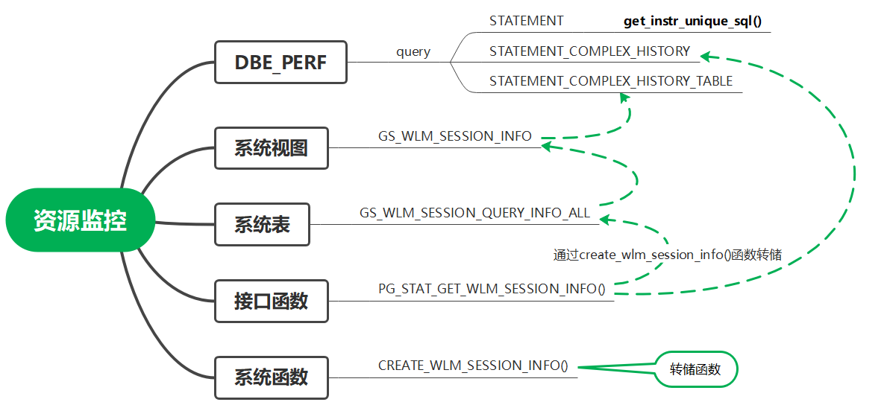
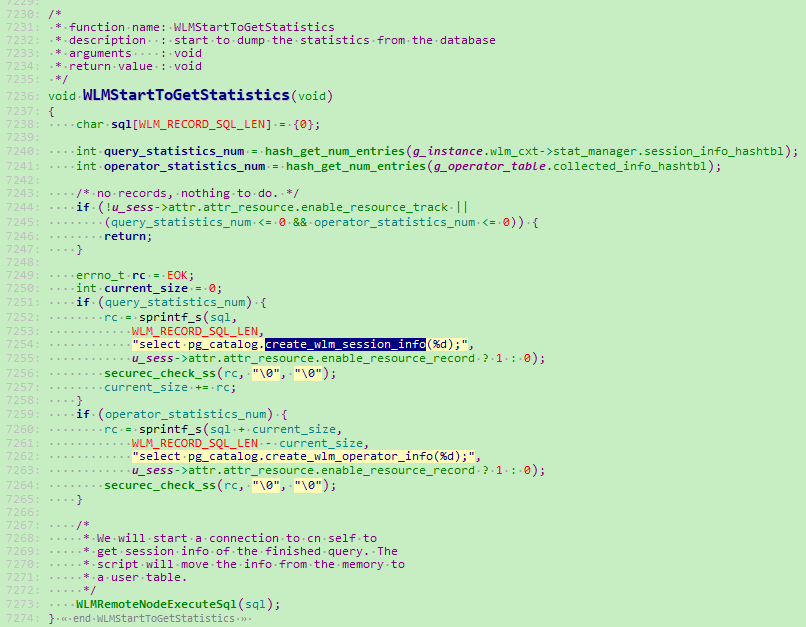

## openGauss 资源监控相关视图介绍

### DBE_PERF schema

DBE_PERF Schema 内视图主要用来诊断性能问题，也是 WDR Snapshot 的数据来源。数据库安装后，默认只有初始用户和监控管理员具有模式 dbe_perf 的权限。若是由旧版本升级而来，为保持权限的前向兼容，模式 dbe_perf 的权限与旧版本保持一致。

### 1.实时 TOP SQL

openGauss 提供了 query 级别和算子级别的资源监控实时视图用来查询实时 TopSQL。资源监控实时视图记录了查询作业运行时的资源使用情况(包括内存、下盘、CPU 时间、IO 等)以及性能告警信息。

| 视图级别      | 查询视图                           |
| ------------- | ---------------------------------- |
| Query 级别    | DBE_PERF.STATEMENT_COMPLEX_RUNTIME |
| Operator 级别 | DBE_PERF.OPERATOR_RUNTIME          |

```
1.1 查看当前用户在数据库主节点上正在执行的作业的负载管理记录：
postgres=# select * from dbe_perf.STATEMENT_COMPLEX_RUNTIME;
1.2 查看当前用户正在执行的作业的算子相关信息：
postgres=# select * from dbe_perf.OPERATOR_RUNTIME;
```

### 2.历史 TOP SQL

openGauss 提供了 query 级别和算子级别的资源监控历史视图用例查询历史 TopSQL。资源监控历史视图记录了查询作业运行结束时的资源使用情况(包括内存、下盘、CPU 时间、IO 等)和运行状态信息(包括报错、终止、异常等)以及性能告警信息。但对于由于 FATAL、PANIC 错误导致查询异常结束时，状态信息列只显示 aborted，无法记录详细异常信息。默认三分钟 gs_wlm_session_history 的数据会转储到 gs_wlm_session_info 中。

**使用 workload manager 相关视图监控功能，需开启 use_workload_manager、enable_resource_track 参数。并同时根据需求设置如下其他阈值控制参数：**

| GUC 参数                | 功能                                                                                                                                                          | 默认值 |
| ----------------------- | ------------------------------------------------------------------------------------------------------------------------------------------------------------- | ------ |
| use_workload_manager    | 是否开启资源管理功能。                                                                                                                                        | on     |
| enable_resource_track   | 是否开启资源实时监控功能，on 表示打开资源监控；off 表示关闭资源监控。                                                                                         | on     |
| resource_track_level    | 设置资源监控的等级。none 表示不开启资源记录功能；query 表示开启 query 级别资源记录功能；operator 表示开启 query 级别和算子级别资源记录功能。                  | query  |
| resource_track_cost     | 设置语句进行资源监控的最小执行代价。取值范围：-1 ～ INT_MAX，-1 时表示所有语句都不进行资源监控；大于或等于 0 时表示执行语句的代价超过这个值就会进行资源监控。 | 100000 |
| resource_track_duration | 设置资源监控实时视图中记录的语句执行结束后进行历史信息转存的最小执行时间。                                                                                    | 1min   |
| enable_resource_record  | 是否开启资源记录功能。on 表示打开资源记录；off 表示关闭资源记录。                                                                                             | off    |

### 2.1 系统视图 DBE_PERF.STATEMENT_COMPLEX_HISTORY

DBE_PERF 相关视图定义：src/common/backend/catalog/performance_views.sql

DBE_PERF.STATEMENT_COMPLEX_HISTORY 视图显示在数据库主节点上执行作业结束后的负载管理记录。

```
收集GUC参数：
use_workload_manager = on
enable_resource_track = on
过滤参数设置举例：
resource_track_duration = 1min
resource_track_cost = 0
resource_track_level = 'query'
```

```
查看当前执行作业结束后的负载管理记录：
postgres=# select * from DBE_PERF.STATEMENT_COMPLEX_HISTORY;
```

### 2.2 系统视图 DBE_PERF.STATEMENT_COMPLEX_HISTORY_TABLE

STATEMENT_COMPLEX_HISTORY_TABLE 系统视图显示数据库主节点执行作业结束后的负载管理记录，显示的数据是从内核中转储到系统表中的数据。当设置 GUC 参数 enable_resource_record 为 on 时，系统会定时（周期为 3 分钟）将中的记录 DBE_PERF.STATEMENT_COMPLEX_HISTORY 转储到系统表中。

```
查看归档的负载管理记录：
postgres=# select * from DBE_PERF.STATEMENT_COMPLEX_HISTORY_TABLE;
```

### 3. 系统视图 DBE_PERF.STATEMENT

获得当前节点的执行语句(归一化 SQL)的信息。查询视图必须具有 sysadmin 权限。数据库主节点上可以看到此数据库主节点接收到的归一化的 SQL 的全量统计信息（包含数据库节点）；数据库节点上仅可看到归一化的 SQL 的此节点执行的统计信息。

```
CREATE VIEW dbe_perf.statement AS
  SELECT * FROM get_instr_unique_sql();
```

```
GUC参数：
enable_resource_track = on
instr_unique_sql_count > 0
```

### 4. 系统视图 DBE_PERF.WAIT_EVENTS

WAIT_EVENTS 显示当前节点的 event 的等待相关的统计信息。

```
CREATE VIEW dbe_perf.wait_events AS
  SELECT * FROM get_instr_wait_event(NULL);
```

```
GUC参数：
enable_instr_track_wait = on
```

### 转储机制

GUC 参数 **enable_resource_record** ：

是否开启资源监控记录归档功能。开启(on)时，对于 history 视图（DBE_PERF.STATEMENT_COMPLEX_HISTORY 和 DBE_PERF.OPERATOR_HISTORY）中的记录，每隔 3 分钟会分别被归档到相应的 table 视图（ DBE_PERF.STATEMENT_COMPLEX_HISTORY_TABLE 和 DBE_PERF.OPERATOR_HISTORY_TABLE），归档后 history 视图中的记录会被清除。



以 session 中 query 级别的资源监控为例，主要对象之间的逻辑关系如上图。虚线表示对象之间的关系（如系统表 gs_wlm_query_info_all 为 系统视图 gs_wlm_session_info 的基表）。

当开启 enable_record_on 参数时，系统每隔三分钟调用 CREATE_WLE_SESSION_INFO()函数，将 pg_stat_get_wlm_session_info()函数的返回内容（即 DBE_PERF.STATEMENT_COMPLEX_HISTORY 视图记录）转储到系统表 GS_WLM_SESSION_QUERY_INFO_ALL(即 DBE_PERF.STATMENT_COMPLEX_HISTORY_TABLE 视图记录)中，同时将视图中的记录删掉：

system_views.sql

```
CREATE OR REPLACE FUNCTION create_wlm_session_info(IN flag int)
RETURNS int
AS $$
DECLARE
        query_str text;
        record_cnt int;
        BEGIN
                record_cnt := 0;
                query_str := 'SELECT * FROM pg_stat_get_wlm_session_info(1)';
                IF flag > 0 THEN
                        EXECUTE 'INSERT INTO gs_wlm_session_query_info_all ' || query_str; --删除视图中记录，转储到gs_wlm_session_query_info_all系统表
                ELSE
                        EXECUTE query_str; --直接返回结果，删除视图中记录
                END IF;
                RETURN record_cnt;
        END; $$
LANGUAGE plpgsql NOT FENCED;
```

内核调用接口：



### 其他内核相关函数

1.session 信息 query 级函数：

pg_stat_get_wlm_session_info(PG_FUNCTION_ARGS)

WLMGetSessionInfo(const Qid* qid, int removed, int* num)

维护的 hash 表：g_instance.wlm_cxt->stat_manager.session_info_hashtbl

2.session 信息 operator 级函数：

pg_stat_get_wlm_operator_info(PG_FUNCTION_ARGS)

ExplainGetSessionInfo(const Qpid* qid, int removed, int* num)

维护的 hash 表：g_operator_table.collected_info_hashtbl

3.unique sql：

get_instr_unique_sql(PG_FUNCTION_ARGS)

GetUniqueSQLStat(long\* num)

维护的 hash 表：g_instance.stat_cxt.UniqueSQLHashtbl

其他方面的主要函数可以通过函数的底层接口查看内核代码，再通过其维护的 hash 表，自主梳理资源统计相关的流程。

### 总结：

DBE_PERF Schema 提供主要的资源管理、性能监控方面的相关视图，相关视图的定义在源码 ./src/common/backend/catalog/system_views.sql， ./src/common/backend/catalog/performance_views.sql 中，可以通过视图定义进一步查看底层调用的函数接口、GUC 参数的要求以及各个视图之间的关系。
