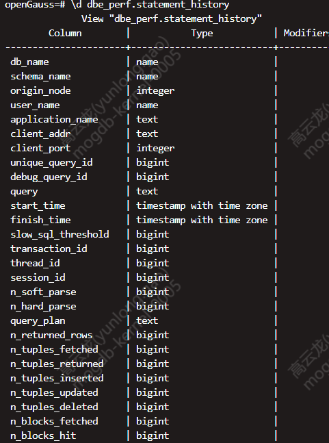
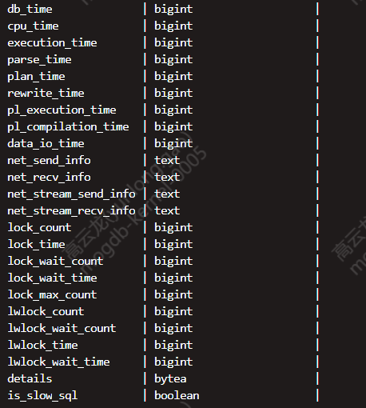

# MogDB/OpenGauss 数据库中通过参数控制抓取慢 sql

本文出处：https://www.modb.pro/db/221556

mogdb 数据库中可以通过打开相应的参数抓取慢 sql，该参数为 log_min_duratuion_statement。

**log_min_duration_statement**
**参数说明：** 当某条语句的持续时间大于或者等于特定的毫秒数时，log_min_duration_statement 参数用于控制记录每条完成语句的持续时间。
设置 log_min_duration_statement 可以很方便地跟踪需要优化的查询语句。对于使用扩展查询协议的客户端，语法分析、绑定、执行每一步所花时间被独立记录。
指定该参数的值可以设置慢 sql 的抓取阈值，例如：

```
gs_ctl reload -I all -N all -c"log_min_duratuion_statement=20ms"
```

该语句表示把集群内所有节点的 log_min_duratuion_statement 参数都设置为 20ms，这时候执行时间超过 20ms 的 sql 都被定义为慢 sql，并被记录到 dbe_perf.statement_history 这个表中。




该表会记录 sql 的详细信息，执行时间，cpu 时间，解析时间等等,需要注意的是该表只在主库可读，备库没有该表。该表中的信息保留时间默认为 7 天，保留时间收参数 track_stmt_retention_time 的影响。

**track_stmt_retention_time**
**参数说明：** 组合参数，控制全量/慢 SQL 记录的保留时间。以 60 秒为周期读取该参数，并执行清理超过保留时间的记录，仅 sysadmin 用户可以访问。
该参数属于 SIGHUP 类型参数，请参考表 1 中对应设置方法进行设置。
**取值范围：** 字符型
该参数分为两部分，形式为’full sql retention time, slow sql retention time’
full sql retention time 为全量 SQL 保留时间，取值范围为 0 ~ 86400
slow sql retention time 为慢 SQL 的保留时间，取值范围为 0 ~ 604800
**默认值：** 3600,604800

该参数的值单位为秒，全量 sql 的保留时间默认为一小时，慢 sql 默认保留七天，如果慢 sql 的量比较大，建议修改慢 sql 的保留时间为两天或者一天。

```
gs_guc set -I all -N all -c"track_stmt_retention_time='3600,172800'"
```

如上语句为设置全量 sql 保留 1 小时，慢 sql 保留两天。
