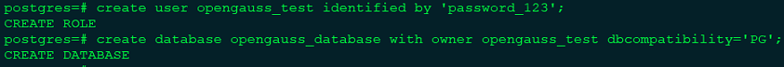
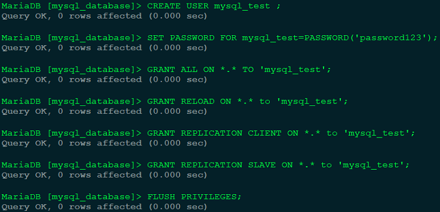
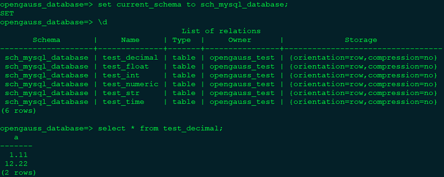
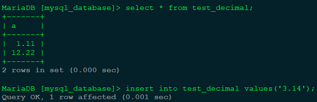
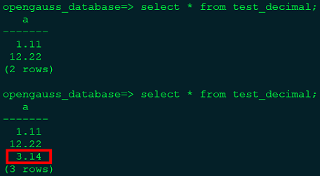

# pg_chameleon 介绍

pg_chameleon 是一个用 Python 3 编写的实时复制工具，经过内部适配，目前支持 MySQL 迁移到 openGauss。工具使用 mysql-replication 库从 MySQL 中提取 rowimages，这些 rowimages 将以 jsonb 格式被存储到 openGauss 中。在 openGauss 中会执行一个 pl/pgsql 函数，解码 jsonb 并将更改重演到 openGauss。同时，工具通过一次初始化配置，使用只读模式，将 MySQL 的全量数据拉取到 openGauss，使得该工具提供了初始全量数据的复制以及后续增量数据的实时在线复制功能。pg_chameleon 的特色包括：

- 通过读取 MySQL 的 binlog，提供实时在线复制的功能。

- 支持从多个 MySQL schema 读取数据，并将其恢复到目标 openGauss 数据库中。源 schema 和目标 schema 可以使用不同的名称。

- 通过守护进程实现实时复制，包含两个子进程，一个负责读取 MySQL 侧的日志，一个负责在 openGauss 侧重演变更。

使用 pg_chameleon 将 MySQL 数据库迁移至 openGauss，通过 pg_chameleon 的实时复制能力，可大大降低系统切换数据库时的停服时间。

# pg_chameleon 在 openGauss 上的使用注意事项

1. pg_chameleon 依赖 psycopg2，psycopg2 内部通过 pg_config 检查 PostgreSQL 版本号，限制低版本 PostgreSQL 使用该驱动。而 openGauss 的 pg_config 返回的是 openGauss 的版本号（当前是 openGauss 2.0.0），会导致该驱动报版本错误，&quot;Psycopg requires PostgreSQL client library (libpq) >= 9.1&quot;。解决方案为通过源码编译使用 psycopg2，并去掉源码头文件 **psycopg/psycopg.h** 中的相关限制。

2. pg_chameleon 通过设置 **LOCK_TIMEOUT** GUC 参数限制在 PostgreSQL 中的等锁的超时时间。openGauss 不支持该参数（openGauss 支持类似的 GUC 参数 **lockwait_timeout** ，但是需要管理员权限设置）。需要将 pg_chameleon 源码中的相关设置去掉。

3. pg_chameleon 用到了 upsert 语法，用来指定发生违反约束时的替换动作。openGauss 支持的 upsert 功能语法与 PostgreSQL 的语法不同。openGauss 的语法是 **ON DUPLICATE KEY UPDATE { column_name = { expression | DEFAULT } } [, ...]**。PostgreSQL 的语法是 **ON CONFLICT [conflict\_target] DO UPDATE SET { column_name = { expression | DEFAULT } }**。两者在功能和语法上略有差异。需要修改 pg_chameleon 源码中相关的 upsert 语句。

4. pg_chameleon 用到了 CREATE SCHEMA IF NOT EXISTS、CREATE INDEX IF NOT EXISTS 语法。openGauss 不支持 SCHEMA 和 INDEX 的 IF NOT EXISTS 选项。需要修改成先判断 SCHEMA 和 INDEX 是否存在，然后再创建的逻辑。

5. penGauss 对于数组的范围选择，使用的是 column_name[start, end] 的方式。而 PostgreSQL 使用的是 column_name[start : end] 的方式。需要修改 pg_chameleon 源码中关于数组的范围选择方式。

6. pg_chameleon 使用了继承表（INHERITS）功能，而当前 openGauss 不支持继承表。需要改写使用到继承表的 SQL 语句和表。

接下来我们将演示如何使用 pg_chameleon 迁移 MySQL 数据库至 openGauss。

# 配置 pg_chameleon

pg_chameleon 通过 **~/.pg_chameleon/configuration** 下的配置文件 config-example.yaml 定义迁移过程中的各项配置。整个配置文件大约分成四个部分，分别是全局设置、类型重载、目标数据库连接设置、源数据库设置。全局设置主要定义 log 文件路径、log 等级等。类型重载让用户可以自定义类型转换规则，允许用户覆盖已有的默认转换规则。目标数据库连接设置用于配置连接至 openGauss 的连接参数。源数据库设置定义连接至 MySQL 的连接参数以及其他复制过程中的可配置项目。

详细的配置项解读，可查看官网的说明：

[https://pgchameleon.org/documents_v2/configuration_file.html](https://pgchameleon.org/documents_v2/configuration_file.html)

下面是一份配置文件示例：

```
# global settings
pid_dir: '~/.pg_chameleon/pid/'
log_dir: '~/.pg_chameleon/logs/'
log_dest: file
log_level: info
log_days_keep: 10
rollbar_key: ''
rollbar_env: ''

# type_override allows the user to override the default type conversion
# into a different one.
type_override:
"tinyint(1)":
    override_to: boolean
    override_tables:
    - "*"

# postgres  destination connection
pg_conn:
  host: "1.1.1.1"
  port: "5432"
  user: "opengauss_test"
  password: "password_123"
  database: "opengauss_database"
  charset: "utf8"

sources:
  mysql:
    db_conn:
      host: "1.1.1.1"
      port: "3306"
      user: "mysql_test"
      password: "password123"
      charset: 'utf8'
      connect_timeout: 10
    schema_mappings:
      mysql_database:sch_mysql_database
    limit_tables:
    skip_tables:
    grant_select_to:
      - usr_migration
    lock_timeout: "120s"
    my_server_id: 1
    replica_batch_size: 10000
    replay_max_rows: 10000
    batch_retention: '1 day'
    copy_max_memory: "300M"
    copy_mode: 'file'
    out_dir: /tmp
    sleep_loop: 1
    on_error_replay: continue
    on_error_read: continue
    auto_maintenance: "disabled"
    gtid_enable: false
    type: mysql
keep_existing_schema: No
```

以上配置文件的含义是，迁移数据时，MySQL 侧使用的用户名密码分别是 **mysql_test** 和 **password123** 。MySQL 服务器的 IP 和 port 分别是 **1.1.1.1** 和 **3306**，待迁移的数据库是 **mysql_database** 。

openGauss 侧使用的用户名密码分别是 **opengauss_test** 和 **password_123** 。openGauss 服务器的 IP 和 port 分别是 **1.1.1.1** 和 **5432** ，目标数据库是 **opengauss_database**，同时会在 **opengauss_database**下创建 **sch_mysql_database** schema，迁移的表都将位于该 schema 下。

需要注意的是，这里使用的用户需要有远程连接 MySQL 和 openGauss 的权限，以及对对应数据库的读写权限。同时对于 openGauss，运行 pg_chameleon 所在的机器需要在 openGauss 的远程访问白名单中。对于 MySQL，用户还需要有 RELOAD、REPLICATION CLIENT、REPLICATION SLAVE 的权限。

下面开始介绍整个迁移的步骤。

# 创建用户及 database

在 openGauss 侧创建迁移时需要用到的用户以及 database。



在 MySQL 侧创建迁移时需要用到的用户并赋予相关权限。



# 开启 MySQL 的复制功能

修改 MySQL 的配置文件，一般是/etc/my.cnf 或者是 /etc/my.cnf.d/ 文件夹下的 cnf 配置文件。在[mysqld] 配置块下修改如下配置（若没有 mysqld 配置块，新增即可）：

```
[mysqld]
binlog_format= ROW
log_bin = mysql-bin
server_id = 1
binlog_row_image=FULL
expire_logs_days = 10
```

修改完毕后需要重启 MySQL 使配置生效。

# 运行 pg_chameleon 进行数据迁移

创建 python 虚拟环境并激活:

**python3 -m venv venv**
**source venv/bin/activate**

下载安装 psycopg2 和 pg_chameleon:

更新 pip： **pip install pip --upgrade**

将 openGauss 的 pg_config 工具所在文件夹加入到 $PATH 环境变量中。例如：

**export PATH={openGauss-server}/dest/bin:$PATH**

下载 psycopg2 源码(https://github.com/psycopg/psycopg2 )，去掉检查 PostgreSQL 版本的限制，使用 **python setup.py install** 编译安装。

下载 pg_chameleon 源码(https://github.com/the4thdoctor/pg_chameleon )，修改前面提到的在 openGauss 上的问题，使用 **python setup.py install** 编译安装。

创建 pg_chameleon 配置文件目录:

**chameleon set_configuration_files**

修改 pg_chameleon 配置文件:

**cd ~/.pg_chameleon/configuration**

**cp config-example.yml default.yml**

根据实际情况修改 default.yml 文件中的内容。重点修改 pg_conn 和 mysql 中的连接配置信息，用户信息，数据库信息，schema 映射关系。前面已给出一份配置文件示例供参考。

初始化复制流:

**chameleon create_replica_schema --config default**

**chameleon add_source --config default --source mysql**

此步骤将在 openGauss 侧创建用于复制过程的辅助 schema 和表。

复制基础数据:

**chameleon init_replica --config default --source mysql**

做完此步骤后，将把 MySQL 当前的全量数据复制到 openGauss。

可以在 openGauss 侧查看全量数据复制后的情况。



开启在线实时复制:

**chameleon start_replica --config default --source mysql**

开启实时复制后，在 MySQL 侧插入一条数据：



在 openGauss 侧查看 test_decimal 表的数据：



可以看到新插入的数据在 openGauss 侧成功被复制过来了。

停止在线复制:

**chameleon stop_replica --config default --source mysql**

**chameleon detach_replica --config default --source mysql**

**chameleon drop_replica_schema --config default**
