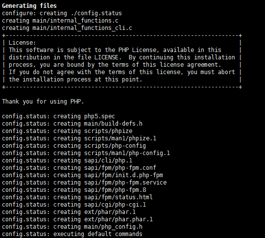
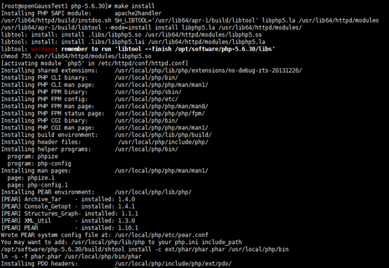
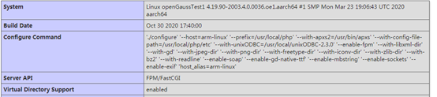
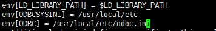

# PHP unixODBC Apache openGauss 实现数据库的连接<a name="ZH-CN_TOPIC_0000001072602343"></a>

环境：openEuler20.03 LTS

数据库：openGauss1.0.1

PHP：5.6.30

unixODBC：2.3.0Apache:2.4.3

## 安装 unixODBC<a name="section182315341545"></a>

具体请参考官方文档[基于 ODBC 开发](https://opengauss.org/zh/docs/1.0.1/docs/Developerguide/%E5%9F%BA%E4%BA%8EODBC%E5%BC%80%E5%8F%91.html)

注意，这里请将 unixODBC 的 lib 文件权限修改为 755，否则可能无法在浏览器上通过 PHP 访问 openGauss。特别是“psqlodbcw.la”和“psqlodbcw.so”文件。

如果 openGauss 和 unixODBC 在同一台设备时需在数据库主节点配置文件中增加一条认证规则。

不再同一台设备时需配置 SSL，也可以关闭 SSL 设置，具体请参考[Data studio 普通用户采用非 SSL 的方式连接 openGauss](https://www.modb.pro/db/43087)。增加的认证规则是

```
host all all x.x.x.x/x sha256
```

如果测试时报错\[UnixODBC\]connect to server failed: no such file or directory，也有可能是未增加认证规则或错误增加认证规则导致的。

## Apache 安装<a name="section84107493543"></a>

这里是使用 EulerOS 的 yum 源直接安装 Apache 和 Apache-devel，Apache-devel 是必须安装的，不然无法使用 PHP。

EulerOSyum 源配置（在/etc/yum.repos.d/openEuler.repo 上）

```
[eulerosrepo]
name=EulerOS-2.0SP8 base
baseurl=http://mirrors.huaweicloud.com/euler/2.8/os/aarch64/
enabled=1
gpgcheck=1
gpgkey=http://mirrors.huaweicloud.com/euler/2.8/os/RPM-GPG-KEY-EulerOS
```

## PHP 安装<a name="section1137515125513"></a>

首先，找到 apxs 文件夹所在路径，这个文件夹的路径在接下来的配置中会用到。

```
find / -name apxs
```

其次，在 PHP 安装包解压路径下，进行./configure 配置，配置语句如下：

```
./configure --host=arm-linux --prefix=/usr/local/php --with-apxs2=[刚才的路径] --with-config-file-path=/usr/local/php/etc --with-unixODBC=[unixODBC路径] --enable-fpm --with-libxml-dir --with-gd --with-jpeg-dir --with-png-dir --with-freetype-dir --with-iconv-dir --with-zlib-dir --with-bz2 --with-readline --enable-soap --enable-gd-native-ttf --enable-mbstring --enable-sockets --enable-exif
```

这里配置时，缺哪个文件安装哪个文件。

完成截图如下：



配置时可能会报错 config.guess 和 config.sub 错误,修改 unixODBC 的这两个文件时间戳同 openEuler 的时间一样即可。

随后进行 make 和 make install。完成截图如下：



复制 php.ini 到 PHP 安装路径下。

```
cp php.ini-production /usr/local/php/etc/php.ini
```

修改 Apache 配置文件，在对应的位置添加以下内容。

```
AddType application/x-httpd-php .php AddType application/x-httpd-php-source .phps
```

重启 Apache，PHP 安装完成。

## PHP-FPM 安装<a name="section122804182552"></a>

找到 php 安装文件。

```
find / -name php
```

到 php 目录下 etc 文件内。

将 php-fpm.conf.default 复制为 php-fpm.conf 文件

```
cp php-fpm.conf.default php-fpm.conf
```

到 php 目录下 sbin 文件。

运行 php-fpm。

```
./php-fpm
```

修改 Apache 配置文件，在其中增加以下语句。

```
LoadModule proxy_module modules/mod_proxy.so LoadModule proxy_fcgi_module modules/mod_proxy_fcgi.so  ProxyRequests Off ProxyPassMatch "^/(.*\.php(/.*)?)$" "fcgi://127.0.0.1:9000/[php文件的路径]/$1"
```

调用 phpinfo\(\)显示如下：



PHP-FPM 安装完成。

## 配置 PHP-FPM 内 unixODBC 环境变量<a name="section6339193745510"></a>

找到 php-fpm.conf 文件

```
find / -name php-fpm.conf
```

打开 php-fpm.conf 文件，找到存在大量 env 的文件段落，在其中加入 unixODBC 的环境变量（根据自己的配置路径来填写）

其中 env 表示配置 fpm 内的环境变量，\[\]内填写环境变量名，=后填写系统环境变量名（在系统环境变量名前加$）或填写路径，例如下图：



之后，重启 PHP-FPM，即可使用浏览器通过 PHP 访问 openGauss 数据库。
