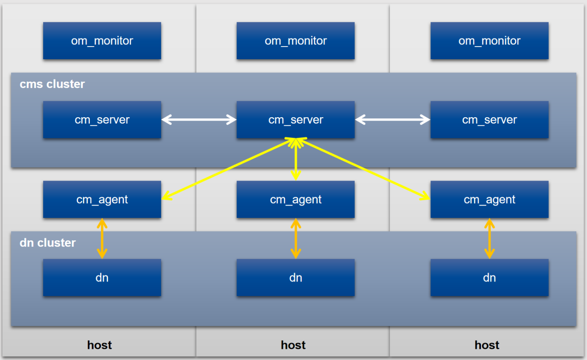
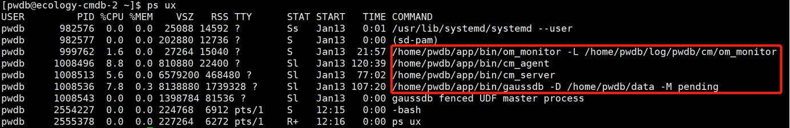
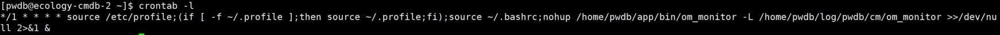
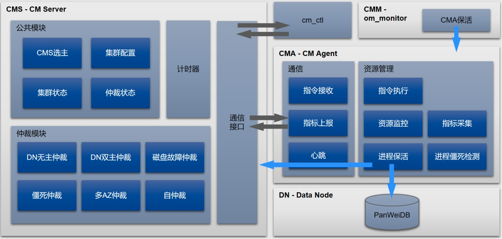
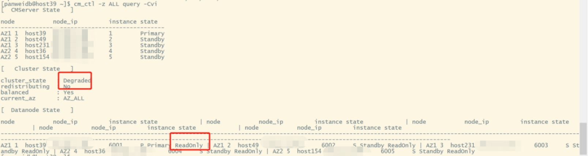
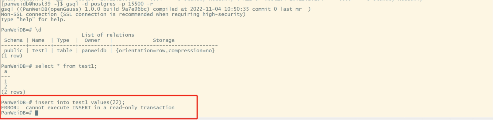
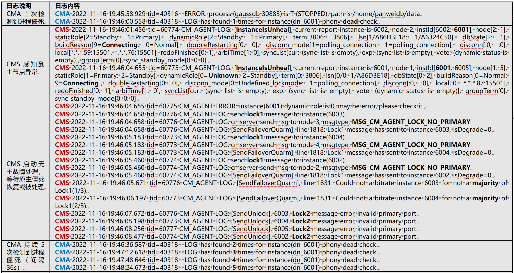
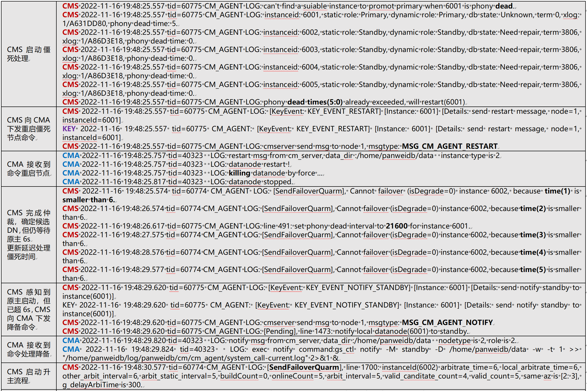
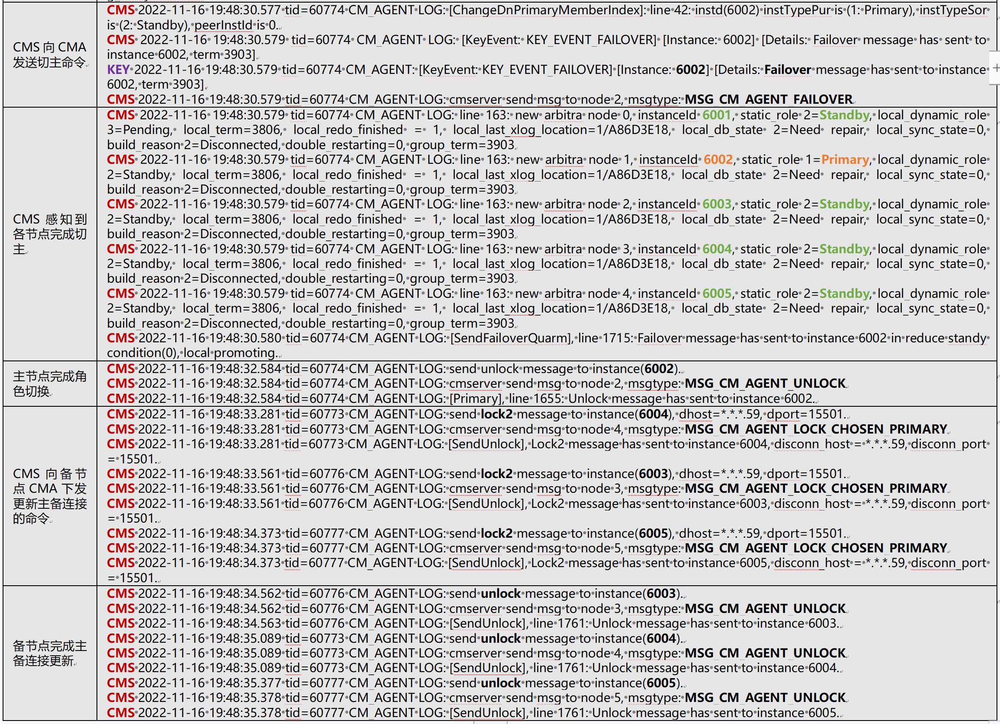

openGauss 作为面向 OLTP 业务的关系型数据库，在主备集群模式下，如何实现对节点的监控，感知故障，实现自动主备切换，保证集群的高可用，是至关重要的，相信大家也非常感兴趣，下面我们就一起来揭秘 openGauss 集群管理组件 Cluster Manager。

## **【1. 简介】**

Cluster Manager（CM）是 openGauss 集群管理组件，是 openGauss 集群高可用的保障。CM 的主要功能有：

    - 数据库主备节点状态监控，故障自动主备切换
    - 网络通信故障、文件系统故障等故障监控
    - 支持集群、节点查询、配置、操作等

此外，还支持自定义资源纳管，如分布式中间件 ShardingSphere 等。

### **1.1 高可用组网**

CM 组件包含 CM Agent（CMA），CM Server（CMS），OM Monitor（CMM）三个核心模块。为保证 openGauss 节点（DN）的高可用，需要满足以下组网条件：

    - 每个节点都需要部署CMM、CMA：CMM监控本节点CMA实例；CMA监控本节点的DN、CMS实例，采集信息上报CMS主
    - CMS、DN不需要每个节点都部署
    - CMS、DN实例组成各自的集群
    - CMS集群实个数>=3，基于Quorum协议实现自仲裁，以及DN仲裁，需要保证一半以上实例存活

openGauss 3.0.0 推荐的高可用部署方案为一主两备，组网如下图所示。除此之外，CM 还支持双中心组网方案，并支持优先同中心选主。

### **1.2 进程保活机制**

CM 组件包含 cm_server，cm_agent，以及 om_monitor 三个进程，分别为 CMS、CMA，以及 CMM 模块。openGauss（DN）进程为 gaussdb。如下图所示：

**DN、CMS 保活：由 CMA 来负责**

CMA 每秒检查一次 DN、CMS 健康状态。若进程不存在，拉起进程；通过检查 DN、CMS 进程状态，以及时间阈值内多次查询检测进程是否僵死，并负责杀死僵死进程，重新拉起。

**CMA 保活：由 CMM 来负责**

CMM 每秒检查一次 CMA 健康状态。若进程不存在，拉起进程；若进程僵死，则杀死僵死进程，重新拉起。

**CMM 保活：由系统定时任务来兜底**

系统定时任务每分钟第 0 秒执行一次。若进程不存在，下一轮定时任务执行时拉起进程；若进程僵死，则下一轮定时任务执行时杀死僵死进程，再下一轮重新拉起。

## **【2. 主要模块及功能】**

CM 组件整体架构，以及模块核心功能如下图所示：

### **2.1 CM Agent**

CM Agent 在多线程模式下，实现对本地 DN、CMS 的看护，以及 CMS 与 DN 的交互。主要功能如下：

**检查保持与 CMS 主的连接**

CMA 的 ConnCmsPMain 线程负责循环检查与 CMS 主的连接状态，检查的间隔 AGENT_RECV_CYCLE 为 200ms。若连接不存在，则重新建立连接。

**检查与所有 peer DN 的连接**

CMA 的 DNConnectionStatusCheckMain 线程负责循环 ping 所有 peer DN 节点，检查的间隔由 agent_report_interval 参数控制，默认为 1s。若与所有 peer DN 节点断连，且本节点为 DN 主，则上报 CMS，并杀死本节点 DN，CMS 将启动 DN 仲裁。

**检查上报 DN 的状态**

CMA 的 DNStatusCheckMain 线程负责循环检查 DN 状态，检查的间隔由 agent_report_interval 参数控制，默认为 1s。若进程不存在，则上报 CMS，并拉起进程，CMS 仲裁模块将启动 DN 仲裁。

**检查上报 CMS 的状态**

CMA 同样循环检测本节点 CMS 状态，每次检查的间隔为 1s。若进程不存在，则上报 CMS，并拉起进程，CMS HA 模块将启动主备自仲裁。若进程出现 T 状态，则判定为进程僵死，则将僵死情况上报 CMS，并杀死进程，重新拉起，CMS HA 模块也将启动主备自仲裁。

**检测磁盘使用率、磁盘故障**

CMA 通过在数据、日志路径下创建临时文件，进行读写测试（fopen，fwrite，fread），来检测 DN、CMS 磁盘故障，若出现失败，则将 disc damage 状态上报 CMS。

**检测 CPU、MEM、磁盘 IO 使用率**

CMA 还负责检测节点 cpu、mem，以及所有磁盘 io 使用是否达阈值。

**检测进程僵死**

CMA 的 DNPhonyDeadStatusCheckMain 线程负责循环检测 DN、CMS 进程是否僵死，检测的间隔由 agent_phony_dead_check_interval 参数控制，默认为 10s，其中包含检测时间。

若 DN 进程出现 T、D、Z 状态，则判定为进程僵死，将 T、Z 状态上报 CMS，若为 T 状态，则将检测间隔更新为 36s。若非以上状态，则连接数据库，执行查询语句，若执行失败，则判定为进程僵死。当上报次数达到阈值，CMS 仲裁模块将启动僵死处理。

**向 CMS 主上报消息**

CMA 的 SendCmsMsgMain 线程负责循环将 DN、CMS 状态上报 CMS 主，每次上报的间隔为 200ms。

**处理 CMS 主下发的命令**

CMA 同时负责接收并处理 CMS 下发的命令，根据命令类型，执行对 DN 的操作。

### **2.2 CM Server**

CM Server 通过 CMA 是实现与 DN 的交互。CMS 集群基于 Quorum 协议，实现对 DN 集群的仲裁选主，以及自仲裁。核心功能如下：

**处理 DN 节点仲裁**

服务线程接收 CMA 定时上报的 DN 节点状态，感知 DN 异常。若为主故障，则启动仲裁，确定候选 DN 后，启动升主流程。若进程被判定为僵死，则进行僵死处理，若僵死进程为主节点，处理完成后，进入仲裁选主。

**处理 CMS 节点自仲裁**

服务线程接收 CMA 定时上报的 CMS 节点状态，感知 CMS 故障，若为主故障，则根据 Quorum 协议实现 CMS 集群选主。

**处理存储达阈值、磁盘故障**

服务线程接收 CMA 定时上报的 DN 数据、日志路径磁盘使用情况，循环处理，间隔由 datastorage_threshold_check_interval 参数控制，默认为 10s，每分钟输出检测日志。

当磁盘用量超过只读阈值的 80%（只读阈值由 datastorage_threshold_value_check 控制，默认为 85%）时，发送预告警，否则清除预告警。当超过只读阈值时，则向所有 DN 实例发送只读命令（通过 CMA），发送只读告警，否则清除所有 DN 实例只读命令状态（通过 CMA），清除只读告警。

需要注意的是，只读状态为集群级设置，因此集群中任何一个节点磁盘使用达到阈值，集群都会被设置为只读模式，导致写请求返回失败。

## **【3. 常见故障场景处理】**

下面介绍常见故障场景下，CM 的处理流程。

### **3.1 主节点故障处理**

CM 故障处理由状态驱动。主节点故障的主要状态，以及相应的处理流程如下：

**状态 1：感知到 DN 主故障**

**1. 向所有 DN 备发送 LOCK1 命令**

LOCK1 成功的条件为：

    - DN备与DN主复制链路永久断开，并不再主动重连
    - DN备完成全部日志回放，并不再新增

**2. 定候选 DN 备**

    - 获取DN仲裁所需信息
    - 根据信息确定候选DN备：判断原主是否满足候选条件。若原主不满足,则从其他DN备中选择

候选 DN 备的选择策略为：

    - 发送Failover命令次数未达到上限（MAX_SEND_FAILOVER_TIMES=3）
    - 已进入LOCK1状态
    - 选择日志最多的同步备：Term和LSN最新

当多个 DN 满足条件时，选择顺序为：原主同 AZ 的备 > AZ ID 顺序 > node ID 顺序

**状态 2：`检测到过半 DN 备进入 LOCK1 状态（Quorum 协议，>=(n+1)/2）`**

向候选 DN 备发送 Failover 命令。若候选 DN 备不是原主，则等待 6s（6 轮仲裁，每轮约 1s）。若候选 DN 备不是同 AZ，则等待 delay_arbitrate_timeout 轮仲裁（默认为 0），该配置用于配置优先同 AZ 选主策略。

**状态 3：检测到新 DN 主升主成功**

若 DN 主处于 LOCK1 状态，则向其发送 UNLOCK 命令。若 DN 备处于 LOCK1 状态，则向其发送 LOCK2 命令，更新主 IP，使其连接新主，完成后，向其发送 UNLOCK 命令。

### **3.2 主节点僵死处理**

前面提到，CMA 负责循环检测 DN 进程是否僵死，若 DN 进程出现 T、D、Z 状态，则判定为进程僵死，上报 CMS。当 CMA 上报进程僵死次数大于等于 phony_dead_effective_time（默认为 5 次）时，CMS 开始处理僵死，重启僵死 DN。完成后，CMS 标记完成僵死处理，并将延迟处理僵死时间由初始值 0s 更新为 instance_phony_dead_restart_interval（默认为 21600s，6 小时，至少设置为 1800s），从设置时间点开始递减，为下次处理僵死需要等待的时间。此时集群进入无主状态，启动主故障处理。

下面为 1 主 4 备，3+2 双中心组网方案下，一次 CM 感知与处理 DN 主进程僵死的关键日志，全流程耗时 157s：

### **3.3 脑裂预防**

CM 认为集群的正常状态为 CMA 正常定时上报 DN 主状态，否则为异常状态，如：

**CMA 不能上报，DN 主存在，且与 DN 备连接正常**

首先 CMS 认为主故障，启动选主。由于 DN 主与备机连接正常，会导致备机 LOCK1 失败。超时后 CMS 将通过 SSH 向 DN 主远程发送 KILL 命令，杀死原主，选主流程正常进行。超时阈值设置的公式为：

`cmsNum _ agent_connect_timeout _ agent*connect_retries + agent_heartbeat_timeout + 10，默认为 3 * 1 \_ 15 + 8 + 10=63s。`

**CMA 不能上报，DN 主存在，但与 DN 备断连**

此时 CMS 认为主故障，启动选主。若完成升主后，CMA 恢复上报，将出现双主，CMS 将杀死原主。

### **3.4 网络隔离处理**

多 AZ 部署时，若某个 AZ 被网络故障隔离，剩余的 CMS 节点如仍满足多数派条件，则可以触发自仲裁选主和 DN 仲裁选主流程，即在多数派的节点中产生新的 CMS 主和 DN 主。被隔离的少数派中的 CMS 主将主动降备，并杀死被隔离的 DN 主。若网络隔离快速恢复，被隔离的 DN 主还未被杀死，该 DN 主将被新 CMS 主杀死。

## **【4. 结语】**

CM 组件是 openGauss 高可用特性的保障，目前主要服务于裸金属部署的 openGauss 集群。希望未来可以实现 openGauss+CM 组件的云原生部署，顺应基础服务云原生的趋势，满足更广大的业务需求。
