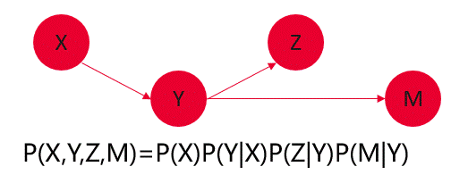

# openGauss-智能优化器之基数估计

现代数据库优化器主要依赖于其内部的代价估计系统，而代价估计最重要的依据就是查询算子的基数，即数据通过算子内查询条件过滤之后剩余的结果行数。因此基数估计技术是影响优化器产生的执行计划性能最关键的技术。学术界和工业界针对基数估计技术研究和发展了几十年，但是由于基数估计需要兼顾准确性和效率，到目前为止其依然是数据库中最难解决的课题之一，被称为是优化器的“Achilles heel”。

当前数据库为了高效估计多列复合查询条件的基数，广泛采用了基于独立性假设的多列数据分布刻画的技术，比如假设 X,Y,Z 列的联合分布为 P\(X,Y,Z\)=P\(X\)P\(Y\)P\(Z\)。这种方式可以估计出多列查询基数的下界，但是往往会严重偏离真实的基数，导致优化器无法选中正确的执行计划。针对这个问题，数据库领域提出过很多多维数据的分布刻画技术，比如多列直方图，神经网络建模等技术，但在实际落地中遇到很大的性能方面的挑战。

openGauss 本次开源的智能基数估计特性采用了一种分布自适应的内核原生多列数据分布刻画方法，其首先利用数据列相关性进行数据分布感知，然后根据分布构建对应的概率图模型。具体来说，图模型中的每个节点都是一列数据，节点之间的边表示节点之间的相关关系。对于相关性不强的数据列，在图模型中也是独立且不相关的，此时的基数估计等价于利用独立性假设进行估计；而如果识别出列之前有强相关性（即一列数据的取值分布依赖于另一列），那么图模型会综合考虑两列的联合分布；而对于更多列的联合分布，为了避免指数级别的空间复杂度增长，openGauss 采用了条件独立性假设，比如三列数据 X,Y,Z 分布相关，但是一旦将 Y 取值固定，X 和 Y 的分布便称为独立，这时的联合概率计算可以被抽象为 P\(X,Y,Z\)=P\(X|Y\)P\(Y|Z\)P\(Z\)。

分布模型简要示意图

openGauss 针对单列数据不同值个数多的场景对模型进行了进一步的优化，具体优化点有四个：

（1）针对连续浮点型值进行等宽分桶为直方图；

（2）针对符合近似 Zipf 分布的离散值将低频值合并；

（3）采用 NDV 近似估计技术对于采样稀疏带来的偏差进行纠正；

（4）使用正态分布对桶内条件分布进行参数化建模。

openGauss 利用此方法显著提升了多列复合索引的选择准确率，实现 30%以上的端到端的性能提升，实现了兼顾计算性能和估计准确率的基数估计。

该特性是 openGauss 对数据库内核优化器做的大幅度改动，也是直接利用 AI 技术改造经典数据库架构的创新尝试，经过实践验证可以解决传统优化器架构无法解决的疑难场景，大幅度提高数据库查询性能。用户可以通过下载最新的 openGauss 数据库版本进行体验。
