# 解密 openGauss 数据库中的函数依赖关系<a name="ZH-CN_TOPIC_0000001200255644"></a>

生活中总是存在着错综复杂的联系，例如喜欢打篮球的人，身高普遍比较高；喜欢穿艳丽色衣服的人，性格会普遍比较开朗；在超市买炸鸡的人，会大概率买啤酒。而反过来，这种联系并不一定成立。

在数据库领域，表中的不同属性就像生活中不同的事物，也会存在着各种类似的关联关系。如何利用这种关联关系来提升数据库查询性能？这篇文章可以解密 openGauss 的一种应用方案，该特性可通过 GUC 参数 enable_functional_dependency 进行控制。

## 1 函数依赖的用途<a name="section17488202714512"></a>

函数依赖特性就是用一个介于 0\~1 的值来量化这种关联关系的强弱程度，这个数值又被称为函数依赖度，其中 0 表示没有关联，1 表示完全关联。函数依赖，是多列统计信息的一种，可以描述两个属性之间的关联关系的强弱，也可以用于描述多个属性与另一个属性的关联关系的强弱，其主要用途是提高选择率计算的准确性。其中选择率的定义为


选择率是对 SQL 查询结果规模的预期，取值 0\~1。如果选择率比较大，即接近于 1，那么查询优化器会倾向于使用顺序扫描，如果选择率比较小，即接近于 0，查询优化器会倾向于使用索引扫描，如果介于两者之间，查询优化器倾向于使用位图扫描。所以选择率能否估算准确，会直接影响到执行计划的选择，进而影响到数据库的查询效率。函数依赖特性的加入，能一定程度上提高选择率估算的准确性。

在引用函数依赖特性之前，数据库会使用条件独立假设的方法来估算选择率。举一个生活中的例子，在一个班级中，男女生的比例是 1：1，喜欢篮球的人数占比为 20%，身高 175cm 以上的人数占比为 50%。我们可以说喜欢篮球且身高在 175cm 以上的男生的占比为 50% \* 20% \* 50% = 5%吗？显然这个计算结果会比实际结果低，因为这几个属性之间有关联关系，喜欢篮球的人普遍身高偏高，喜欢篮球的人中男生占多数，男生的身高较女生普遍偏高。

## 2 理论推导<a name="section10123175324517"></a>

下面我们从理论上来对比，条件独立假设和函数依赖在计算选择率时的差异。假设一个表 t\(a int, b int, c int\)，A 是只与属性\{a\}相关的等式约束条件，B 是只与属性\{b\}相关的等式约束条件。在条件独立假设下，同时满足约束条件 A 和约束条件 B 的选择率的计算公式为

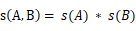

这会导致选择率一定程度的低估，因为约束条件 A 和约束条件 B 会存在或强或弱关联，而这里并没有考虑在内。引入函数依赖特性，并应用函数依赖关系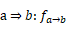来计算选择率 s\(A, B\)的理论公式为

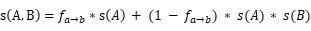

其中，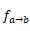为一个实数，取值 0\~1。类似地，对于含有三个属性的函数依赖关系"a , b=\> c: 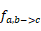"，计算选择率 s\(A, B, C\)的理论公式为

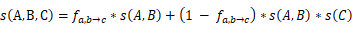

但是在实际应用中，考虑到最终的选择率不能大于任何一个属性列的选择率，需要对上述的理论公式做一个轻微变形，用 min\(s\(A\), s\(B\)\)来代替第一项的 s\(A\)，min\(s\(A, B\), s\(C\)\)来代替第一项的 s\(A, B\)。这种变形会对计算不满足函数依赖的数值的选择率，产生一定的修正作用。

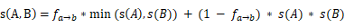

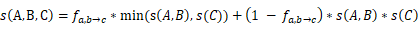

## 3 应用示例<a name="section582192014463"></a>

上面我们已经对 openGauss 数据库中的函数依赖关系进行了理论上的介绍，下面我们看看在具体实践中，应该如何操作。下面的几个例子，可以很好地展现 openGauss 数据库的该特性。

--优化 SQL 查询的行数估计模型前

```
create table t5 (a int, b int, c int, d int, e int);
insert into t5 select 1, 1, 1, 1, 1 from generate_series(1,100) i;
insert into t5 select 2, 2, 2, 2, 2 from generate_series(1,100000) i;
insert into t5 select 3, 3, 3, 3, 3 from generate_series(1,10000) i;
insert into t5 select 4, 4, 4, 4, 4 from generate_series(1,10000) i;
analyze t5;
```

--执行 explain analyze select \* from t5 where b=1 and c=1;并查看计划。真实行数为 100，估算行数为 1，行数估计准确率较低，为 0.01。

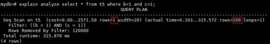

--执行 explain analyze select \* from t5 where b=2 and c=2;并查看计划。真实行数为 100000，估算行数为 83396，行数估计准确率略低，为 0.834。

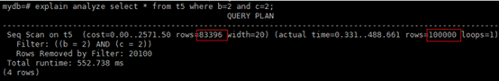

--执行 explain analyze select \* from t5 where b=3 and c=3; 并查看计划。真实行数为 10000，估算行数为 832，行数估计准确率较低，为 0.083。

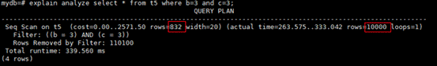

--设置 ANALYZE 的采样方式为百分比采样，采样率为 2%

```
set default_statistics_target=-2;
```

--开启 GUC 参数，生成函数依赖统计信息

```
set enable_functional_dependency=on;
alter table t5 add statistics ((a, b, c));
analyze t5((a, b, c));
```

--执行 explain analyze select \* from t5 where b=1 and c=1; 并查看计划。真实行数为 100，估算行数为 72，所以行数估计准确率为 0.72。应用函数依赖统计信息，准确率从 0.01 提升为 0.72，提升 72 倍。

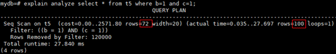

--执行 explain analyze select \* from t5 where b=2 and c=2; 并查看计划。真实行数为 100000，估算行数为 99708，所以行数估计准确率为 0.997。应用函数依赖统计信息，准确率从 0.834 提升为 0.997，提升 1.19 倍。

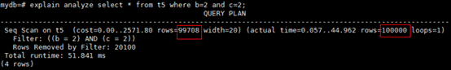

--执行 explain analyze select \* from t5 where b=3 and c=3; 并查看计划。真实行数为 10000，估算行数为 10066，所以行数估计准确率为 0.993。应用函数依赖统计信息，准确率从 0.083 提升为 0.993，提升 11.96 倍。

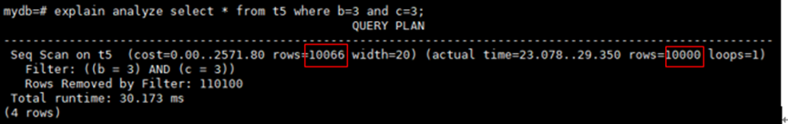

通过在 openGauss 中使用函数依赖关系的数据库优化技术，我们可以看到数据库的查询优化性能得到了显著的提升。如果大家对该特性感兴趣，欢迎下载最新的 openGauss 数据库进行体验！
