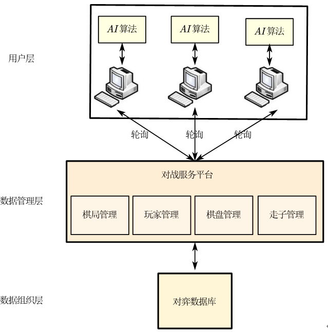
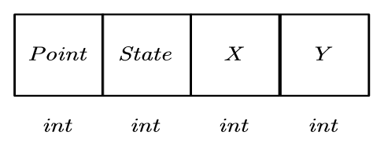
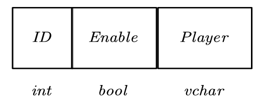
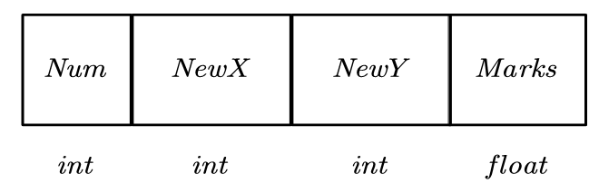
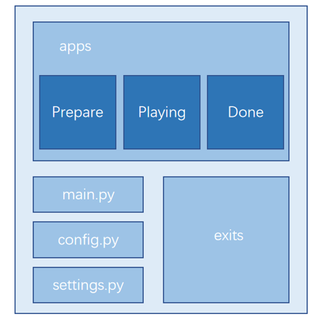
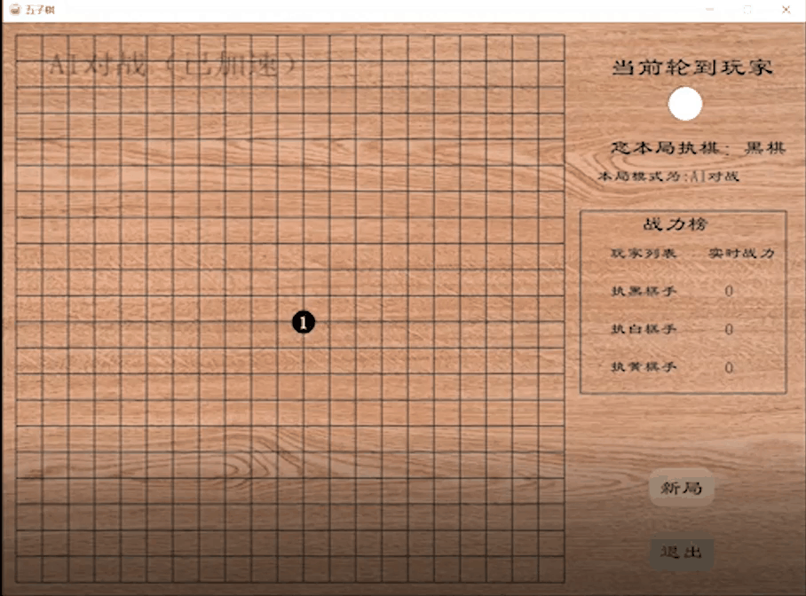

# 1 前言

openGauss 是一款全面友好开放的企业级开源关系型数据库。openGauss 采用木兰宽松许可证 v2 发行，提供面向多核架构的极致性能、全链路的业务、数据安全、基于 AI 的调优和高效运维的能力。本文采用`openGauss`设计一个 AI 小 demo。

# 2 方案意义

人工智能被广泛用于棋类对弈的主要原因是：

- 棋类对弈自古以来就被认为是人类智力活动的象征，若人工智能成功达到、甚至高于人类水平，则就代表 AI 的发展潜力，从而吸引更多研究者关注并投身其中；
- 棋类很适合作为新 AI 算法的标杆。棋类游戏规则简洁、输赢都在盘面，适合计算机求解。理论上只要在计算能力和算法上有新的突破，任何新的棋类游戏都有可能得到攻克。而在棋类游戏上的表现也可以直观体现出 AI 之间计算能力与算法的高低，是促进 AI 算法发展的有效途径。

就本五子棋智能对弈系统而言，其服务对象为同局域网下的多个终端，讲求联机互动、互相限制、互相博弈，打破了传统二人对弈五子棋规则中，“若无禁手，先手易胜；若为后手，十堵九输”的说法，是 AI 算法设计、网络通信、数据库等技术的综合应用。

# 3 架构设计

其中对弈数据库采用`openGauss`数据库

# 4 数据表设计

棋盘数据表的表头如图所示

为将二维棋盘状态存入数据库中，令棋盘按 轴方向展开为一维序列

玩家数据表的表头如图所示

走子数据表的表头如图所示

# 5 代码结构

如图所示，依据模块化程序设计的基本思想，将整个项目按照功能划分为若干个小程序模块，每个小程序模块完成一个确定的功能，自顶向下、逐步分解、分而治之，各模块相对独立、功能单一、结构清晰。同时，在这些模块之间建立必要的联系，通过模块的互相协作完成整个功能的程序设计

各模块具体设计如下：

- main.py：启动文件。
- config.py：变量管理文件。管理所有跨文件的全局变量。
- settings.py：配置文件。开发环境配置、第三方扩展插件参数配置、数据库的链接路径及其他配置等。
- apps：主体文件包。其初始化文件包括 Flask 类的实例创建以及工厂函数。该文件包下设三个子文件包，分别对应架构设计中的三张蓝图。
- exts：扩展文件包。第三方扩展插件的例化，创建映射对象等。

项目采用高度模块化设计的优点有：控制了程序设计的复杂性；提高了代码的重用性；易于维护和功能扩充；有利于团队开发等。

# 6 项目演示

# 7 总结

基于`openguass`开发 AI 应用相当方便，也使我进一步掌握了数据库的常用技术，提高工程开发能力和面对未知问题的临场解决能力，对设计、创新、分析水平都有很大的帮助
