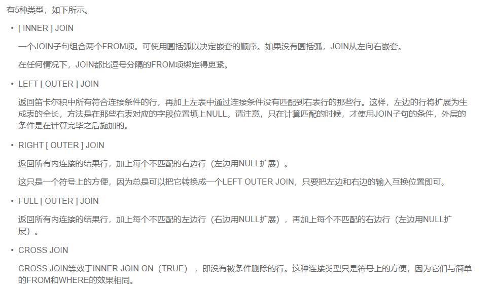
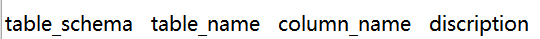

# 关于迁移 SQL server 到 openGauss 的问题和解决

## 背景

2020 年 9 月份，在将 SQL server 内容迁移到 openGauss 数据库的过程中，由于 openGauss 开源不久，我在迁移的过程中遇到了许多问题。通过对源码的阅读和实际调试，最后逐个解决。在这里，我对两个数据库之间的不同和相同分别做对比，提供一个实际参考。（之所以列出相同，是为了更放心地使用）

- openGauss 版本：1.0.1
- SQL server 版本：2008

## 对比

以下所有内容均基于具体使用，因此将涵盖使用中较基本方面。

**整体结构**

- 相同

SQL server 和 openGauss 同为关系型数据库，创建数据库和使用基本相同，当然 openGauss 数据库相比其他开源数据库主要有复合应用场景、高性能和高可用等产品特点，在不同之处基本可以解决。

- 相异

<table><thead ><tr id="row15262102710911"><th class="cellrowborder"  width="33.333333333333336%" id="mcps1.1.4.1.1">
SQL server

</th>
<th class="cellrowborder"  width="33.333333333333336%" id="mcps1.1.4.1.2">
openGauss

</th>
<th class="cellrowborder"  width="33.333333333333336%" id="mcps1.1.4.1.3">
解决

</th>
</tr>
</thead>
<tbody><tr id="row92621527497"><td class="cellrowborder"  width="33.333333333333336%" headers="mcps1.1.4.1.1 ">
跨数据库执行表操作和存储过程调用

</td>
<td class="cellrowborder"  width="33.333333333333336%" headers="mcps1.1.4.1.2 ">
无法跨数据库操作

</td>
<td class="cellrowborder"  width="33.333333333333336%" headers="mcps1.1.4.1.3 ">
基本可以用openGauss中的多模式实现多数据库，跨模式可以实现跨库

</td>
</tr>
<tr id="row1926314276913"><td class="cellrowborder"  width="33.333333333333336%" headers="mcps1.1.4.1.1 ">
同一数据库可以直接用表名调用操作

</td>
<td class="cellrowborder"  width="33.333333333333336%" headers="mcps1.1.4.1.2 ">
若直接调用会报不相关错误

</td>
<td class="cellrowborder"  width="33.333333333333336%" headers="mcps1.1.4.1.3 ">
将包括系统表在内的所有表，一切采用显示调用：模式名+数据库名+表名

</td>
</tr>
<tr id="row526315279918"><td class="cellrowborder"  width="33.333333333333336%" headers="mcps1.1.4.1.1 ">
临时数据库TempDB自动存储临时表

</td>
<td class="cellrowborder"  width="33.333333333333336%" headers="mcps1.1.4.1.2 ">
无临时数据库

</td>
<td class="cellrowborder"  width="33.333333333333336%" headers="mcps1.1.4.1.3 ">
openGauss在pg_temp开头的schema中有系统临时表，当然也有全局和本地两种临时表，创建时指定TEMP或TEMPORARY关键字，可创建为临时表

</td>
</tr>
</tbody>
</table>

**数据类型**

- 相同

1.  数值类型：INT、INTEGER、SAMALLINT、BIGINT 包括对应数组基本用法相同。
2.  货币类型和布尔类型使用基本相同。
3.  字符类型：定长和变长的 CHAER 和 VARCHAR 用法基本相同；TEXT、name 也可互通使用

- 相异

<table><thead ><tr id="row132653277918"><th class="cellrowborder"  width="33.333333333333336%" id="mcps1.1.4.1.1">
SQL server

</th>
<th class="cellrowborder"  width="33.333333333333336%" id="mcps1.1.4.1.2">
openGauss

</th>
<th class="cellrowborder"  width="33.333333333333336%" id="mcps1.1.4.1.3">
解决

</th>
</tr>
</thead>
<tbody><tr id="row102651227194"><td class="cellrowborder"  width="33.333333333333336%" headers="mcps1.1.4.1.1 ">
字符类型：nvarchar（n）用来存储大量中文

</td>
<td class="cellrowborder"  width="33.333333333333336%" headers="mcps1.1.4.1.2 ">
不存在对应nvarchar(n)的类型

</td>
<td class="cellrowborder"  width="33.333333333333336%" headers="mcps1.1.4.1.3 ">
openGauss中选择nvarchar2(n)存储大量中文，效果一致

</td>
</tr>
</tbody>
</table>

**表操作**

- 相同

1.  创建表和删除表基本相同
2.  多表查询基本相同，如下：

    

3.  集函数用法基本一致

- 相异

主要是系统表的使用差别

<table><thead ><tr id="row72669271693"><th class="cellrowborder"  width="26.392639263926394%" id="mcps1.1.4.1.1">
SQL server

</th>
<th class="cellrowborder"  width="29.382938293829387%" id="mcps1.1.4.1.2">
openGauss

</th>
<th class="cellrowborder"  width="44.22442244224422%" id="mcps1.1.4.1.3">
解决

</th>
</tr>
</thead>
<tbody><tr id="row7267112715914"><td class="cellrowborder"  width="26.392639263926394%" headers="mcps1.1.4.1.1 ">
sysobjects可用表名查询

</td>
<td class="cellrowborder"  width="29.382938293829387%" headers="mcps1.1.4.1.2 ">
刚开始使用PG_OBJECT表，此表只能按id查询

</td>
<td class="cellrowborder"  width="44.22442244224422%" headers="mcps1.1.4.1.3 ">
代替：PG_TABLES中可用表名查询

</td>
</tr>
<tr id="row2267172713911"><td class="cellrowborder"  width="26.392639263926394%" headers="mcps1.1.4.1.1 ">
可用系统表sys.columns.object_id查询某表所有列名

</td>
<td class="cellrowborder"  width="29.382938293829387%" headers="mcps1.1.4.1.2 ">
openGauss中可用information_schema模式下的columns表得到某表所有列名

</td>
<td class="cellrowborder"  width="44.22442244224422%" headers="mcps1.1.4.1.3 ">
sys.columns表结构

information_schema.columns表结构

</td>
</tr>
</tbody>
</table>

**函数对比**

- 相同

1.  while 函数、集函数、exist 函数等简单函数基本一致
2.  `left\(str text, n int\)、right\(str text, n int\)、length\(string bytea, encoding name \)replace\(string text, from text, to text\)ltrim\(string \[, characters\]\)、rtrim\(string text \[, characters text\]charindex` 函数

- 相异

<table><thead ><tr id="row18269152717914"><th class="cellrowborder"  width="50%" id="mcps1.1.3.1.1">
SQL server

</th>
<th class="cellrowborder"  width="50%" id="mcps1.1.3.1.2">
openGauss解决

</th>
</tr>
</thead>
<tbody><tr id="row42699277911"><td class="cellrowborder"  width="50%" headers="mcps1.1.3.1.1 ">
if-else函数比较自由

</td>
<td class="cellrowborder"  width="50%" headers="mcps1.1.3.1.2 ">
完整的if-then-else-end if结构

</td>
</tr>
<tr id="row62703274918"><td class="cellrowborder"  width="50%" headers="mcps1.1.3.1.1 ">
替换子字符串函数stuff ( character_expression1 , start , length , character_expression2 )

</td>
<td class="cellrowborder"  width="50%" headers="mcps1.1.3.1.2 ">
overlay(string placing string FROM int [for int])完美替换stuff（）函数

</td>
</tr>
<tr id="row112702271492"><td class="cellrowborder"  width="50%" headers="mcps1.1.3.1.1 ">
自定义函数时比较自由

</td>
<td class="cellrowborder"  width="50%" headers="mcps1.1.3.1.2 ">
自定义函数格式注意加

</td>
</tr>
</tbody>
</table>

**存储过程**

- 相同

SQL server 和 openGauss 在存储过程中的相同点较少，基本上的逻辑基本相同。

1.  存储过程均支持输入\(in\)、输出（out）参数。
2.  存储过程答题逻辑相似。

- 相异

<table><thead ><tr id="row1627118271399"><th class="cellrowborder"  width="49.27%" id="mcps1.1.3.1.1">
SQL server

</th>
<th class="cellrowborder"  width="50.73%" id="mcps1.1.3.1.2">
openGauss解决

</th>
</tr>
</thead>
<tbody><tr id="row027120277919"><td class="cellrowborder"  width="49.27%" headers="mcps1.1.3.1.1 ">
declare声明在begin-end体内

</td>
<td class="cellrowborder"  width="50.73%" headers="mcps1.1.3.1.2 ">
declare声明必须在存储过程begin-end体外统一声明

</td>
</tr>
<tr id="row1627115271919"><td class="cellrowborder"  width="49.27%" headers="mcps1.1.3.1.1 ">
由于SQL server的begin-end相当于‘{}’，所以根据使用的函数，或者事务相应添加结构begin-end

</td>
<td class="cellrowborder"  width="50.73%" headers="mcps1.1.3.1.2 ">
由于begin-end是执行结构，因此，存储过程body中所有添加begin-end结构的都不需要再添加，即整个存储过程一套begin-end结构

</td>
</tr>
<tr id="row32719276913"><td class="cellrowborder"  width="49.27%" headers="mcps1.1.3.1.1 ">
存储过程中用表创建新表：SELECT * INTO tablename FROM tablename1

</td>
<td class="cellrowborder"  width="50.73%" headers="mcps1.1.3.1.2 ">
因为SELECT INTO不能在存储过程中使用，会报错tablename不存在。 解决：使用CREATE TABLE AS语法替代SELECT INTO

</td>
</tr>
<tr id="row8272527495"><td class="cellrowborder"  width="49.27%" headers="mcps1.1.3.1.1 ">
catch错误处理：在有事务时，仍可针对具体语句多次处理

</td>
<td class="cellrowborder"  width="50.73%" headers="mcps1.1.3.1.2 ">
openGauss中，存储过程begin-end就是一个整体事务，可以方便地在body体最后用others整体处理：

</td>
</tr>
<tr id="row122723271690"><td class="cellrowborder"  width="49.27%" headers="mcps1.1.3.1.1 ">
可用return返回参数

</td>
<td class="cellrowborder"  width="50.73%" headers="mcps1.1.3.1.2 ">
存储过程的入参和出参，默认IN，出参时（OUT name nametype）

</td>
</tr>
<tr id="row1327216271699"><td class="cellrowborder"  width="49.27%" headers="mcps1.1.3.1.1 ">
exec执行；@是变量必要格式

</td>
<td class="cellrowborder"  width="50.73%" headers="mcps1.1.3.1.2 ">
execute执行；并不需要@格式

</td>
</tr>
<tr id="row132731027999"><td class="cellrowborder"  width="49.27%" headers="mcps1.1.3.1.1 ">
动态执行：exec sp_executesql

</td>
<td class="cellrowborder"  width="50.73%" headers="mcps1.1.3.1.2 ">
动态执行： execute immediate

</td>
</tr>
</tbody>
</table>

- 以上均为问题解决方法，具体语句可以看开源社区的格式[openGauss 社区](https://www.modb.pro/opengauss)

**总结**

SQL server 和 openGauss 由于都是关系型数据库，大体结构、基本数据类型、表操作和函数重合点很高，但是存储过程方面基本上需要全部仔细修改，逐渐调试并找到解决办法。以上所有都来自于实操，并成功迁移。
