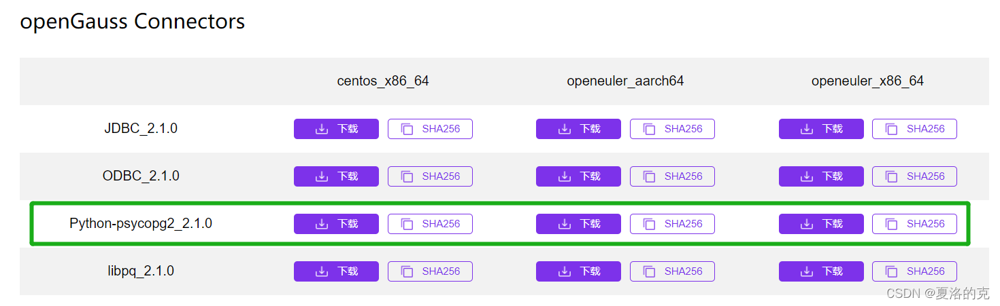

本文出处：[https://www.modb.pro/db/337465](https://www.modb.pro/db/337465)

## 摘要

> Psycopg 是一种用于执行 SQL 语句的 PythonAPI，可以为 PostgreSQL、GaussDB 数据库提供统一访问接口，应用程序可基于它进行数据操作。Psycopg2 是对 libpq 的封装，主要使用 C 语言实现，既高效又安全。它具有客户端游标和服务器端游标、异步通信和通知、支持“COPY TO/COPY FROM”功能。支持多种类型 Python 开箱即用，适配 PostgreSQL 数据类型；通过灵活的对象适配系统，可以扩展和定制适配。Psycopg2 兼容 Unicode 和 Python 3。

## 获取安装包

- 下载地址：https://opengauss.org/zh/download/
  

选择你需要的版本进行下载。

## 安装驱动

- 解压安装包

```
[postgres@10 ~]$ tar -zxvf openGauss-2.1.0-CentOS-x86_64-Python.tar.gz
[postgres@10 ~]$ cd psycopg2/
[postgres@10 psycopg2]$ ll
total 1224
-rw-r--r-- 1 postgres postgres   14277 Sep 28 20:08 errorcodes.py
-rw-r--r-- 1 postgres postgres    1425 Sep 28 20:08 errors.py
-rw-r--r-- 1 postgres postgres    6797 Sep 28 20:08 extensions.py
-rw-r--r-- 1 postgres postgres   42863 Sep 28 20:08 extras.py
-rw-r--r-- 1 postgres postgres    4768 Sep 28 20:08 __init__.py
-rw-r--r-- 1 postgres postgres    2922 Sep 28 20:08 _ipaddress.py
-rw-r--r-- 1 postgres postgres    7153 Sep 28 20:08 _json.py
-rw-r--r-- 1 postgres postgres    6316 Sep 28 20:08 pool.py
-rwxr-xr-x 1 postgres postgres 1104672 Sep 30 14:41 _psycopg.so
-rw-r--r-- 1 postgres postgres   17608 Sep 28 20:08 _range.py
-rw-r--r-- 1 postgres postgres   14699 Sep 28 20:08 sql.py
-rw-r--r-- 1 postgres postgres    4870 Sep 28 20:08 tz.py
```

- 找到 python 安装目录

```
[postgres@10 psycopg2]$ whereis python
python: /usr/bin/python3.7 /usr/bin/python3.7m /usr/bin/python3.7-config /usr/bin/python3.7m-config /usr/bin/python3.7m-x86_64-config /usr/lib/python3.7 /usr/lib/python2.7 /usr/lib64/python3.7 /usr/lib64/python2.7 /usr/local/lib/python3.7 /usr/include/python3.7m /usr/include/python2.7-debug /usr/include/python2.7
```

_我的服务器上面有两个版本的 python，分别是 python3.7 和 python2.7。_

- 找到 site-packages 目录

```
[postgres@10 lib]$ pwd
/usr/lib
[postgres@10 lib]$ ll python
python2.7/ python3.7/
```

- 使用 root 用户将 psycopg2 目录 copy 到对应版本的 site-packages 目录下

```
[root@10 postgres]# cp -r /home/postgres/psycopg2/ /usr/lib/python3.7/site-packages/
```

- 赋权

```
[root@10 site-packages]# chmod -R 775 psycopg2/
```

## 测试

```
[postgres@10 ~]$ python3
Python 3.7.9 (default, Jan 25 2022, 15:12:36)
[GCC 7.3.0] on linux
Type "help", "copyright", "credits" or "license" for more information.
>>> import psycopg2
>>> conn=psycopg2.connect(database="postgres",user="postgres",password="frank@123",host="localhost",port=5432)
>>> cur=conn.cursor()
>>> cur.execute("CREATE TABLE student(id integer,name varchar,sex varchar);")
>>> cur.execute("INSERT INTO student(id,name,sex) VALUES(%s,%s,%s)",(1,'Aspirin','M'))
>>> cur.execute("INSERT INTO student(id,name,sex) VALUES(%s,%s,%s)",(2,'Taxol','F'))
>>> cur.execute('SELECT * FROM student')
>>> results=cur.fetchall()
>>> print (results)
[(1, 'Aspirin', 'M'), (2, 'Taxol', 'F')]
>>> conn.commit()
>>> cur.close()
>>> conn.close()
>>>
```

## FQA

第一次尝试的时候使用的是`centos_x86_64`版本，测试是会报错。

```
>>> import psycopg2
Traceback (most recent call last):
  File "<stdin>", line 1, in <module>
  File "/usr/local/lib/python3.6/site-packages/psycopg2/__init__.py", line 51, in <module>
    from psycopg2._psycopg import (                     # noqa
ImportError: libpython3.6m.so.1.0: cannot open shared object file: No such file or directory
```

试图通过编译安装 3.6 版本解决这个问题，但是编译安装后没有编译出`libpython3.6m.so.1.0`，只有`libpython3.6m.a`。

后来直接下载`openeuler_x86_64`版本，问题解决。PS. 我是 kylin v10 的操作系统，其他系统可能遇到不同问题，可以评论区留言。
