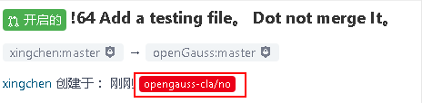
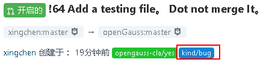

### 签署 cla 协议(贡献者许可协议)

第一次提交 Pull Request 后，会有一个`opengauss-cla/no`的标签，提示需要去签署 cla 协议，否则无法合入代码。

请在打开下面网站进行签署协议：

英文： https://opengauss.org/en/cla.html

中文： https://opengauss.org/zh/cla.html

签署后，在文本编辑框输入
`/check-cla`
即可刷新签署状态。已经签署后，后续的 pull request 则无需做该操作。

### 通过回复命令来触发操作

openGauss 社区建议每个开发人员在 Pull Request 或者 issue 下面的文本编辑框里面通过输入命令进行对应的操作。
详细命令参见：

英文：https://gitee.com/opengauss/community/blob/master/en/command.md

中文：https://gitee.com/opengauss/community/blob/master/zh/command.md

示例

> 1.上一步的签署完 cla 再通过输入`/check-cla`命令来刷新签署状态。

> 2.输入`/kind bug`，标注这个合入是一个 bug 问题，本次合入会打上 bug 标签。
> 

> 3.如果要关闭掉该 Pull Request，输入 `/close`，本次提交即被关闭掉。
