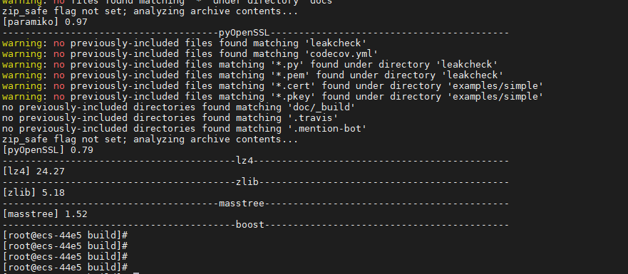
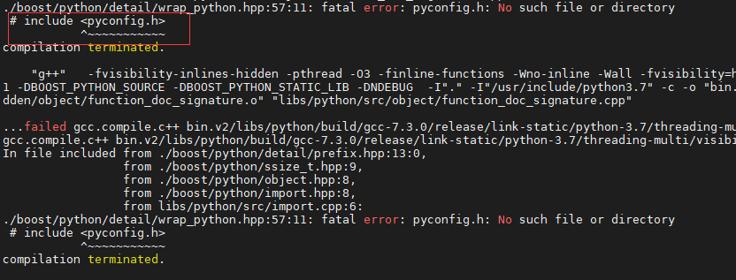
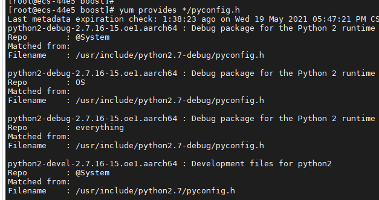
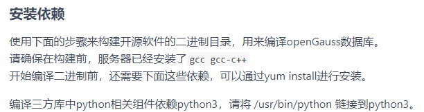
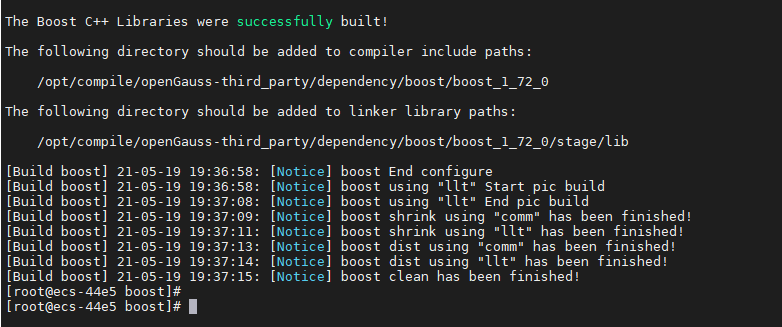

## 概述

本文档介绍再编译 openGauss-third_party 三方库时候，boost 编译失败解决方法。 目前在 1.1.0 2.0.0 版本都适用。

## 错误分析和处理

在编译 openGauss-third_party 三方库时候，我们首先在 build 目录下执行`sh build.sh`，三方库自行编译。 但是经常遇到在编译到 boost 的时候，脚本终止掉了。很明显，这里面编译出错了。



dependency 依赖的编译日志在 `dependency/build` 目录下 demo.log，这里面可以很明显的看到错误信息。
也可以进入到`dependency/boost`目录下，单独编译，看看报错。

```
sh build.sh -m all
```



可以看到缺少了 pyconfig.h 头文件。
使用 `yum provides */pyconfig.h` 查找下，发现在 python-devel 包里面，需要安装下`python2-devel`包。


```
yum install python2-devel
yum install python3-devel
```

其实我们在编译前，已经安装过这两个依赖。但是还是出现了这个问题。。。。

我们在开始编译的时候，做了这个操作，将 python 链接到 python3: `ln -s /usr/bin/python3 /usr/bin/python`


这里是因为，三方库里面有很多需要使用 python3 编译的三方库，但是脚本中写的`/usr/bin/python`的执行环境，所以需要做这个链接操作，将 python 指向 python3。\
但是 boost 编译，依赖的头文件是 python2-devel 的，这里需要将 python 链接到 python2 上。如下：

```
unlink /usr/bin/python
ln -s /usr/bin/python2 /usr/bin/python
```

再次编译 `sh build.sh -m all`，编译成功。



在 `dependency/build/build_dependency.sh` 里面，注释掉已经编译好的脚本片段，执行 `sh build_dependency.sh`
继续编译未完成的三方库。

**_注意：在编译完 boost 后，还需要将 python 再链接到 python3，以完成后面三方库的编译工作。_**

```
unlink /usr/bin/python
ln -s /usr/bin/python3 /usr/bin/python
```
