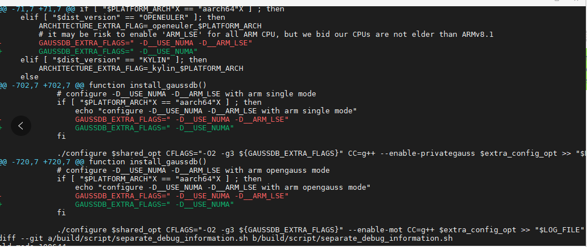

### 概述

在一些非官方指定的系统上面 (官方指定的系统：https://opengauss.org/zh/docs/latest/docs/Description/%E8%BF%90%E8%A1%8C%E7%8E%AF%E5%A2%83.html), 使用官网提供的镜像安装数据库，有时会遇到一些 `"非法指令" "illegal instruction"` 的问题， 这些往往是由于 CPU 指令集不兼容导致的。

此处我们只说下在 ARM 上面安装失败的问题。

常见的主要如下：

官网发布的 `openEuler_arm` 包，在编译的时候，打开了`ARM_LSE`指令集做了编译的优化。但是对于一些其他版本的 arm 服务器，不一定支持。

代码注释中这么写的：

```
build\script\mpp_package.sh

# it may be risk to enable 'ARM_LSE' for all ARM CPU, but we bid our CPUs are not elder than ARMv8.1
```

实测在 **_鲲鹏 920_** 和 **_麒麟 990_** 的 cpu 芯片下是支持安装的。
cpu 可以通过 `lscpu` 名称查看。

对于其他不自持该指令的系统，需要去掉 `-D__ARM_LSE` 指令重新编译即可。

在编译脚本中 `build\script\mpp_package.sh`，删除掉所有的 `-D__ARM_LSE` ， 重新编译数据库。

patch 如下图：


