<!-- TOC -->

<!-- - [1. 编译三方库](#1.编译三方库)
  - [1.1.编译步骤概述](#1.1.编译步骤概述)
  - [1.2.编译 gcc 和 cmake](#1.2.编译gcc和cmake)
  - [1.3.脚本增加平台信息](#1.3.脚本增加平台信息)
  - [1.4.编译三方库](#1.4.编译三方库)
  - [1.5.编译完成](#1.5.编译完成)
- [2.编译数据库](#2.编译数据库)
  - [2.1.编译数据库](#2.1.编译数据库)
  - [2.2.编译适配其他系统](#2.2.编译适配其他系统)
  - [2.3.编译适配其他版本 gcc](#2.3.编译适配其他版本gcc) -->

<!-- /TOC -->

# openGauss 数据库编译指导

openGauss 数据库的编译依赖很多三方库，社区已经在 `openGauss-third_party` 仓库中将所有的依赖放入其中，按照操作编译完三方库后，就可以使用编译好的三方库来编译数据库了。详细步骤如下：

## 1.编译三方库

社区针对 `centos_7.6_x86_64`、`openEuler20.03 LTS_arm`、`openEuler20.03 LTS_ x86_64` 三种架构及操作系统已经提供了编译好的二进制，对于这三种系统架构，可以直接使用社区提供的编译好的文件[openGauss-third_party_binarylibs.tar.gz](https://opengauss.obs.cn-south-1.myhuaweicloud.com/1.1.0/openGauss-third_party_binarylibs.tar.gz)，对于其他系统，需要用户自己编译。

针对其他系统编译三方库步骤

### 1.1.编译步骤概述

(1) 需要自行编译好 `gcc` 和 `cmake`，gcc 推荐使用 `7.3.0` 版本，cmake 推荐 `>=3.16`（如果系统中的 cmake 版本>=3.16 则直接使用系统自带 cmake 即可）。
(2) 下载三方库源码，修改脚本增加新的平台信息。
(3) 进入到 `openGauss-third_party/build` 下，运行 `sh build_all.sh` ，即可进行全量三方库的编译。
在此编译过程中，首先编译了 `openssl` ，然后按照顺序编译构建工具 `buildtools` 、平台软件 `platform` 、三方依赖 `dependency`。
(4) 编译完成后，编译结果在 `openGauss-third_party/output` 目录下。

### 1.2.编译 gcc 和 cmake

gcc 和 cmake 编译请参照：[gcc 编译指导](https://opengauss.org/zh/blogs/blogs.html?post/xingchen/gcc_compile/)

编译完成后，将 gcc 和 cmake 导入到环境变量中，然后便可进行三方库编译：

```
export CMAKEROOT=$cmake_prefix     ##编译cmake指定的--prefix
export GCC_PATH=$gcc_prefix        ##编译gcc指定的--prefix
export CC=$GCC_PATH/gcc/bin/gcc
export CXX=$GCC_PATH/gcc/bin/g++
export LD_LIBRARY_PATH=$GCC_PATH/gcc/lib64:$GCC_PATH/isl/lib:$GCC_PATH/mpc/lib/:$GCC_PATH/mpfr/lib/:$GCC_PATH/gmp/lib/:$CMAKEROOT/lib:$LD_LIBRARY_PATH
export PATH=$GCC_PATH/gcc/bin:$CMAKEROOT/bin:$PATH
```

### 1.3.脚本增加平台信息

修改 `openGauss-third_party/build/get_PlatForm_str.sh` 增加新的平台，如下图

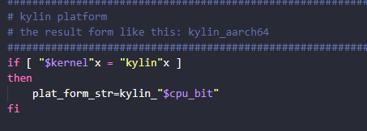

$kernel 信息可以通过命令获取：

```
lsb_release -d | awk -F ' ' '{print $2}'| tr A-Z a-z
```

在以下 python 的三方依赖中，增加平台信息。

```
openGauss-third_party/dependency/fio/build.py
openGauss-third_party/dependency/iperf /build.py
openGauss-third_party/dependency/jemalloc/build.py
openGauss-third_party/dependency/kerberos/build.py
openGauss-third_party/dependency/libcgroup/build.py
openGauss-third_party/dependency/libedit/build.py
openGauss-third_party/dependency/nanomsg /build.py
openGauss-third_party/dependency/numactl/build.py
openGauss-third_party/dependency/openssl/build.py
openGauss-third_party/dependency/protobuf/build.py
```

binary_parse 函数中，增加新的平台相关信息配置。这几个文件改动相同

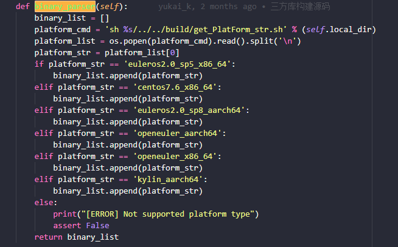

以下错误信息均是由于未增加平台信息引起：

```
Failed
[Error] the plat form is not supported!
[ERROR] Not supported platform type
```

### 1.4.编译三方库

进入到`openGauss-third_party/build`目录，运行 `sh build_all.sh`，全量编译三方库
如果在编译过程中，某一步有错误，解决错误后，可以注释掉已经编译好的三方库，只编译还未编译成功的库，分组单独进行编译。

**_编译 buildtools_**

```
cd openGauss-third_party/build_tools
sh build_tools.sh
```

**_编译 platform_**

```
cd openGauss-third_party/platform/build/
sh build_platform.sh
```

**_编译 dependency_**

```
cd openGauss-third_party/dependency/build/
sh build_dependency.sh
```

### 1.5.编译完成

编译结果在 `openGauss-third_party/output` 之中，目录层级结构如下（`${platform}` 即为当前平台信息）：

```
openGauss-third_party
	- output
		- buildtools
			- license_control
			- server_key
			- ${platform}
				- gcc7.3
		- common
			- commons-codec
			- fastjson
			……
		- dependency
			- ${platform}
				- boost
				- cjson
				……
			- install_tools_${platform}
				- asnlcrypto
				……
		- platform
			- ${platform}
				- openjdk
				……
```

将编译好的 `gmp mpfr mpc isl gcc` 目录拷贝到`openGauss-third_party/output/buildtools/${platform}/gcc7.3`下，output 目录即为完整的三方库二级制。将 output 目录拷贝出去，重命名为 binarylibs，便可以使用它进行数据库编译。

## 2.编译数据库

以上完成三方库编译后，就可以开始数据库的编译了。以下介绍如何进行编译，以及修改代码适配不同的 gcc 版本、不同的操作系统。

### 2.1.编译数据库

下载 openGauss-server 代码，进入到源码目录下。

**_一键编译_**

编译命令:

```
sh build.sh -m release -3rd /usr2/compile/binarylibs
```

-3rd 为第一步编译好的三方库二进制目录
-m 参数可选择 `debug|release|memcheck`
编译完成后，目标文件在`./mppdb_tmp_install`下面。

**_手动编译_**

导入环境变量：

```
export CODE_BASE=/usr2/compile/openGauss-server
export BINARYLIBS=/usr2/compile/binarylibs
export GAUSSHOME=$CODE_BASE/dest/
export GCC_PATH=$BINARYLIBS/buildtools/openeuler_aarch64/gcc7.3/
export CC=$GCC_PATH/gcc/bin/gcc
export CXX=$GCC_PATH/gcc/bin/g++
export LD_LIBRARY_PATH=$GAUSSHOME/lib:$GCC_PATH/gcc/lib64:$GCC_PATH/isl/lib:$GCC_PATH/mpc/lib/:$GCC_PATH/mpfr/lib/:$GCC_PATH/gmp/lib/:$LD_LIBRARY_PATH
export PATH=$GAUSSHOME/bin:$GCC_PATH/gcc/bin:$PATH
```

参数说明：
CODE_BASE 为 openGauss-server 源码目录；
BINARYLIBS 为第一步编译好的三方库二进制目录；
GAUSSHOME 为编译完成的目标文件路径；
GCC_PATH 二进制中，GCC 编译结果存放的路径，需要修改里面的 openeuler_aarch64 为实际的平台信息。

编译命令如下：

```
./configure --gcc-version=7.3.0 CC=g++ CFLAGS='-O0' --prefix=$GAUSSHOME --3rd=$BINARYLIBS --enable-debug --enable-cassert --enable-thread-safety --without-readline --without-zlib
make –sj
make install –sj
```

### 2.2.编译适配其他系统

对于 `centos_7.6` 以及 `openEuler20.03 LTS` 操作系统，可以直接编译。其他系统需要修改代码适配。

**_修改脚本新增平台:_**

打开 `openGauss-server/src/get_PlatForm_str.sh`，在里面（134 行）增加新的平台信息，例如：

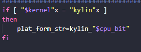

在 `openGauss-server/build/script/mpp_package.sh:46` 行
和 `openGauss-server/build/script/package_opengauss.sh:55` 行
增加平台的信息。

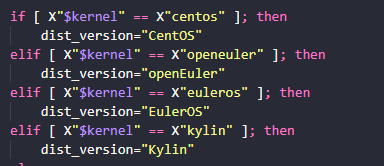

**_修改 Makefile 文件_**
打开`openGauss-server/src/gausskernel/Makefile`文件，在 702 行，复制一份其他系统的并更改为当前平台。

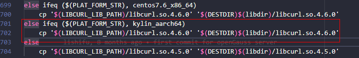

**_一键编译_**

```
sh build.sh -m release -3rd /usr2/compile/binarylibs
```

**_手动编译_**

参照**_2.1 编译数据库_**的**_手动编译_**命令，只需要修改 `GCC_PATH` 中平台参数，其他操作保持一致。

```
export GCC_PATH=$BINARYLIBS/buildtools/ubuntu_x86_64/gcc7.3/
```

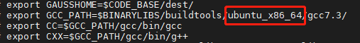

### 2.3.编译适配其他版本 gcc

当前 openGauss 固定编译使用的 gcc 版本为 `gcc7.3`，如果使用其他 gcc 版本，例如 `gcc8.2`(支持 c11 标准)，也可以进行编译。需要修改代码适配。

**_修改配置中的 gcc 版本为指定版本_**

```
openGauss-server/configure:936行，gcc_version改为指定版本。
openGauss-server/build/script/mpp_package.sh 62行和311行(关键字gcc_version)，7.3.0改为指定版本。
```

configure 文件:
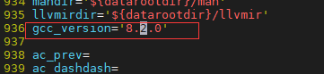
mpp_package 文件:
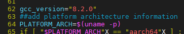
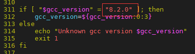

**_一键编译_**

```
sh build.sh -m release -3rd /usr2/compile/binarylibs
```

**_手动编译_**
参照 2.1 手动编译命令，修改环境变量的 gcc 版本为指定版本：

```
export GCC_PATH=$BINARYLIBS/buildtools/openeuler_aarch64/gcc8.2/
```

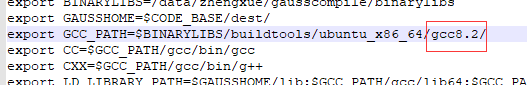

修改 configure 版本为指定版本：

```
./configure --gcc-version=8.2.0 ........
```

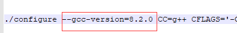
其他命令与 2.1 一致。
