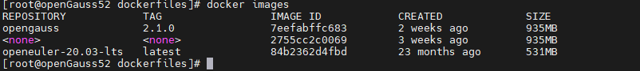
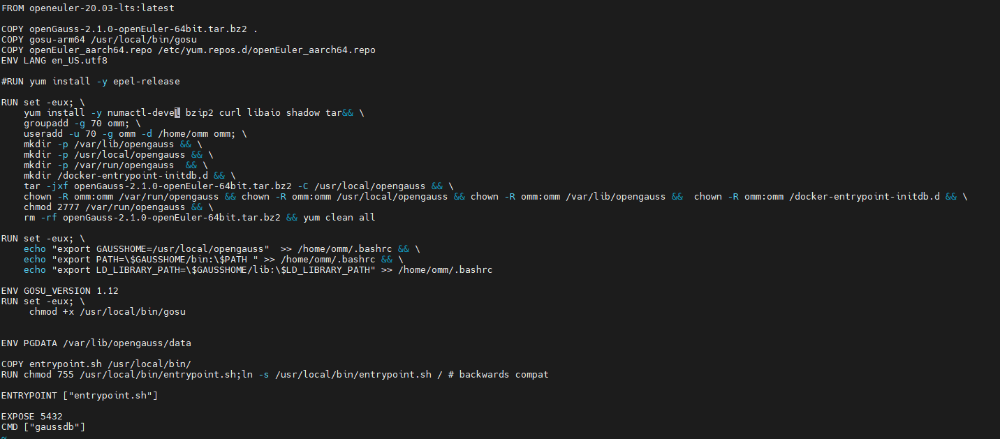

---
title: '通过Docker安装openGauss'
date: '2022-02-19'
category: 'blog'
tags: ['通过Docker安装openGauss']
archives: '2022-02-19'
author: 'xiteming'
summary: '通过Docker安装openGauss'
img: '/zh/blogs/xiteming/title/img1.png'
times: '19:30'
---

###通过 Docker 安装 openGauss

#### Docker 概述

Docker 是一个开源的应用容器引擎，让开发者可以打包他们的应用以及依赖包到一个可移植的容器中,然后发布到任何流行的 Linux 或 Windows 操作系统的机器上,也可以实现虚拟化,容器是完全使用沙箱机制,相互之间不会有任何接口。

#### 概述

本章节介绍通过 Docker 安装单机版 openGauss。

以 openGauss-server 2.1.0 版本、openeuler-20.03 版本和 openGauss-server 2.1.0 版本 openEuler 系统安装包为例。

#### 前提准备

1. openGauss-server 代码库。（下载地址：https://opengauss.obs.cn-south-1.myhuaweicloud.com/2.1.0/arm/openGauss-2.1.0-openEuler-64bit-all.tar.gz）

2. openeuler 操作系统在 docker 环境下的镜像文件。（下载地址：https://repo.openeuler.org/openEuler-20.03-LTS/docker_img/aarch64/）

3. openGauss 在 openEuler 平台的的软件安装包。（下载地址：https://opengauss.obs.cn-south-1.myhuaweicloud.com/2.1.0/arm/openGauss-2.1.0-openEuler-64bit-all.tar.gz）

4. openEuler_aarch64.repo 文件。（下载地址：https://mirrors.huaweicloud.com/repository/conf/openeuler_aarch64.repo）

#### 上传软件包

1. 在 Linux 系统下，创建目录来放软件包

```
mkdir -p /opt/xxx
```

2. 通过 ftp 等工具，将 openGauss-2.1.0-CentOS-64bit-all.tar.gz 包放到/opt/xxx 目录下

#### 安装 docker

```
yum list |grep docker-engine.aarch64                        //查看版本信息
yum install -y docker
```

#### 验证 docker 安装是否成功

```
docker version
```

#### 加载 openeuler docker 镜像文件

```
docker load -i openEuler-docker.aarch64.tar.xz
```

#### 查看 openeuler docker 镜像是否加载成功

```
docker images
```



#### 修改 dockerfile_arm 文件

进入到/opt/xxx/openGauss-server/docker/dockerfiles 路径下，`cd /opt/xxx/openGauss-server/docker/dockerfiles`

将 1.1.0 文件夹名称修改为 2.1.0，`mv 1.1.0 2.1.0`

进入该文件夹，`cd 2.1.0`

打开 dockerfile_arm 文件，`vim dockerfile_arm`

将 openGauss 版本名统一修改成 2.1.0，如下图所示：



#### 创建 openGauss docker 镜像

1. 进入存放软件安装包的路径下，将下载好的 openGauss-2.1.0-openEuler-64bit-all.tar.gz 安装包解压

```
tar –zxvf openGauss-2.1.0-openEuler-64bit-all.tar.gz
```

2. 将解压出来的 openGauss-2.1.0-openEuler-64bit.tar.bz2 移至/opt/xxx/openGauss-server/docker/dockerfiles/2.1.0

```
cp openGauss-2.1.0-openEuler-64bit.tar.bz2 /opt/xxx/openGauss-server/docker/dockerfiles/2.1.0
```

3.将 openEuler_aarch64.repo 文件并放到/opt/xxx/openGauss-server/docker/dockerfiles/2.1.0

```
mv openEuler_aarch64.repo /opt/xxx/openGauss-server/docker/dockerfiles/2.1.0
```

4.创建 openGauss docker 镜像，-v 后面的值为版本号，-i 意为跳过 MD5 检查

```
sh buildDockerImage.sh –v 2.1.0 –i
```

#### 查看 openGauss docker 镜像是否创建成功，成功后如下图所示

```
docker images
```


#### 开启 openGauss 实例

```
docker run --name OG1 --privileged=true -d -e GS_PASSWORD=openGauss@123 –e GS_NODENAME=test –e GS_USERNAME=test –p 8888:5432 opengauss:2.1.0
```

#### 进入 docker

```
docker exec-ti OG1 /bin/bash
```

#### 登录子用户并连接数据库，成功后如下图所示

```
su – omm
gsql –d postgres –p 5432 –r
```


