# openGauss 的 WDR 报告解读

本文出处：[https://www.modb.pro/db/500742](https://www.modb.pro/db/500742)

在 Oralce 数据库中，遇到性能问题，我们通常会查看有无对应时间段的快照，生成 awr 报告并进一步分析（AWR 是 Automatic Workload Repository 的简称，中文叫着自动工作量资料档案库。是 Oracle 数据库用于收集、管理和维护数据库整个运行期间和性能相关统计数据的存储仓库，是 Oracle 数据库性能调整和优化的基础。awr 收集到的数据会被定期保存到磁盘，可以从数据字典查询以及生成性能报告。）。AWR 报告整个数据库在运行期间的现状或者说真实状态只有在被完整记录下来，才是可查，可知，可比较，可推测或者说为未来性能优化调整提供支撑建议的基础。

在 opengauss 数据库中，也有着这样的“awr”，它叫做——wdr。WDR 是(Workload Diagnosis Report)负载诊断报告，是 openGauss 的工作负载诊断报告，常用于判断 openGauss 长期性能问题。

# 前提：

生成 WDR 报告的前提条件是，打开参数 enable_wdr_snapshot。确认当前已按照的 openGauss 数据库是否打开 WDR 报告的参数，需要通过下图登录数据库进行查询。enable_wdr_snapshot 的值为 on 表示打开，off 表示关闭

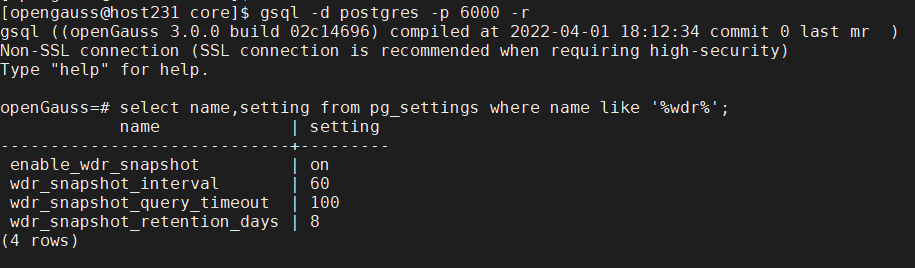

**以下介绍 WDR 报告的参数：**

| 序号 | 参数                        | 参数说明                                                                                                                                | 取值范围                                                                                |
| ---- | --------------------------- | --------------------------------------------------------------------------------------------------------------------------------------- | --------------------------------------------------------------------------------------- |
| 1    | enable_wdr_snapshot         | 是否开启数据库监控快照功能                                                                                                              | 取值范围：布尔型 on: 打开数据库监控快照功能。 off: 关闭数据库监控快照功能。 默认值: off |
| 2    | wdr_snapshot_interval       | 后台线程 Snapshot 自动对数据库监控数据执行快照操作的时间间隔                                                                            | 取值范围: 整型，10 ～ 60（分钟） 默认值: 1h                                             |
| 3    | wdr_snapshot_query_timeout  | 系统执行数据库监控快照操作时，设置快照操作相关的 sql 语句的执行超时时间。如果语句超过设置的时间没有执行完并返回结果，则本次快照操作失败 | 取值范围: 整型，100 ～ INT_MAX（秒） 默认值: 100s                                       |
| 4    | wdr_snapshot_retention_days | 系统中数据库监控快照数据的保留天数，超过设置的值之后，系统每隔 wdr_snapshot_interval 时间间隔，清理 snapshot_id 最小的快照数据          | 取值范围: 整型，1 ～ 8 默认值: 8                                                        |

# 操作步骤：

- 1.执行以下 SQL 命令,查询已经生成的快照信息。

  ```
  select * from snapshot.snapshot;
  ```

  **snapshot.snapshot 【记录当前系统中存储的 WDR 快照信息】**

  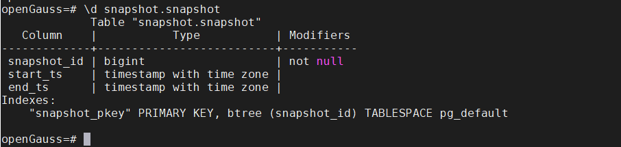

  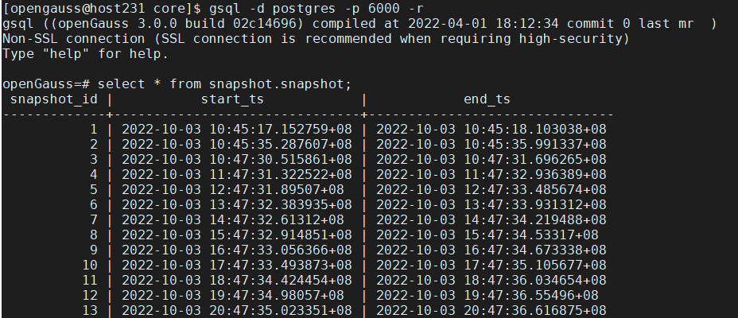

  

- 2.生成 WDR 报告。执行如下步骤，生成节点 node 级别 wdr 报告。

  - 1）查询 pgxc_node_name 参数值，或者使用查询视图：pg_node_env。

  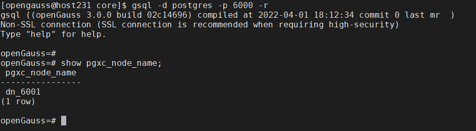

  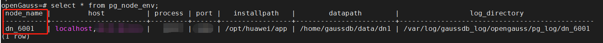

  - 2） \a \t \o 服务器文件路径生成格式化性能报告

  ```
  \a \t \o /home/opengauss/wdrTest.html
  ```

  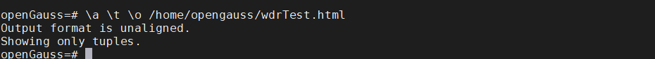

  **上述命令涉及参数说明如下：**

  ```
  \a：切换非对齐模式。
  \t：切换输出的字段名的信息和行计数脚注。
  \o：把所有的查询结果发送至服务器文件里。
  服务器文件路径：生成性能报告文件存放路径。用户需要拥有此路径的读写权限。
  ```

  **如果不退出当前登录 gsql 客户端，进行执行其他 SQL，关闭格式化输出命令：**

  ```
  \o \a \t
  ```

  - 3）向性能报告 wdrTest.html 中写入数据，从 snapshot.snapshot 视图中选取要生成 WDR 报告的时间点。例如：127 和 128 两个时间点。

  ```
  gsql -d postgres -p 6000 -r -c"select generate_wdr_report(快照id1,快照id2,‘all’,‘node’,‘pgxc_node_name参数值’);"

  select generate_wdr_report(127,128,'all','node','dn_6001');
  ```

  **函数说明：generate_wdr_report**

  > **语法:**
  >
  > select generate_wdr_report(begin_snap_id bigint, end_snap_id bigint, report_type cstring, report_scope cstring, node_name cstring);
  >
  > **选项：**
  >
  > begin_snap_id：查询时间段开始的 snapshot 的 id（表 snapshot.snaoshot 中的 snapshot_id）
  >
  > end_snap_id： 查询时间段结束 snapshot 的 id。默认 end_snap_id 大于 begin_snap_id（表 snapshot.snaoshot 中的 snapshot_id）
  >
  > report_type： 指定生成 report 的类型。例如，summary/detail/all，其中：summary\[汇总数据\]/detail\[明细数据\]/all\[包含 summary 和 detail\]
  >
  > report_scope： 指定生成 report 的范围，可以为 cluster 或者 node，其中：cluster 是数据库级别的信息，node 是节点级别的信息。
  >
  > node_name： 当 report_scope 指定为 node 时，需要把该参数指定为对应节点的名称。当 report_scope 为 cluster 时，该值可以省略或者指定为空或 NULL。node[节点名称]、cluster[省略/空/NULL]

  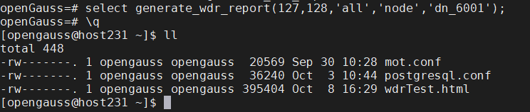

  - 4)目录下生成对应的 wdr 报告，cd /home/opegauss 生成报告的指定路径进行查看。

  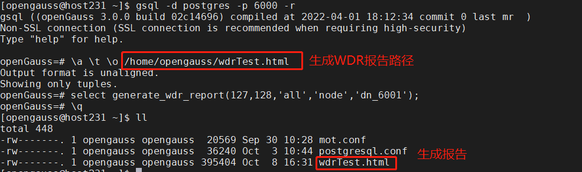

- 3.手工创建快照信息

  当在 openGauss 数据库执行性能测试，数据库默认每小时自动执行一次 snapshot 操作。生成指定时间段内的 WDR 报告，查询快照视图后选取指定开始时间的快照 id，结束时间的快照 id。通过函数 generate_wdr_report 生成 wdr 报告。但是有些情况，固定时间段的 WDR 报告，就需要使用具有 sysadmin 权限用户手工创建快照信息，需要执行两次。具体操作步骤如下：

  - 1）首先确认一下，当前的快照信息视图 snapshot.snapshot 中的时间节点。

    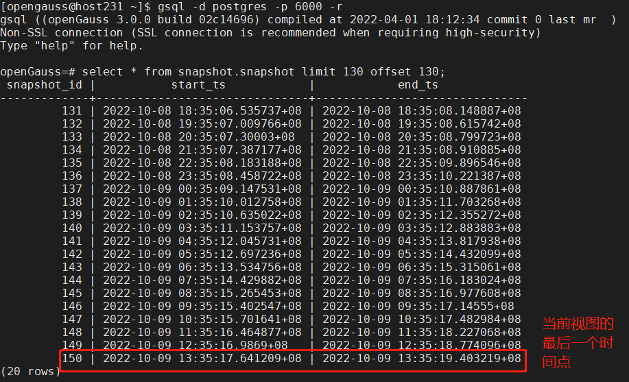

  - 2）执行函数 create_wdr_snapshot()创建快照

    **手工创建 wdr 报告快照执行语句：**

    ```
    select create_wdr_snapshot();
    ```

    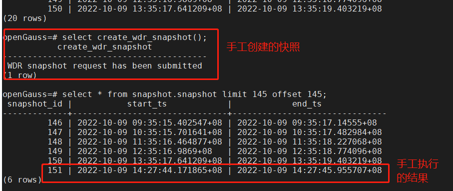

  - 3）等待 10 分钟以后再次执行函数 create_wdr_snapshot()，手工创建结束快照。

    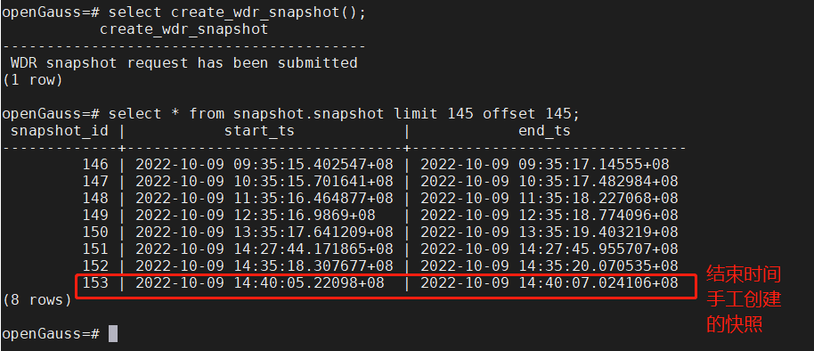

  - 4）执行操作步骤第二步：生成 WDR 报告，执行如下图步骤，生成节点 node 级别 wdr 报告（其中 dn_6001 客户端 gsql 登录数据 show pgxc_node_name 查询的结果）。

    

    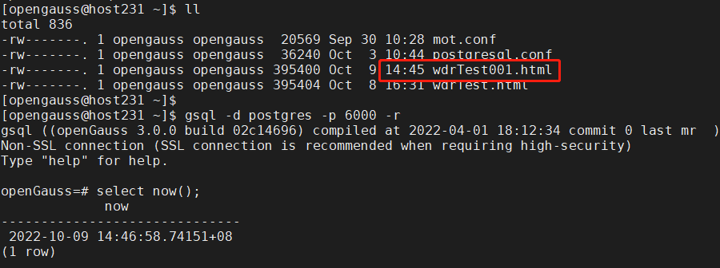

- 4.WDR 涉及的数据表

  > **说明：**
  > WDR 的数据表保存在 snapshot 这个 schema 下以 snap\_开头的表，其数据来源于 dbe_perf 这个 schema 内的视图，总共 61 张视图

  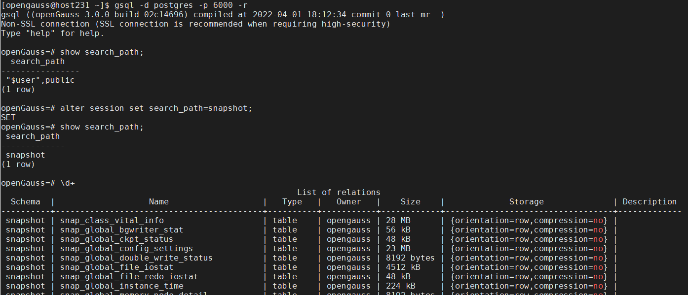

  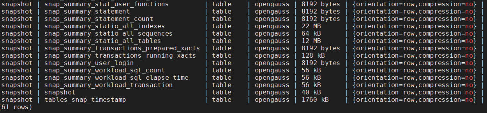

# WDR 报告解读

> **说明：**
> 为了使得 WDR 报告内容不空洞，本次在测试环境使用 BenchmarkSQL5.0 对 openGauss 数据库进行 100warehouse，100 并发压力测试。 本次的 WDR 报告样例来自于此时手工创建的快照数据。

- 手工生成 WDR 报告后，通过浏览器查看。opengauss 的 wdr 报告类似于 oracle 的 awr，拥有资源消耗、等待事件、TOPSQL，以及参数设置等。

- 1）下图是执行前 tpcc 表信息：

  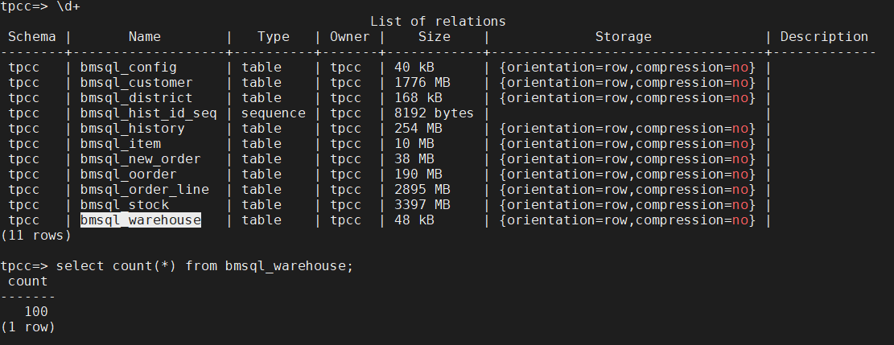

- 2）以下是手工创建的快照开始时间点：

  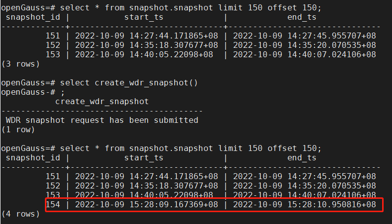

- 3）开始执行 benchmarksql，运行 10 分钟完成后。手工再次生成 wdr 报告的结束快照。

  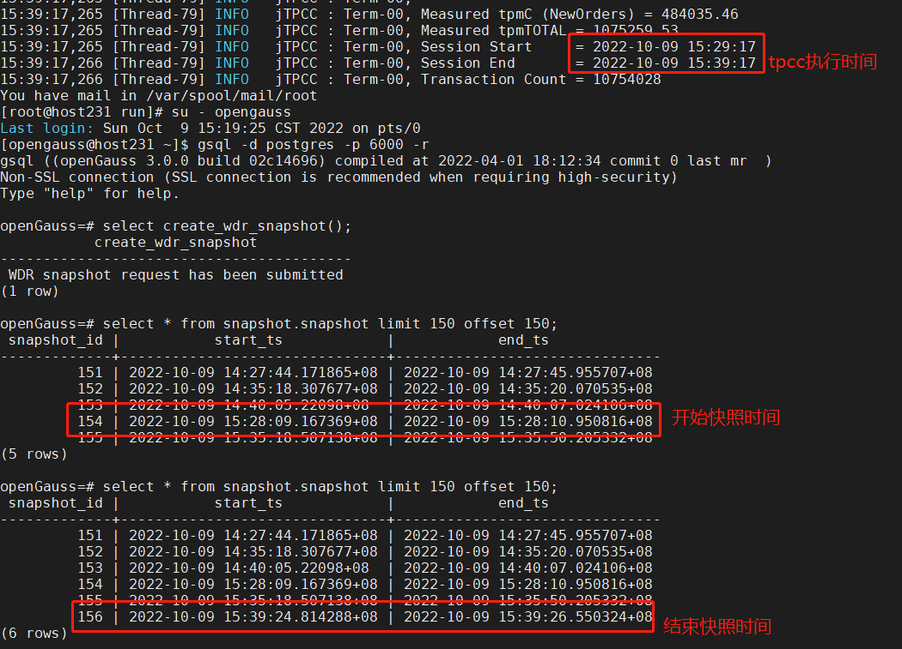

- 4）生成 wdr 报告如下图：

  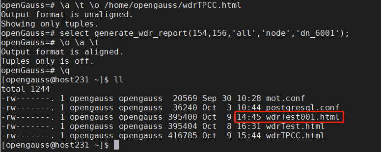

- 5）以下是解读 WDR 报告

当前 wdr 报告概况信息：

| 信息分类       | 信息描述                                                                    |
| -------------- | --------------------------------------------------------------------------- |
| 报告采集类型   | Summary + Detail，即汇总数据+明细数据                                       |
| Snapshot 信息  | 使用 snapshot_id 为 24 和 25 的快照采集 2022-10-09(15:28 ~ 15:39)的运行信息 |
| 硬件配置       | X\*Xc/GB                                                                    |
| 节点名         | dn_6001                                                                     |
| openGauss 版本 | openGauss 3.0.0                                                             |


| 类别           | 分类明细                         | 作用                                                                                                                                                                  |
| -------------- | -------------------------------- | --------------------------------------------------------------------------------------------------------------------------------------------------------------------- |
| Summary        | Instance Efficiency Percentages  | 实例的效率百分比                                                                                                                                                      |
|                | Top 10 Events by Total Wait Time | 事件等待时间排名前 10                                                                                                                                                 |
|                | Wait Classes by Total Wait Time  | 按照等待类型分类                                                                                                                                                      |
|                | Host_CPU                         | 主机 CPU 的负载情况                                                                                                                                                   |
|                | IO Profile                       | 描述了 openGauss 在快照期间的 IO 负载情况                                                                                                                             |
|                | Memory_Statistics                | 描述了节点内存的变化信息                                                                                                                                              |
| Report Details | Time Model                       | 描述了数据库各种状态所消耗的时间                                                                                                                                      |
|                | SQL Statistics                   | 从 SQL 执行时间、SQL 消耗 CPU 的时间、SQL 返回的行数、SQL 扫描的行数、SQL 执行的次数、SQL 物理读的次数、SQL 逻辑读的次数等多维度对两次快照期间的 SQL 执行情况进行统计 |
|                | Wait Events                      | 从等待时长、等待次数这两个维度对等待事件进行统计                                                                                                                      |
|                | Cache IO Stats                   | 根据 Heap block 的命中率排序统计用户表的 IO 活动状态                                                                                                                  |
|                | Utility status                   | 描述的是后台写操作的统计信息                                                                                                                                          |
|                | Object stats                     | 描述用户表状态的统计信息                                                                                                                                              |
|                | Configuration settings           | 描述的是数据库参数配置信息                                                                                                                                            |
|                | SQL Detail                       | 描述的是 SQL 语句的详细信息                                                                                                                                           |
