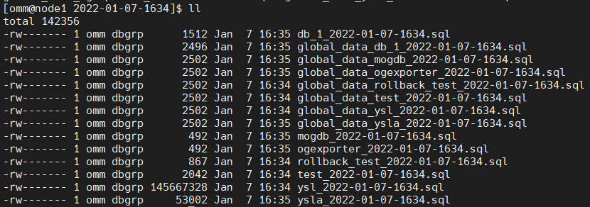
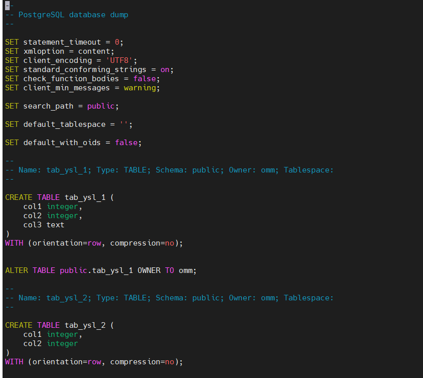

# MOGDB/openGauss 数据库 gs_dump 备份脚本及备份清理

本文出处：[https://www.modb.pro/db/233452](https://www.modb.pro/db/233452)

有客户需要对 MOGDB/openGauss 进行每天逻辑备份。如下脚本分享给大家。当然专业的备份工具也可以了解一下云和恩墨的 BRM 备份工具。

# 一、备份脚本

## 1.脚本

c.sh (可以改名字)

```
# database dump shell
# you should change the GAUSSHOME GAUSSPORT GAUSSDATA DUMP_USER DUMP_PASSWORD
#!/bin/bash
source /etc/profile
source /home/omm/.bash_profile
export GAUSSHOME=/opt/gaussdb/app
export GAUSSPORT=26000
export GAUSSDATA=/gaussdb/data/dn1
export PATH=$PGHOME/bin:$PATH
DUMP_USER=ysla
DUMP_PASSWORD='1qaz@WSX'
CUR_DATE=`date "+%Y-%m-%d-%H%M"`
dbnamelist=`cat oo.txt`

#Loading DBLIST
gsql -p ${GAUSSPORT} postgres -c "select datname from pg_database where datname not in ('template1','template0','postgres')" -t | grep -v '^$' >oo.txt

#save directory
SAVE_BASE_DIR="/gaussdb/dump_dir"
DAT_FILE_DIR="${SAVE_BASE_DIR}/${CUR_DATE}"
if [ -d ${DAT_FILE_DIR} ]
 then :
 else
 mkdir -p ${DAT_FILE_DIR}
fi
# The real backup step!
echo "`date "+%Y-%m-%d-%H%M"` begin backup db "
for dbname in ${dbnamelist}
do
gs_dump -E UTF8 ${dbname} -U ${DUMP_USER} -W ${DUMP_PASSWORD} -p ${GAUSSPORT} -F p -f ${DAT_FILE_DIR}/${dbname}_${CUR_DATE}.sql
gs_dumpall -l ${dbname} -U ${DUMP_USER} -W ${DUMP_PASSWORD} -p ${GAUSSPORT} -g -f ${DAT_FILE_DIR}/global_data_${dbname}_${CUR_DATE}.sql
done
tar -cjvf ${DAT_FILE_DIR}.tar.gz /${DAT_FILE_DIR} --remove-files
echo "`date "+%Y-%m-%d-%H%M"` end backup db "

```

这个脚本需要修改 GAUSSHOME GAUSSPORT GAUSSDATA DUMP_USER DUMP_PASSWORD 这几个（数据库家目录，端口，数据目录，做 dump 的用户，以及密码），之后直接执行就可以。脚本会自动查询数据库，并把’template1’,'template0’和’postgres’数据库排除掉，然后把其他数据库的数据和全局对象各自备份一份，最后把备份的.sql 文件进行压缩。

## 2，脚本执行

执行结果如下：

去备份保存的目录下

解压一个文件

如下数据库的数据保存的文件名格式为（数据库名*日期时间.sql）
全局对象保存的文件名格式为（global_data*数据库名\_日期时间.sql）



查看数据库对应的数据备份

```
[omm@node1 2022-01-07-1634]$ vim ysla_2022-01-07-1634.sql
```


查看数据库对应的全局对象备份

```
[omm@node1 2022-01-07-1634]$ vim global_data_ysla_2022-01-07-1634.sql
```


# 二、备份脚本加到 crontab

将如下一行加入 crontab，让脚本每天凌晨 12：30 执行，这里的 flock 是为了防止一个脚本没执行完就到了这个脚本下一次执行的周期，可能会导致并发问题，严重时会导致出现脏数据性能瓶颈等恶性循环，所以使用 flock 建立排它锁

> -x 独占锁 -n 直接失败 如发现被锁如就失败不等待，除非解锁

```
30 00 * * * /usr/bin/flock -xn /tmp/test.lock -c 'sh /home/omm/c.sh >> c.log'
```

# 三、备份保留，清理

每天都进行备份，如果备份天数过多不清理，可能使目录打满，因此需要添加备份清理策略，我这里用的是 crontab 的方式，每天凌晨 3：30 清理过期数据。
如下一行加入到 crontab 里边，也是用了 flock，这一行命令会找备份目录下的文件，排除掉隐藏文件，并把 30 天之前的.tar.gz 文件删除。

```
30 03 * * * /usr/bin/flock -xn /tmp/test1.lock -c "find /gaussdb/dump_dir  -not -path '*/\.*' -mtime +30  -type f -name *.tar.gz -exec rm -rf {} \;"
```
