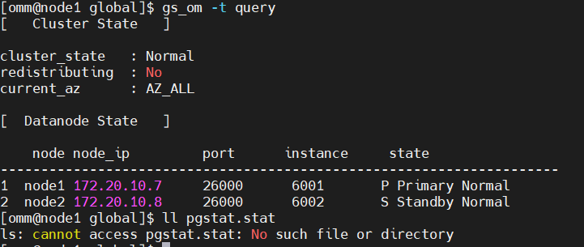
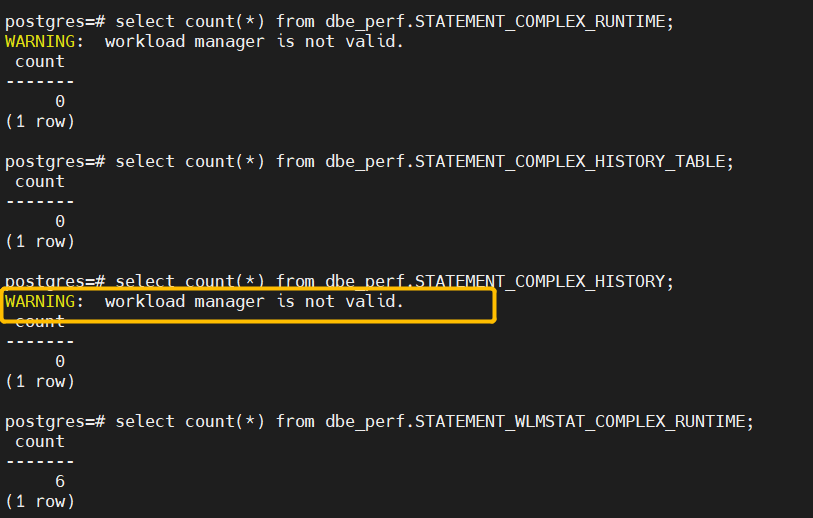
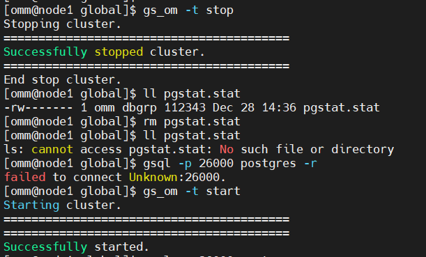

# MOGDB/openGauss 的 dbe_perf.Statement 与 pgstat.stat 文件关系验证

本文出处：[https://www.modb.pro/db/228364](https://www.modb.pro/db/228364)

数据目录的/global 下在数据库 stop 之后会自动生成一个 pgstat.stat 文件。保存着 DBE_PERF_Schema 下 query 记录 statement 相关的 dbe_perf.Statement（获得当前节点的执行语句(归一化 SQL)的信息。查询视图必须具有 sysadmin 权限。
数据库主节点上可以看到此数据库主节点接收到的归一化的 SQL 的全量统计信息（包含数据库节点）；数据库节点上仅可看到归一化的 SQL 的此节点执行的统计信息）、dbe_perf.STATEMENT_WLMSTAT_COMPLEX_RUNTIME（STATEMENT_WLMSTAT_COMPLEX_RUNTIME 视图显示和当前用户执行作业正在运行时的负载管理相关信息）视图静态记录。在数据库拉起后文件自动清理。

# 一、Statement 所有相关的视图有：

```
select count(*) from dbe_perf.Statement;
select count(*) from dbe_perf.STATEMENT_COUNT;
select count(*) from dbe_perf.GLOBAL_STATEMENT_COUNT;
select count(*) from dbe_perf.SUMMARY_STATEMENT_COUNT;
select count(*) from dbe_perf.GLOBAL_STATEMENT_COMPLEX_HISTORY;
select count(*) from dbe_perf.GLOBAL_STATEMENT_COMPLEX_HISTORY_TABLE;
select count(*) from dbe_perf.GLOBAL_STATEMENT_COMPLEX_RUNTIME;
select count(*) from dbe_perf.STATEMENT_RESPONSETIME_PERCENTILE;
select count(*) from dbe_perf.STATEMENT_COMPLEX_RUNTIME;
select count(*) from dbe_perf.STATEMENT_COMPLEX_HISTORY_TABLE;
select count(*) from dbe_perf.STATEMENT_COMPLEX_HISTORY;
select count(*) from dbe_perf.STATEMENT_WLMSTAT_COMPLEX_RUNTIME;

```

验证情况如下，从现象看只有 dbe_perf.Statement、dbe_perf.STATEMENT_WLMSTAT_COMPLEX_RUNTIME 受影响。

# 二、第一轮测试



```
select count(*) from dbe_perf.Statement;
-------
    47
(1 row)

postgres=# select count(*) from dbe_perf.STATEMENT_COUNT;
 count
-------
     4
(1 row)

postgres=# select count(*) from dbe_perf.GLOBAL_STATEMENT_COUNT;
 count
-------
     4
(1 row)

postgres=# select count(*) from dbe_perf.SUMMARY_STATEMENT_COUNT;
 count
-------
     4
(1 row)

postgres=# select count(*) from dbe_perf.GLOBAL_STATEMENT_COMPLEX_HISTORY;
 count
-------
     0
(1 row)

postgres=# select count(*) from dbe_perf.GLOBAL_STATEMENT_COMPLEX_HISTORY_TABLE;
 count
-------
     0
(1 row)

postgres=# select count(*) from dbe_perf.GLOBAL_STATEMENT_COMPLEX_RUNTIME;
 count
-------
     0
(1 row)

postgres=# select count(*) from dbe_perf.STATEMENT_RESPONSETIME_PERCENTILE;
 count
-------
     1
(1 row)

postgres=# select count(*) from dbe_perf.STATEMENT_COMPLEX_RUNTIME;
 count
-------
     0
(1 row)

postgres=# select count(*) from dbe_perf.STATEMENT_COMPLEX_HISTORY_TABLE;
 count
-------
     0
(1 row)

postgres=# select count(*) from dbe_perf.STATEMENT_COMPLEX_HISTORY;
 count
-------
     0
(1 row)

postgres=# select count(*) from dbe_perf.STATEMENT_WLMSTAT_COMPLEX_RUNTIME;
 count
-------
     9
(1 row)


```

可能会报 **WARNING: workload manager is not valid.**，需要将 use_workload_manager 参数打开，该参数表示是否开启资源管理功能。

> use_workload_manager 参数由 off 变为 on 状态后，不会统计 off 时的存储资源。如果需要统计 off 时用户使用的存储资源，请在数据库中执行以下命令：select gs_wlm_readjust_user_space(0);



Stop 库后，删除 pgstat.stat 文件后再次查询



```
postgres=# select count(*) from dbe_perf.Statement;
 count
-------
    27
(1 row)

postgres=# select count(*) from dbe_perf.STATEMENT_COUNT;
 count
-------
     4
(1 row)

postgres=# select count(*) from dbe_perf.GLOBAL_STATEMENT_COUNT;
 count
-------
     4
(1 row)

postgres=# select count(*) from dbe_perf.SUMMARY_STATEMENT_COUNT;
 count
-------
     4
(1 row)

postgres=# select count(*) from dbe_perf.GLOBAL_STATEMENT_COMPLEX_HISTORY;
 count
-------
     0
(1 row)

postgres=# select count(*) from dbe_perf.GLOBAL_STATEMENT_COMPLEX_HISTORY_TABLE;
 count
-------
     0
(1 row)

postgres=# select count(*) from dbe_perf.GLOBAL_STATEMENT_COMPLEX_RUNTIME;
 count
-------
     0
(1 row)

postgres=# select count(*) from dbe_perf.STATEMENT_RESPONSETIME_PERCENTILE;
 count
-------
     1
(1 row)

postgres=# select count(*) from dbe_perf.STATEMENT_COMPLEX_RUNTIME;
 count
-------
     0
(1 row)

postgres=# select count(*) from dbe_perf.STATEMENT_COMPLEX_HISTORY_TABLE;
 count
-------
     0
(1 row)

postgres=# select count(*) from dbe_perf.STATEMENT_COMPLEX_HISTORY;
 count
-------
     0
(1 row)

postgres=# select count(*) from dbe_perf.STATEMENT_WLMSTAT_COMPLEX_RUNTIME;
 count
-------
     9
(1 row)

```

第一轮里看到 dbe_perf.Statement 在删除 pgstat.stat 后数量从 47 变成了 27.三、第二轮测试第二轮测试，发现 dbe_perf.STATEMENT_WLMSTAT_COMPLEX_RUNTIME 的信息也受到了影响
