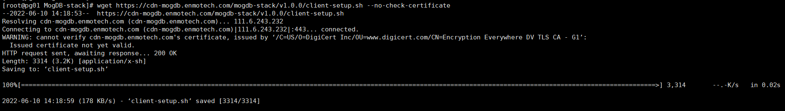
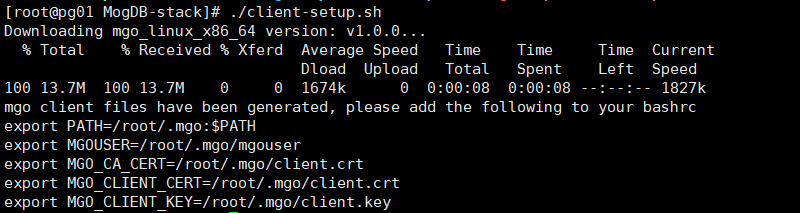
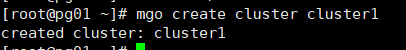

# MogDB stack 之 mgo-client 安装

# 一.安装 mgo 客户端

获取 mgo 的安装脚本

```
 wget https://cdn-mogdb.enmotech.com/mogdb-stack/v1.0.0/client-setup.sh --no-check-certificate
```


安装 mgo 客户端

```
chmod +x client-setup.sh
./client-setup.sh
```



添加环境变量

```
cat <<EOF >> ~/.bashrc
export PATH=/root/.mgo:$PATH
export MGOUSER=/root/.mgo/mgouser
export MGO_CA_CERT=/root/.mgo/client.crt
export MGO_CLIENT_CERT=/root/.mgo/client.crt
export MGO_CLIENT_KEY=/root/.mgo/client.key
export MGO_APISERVER_URL='https://127.0.0.1:32444'
EOF

source ~/.bashrc
```

查看 mgo 版本

```
mgo version
```


# 二、mgo 使用

创建 MogDB cluster

```
mgo create cluster cluster1
```


