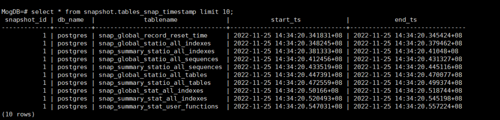
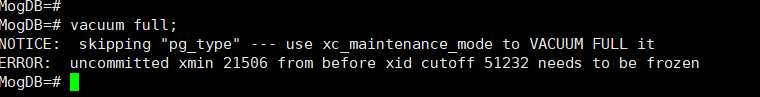
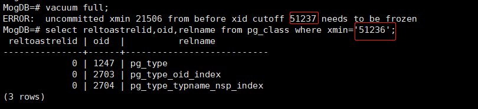
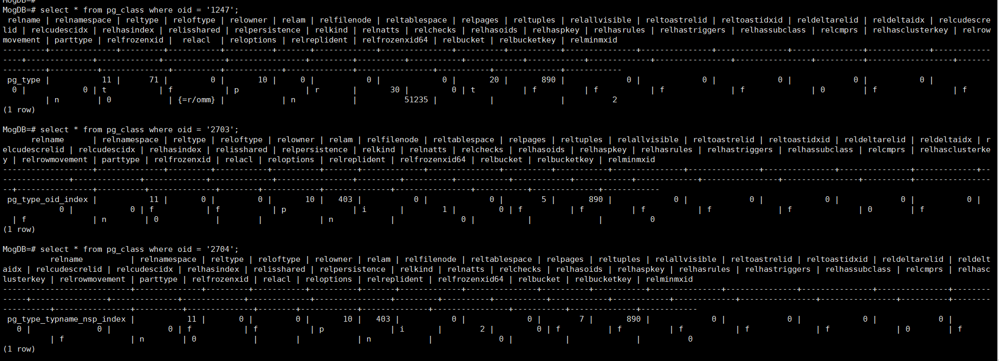
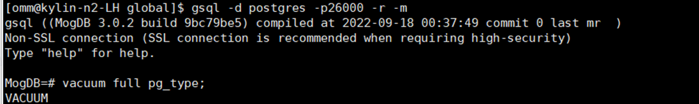
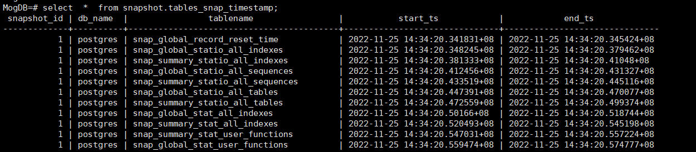

本文出处：[https://www.modb.pro/db/568608](https://www.modb.pro/db/568608)

# 一、问题现象

在测试 openGauss/MogDB 的时候，发现主库查询 snapshot.tables_snap_timestamp 这个表的时候，一 select \*，数据库就宕机，而备库是正常的。因为是测试环境不存在数据量太多的情况。所以最开始初步怀疑有数据页损坏了。



在分析的时候，因为是测试环境使用了 vacuum full 去测试（正常使用 vacuun freeze 应该就可以）。


报错为**ERROR: uncommitted xmin 21506 from before xid cutoff 51237 needs to be frozen**

通过返回结果猜测数据库在已经不允许执行事务的情况下被回滚的, 所以显示为**uncommitted xid**。
根据 vacuum full 提示，它跳过了 pg_type 表，并且建议我们用**maintenance 模式**去 vavuum full 处理它。
此外我们根据提示的 xmin 可以找到对应的是 pg_type 以及两个索引。





# 二、问题解决

maintenance 模式类似于 PostgreSQL 的单用户模式。但是比较好的一点是，MogDB/openGauss 的 maintenance 模式不需要 PostgreSQL 那样需要停掉 PostgreSQL 数据库再去使用。关于 PostgreSQL 的单用户模式可以参考我这一篇 https://www.modb.pro/db/142632

## 1.使用 maintenance 模式连接数据库

以下两种方法均可。

方式一

```
gsql -d postgres -p 26000-r -m
```

方式二

```
gsql -d postgres -p 26000 -r
连接成功后，执行如下命令：
set xc_maintenance_mode=on;
```

## 2.使用 vacuum freeze/vacuum full 处理该系统表

正常使用 vacuun freeze 应该就可以。


再使用正常方式登录，去查询这个表。问题得以解决。

