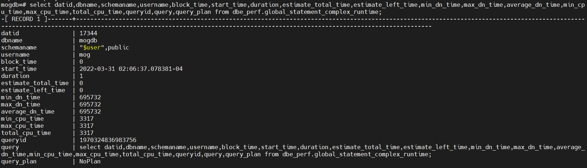
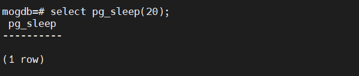
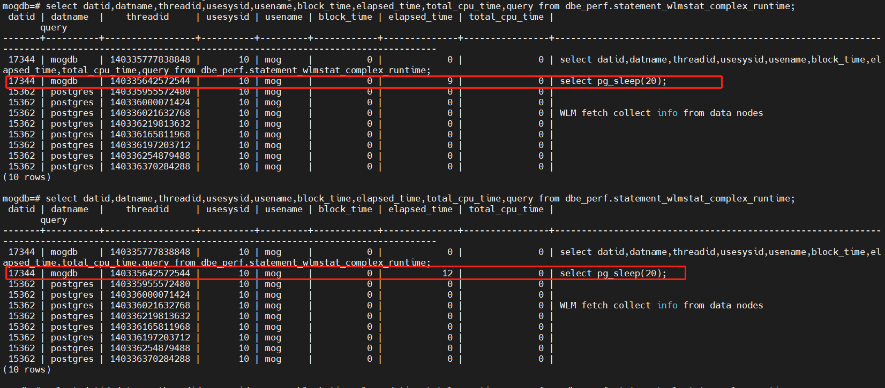
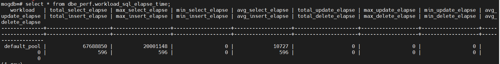
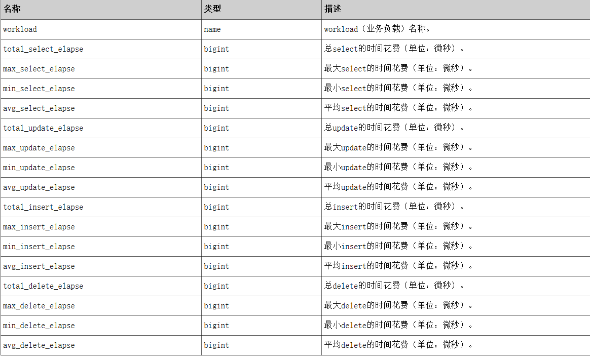
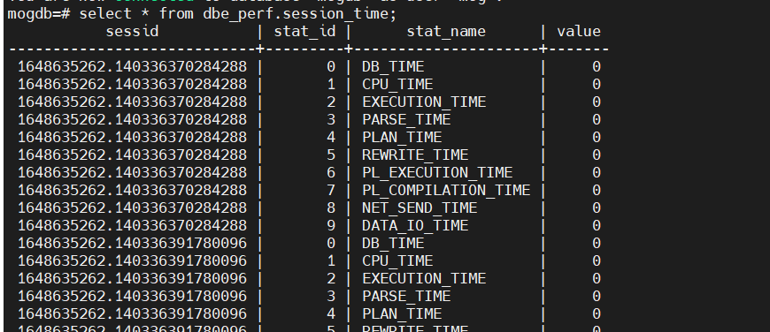

# openGauss/MOGDB 时间消耗相关视图

本文出处：[https://www.modb.pro/db/388212](https://www.modb.pro/db/388212)

> 数据库版本 openGauss/MOGDB-2.1.1

## 一、显示当前用户在各个节点上正在执行的作业的负载管理记录（单位：ms）

包含：
语句执行前的阻塞时间、语句执行的开始时间、语句已经执行的时间、语句执行预估总时间、语句执行预估剩余时间。语句在数据库节点上的最小执行时间，语句在数据库节点上的最大执行时间，语句在数据库节点上的平均执行时间，语句在数据库节点上的最小 CPU 时间，语句在数据库节点上的最大 CPU 时间，语句在数据库节点上的 CPU 总时间等。

```
select datid,dbname,schemaname,username,block_time,start_time,duration,estimate_total_time,estimate_left_time,min_dn_time,max_dn_time,average_dn_time,min_cpu_time,max_cpu_time,total_cpu_time,queryid,query,query_plan from dbe_perf.global_statement_complex_runtime;
```



## 二、显示和当前用户执行作业正在运行时的负载管理相关信息（单位：s）

如查询语句当前为止的 pending 的时间, 语句当前为止的实际执行时间, 语句在上一时间周期内的数据库节点上 CPU 使用的总时间

```
select datid,datname,threadid,usesysid,usename,block_time,elapsed_time,total_cpu_time,query from dbe_perf.statement_wlmstat_complex_runtime;
```

我们在一个终端用 pg_sleep()模拟一个慢 SQL

在另一个终端可以查询这个 SQL 到目前为止的执行时间，可以查看当前查询时刻，这个未完成的 SQL 的实际运行时间等。


## 三、统计 workload（业务负载）上的 DML 的最大，最小，总时间花费（单位：微秒）。

```
select * from dbe_perf.workload_sql_elapse_time;
```




## 四、查看当前数据库节点下的各种时间消耗信息（单位：微秒）

```
select * from dbe_perf.instance_time;
```


> DB_TIME：作业在多核下的有效时间花销。
> CPU_TIME：CPU 的时间花销。
> EXECUTION_TIME：执行器内的时间花销。
> PARSE_TIME：SQL 解析的时间花销。
> PLAN_TIME：生成 Plan 的时间花销。
> REWRITE_TIME：SQL 重写的时间花销。
> PL_EXECUTION_TIME ：plpgsql（存储过程）执行的时间花销。
> PL_COMPILATION_TIME：plpgsql（存储过程）编译的时间花销。
> NET_SEND_TIME：网络上的时间花销。
> DATA_IO_TIME：IO 上的时间花销。

## 五、统计当前节点会话线程的运行时间信息，及各执行阶段所消耗时间

```
select * from dbe_perf.session_time;
```


