## 一、索引

索引是一种用于快速查询和检索数据的数据结构。常见的索引结构有: B 树， B+树和 Hash。

索引的作用就相当于目录的作用。打个比方: 我们在查字典的时候，如果没有目录，那我们就只能一页一页的去找我们需要查的那个字，速度很慢。如果有目录了，我们只需要先去目录里查找字的位置，然后直接翻到那一页就行了。

## 二、内存引擎

在 OpenGauss 中内存引擎全称为内存优化表（MOT）存储引擎。

内存引擎作为在 openGauss 中与传统基于磁盘的行存储、列存储并存的一种高性能存储引擎，基于全内存态数据存储，为 openGauss 提高了高吞吐的实时数据处理分析能力及极低的事务处理时延，在不同业务负载场景下可以达到其他引擎事务处理能力的 3~10 倍。内存引擎之所以有较强的事务处理能力，更多因为其全面利用内存中可以实现的无锁化的数据及其索引结构、高效的数据管控，基于 NUMA 架构的内存管控，优化的数据处理算法及事务管理机制。

MOT 与基于磁盘的普通表并排创建。MOT 的有效设计实现了几乎完全的 SQL 覆盖，并且支持完整的数据库功能集，如存储过程和自定义函数。通过完全存储在内存中的数据和索引、非统一内存访问感知（NUMA-aware）设计、消除锁和锁存争用的算法以及查询原生编译，MOT 可提供更快的数据访问和更高效的事务执行。MOT 有效的几乎无锁的设计和高度调优的实现，使其在多核服务器上实现了卓越的近线性吞吐量扩展。

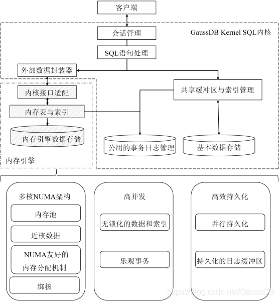

图 1 OpenGauss 内存引擎架构图

## 三、Masstree

### 1．概要

Trie 树和 B+ 树结合而成的并发算法——MassTree。

#### 1.1 因此首先介绍一下字典树(Trie 树)。

Trie 树，又叫字典树、前缀树（Prefix Tree）、单词查找树 或 键树，是一种多叉树结构。

图 2 一棵 Trie 树，表示了关键字集合{“a”, “to”, “tea”, “ted”, “ten”, “i”, “in”, “inn”}。

**\*\*Trie 树的基本性质：\*\***

1.根节点不包含字符，除根节点外的每一个子节点都包含一个字符。

2.从根节点到某一个节点，路径上经过的字符连接起来，为该节点对应的字符串。

3.每个节点的所有子节点包含的字符互不相同。

一般会在节点结构中设置一个标志，用来标记该结点处是否构成一个单词（关键字）。

#### 1.2 然后再介绍一下 B+树。

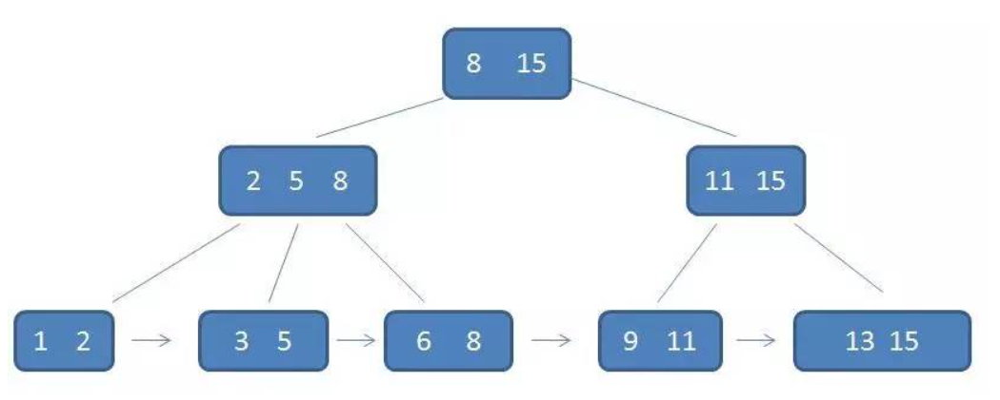

图 3 B+树样例

B+树是 B 树的一种变种，有着比 B-树更高的查询性能

**\*\*一个 m 阶的 B+树具有如下几个特征：\*\***

1.有 k 个子树的中间节点包含有 k 个元素（B 树中是 k-1 个元素），每个元素不保存数据，只用来索引，所有数据都保存在叶子节点。

2.所有的叶子结点中包含了全部元素的信息，及指向含这些元素记录的指针，且叶子结点本身依关键字的大小自小而大顺序链接。

3.所有的中间节点元素都同时存在于子节点，在子节点元素中是最大（或最小）元素。

从结构上来说，Mass Tree 是由一层或多层 B+ 树组成的 Trie 树。

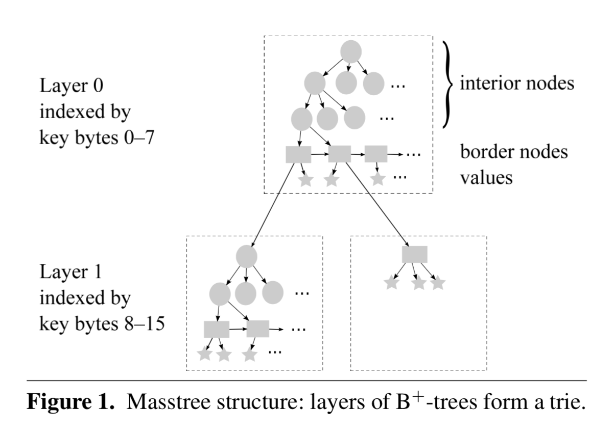

图 4

图 4 中，圆形代表内部节点（interior node，也就是 B+ 树的 branch node），矩形代表边缘节点（border node，也就是 B+ 树的 leaf node），五角星代表 value。border node 的 value 域可能存放的是数据，也可能存放的是下一层子树的根节点。

Masstree 以键(key)的前缀作为索引，每 k 个字节形成一层 B+ 树结构，在每层中处理键中这 k 个 字 节 对 应 所 需 的 INSERT/LOOKUP/ UPDATE/DELETE 流程。图 4 为 k=8 的情况。

### 2．Masstree 静态数据结构

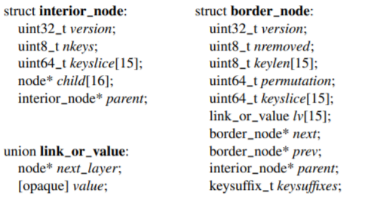

图 5

## 四、OpenGauss 中基于 Masstree 的索引

下面所有提到的大部分文件位于

openGauss-server-master\openGauss-server-master\src\gausskernel\storage\mot\core\src\storage\index 中

### 1．数据结构

对应文件位置：

openGauss-server-master\openGauss-server-master\src\gausskernel\storage\mot\core\src\storage\index\Masstree

OpenGauss 中对应 Masstree 的索引类名为 MasstreePrimaryIndex，

继承 Index 超类。

类 MasstreePrimaryIndex 拥有图 6 中的成员属性。

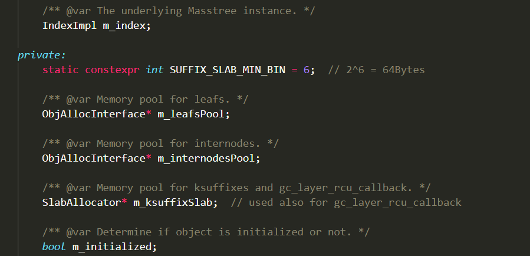

图 6

其超类 Index 拥有图 7 中的成员属性。

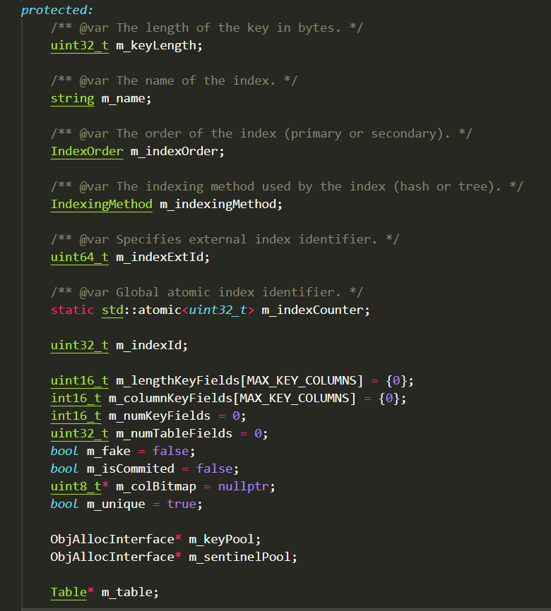

图 7

### 2．并发控制

为了防止读线程读到中间状态，叶节点被设计成最多存放 15 个 key，引入了一个 8 字节 64 位的 permutation(uint64_t)，这个 permutation 被划分成 16 份，每份 4 位，其中 1 份代表当前节点的 key 数量，另外 15 份用于存放每个 key 在节点中实际位置的索引，key 的插入是顺序插入，之后只需要修改 permutation 来更新节点内 key 的索引信息，然后施加一个 release 语义，当读线程对这个节点的 permutation 施加 acquire 语义时，可以获取到完整的节点信息。

并发情况一般有两种竞争，OpenGauss 采用一个 32bit 的 version 参数应对并发控制。

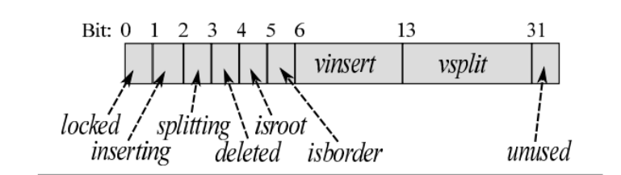

图 8

write-write 竞争：同一时刻只有一个线程可以对当前节点进行写操作

read-write 竞争：开始前和读结束后都需要获取当前节点的最新 version，来判断在读过程中当前节点是否发生了写操作（插入或分裂），同时对节点的写操作都需要先修改 version，在插入 key 之前需要设置 inserting 标记，插入完成之后将 insert 的 vinsert + 1；在分裂之前需要设置 splitting 标记，分裂完成之后将 split 的 vsplit + 1。

### 3．查找操作

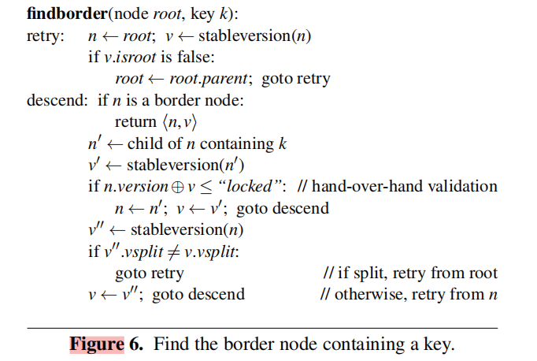

图 9

首先，在开始读取节点之前，必须获得节点的 stable version，即 version 中的 inserting 和 splitting 位都为 0。

其次，在下降之前，需要获取最新的 root，因为在开始下降前，根节点可能分裂了，导致其发生了改变。

最后，如果当前节点已经是叶节点，那么可以返回，否则需要进行下降，读取内部结点根据 key[x, x+8)(8 字节) 获得下降节点之后，分为 3 种情况处理：

1.节点在我们读取期间没有发生任何变化，我们可以安全地进行下降；

2.节点发生了变化，而且是分裂，那么我们需要从根节点重新进行下降；

3.节点发生了变化，但只是插入，只需要重新对当前节点进行下降。

### 4. 插入操作

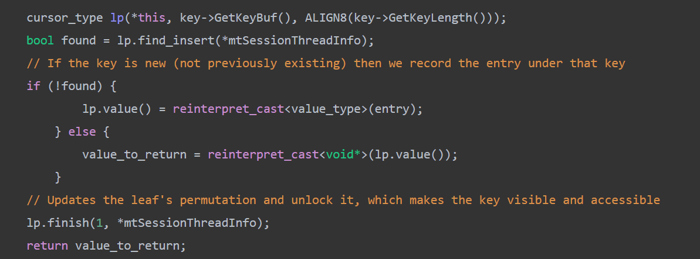

图 10

查找 key，如果找到 key 则 tree 不做改变；如果没找到，

1.先锁住应该持有待插入 key 的节点

2.将相应节点 version 修改为 inserting

3.将相应节点 state 修改为 insert

4.更新树结构，以满足约束

5.更新在叶节点中的 key slice ，keylen， key suffix ，key vaule

6.Add the key's location in permutation's back.在解锁节点并将密钥输入到排列中之后将在 finish_insert(从 lp.finish 调用)中完成。

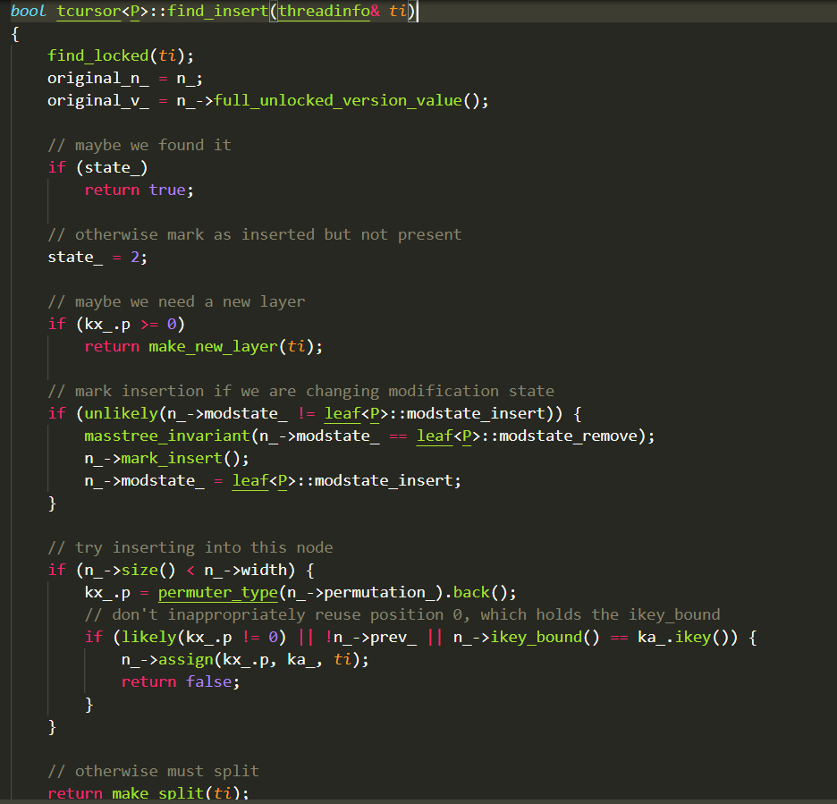

图 11 OpenGauss 内存引擎索引上插入操作代码部分

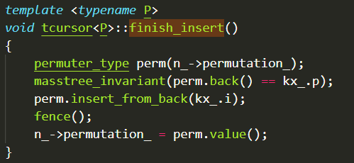

图 12

在 lp.finish 传入第一个参数为 1 时，调用 finish_insert，finish_insert 函数中实现通过在 permutation 插入新增节点的 index 使得节点对外可见。

### 5．删除操作

这里只讨论逻辑删除。

逻辑删除和 B+树的类似，但是并不对 key 少的节点进行合并，当节点 key 减少到 0 时，需要标记这个节点为 deleted，然后将其从父节点删除，同时如果是叶节点的话，还需要维护叶节点的双向连接。如果某棵子树为空的话也可以删除整棵子树。当其他线程发现节点处于 deleted 状态时，需要进行重试，因为这个节点逻辑上是不存在的。

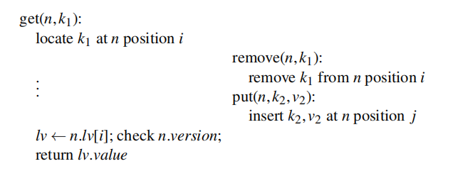

图 13

删除操作可能会遇到图 13 的情况，左边的线程根据 k1 定位到了位置 i，在读取 v1 之前这个节点发生了删除位于位置 i 的 k1，同时在位置 j 处插入 k2，如果 i 等于 j，可能导致左边的线程读取到 v2，为了解决这个问题，需要在索引 i 被删除后重新利用时增加节点的 vinsert 域。

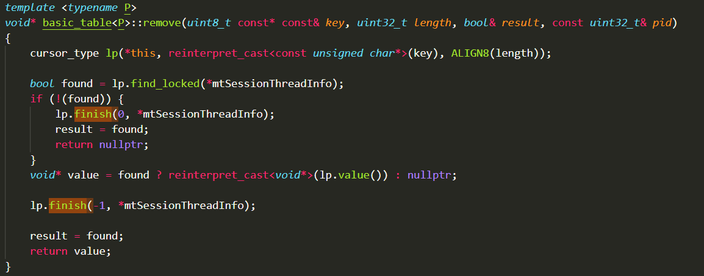

图 14 OpenGauss 内存引擎索引上删除操作代码部分

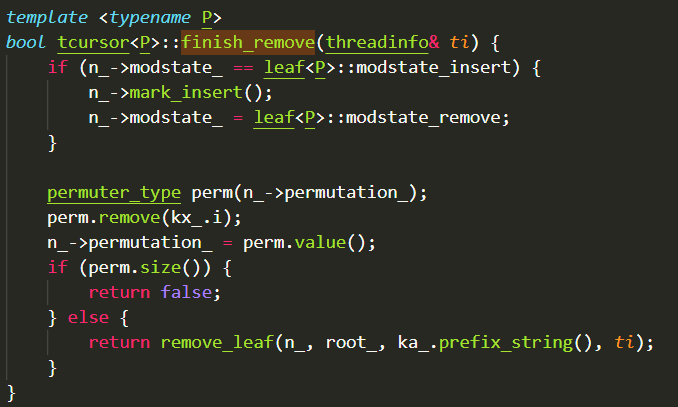

图 15 lp.finish 传入参数为-1 时，调用 finish_remove 函数，通过在 permutation 中删除节点索引已达到逻辑删除作用
