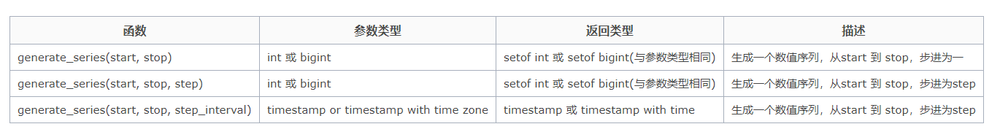

# MogDB 快速构建海量数据方法

在测试的时候，我们需要快速构建海量数据。 在 PG 中提供了一些基础的方法，如 generate_series 函数，但对于模拟真实环境来讲还差很远，比如模拟真实的手机号，模拟真实的生份证号等等。在这整理了些 PG 常用的模拟数据的方法。包括自定义的一些方法。已基本满足日常的测试，欢应大家补充。

# 1. 生成序例

```
SELECT    generate_series(1,10)
```

**generate_series 函数**


# 2. 生成字符串

```
#生成36位的UUID字符串
#  将compat-tools下载到数据库服务器上，解压。进入解压后的目录
-- 执行如下命令
gsql -d 数据库 -f runMe.sql

-- 登录数据库后，执行uuid函数
Select uuid();

#生成32位随机字符串
    select md5(random()::text)
  SELECT substr('abcdefghijklmnopqrstuvwxyz',1,(random()*26)::integer);

#生成重复字符串
 -- abc重复多次的字符串
SELECT repeat('abc',(random()*4)::integer);

-- 重复2次的MD5字符串
select repeat(md5(random()::text),2);

#连接符
select concat('a', ' ', 'b-+');
```

# 3. 生成随机数

```
#生成100以内的随机数字 int
    select (random()*100)::int

#生成100以内，总位数为4，小数点后2位的小数 numeric
    SELECT (random()*100.)::numeric(4,2);

```

# 4. 生成日期

```
SELECT date_trunc('day', generate_series(now(), now() + '1 week', '1 day'));
select generate_series(to_date('20130403','yyyymmdd'), to_date('20130404','yyyymmdd'), '3 hours');
```

# 5. 自定义函数

## 5.1 随机生成汉字

```
# 生成随机汉字
    create or replace function gen_hanzi(int) returns text as $$
    declare
      res text;
    begin
      if $1 >=1 then
        select string_agg(chr(19968+(random()*20901)::int),'') into res from generate_series(1,$1);
        return res;
      end if;
      return null;
    end;
    $$ language plpgsql strict;
# 输出汉字示例
    select gen_hanzi(10) from generate_series(1,10);
      gen_hanzi
----------------------
 塨甤脲齧吆姪暭杗滶衎
 釾爚疞蠸苊溮售矧騕枾
 碅鲌濂櫂皅觡榱颗饢盖
 番薥椿殍炀挻綏沄弉憙
 廳媩鬪匷渃镙廿虬諾馭
 禭粌嬀戳嫓儨嬶轙熃鲴
 讜謐勭嗨斜棲秈檙兣涰
 鸰纘飧顑悽鋍睹唤佖咙
 狗映馁鳄髋苲歘鞕蹭沛
 峑淯饪妐螹棝肒籙搎儤
(10 rows)
```

## 5.2 指定中文字符输出

```
#产生指定长度的中文字符
CREATE OR REPLACE FUNCTION getChnChar(startLength int, endLength int) RETURNS VARCHAR (3000) AS $BODY$
DECLARE
    chars_str VARCHAR(3000) DEFAULT '赵钱孙李周吴郑王冯陈楮卫';
    return_str VARCHAR(3000) DEFAULT '';
    i int;
    end1 int;
    BEGIN
        end1 :=cast((random()*(endLength - startLength)) as int)+startLength;
        FOR i in 1 .. end1 loop
        --CONCAT(char1,char2,char3,…)顺序联结多个字符串成为一个字符串
        return_str = concat(return_str,substring(chars_str , cast((random()*(length(chars_str) -1) +1) as INT),1));
        end loop;
        RETURN return_str;
    END;
$BODY$
LANGUAGE 'plpgsql' ;
#输出指定汉字示例

select getChnChar(2,3) from generate_series(1,10);
 getchnchar
------------
 王郑
 吴李
 陈卫
 钱郑
 周楮周
 钱孙赵
 郑钱
 楮冯卫
 卫郑楮
 王钱孙
(10 rows)
```

## 5.3 随机生成英文

```
# 产生指定长度的英文字符

CREATE OR REPLACE function getEnChar (startLength int, endLength int) RETURNS VARCHAR (3000) AS $BODY$
 DECLARE
    chars_str VARCHAR(3000) DEFAULT 'ABCDEFGHIJKLMNOPQRSTUVWXYZabcdefghijklmnopqrstuvwxyz';
    return_str VARCHAR(3000) DEFAULT '';
    i int;
    end1 int;
    BEGIN
        end1 :=cast((random()*(endLength - startLength)) as int)+startLength;
        FOR i in 1 .. end1 loop
        return_str = concat(return_str,substring(chars_str , cast((random()*(length(chars_str) -1) +1) as INT),1));
        end loop;
        RETURN return_str;
    END;
$BODY$
LANGUAGE 'plpgsql' ;
#输出英文字符示例

select getEnChar (1,5) from generate_series(1,10);

 getenchar
-----------
 Fy
 QxSju
 qhak
 Ox
 Gkbgk
 ZsP
 Iaf
 g
 vbly
 L
(10 rows)
```

## 5.4 英文混合字符

```
# 产生指定长度的混合字符

CREATE OR REPLACE function getMixChar (startLength int, endLength int) RETURNS VARCHAR (3000) AS $BODY$
DECLARE
    chars_str VARCHAR(3000) DEFAULT 'ABCDEFGHIJKLMNOPQRSTUVWXYZabcdefghijklmnopqrstuvwxyz1234567890';
    return_str VARCHAR(3000) DEFAULT '';
    i int;
     end1 int;
    BEGIN
        end1 :=cast((random()*(endLength - startLength)) as int)+startLength;
        FOR i in 1 .. end1 loop
        return_str = concat(return_str,substring(chars_str , cast((random()*(length(chars_str) -1) +1) as INT),1));
        end loop;
        RETURN return_str;
    END;
$BODY$
LANGUAGE 'plpgsql' ;
#英文混合字符示例

select getMixChar(4,10) from generate_series(1,10);
 getmixchar
------------
 MX61zKTCJ
 KWlg1kR
 UojkS
 QSnx
 T9If6T
 FiZBj
 l8ICioUK
 nFuIxPuv8
 oW7dLeDo
 DST0vt
(10 rows)
```

## 5.4 随机生成固定数字

### 5.4.1 随意生成固定区间的整数

```
# 随意生成固定区间的整数

CREATE OR REPLACE FUNCTION get_rand_int (m INT ,n INT) RETURNS INT AS $BODY$
BEGIN
    RETURN CAST((random() *(n - m) + m) as int);
END ;
$BODY$
LANGUAGE plpgsql;
#输出纯数字示例

select get_rand_int (1,10) from generate_series(1,10);
 get_rand_int
--------------
            9
            7
            3
            6
            9
            3
           10
            1
            4
            3
```

### 5.4.2 随机指定位数

```
# 产 随机指定位数

CREATE or REPLACE FUNCTION get_IdCard(startLength int,endLength int) RETURNs VARCHAR(300) as $BODY$
DECLARE
    chars_str VARCHAR(100) DEFAULT '0123456789';
    return_str VARCHAR(300) DEFAULT substring('123456789' , cast((1 + random()*8 ) as INT),1);
    i int ;
    end1 int;
    BEGIN
        end1 :=cast((random()*(endLength - startLength)) as int)+startLength;
        FOR i in 1 .. end1-1 loop
        return_str = concat(return_str,substring(chars_str , cast((1 + random()*9 ) as INT),1));
        end loop;
        RETURN return_str;
    END;
 $BODY$
 LANGUAGE 'plpgsql' ;
#指定位数的数据
select get_IdCard(18, 18) from generate_series(1,10);
     get_idcard
--------------------
 211106597441241496
 817484221491929439
 751750672496684954
 467298482518772820
 755146332581811237
 654355582465824837
 466324416711843541
 805761911440645428
 345890747048704755
 935980923844755351
```

## 5.5 随机生成身份证

```
# 生成随机身份证号指字年龄段
    create or replace function gen_id(a date, b date)
    returns text as $$
    select lpad((random()*99)::int::text, 2, '0') ||
           lpad((random()*99)::int::text, 2, '0') ||
           lpad((random()*99)::int::text, 2, '0') ||
           to_char(a + (random()*(b-a))::interval, 'yyyymmdd') ||
           lpad((random()*99)::int::text, 2, '0') ||
           random()::int ||
           (case when random()*10 >9 then 'X' else (random()*9)::int::text end ) ;
    $$ language sql strict;
#输出身份证号
     select gen_id('1900-01-01', '2017-10-16') from generate_series(1,10);
       gen_id
--------------------
 91717419030428331X
 36358219410325111X
 102660196803291604
 72440419370911470X
 860433198201166503
 877577194010256305
 727201191211255110
 453166201110249906
 519767195409130608
 427291193005202108
```

## 5.6 产生 11 位电话号码

```
# 产生11位电话号码
    CREATE or REPLACE FUNCTION get_Tel() RETURNs VARCHAR(300) as $BODY$
    DECLARE
            startLength int  DEFAULT 11 ;
            endLength int  DEFAULT 11  ;
            first_no VARCHAR(100) DEFAULT '1';
            chars_str VARCHAR(100) DEFAULT '0123456789';
            return_str VARCHAR(300) DEFAULT substring('3578' , cast((1 + random()*3 ) as INT),1);
            i int ;
            end1 int;
        BEGIN
            end1 :=cast((random()*(endLength - startLength)) as int)+startLength;
            FOR i in 1 .. end1-2 loop
            return_str = concat(return_str,substring(chars_str , cast((1 + random()*9 ) as INT),1));
            end loop;
            RETURN concat(first_no,return_str);
        END;
    $BODY$
    LANGUAGE 'plpgsql' ;


#产生11位电话号码
  select get_Tel() from  generate_series(1,10);
   get_tel
-------------
 18518236357
 17619817580
 13519825653
 18180214556
 17146025513
 15755856077
 17657371519
 13464868322
 15535691221
 17522216125
```

## 5.7 指定日期内的随机日期,时间

### 5.7.1 生成指定日期内的随机日期

```
#生成指定日期内的随机日期
    CREATE OR REPLACE FUNCTION get_rand_date(start_date DATE,end_date DATE) RETURNS DATE AS $BODY$
DECLARE
        interval_days INTEGER ;
        random_days INTEGER ;
        random_date DATE ;
    BEGIN
        interval_days :=split_part((end_date - start_date),' ',1);
        random_days := get_rand_int (0, interval_days) ;
        random_date := start_date + random_days ;
        RETURN random_date;
 END ;
$BODY$
LANGUAGE plpgsql;
#生成指定日期内的随机日期
select get_rand_date('2020-01-01', '2022-10-16') from  generate_series(1,10);
 get_rand_date
---------------
 2022-05-21
 2022-06-30
 2022-03-26
 2020-04-22
 2022-04-15
 2021-10-23
 2021-10-30
 2021-05-18
 2021-07-19
 2021-03-02

```

### 5.7.2 生成指定时间内的随机时间

```
# 生成指定时间内的随机时间
         CREATE OR REPLACE FUNCTION get_rand_datetime(start_date date, end_date date) RETURNS TIMESTAMP AS $BODY$
DECLARE
        interval_days integer;
        random_seconds integer;
        random_dates integer;
        random_date date;
        random_time time;
    BEGIN
        interval_days := split_part((end_date - start_date),' ',1);
        random_dates:= trunc(random()*interval_days);
        random_date := start_date + random_dates;
        random_seconds:= trunc(random()*3600*24);
        random_time:=' 00:00:00'::time+(random_seconds || ' second')::INTERVAL;
        RETURN random_date +random_time;
 END;
$BODY$
LANGUAGE plpgsql;


# 生成指定时间内的随机时间
 select get_rand_datetime('2020-01-01', '2022-10-16') from  generate_series(1,10);
  get_rand_datetime
---------------------
 2020-10-04 01:10:23
 2020-01-11 21:34:39
 2022-04-18 16:20:11
 2020-10-01 07:08:52
 2021-05-16 17:26:00
 2020-07-01 06:38:24
 2022-01-29 20:51:53
 2021-08-03 14:44:24
 2021-07-21 17:49:45
 2022-07-08 21:37:42
```

## 5.8 数组

### 5.8.1 分割字符串

```
# 分割字符串，返回其中的随机字符串
        CREATE OR REPLACE FUNCTION get_split_str (str VARCHAR) RETURNS VARCHAR AS $BODY$
        DECLARE
                array_str VARCHAR[];
                i int;
                rand_index    int;
            BEGIN
                str :=trim(str);
                array_str :=regexp_split_to_array(str,'[，,]');--正在表达式匹配
                    -- array_length(array_str,1)1代表维度，一维、二维
                rand_index :=cast((random()*(array_length(array_str,1) -1) +1 )as int);
                RETURN array_str[rand_index] ;
            END ;
        $BODY$
        LANGUAGE plpgsql;
# 分割字符串，返回其中的随机字符串
select get_split_str('hello ,zdata ,asher ,enmo,mogdb,zcloud') from  generate_series(1,10);
 get_split_str
---------------
 mogdb
 zdata
 hello
 mogdb
 zdata
 zdata
 hello
 mogdb
 asher
 zdata
```

### 5.8.2 生成随机数组

```
# 生成随机数组

    create or replace function gen_rand_arr(int,int) returns int[] as $$
      select array_agg((random()*$1)::int) from generate_series(1,$2);
    $$ language sql strict;

# 输出数组
 select gen_rand_arr(100,10) from generate_series(1,10);
          gen_rand_arr
---------------------------------
 {98,32,80,7,76,27,96,30,50,18}
 {51,91,65,2,2,16,61,39,94,26}
 {59,30,74,59,100,66,26,3,91,13}
 {7,0,73,19,70,84,57,37,3,73}
 {87,26,53,11,52,33,88,69,4,70}
 {83,80,98,87,12,0,69,100,36,13}
 {47,59,99,70,7,1,41,81,80,82}
 {34,67,11,13,78,76,5,23,85,18}
 {88,80,92,65,87,77,1,19,64,62}
 {94,28,4,23,76,87,79,88,20,79}
(10 rows)
```

# 6.示例

## 6.1.查询

```
postgres=# select generate_series(1,5), (random()*100)::int, (random()*20.)::numeric(4,2), gen_hanzi(3) ;
 generate_series | int4 | numeric | gen_hanzi
-----------------+------+---------+-----------
               1 |   14 |    7.43 | 溲漮鉂
               2 |   41 |    7.26 | 孭揬嬅
               3 |   28 |    2.52 | 規冻厌
               4 |   33 |    9.39 | 鎤唭溢
               5 |   34 |   14.31 | 階鎂珈


postgres=# select generate_series(1,5), (random()*100)::int,(random()*20.)::numeric(4,2), md5(random()::text) ;
 generate_series | int4 | numeric |               md5
-----------------+------+---------+----------------------------------
               1 |   78 |    2.72 | 888e3ed79f9f50c5f3c46b39214d8c94
               2 |   63 |   12.04 | e0c5e216af4d35bc1679b65ed6b70e8d
               3 |   30 |    4.80 | 69dfb257c109b2cbc3dda75bbaac1ce4
               4 |   64 |    8.22 | 1228eb653f3b81273eaf00c4fcf65afd
               5 |   38 |   11.34 | 914e9befabbc81c23ed5dc3afde271ab
(5 rows)
```

## 6.2.创建表

```
postgres=# CREATE TABLE t_test(
                                ID INT PRIMARY KEY   NOT NULL,
                                NAME      TEXT  NOT NULL,
                                AGE      INT   NOT NULL,
                                ADDRESS    CHAR(50),
                                SALARY     REAL
                              );
CREATE TABLE

postgres=# insert into t_test SELECT generate_series(1,5) as key,repeat( chr(int4(random()*26)+65),4), (random()*(6^2))::integer,null,(random()*(10^4))::integer;
INSERT 0 5

postgres=# select * from t_test ;
 id | name | age | address | salary
----+------+-----+---------+--------
  1 | MMMM |  25 |         |   9590
  2 | OOOO |   7 |         |   9929
  3 | SSSS |   6 |         |   2710
  4 | TTTT |  14 |         |   9027
  5 | SSSS |  19 |         |   8290
(5 rows)
```
