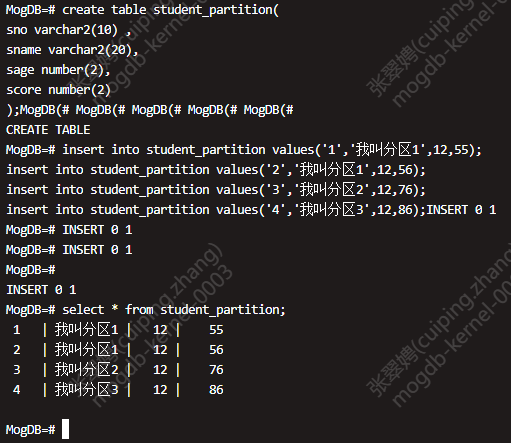
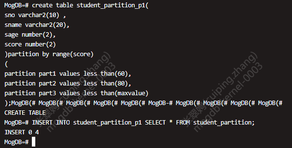
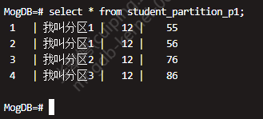
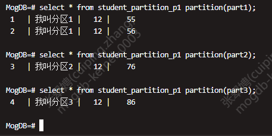
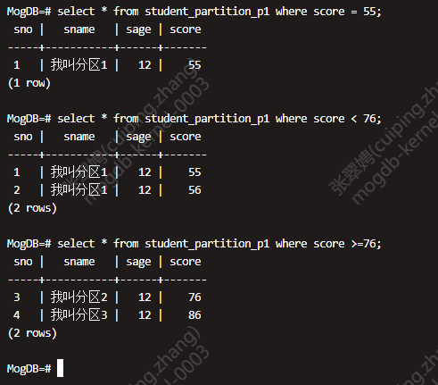

# 如何创建范围分区表

分区表是把逻辑上的一张表根据某种方案分成几张物理块进行存储，这张逻辑上的表称之为分区表，物理块称之为分区。分区表是一张逻辑表，不存储数据，数据实际是存储在分区上的。

常见的分区方案有范围分区（Range Partitioning）、间隔分区（Interval Partitioning）、哈希分区（Hash Partitioning）、列表分区（List Partitioning）、数值分区（Value Partition）等。目前行存表支持范围分区、间隔分区、哈希分区、列表分区，列存表仅支持范围分区。

示例

1. 创建普通表 student_partition，并插入数据。

   

2. 创建范围分区表 student_partition_p1，将普通表的数据插入到范围分区表。

   

3. 查看范围分区表。

   

4. 查询指定分区数据。

   

5. 使用 where 过滤条件查询目标数据。

   
