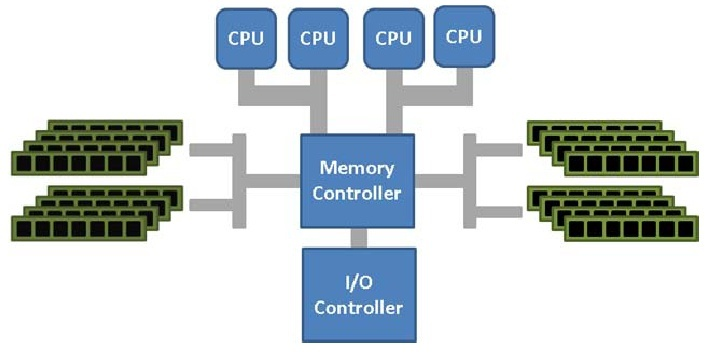
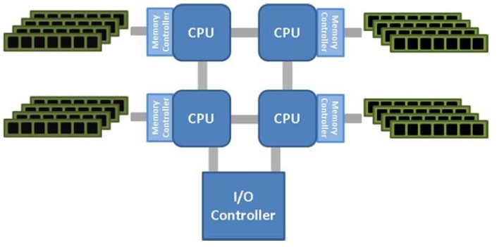

# 如何通过一个小故事解读 NUMA 技术

## 内存访问瓶颈

假如我是 CPU 一号车间的阿 Q，前一阵子我们厂里发生了一件大喜事，老板拉到了一笔投资，准备扩大生产规模。

原来的 8 个车间要变成 16 个了，现在我们变成了一个 16 核的 CPU 啦。

我们 CPU 里面各个车间访问内存都要通过内存控制器和总线系统，有时候碰到几个车间都要访问内存，就得要竞争。

以前我们八个车间的时候竞争情况还不是很激烈，大家互相谦让一下也就罢了。现在变成了十六个车间都要过独木桥，这竞争一下就激烈了，尤其是我们这帮老员工基本不会让着新来的，为了此事经常发生不愉快。

内存访问出现了瓶颈，这性能自然是折损严重。

## NUMA 架构

老板把这一切都看在眼里，私下里找了我、二号车间的虎子还有总线主任开了个小会。

会议达成的结果是再建一条路-------把新扩建的那 8 个车间独立出去，建一个分厂。然后再把内存分一下，让两个厂各管理一部分。一来可以减少新老员工之间的矛盾，二来可以减少大家访问内存拥挤造成的资源浪费。当两个厂之间需要通信，如果访问的内存不在自己管辖的范围，就要互相帮忙传递一下。

这个技术就叫 NUMA（Non Uniform Memory Access），非一致性内存访问。

现有的 16 个车间拆分成两个 CPU 工厂，叫做两个 NUMA 节点（Node），每个节点直接连接一部分内存，两个节点之间有专门的的`inter-connect`通道。各节点直接访问自己管理的内存叫`Local Access`，通过`inter-connect`通道访问其他分厂管理的内存叫做`Remote Access`。很显然，前者的访问速度要比后者快得多，所以这也是这项技术名字的由来：非一致性内存访问。

