### 前言：

随着 pg 在国内越来越热，我也想赶紧的学习学习，pg 的挺多语法跟 mysql 和 oracle 不太一样，光看书还是不太行，还是得多动手。前面实践了下 mogdb，这次借着机会学习学习 openGauss。 本次实践的是 opengauss 的 MOT 表，我们都知道现在数据库的瓶颈都在 IO 上，内存操作的速度是极快的，MOT 特性就是建立在内存中的存储引擎。根据官档介绍 MOT 是 openGauss 数据库最先进的生产级特性，看起来好处多多啊，这次主要是尝尝鲜。这次实践是基于 docker 的，之前对 docker 不太感冒，每次做个实验都要弄一套不同版本的数据库环境，太费事了，自从用了 docker 以后，感觉不要太爽，不用再在自己电脑上弄一个个虚拟机了，直接装个 docker 环境，撸镜像得了。

## 一、利用 docker 拉起 openGuass

- 1、配置好 docker 环境，这里就不再细讲了，网上都有保姆教程。
  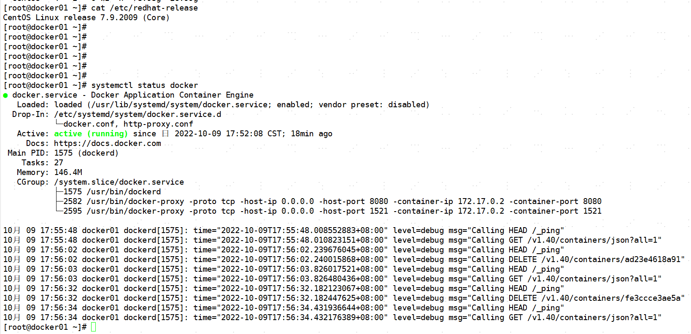

- 2、恩墨制作了 opengauss 3.0 的镜像，直接从网上拉镜像就可以。
  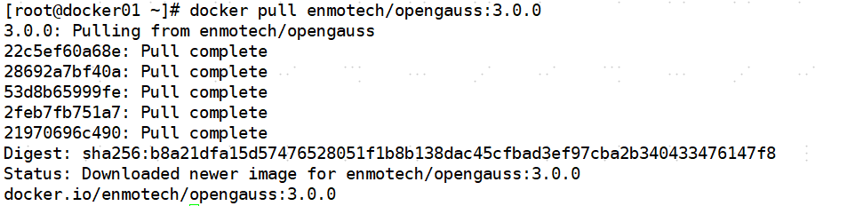

- 3、确认镜像已经拉下来，总共 480M，不大也不小。
  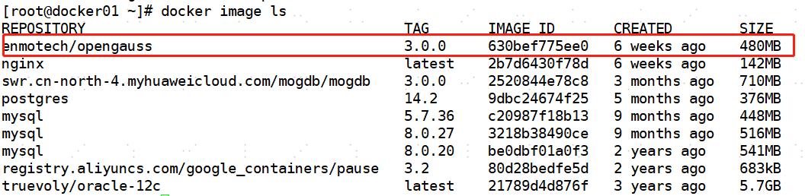

- 4、启动镜像，指定下密码就行，如果密码太简单会报错。
  `docker run --name myopengauss --privileged=true -d -e GS_PASSWORD=Gauss@123 enmotech/opengauss:3.0.0`
  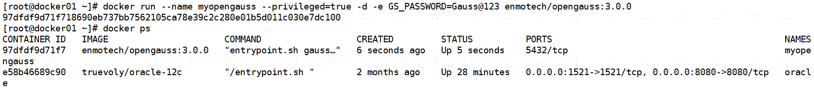

## 二、测试 MOT 表

- 1、新建一个普通用户 test
  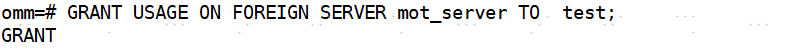

- 2、创建 MOT，在创建表的时候加关键词 foreign。
  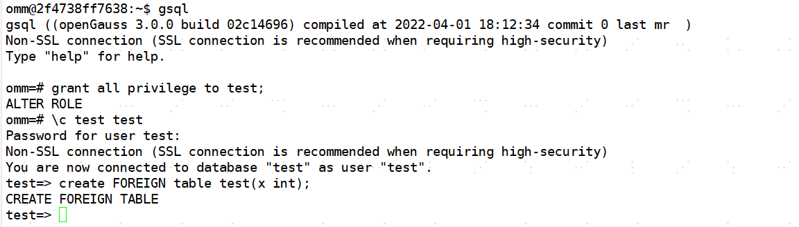

在创建的时候可能会报，无法创建，这是因为如果 postgresql.conf 中开启了增量检查点，则无法创建 MOT。因此请在创建 MOT 前将 enable_incremental_checkpoint 设置为 off。

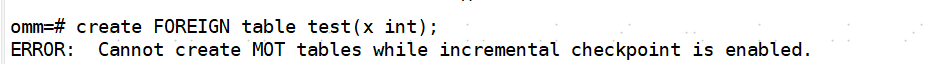

解决方案如下：

- a.找到镜像的 postgresql.conf 配置文件
  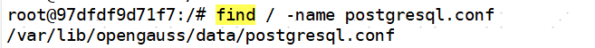

- b.修改 `enable_incremental_checkpoint=off`

- c.基于现有镜像生成新镜像
  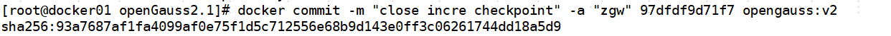

- d.启动新镜像
  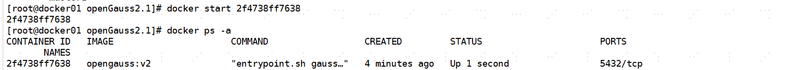

## 三、测试将磁盘表转换成 MOT 表

根据官方手册的说法，目前还不能一键实现磁盘表到 MOT 表的转换，需要利用导入导出的方法。转换步骤如下：

- a、停应用，做的时候不能有写入。
- b、利用 gs_dump 导出数据，必须使用 data only
- c、重命名原表
- d、新建 mot 表，与原表同名。
- e、使用 gs_restore 导入数据
- f、恢复应用。

- 1、新建普通测试表，确认相关字段 MOT 都能支持。
  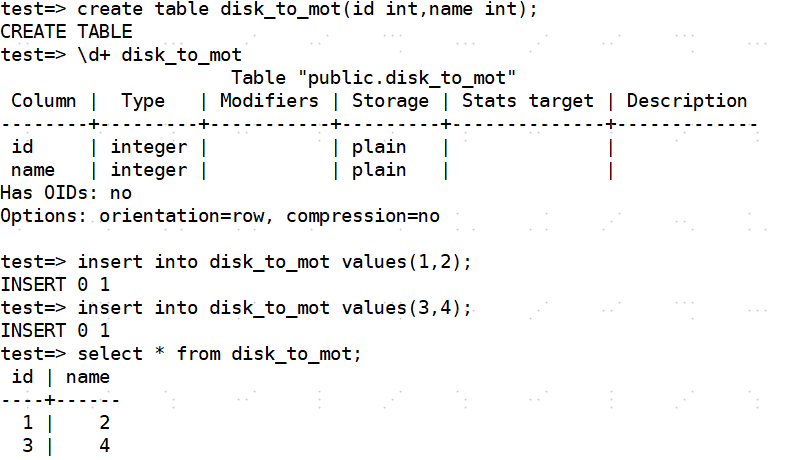

- 2、导出表数据
  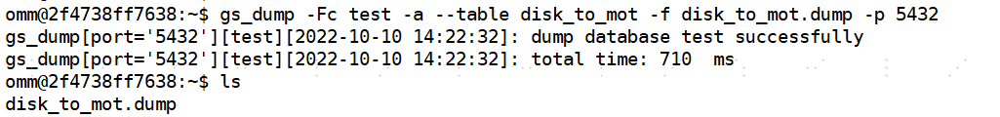

- 3、重命名原表
  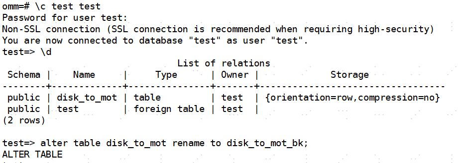

- 4、新建同名 MOT 表
  

- 5、导入数据
  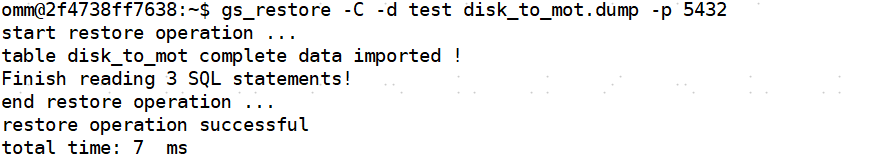

- 6、确认数据
  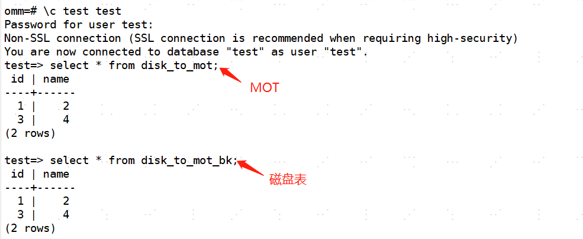
