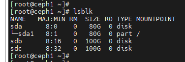
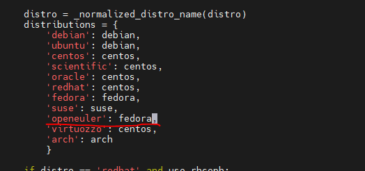
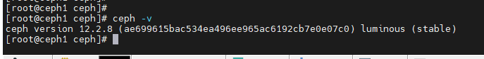
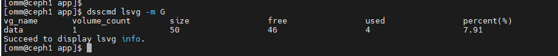
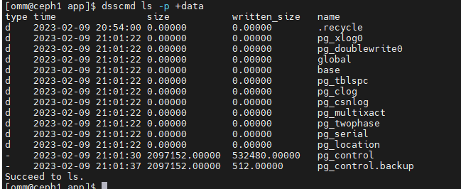
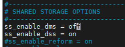

### openGauss + DSS + Ceph 部署操作步骤

本文档介绍单机版 openGauss+DSS+Ceph 集群部署方式。后续提供主备下的步骤。

服务器：

| Hostname | IP          | 系统                  | 规格      | 磁盘       |
| -------- | ----------- | --------------------- | --------- | ---------- |
| Ceph1    | 192.168.0.2 | openEuler20.03 x86_64 | 8 核 16GB | 2 \* 100GB |
| Ceph2    | 192.168.0.3 | openEuler20.03 x86_64 | 8 核 16GB | 2 \* 100GB |



> - /dev/sdb 格式化为文件系统，用来部署数据库
> - /dev/sdc 按照块设备使用，提供给 ceph 部署 OSD 节点。

### 1. 部署 Ceph

Ceph 集群推荐服务端 3 台机器，客户端按需部署。我们这次部署单机版，ceph 服务端用几台机器都可以，客户端也可以和服务端公用机器。

目前将这两台机器都部署上 ceph。

#### (1) 每台节点都执行以下操作：

##### 关闭防火墙

```
systemctl stop firewalld
systemctl disable firewalld
systemctl status firewalld
```

##### 关闭 selinux

```
setenforce 0
```

##### 修改节点名称

```
# 建议修改节点名称。ceph集群服务端改为ceph1,ceph2,client节点改为client1,client2等
hostnamectl --static set-hostname ceph1
hostnamectl --static set-hostname ceph2
```

##### ntp 配置

需要保证这几台服务器节点的时间同步。可以通过配置 ntp 保证时间同步。

##### 安装 Ceph

```
yum install ceph -y
pip install prettytable
# 这里安装的是openeuler系统自带的12.2.8。 如果需要其他版本，可以自行安装。
```

##### 建立这几个节点互信

ceph-deploy 部署时候需要保证几个节点之间 root 用户免密连通，即需要建立 root 用户的互信。
可以使用 openGauss 的 OM 工具 gs_sshexkey 来建立互信。

```
./gs_sshexkey -f ./hostfile  # hosffile里面所有节点ip，每行一个
```

#### (2) 选择 ceph1 节点上执行部署 ceph 操作：

##### 安装 ceph-deploy 部署工具

```
pip install ceph-deploy
```

openEuler 上需要适配修改：

```
vim /lib/python2.7/site-packages/ceph_deploy/hosts/__init__.py
```

添加一行对 openeuler 的支持。 \


ceph -v 查询是否安装成功。 \


##### 部署 MON 节点

Ceph Monitor,负责监视 Ceph 集群，维护 Ceph 集群的健康状态。

只用在 ceph1 节点执行

```
cd /etc/ceph
ceph-deploy new ceph1 ceph2 #所有的客户端和服务端节点都要
ceph-deploy mon create-initial
ceph-deploy --overwrite-conf admin ceph1 ceph2 #所有的客户端和服务端节点都要
```

部署完成后，可以使用 ceph -s 查看状态

##### 部署 MGR 节点

提供外部监测和管理系统的接口。

只用在 ceph1 节点执行

```
ceph-deploy mgr create ceph1 ceph2 #只需要给服务端部署
```

##### 部署 OSD 节点

osd（Object Storage Device）主要用于存储数据，一般将一块数据盘对应一个 osd，也可以把一个分区作为一个 osd。

查看数据盘是否有分区 \
使用 lsblk 查看，需要部署 osd 的数据盘如果之前被做了分区，可以用如下命令清除。

```
ceph-volume lvm zap /dev/sdb --destroy #/dev/sdb 为要清除分区的数据盘
```

##### 部署 OSD

```
ceph-deploy osd create ceph1 --data /dev/sdc
ceph-deploy osd create ceph2 --data /dev/sdc
```

ceph1 为当前服务器名称， `/dev/sdc` 为对应服务器要部署 osd 的数据盘盘符。

完成后使用 ceph -s 查看状态

##### MDS 部署

MDS（Metadata Server）即元数据 Server 主要负责 Ceph FS 集群中文件和目录的管理。
我们使用 ceph 的块设备，不用 cephfs 文件系统。可以不需要部署 MDS 服务。

```
cd /etc/ceph
ceph-deploy mds create ceph1 ceph2
```

状态查看

```
集群状态： ceph -s
集群健康信息： ceph health detail
OSD信息： ceph osd tree
各个服务状态：
systemctl status ceph-mon@ceph1
systemctl status ceph-mgr@ceph1
systemctl status ceph-osd@ceph1
```

### 2. 部署 DSS

数据库和 DSS 都是部署在子用户下运行，需要有子用户调用 ceph 接口的权限。我们将/ec/ceph 目录权限以及里面的文件权限改为 755，保证子用户可读。

```
chmod -R 755 /etc/ceph
```

#### (1) 创建块设备

##### 创建存储池：

```
ceph osd pool create blkpool 64 64
```

##### 创建块设备

```
rbd create dssimage --size 50GB --pool blkpool --image-format 2 --image-feature layering
```

> - blkpool 存储池名称
> - dssimage 实际使用的块设备名称，类似于磁盘，在创建时候需要指定大小。

```
rbd map blkpool/dssimage
```

将 ceph 的块设备挂载到系统上。例如挂载为： `/dev/rbd0`

> 这一步无实际意义，仅是为了做个标识。对 ceph 的读写不会真正去打开/dev/rbd0，而是通过存储池> 名称 blkpool 和块设备名称 dssimage 调用 rbd 接口打开以及读写。

#### (2) DSS 对接到 Ceph 块设备

##### 编译 DSS

```
sh build.sh -m Release -3rd /xxx/openGauss-third_party_binarylibs_openEuler_x86_64 -t cmake -s ceph
```

下载最新的 dss 代码进行编译，编译命令后面加上 `-s ceph` 表明构建出的二级制支持 ceph 块设备。

编译需要安装 rbd 的依赖：

```
yum install librados-devel librbd-devel -y
```

##### 部署 DSS

导入环境变量：

```
export DSSAPP=/data/ddes/code/DSS-zxb/output
export LD_LIBRARY_PATH=$DSSAPP/lib:$LD_LIBRARY_PATH
export PATH=$DSSAPP/bin:$PATH
export DSS_HOME=/data/ddes/app/dsshome
export DSSDATA=/dev/rbd0
```

> - DSSAPP 目录为编译出来的 dss 二级制目录，下面为 bin 以及 lib
> - DSS_HOME 为 dss 的配置文件目录，指定一个目录并创建

创建配置以及日志目录：

```
mkdir -p ${DSS_HOME}/cfg
mkdir -p ${DSS_HOME}/log
```

写入 DSS 配置文件：

```
echo "VOLUME_TYPES=${DSSDATA}=1" > ${DSS_HOME}/cfg/dss_inst.ini
echo "POOL_NAMES=${DSSDATA}=blkpool" >> ${DSS_HOME}/cfg/dss_inst.ini
echo "IMAGE_NAMES=${DSSDATA}=dssimage" >> ${DSS_HOME}/cfg/dss_inst.ini
echo "CEPH_CONFIG=/etc/ceph/ceph.conf" >> ${DSS_HOME}/cfg/dss_inst.ini
echo "data:${DSSDATA}" > ${DSS_HOME}/cfg/dss_vg_conf.ini
```

> - DSSDATA=/dev/rbd0 为挂载 ceph 块设备，名称仅做标识。
> - POOL_NAMES 为存储池配置，格式为 `/dev/rbd0=dsspool`
> - IMAGE_NAMES 为 image 配置，格式为 `/dev/rbd0=dssimage`
> - CEPH_CONFIG 为 ceph 集群配置文件，默认是`/etc/ceph/ceph.conf`

初始化 DSS 卷组

```
dsscmd cv -g data -v ${DSSDATA} -s 2048 -D ${DSS_HOME}
```

启动 dssserver

```
nuhop dssserver &
```

查看 dss 卷组大小

```
dsscmd lsvg -m G
```



查看 dss 目录

```
dsscmd ls -p +data
```



### 3. 部署 openGauss

openGauss 单机版本部署方式不变，自行编译或者取构建好的包就行。

#### 部署二级制

将 opengauss 内核的二进制包解压，导入环境变量：

```
export GAUSSHOME=/data/ddes/app/gauss
export LD_LIBRARY_PATH=$GAUSSHOME/lib:$LD_LIBRARY_PATH
export PATH=$GAUSSHOME/bin:$PATH
```

> GAUSSHOME 是解压的二级制目录。下面包含 bin 和 lib

正常打包会把 dss 的`dsscmd/dssserve`r 以及依赖库`libdss*.so`打包到 openGauss 的软件包里面。
加载了 opengauss 的环境变量后，会优先使用`$GAUSSHOME/bin`下的 dss 二级制以及依赖库。需要保证上面手动编译出来的 dss 的二进制文件、库文件和`$GAUSSHOME`下面的一致。

#### 初始化 openGauss：

```
gs_initdb -d /data/ddes/datanode/dn1 --nodename=ss -w Test@123 --vgname="+data" --enable-dss --dms_url="0:127.0.0.1:1611,1:127.0.0.1:1711" -I 0 --socketpath="UDS:/tmp/.dss_unix_d_socket"
```

由于单机版本的不支持 dms，在初始化完成后，修改下 postgresql.conf，将`ss_enable_dms`置为`off`



#### 启动数据库

```
gs_ctl start -D /data/ddes/datanode/dn1
```
