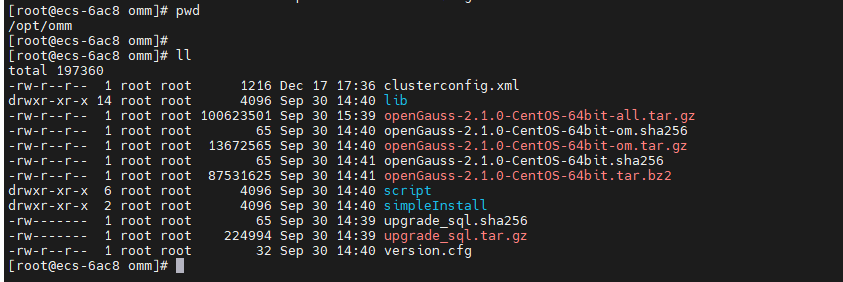

### 安装单机版数据库

#### 概述

本章节介绍安装一个单实例版本的 openGauss 数据库。

#### 前提准备

1. 请自行准备 Centos7.8_x86_64 平台的 Linux 操作系统。(centos7.8_x86 镜像下载地址：https://mirrors.huaweicloud.com/centos-vault/7.8.2003/isos/x86_64/CentOS-7-x86_64-DVD-2003.iso
   )

2. 下载 openGauss 在 Centos 平台下的软件包：https://opengauss.obs.cn-south-1.myhuaweicloud.com/2.1.0/x86/openGauss-2.1.0-CentOS-64bit-all.tar.gz

#### 上传软件包

1. 在 Linux 系统下，创建目录来放软件包

```
mkdir -p /opt/omm/
```

2. 通过 ftp 等工具，将 openGauss-2.1.0-CentOS-64bit-all.tar.gz 包放到/opt/omm 目录下

#### 创建 xml 配置文件

进入到 /opt/omm 路径下， `cd /opt/omm/`

`vi clusterconfig.xml`

将下面的配置修改后，粘贴到进去。

需要修改的配置项：
ecs-6ac8 -> 改为当前服务器实际的名称，可以用 hostname 命令查看。
192.168.0.2 -> 配置为当前服务器的 Ip 地址，使用 ifconfig 名称查看。

```
<?xml version="1.0" encoding="UTF-8"?>
<ROOT>
    <CLUSTER>
        <PARAM name="clusterName" value="mycluster" />
        <PARAM name="nodeNames" value="ecs-6ac8" />
        <PARAM name="gaussdbAppPath" value="/opt/omminstall/opengauss/app" />
        <PARAM name="gaussdbLogPath" value="/opt/omminstall/opengauss/log/omm" />
        <PARAM name="tmpMppdbPath" value="/opt/omminstall/opengauss/tmp" />
        <PARAM name="gaussdbToolPath" value="/opt/omminstall/opengauss/om" />
        <PARAM name="corePath" value="/opt/omminstall/opengauss/corefile" />
        <PARAM name="backIp1s" value="192.168.0.2"/>
    </CLUSTER>
    <DEVICELIST>
        <DEVICE sn="100001">
            <PARAM name="name" value="ecs-6ac8"/>
            <PARAM name="azName" value="AZ1"/>
            <PARAM name="azPriority" value="1"/>
            <PARAM name="backIp1" value="192.168.0.2"/>
            <PARAM name="sshIp1" value="192.168.0.2"/>
            <PARAM name="dataNum" value="1"/>
            <PARAM name="dataPortBase" value="2000"/>
            <PARAM name="dataNode1" value="/opt/omminstall/opengauss/data/dn1"/>
            <PARAM name="dataNode1_syncNum" value="0"/>
        </DEVICE>
    </DEVICELIST>
</ROOT>
```

#### 解压软件包

先解压总包：

```
tar -zxf openGauss-2.1.0-CentOS-64bit-all.tar.gz
```

在解压 OM 包:

```
tar -zxf openGauss-2.1.0-CentOS-64bit-om.tar.gz
```

解压完成后，总体的文件如下:


#### 预安装数据库

预安装会安装上面配置的 xml 文件，进行创建规划目录、用户、校验操作系统等步骤，需要在 root 用户下执行。

1. 设置目录权限

```
chmod -R 750 /opt/omm/
```

2. 安装依赖

```
yum install libaio-devel -y
```

3. 进入到 script 目录下，预安装数据库

```
cd /opt/omm/script
./gs_preinstall -U omm -G omm -X /opt/omm/clusterconfig.xml --sep-env-file=/home/omm/envfile
```

预安装过程中，遇到：

Are you sure you want to create the user[omm] and create trust for it (yes/no)? 请输入 yes，这里会创建 omm 数据库管理用户。

Please enter password for cluster user.
Password:
请输入为创建的 omm 用户设置的密码，例如 openGauss@123
下一步再输入一遍进行确认。

等待预安装过程完成。

#### 安装数据库

在预安装数据库完成后，进行安装数据库操作。数据库的安装需要在 omm 用户下执行。

1. 切换到 omm 用户，并导入环境变量

```
su - omm
source /home/omm/envfile
```

2. 执行数据库安装命令

```
gs_install -X /opt/omm/clusterconfig.xml
```

在安装过程中，需要设置数据库的管理密码。
（密码要求长度大于 8 位，并至少包含数字、字母、特殊字符在内的三种类型。如 openGauss@123 ）

Please enter password for database: 请输入数据库密码
Please repeat for database: 请再输入一次数据库密码

等待安装完成。

#### 数据库使用

1. 状态查询

   ```
   gs_om -t status --detail
   ```

2. 数据库启动、停止

   停止: `gs_om -t stop`
   启动：`gs_om -t start`

3. 登录数据库进行 sql 操作

   ```
   gsql -d postgres -p 2000 -r
   ```

   创建数据库： `create database test_db;`

   切换到 test_db 数据库： `\c test_db`

   创建表：`create table students(id int, name varchar, age int);`

   插入数据:

   ```
   insert into students values(1000, 'xiaoming', 22);
   insert into students values(1001, 'liqiang', 23);
   insert into students values(1002, 'zhanghua', 21);
   ```

   查询所有人员：

   ```
   select * from students;
   ```
