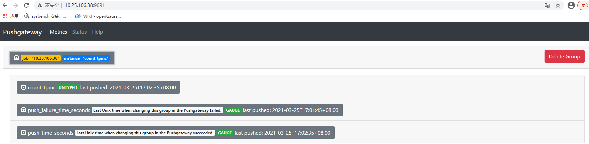
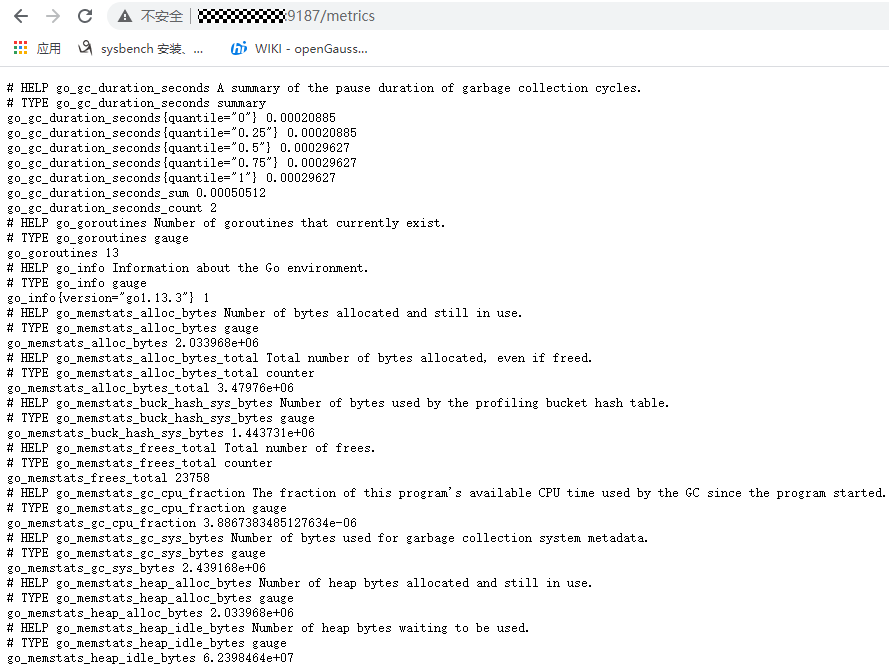
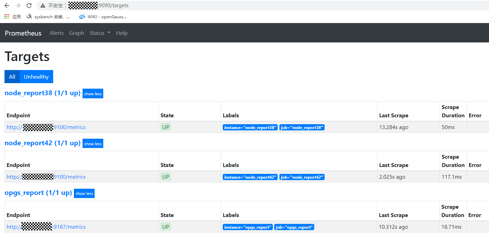
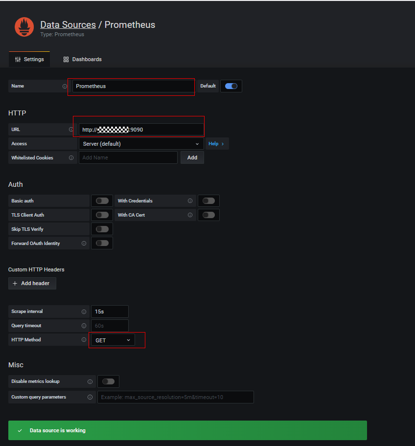
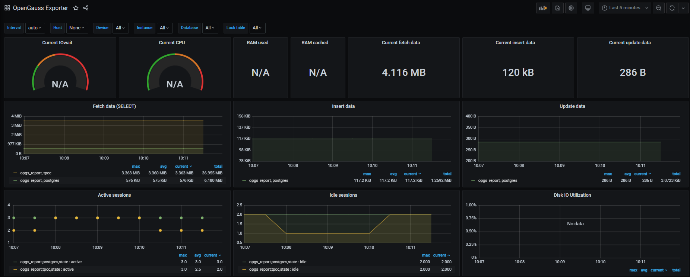
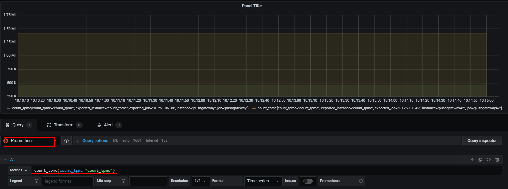

# 普罗米修斯监控 openGauss

## 1、前期准备

### 1.1 项目依赖链接

| 依赖开源工程     | 工程链接                                                  |
| ---------------- | --------------------------------------------------------- |
| 普罗米修斯       | https://github.com/prometheus/pushgateway                 |
| opengauss_export | https://gitee.com/opengauss/openGauss-prometheus-exporter |
| pushgateway      | https://github.com/prometheus/pushgateway                 |
| openGauss        | https://gitee.com/opengauss/openGauss-server              |

### 1.2 工具包准备

| 系统环境      | 工具版本                                                                                                |
| ------------- | ------------------------------------------------------------------------------------------------------- |
| ARM+openEuler | prometheus-2.21.0.linux-arm64.tar.gz、pushgateway-1.2.0.linux-arm64.tar.gz、grafana-7.1.5-1.aarch64.rpm |
| X86+openEuler | prometheus-2.21.0.linux-amd64.tar.gz、pushgateway-1.3.0.linux-amd64.tar.gz、grafana-7.2.1-1.x86_64.rpm  |

## 2、监控系统安装部署

### 2.1 tpmC 采集和发送

```python
'''
功能描述：在benchmarksql工具测试过程的输出信息通过tee命令 固定输出到/tmp/tpcc.log（便于在不同环境上部署），采集函数从/tmp/tpcc.log文件获取到tpmC值，发送函数将值发送到pushgateway服务。
'''
#日志信息采集并转换为tpmC
def collect_tpmc():
    log_file = "/tmp/tpcc.log"
    cmd = "tail -1 %s > /home/tpmc;awk -F ':' '{print $(NF-2)}' /home/tpmc | awk '{print $1}'" % log_file
    tpmc = os.popen(cmd).read().strip()
    tpmc = float(tpmc) * 0.45
    count_tpmc = "count_tpmc{count_tpmc=\"count_tpmc\"} " + str(tpmc) + "\n"
    print("count_tpmc : %s" %count_tpmc)
    return count_tpmc
#向pushgateway发送采集到的数据
def send_data(data_type, node):
    if data_type == "cpu":
        send_cmd = "cat {file_cpu} | curl --data-binary @- pushgateway_ip:port/metrics/job/{node}/instance/{data_type}".format(
            file_cpu=file_cpu, node=node, data_type=data_type)
    os.popen(send_cmd)
```

### 2.2 pushgateway 的使用

```
cd pushgateway-1.2.0.linux-arm64
./pushgateway
```

​ 网页显示效果如下



### 2.3 opengauss_exporter 的使用

```
GO GET配置
git config --global http.proxy http://域账号:密码
git config --global https.proxy https://域账号:密码
git config --global http.sslverify false
git config --global https.sslverify false
GO MODULE配置
export GO111MODULE=on
export GOPROXY=http://***/
export GONOSUMDB=*

配置数据库白名单
host    all             all             ip      md5

配置启动opengauss_exporter
cd opengauss_exporter-master
make build
export DATA_SOURCE_NAME="postgresql://tpcc:******@ip:port/tpcc?sslmode=disable"
./bin/opengauss_exporter --config="og_exporter_default.yaml"
注：默认端口为9187
```

​ 启动效果



### 2.4 prometheus 的使用

```
prometheus.yml 文件配置参考
scrape_configs:
  # The job name is added as a label `job=<job_name>` to any timeseries scraped from this config.
  - job_name: 'prometheus'

    # metrics_path defaults to '/metrics'
    # scheme defaults to 'http'.

    static_configs:
    - targets: ['prometheus_ip:9090']

  - job_name: 'pushgateway'
    static_configs:
    - targets: ['pushgateway_ip:9091']
      labels:
        instance: pushgateway

  - job_name: 'opgs_report'
    static_configs:
    - targets: ['opgs_report:9187']
      labels:
        instance: opgs_report

 #启动方式
 ./prometheus
```

​ 启动效果



### 2.5 grafana 的使用

```
yum install grafana-7.1.5-1.aarch64.rpm
service grafana-server start

网访问prometheus_ip:3000
初始用户名密码均为admin
```

​ 数据源的配置



​ Dashboard 的导入

```
openGauss_exporter工程 界面模板路径如下
opengauss_exporter-master\opengauss_exporter-master\dashboard\
模板也可根据自己需求灵活配置
```

​ 界面效果如下



​ tpmC 显示 panel 的添加


