## opengauss 安装教程（二）

前面我们已经完成了虚拟机 centos 的安装和环境配置，接下来我们要进入 opengauss 的安装了

#### 一、操作系统环境准备

1. **修改系统版本**

   先使用 su 指令切换到 root 用户：

   

   如果 CentOS 版本不是 7.6 的需要进行修改，如果是 7.6 则无需修改，

   先 vi /etc/redhat-releas 打开编辑文件，然后将内容改为 CentOS Linux release 7.6.2003 (Core)。输入”i”切换到编辑模式，移动鼠标到修改位置修改内容，然后按下 ESC 键退出编辑模式，然后输入”:wq”退出并进行保存，具体如下：

   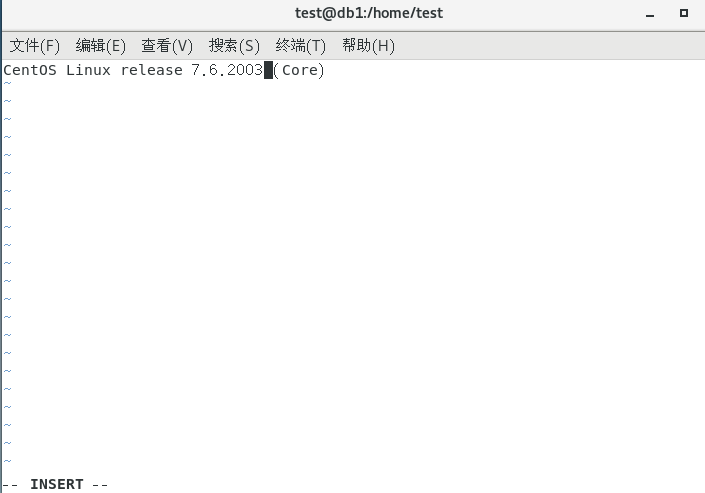

2. **关闭防火墙**

​ 执行以下二个命令将防火墙关闭，

​ systemctl stop firewalld.service

​ systemctl disable firewalld.service，具体如下

​ 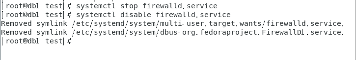

3. **设置字符集及环境变量**

   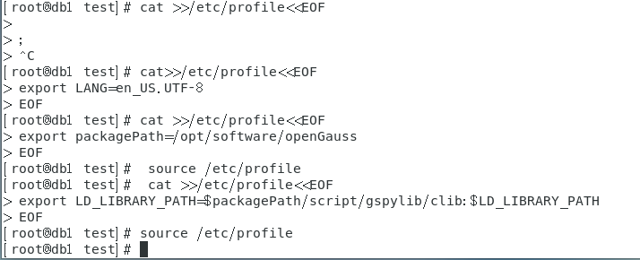

   验证变量是否生效：

   

4. **关闭 swap 内存**

   swapoff -a


5.  **准备 yum 环境**

备份原有的 yum 配置文件：

    mv /etc/yum.repos.d/CentOS-Base.repo /etc/yum.repos.d/CentOS-Base.repo.bak

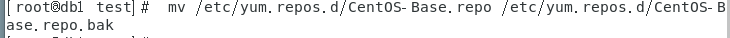

下载可用源的 repo 文件,可通过以下二种方式下载：

方式一：

curl -o /etc/yum.repos.d/CentOS-Base.repo http://mirrors.aliyun.com/repo/Centos-7.repo

方式二：

curl -o /etc/yum.repos.d/CentOS-Base.repo https://mirrors.huaweicloud.com/repository/conf/CentOS-7-anon.repo

如图：

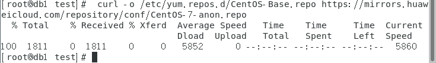

查看 repo 文件内容是否正确，如果显示的内容不正确，请选择另一种方式下载可用源的 repo 文件。

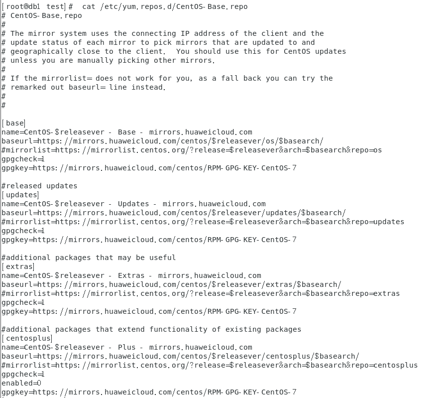

6.  **yum 安装相关包。**

7.  执行以下命令，安装所需的包

    yum install -y libaio-devel flex bison ncurses-devel glibc.devel patch lsb_release wget python3

    如下：

    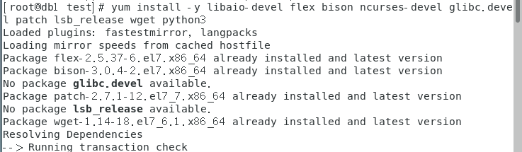

    此处可能你会出错：-bash: /usr/bin/yum: /usr/bin/python: bad interpreter: No such file or directory

    因为我也出错了。。。。

    解决方法：

    [-bash: /usr/bin/yum: /usr/bin/python: bad interpreter: No such file or directory_weixin_38169359 的博客-CSDN 博客](https://blog.csdn.net/weixin_38169359/article/details/101292719)

    根据你的路径决定修改后 python 数字是 2.4 还是 2.7 亦或是其它哦（我是 2.7）

8.  **设置默认 Python 版本为 3.x。**

    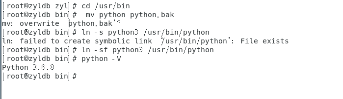

    修改完成后，需要确认 yum 是否能使用，如果不能使用需要修改/usr/bin/yum 文件，把#!/usr/bin/python 这行修改为#!/usr/bin/python2.7（或者对应的 python 2.x 的版本）。输入”i”切换到编辑模式，移动鼠标到修改位置修改内容，然后按下 ESC 键退出编辑模式，然后输入”:wq”退出并进行保存。如下：

    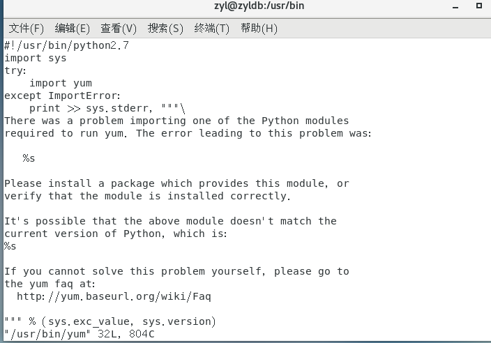

    用 yum --help 命令来验证 yum 是否能使用：

    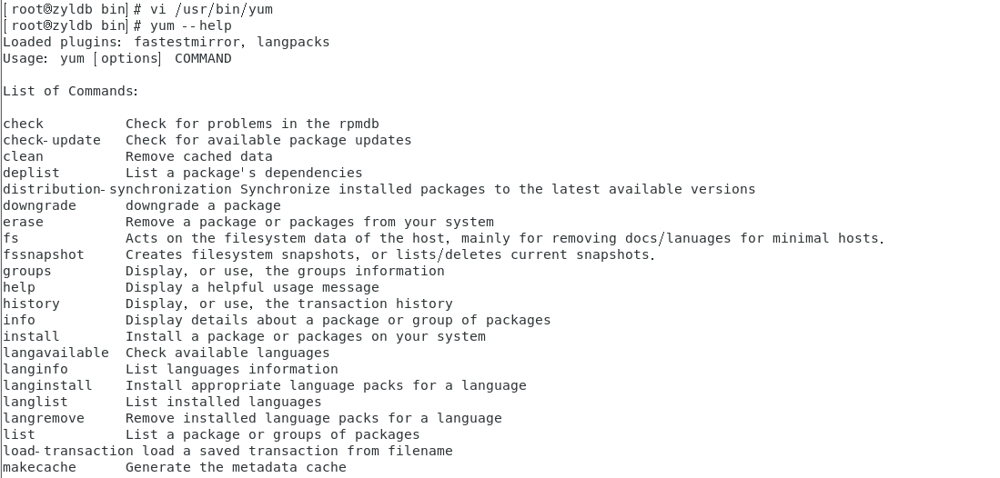

9.  **创建数据库存放安装目录：**

    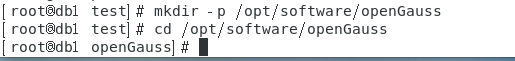

10. **下载数据库安装包**

    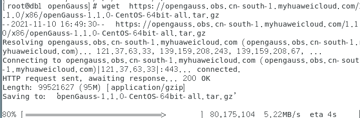

#### 二、安装 opengauss 数据库

1. **创建 XML 配置文件，用于数据库安装**

   

   将以下内容添加进 clusterconfig.xml 文件中。输入”i”切换到编辑模式，复制内容黏贴到文档中，然后按下 ESC 键退出编辑模式，然后输入”:wq”退出并进行保存。

   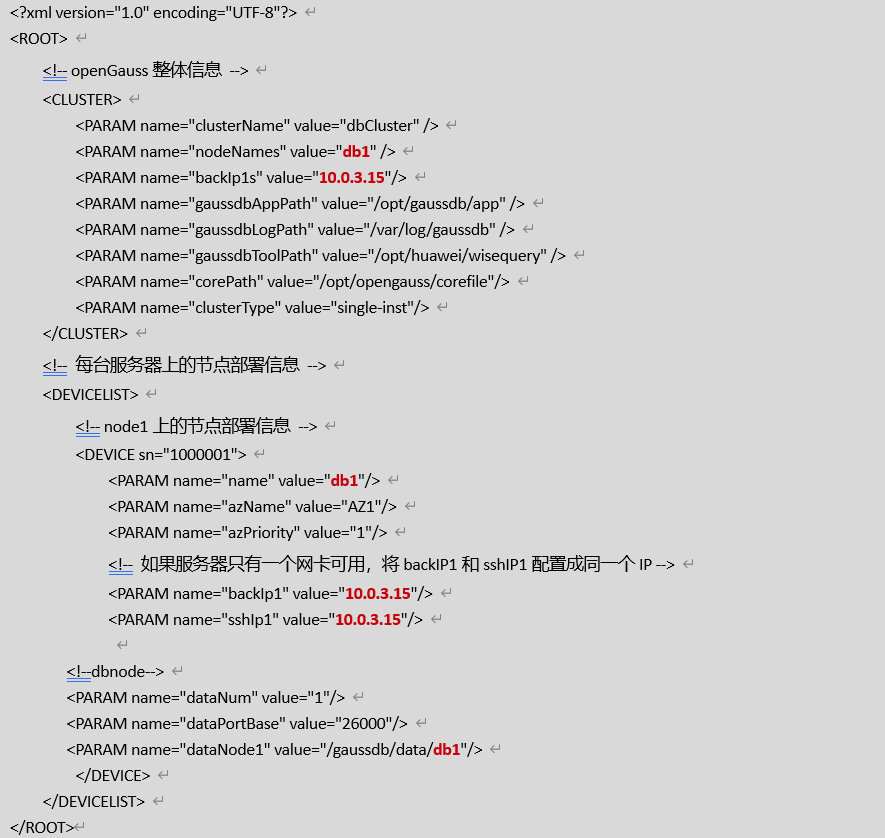

   ```
   <?xml version="1.0" encoding="UTF-8"?>
   <ROOT>
       <!-- openGauss整体信息 -->
       <CLUSTER>
           <PARAM name="clusterName" value="dbCluster" />
           <PARAM name="nodeNames" value="db1" />
           <PARAM name="backIp1s" value="10.0.3.15"/>
           <PARAM name="gaussdbAppPath" value="/opt/gaussdb/app" />
           <PARAM name="gaussdbLogPath" value="/var/log/gaussdb" />
           <PARAM name="gaussdbToolPath" value="/opt/huawei/wisequery" />
           <PARAM name="corePath" value="/opt/opengauss/corefile"/>
           <PARAM name="clusterType" value="single-inst"/>
       </CLUSTER>
       <!-- 每台服务器上的节点部署信息 -->
       <DEVICELIST>
           <!-- node1上的节点部署信息 -->
           <DEVICE sn="1000001">
               <PARAM name="name" value="db1"/>
               <PARAM name="azName" value="AZ1"/>
               <PARAM name="azPriority" value="1"/>
               <!-- 如果服务器只有一个网卡可用，将backIP1和sshIP1配置成同一个IP -->
               <PARAM name="backIp1" value="10.0.3.15"/>
               <PARAM name="sshIp1" value="10.0.3.15"/>

   	    <!--dbnode-->
   	    <PARAM name="dataNum" value="1"/>
   	    <PARAM name="dataPortBase" value="26000"/>
   	    <PARAM name="dataNode1" value="/gaussdb/data/db1"/>
           </DEVICE>
       </DEVICELIST>
   </ROOT>

   ```

   说明：其中标红的内容，需要根据自己实际的 IP 和主机名进行修改，如果其中的中文出现乱码时可以删除这些行。

2. **将下载好的安装包解压至存放目录**

   先解压 openGauss-1.1.0-CentOS-64bit-all.tar.gz 包

   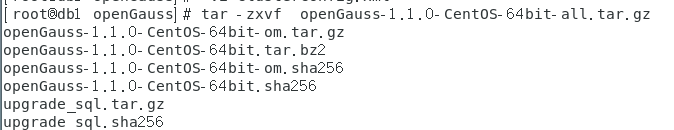

   再先解压 openGauss-1.1.0-CentOS-64bit-om.tar.gz 包。

   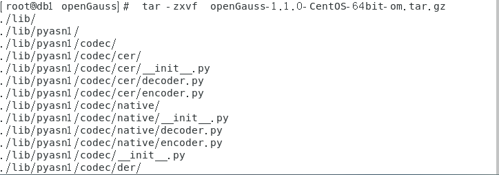

   解压后如下，用 ls 命令查看如下：

   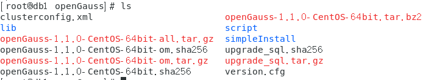

   安装包解压后，会在/opt/software/openGauss 路径下自动生成 script 子目录，并且在 script 目录下生成 gs_preinstall 等各种 OM 工具脚本。

   更改权限。

   

3. **执行初始化脚本**

   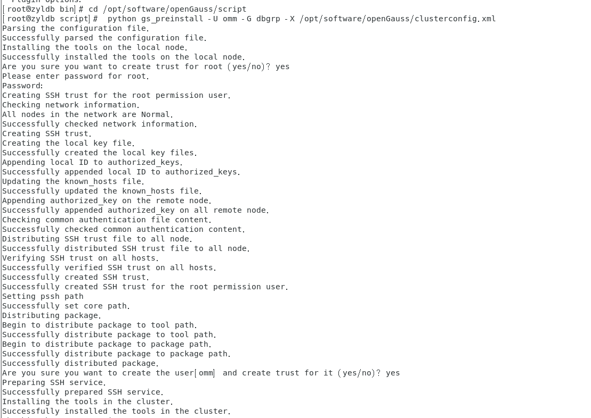

   期间需要输入操作系统 root 用户的密码（如密码：openGauss@123）和创建操作系统 omm 用户及设置密码（如密码：openGauss@123）。密码依然不回显，直接输入密码并回车即可。

   当返回 Preinstallation succeeded 内容时，表明初始化完成。

4. **初始化数据库。**

   用 init 6 重启下虚拟机（主要是为了释放一些内存资源）。

   

   更新权限：

   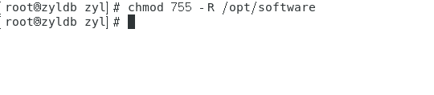

   然后使用 omm 用户进行数据库初始化。

   注意：根据用户实际内存大小设置对应的共享内存的大小，如果对该参数进行了设置，会在数据库启动时候报错，本实验虚拟机总内存大小是 2G。

   gs_install -X /opt/software/openGauss/clusterconfig.xml --gsinit-parameter="--encoding=UTF8" --dn-guc="max_process_memory=**2GB**" --dn-guc="shared_buffers=**128MB**" --dn-guc="bulk_write_ring_size=**128MB**" --dn-guc="cstore_buffers=**16MB**"

   具体如下：

   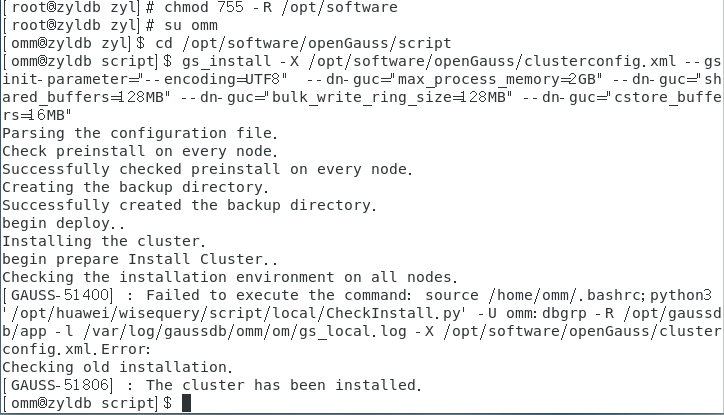

   （我已经安装过一遍，和你的页面可能不太一样）

5. **清理软件安装包**

   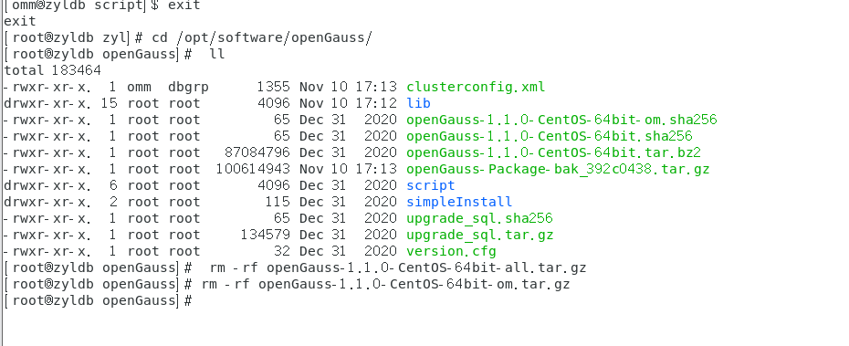

   （我同样已经删过一遍）

#### 三、数据库基础使用

1.  **切换用户到 omm：**

    

2.  **启动服务**

    启动服务命令：**gs_om -t start**

    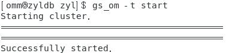

3.  **连接数据库**

    连接指令：**gsql -d postgres -p 26000 -r**

    当结果显示为如下信息，则表示连接成功。

    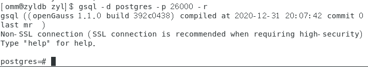

    其中，postgres 为 openGauss 安装完成后默认生成的数据库。初始可以连接到此数据库进行新数据库的创建。26000 为数据库主节点的端口号，需根据 openGauss 的实际情况做替换，请确认连接信息获取。

    **引申信息：**

    使用数据库前，需先使用客户端程序或工具连接到数据库，然后就可以通过客户端程序或工具执行 SQL 来使用数据库了。gsql 是 openGauss 数据库提供的命令行方式的数据库连接工具。

4.  **第一次连接数据库时，需要先修改 omm 用户密码，新密码修改为 Bigdata@123（建议用户自定义密码）**

**alter role omm identified by _'Bigdata@123_' replace _'openGauss@123'_;**

      显示“ALTER ROLE”则成功

5.  **创建数据库用户**。

默认只有 openGauss 安装时创建的管理员用户可以访问初始数据库，您还可以创建其他数据库用户帐号。

指令：**CREATE USER joe WITH PASSWORD "Bigdata@123";**


    如上创建了一个用户名为joe，密码为Bigdata@123的用户。

6.  **创建数据库。**

指令：**CREATE DATABASE db_tpcc OWNER joe;**


退出数据库：


使用新用户连接到此数据库：

指令： **gsql -d db_tpcc -p 26000 -U joe -W Bigdata@123 -r**

显示如下内容表示成功：

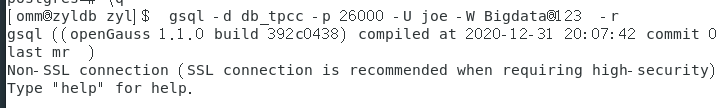

**至此，opengauss 数据库安装全部完成**

​
