## openGauss 源码解析 ------ SQL 语句解析模块

#### 一、概述

openGauss 数据库是华为深度融合在数据库领域多年经验，结合企业级场景要求推出的新一代企业级开源数据库。openGauss 是关系型数据库，采用客户端/服务器，单进程多线程架构；支持单机和一主多备部署方式，同时支持备机可读、双机高可用等特性。

openGauss 是基于 postgresql 数据库开发的。

开源地址：[openGauss/openGauss-server - 码云 - 开源中国 (gitee.com)](https://gitee.com/opengauss/openGauss-server?_from=gitee_search)

#### 二、SQL 解析

数据库的 SQL 引擎作为 SQL 解析模块是数据库重要的子系统之一，它对上负责承接应用程序发送的 SQL 语句，对下负责指挥执行器运行执行计划，是整个数据库的第一个执行的模块。具体而言，就是讲用户输入的 SQL 语句转换为具体的能被机器识别的要求从而被执行，类似与各种编程语言的编译器。

完整过程：

 分析树 --(语义分析)--> 查询树

在代码里的调用路径如下(方框内为函数，数字显示了调用顺序)

#### 四、源码文件及作用：

| parser.cpp              | **解析主程序**                             |
| ----------------------- | ------------------------------------------ |
| scan.l                  | 词法分析，分解查询成 token                 |
| scansup.cpp             | 处理查询语句转义符                         |
| kwlookup.cpp            | 将关键词转化为具体的 token                 |
| keywords.cpp            | 标准关键词列表                             |
| analyze.cpp             | 语义分析                                   |
| gram.y                  | 语法分析，解析查询 tokens 并产生原始解析树 |
| parse_agg.cpp           | 处理聚集操作，比如 SUM(col1)，AVG(col2)    |
| parse_clause.cpp        | 处理子句，比如 WHERE，ORDER BY             |
| parse_compatibility.cpp | 处理数据库兼容语法和特性支持               |
| parse_coerce.cpp        | 处理表达式数据类型强制转换                 |
| parse_collate.cpp       | 对完成表达式添加校对信息                   |
| parse_cte.cpp           | 处理公共表格表达式（WITH 子句）            |
| parse_expr.cpp          | 处理表达式，比如 col, col+3, x = 3         |
| parse_func.cpp          | 处理函数，table.column 和列标识符          |
| parse_node.cpp          | 对各种结构创建解析节点                     |
| parse_oper.cpp          | 处理表达式中的操作符                       |
| parse_param.cpp         | 处理参数                                   |
| parse_relation.cpp      | 支持表和列的关系处理程序                   |
| parse_target.cpp        | 处理查询解析的结果列表                     |
| parse_type.cpp          | 处理数据类型                               |
| parse_utilcmd.cpp       | 处理实用命令的解析分析                     |

#### 五、词法解析部分

**对于字符串流的输入，根据词表，将关键字、变量等转化成自定义逻辑结构，用于下一步的语法分析**

分为三部分：定义段、规则段、用户程序段

- 定义段：

  这一部分一般是一些声明及选项设置等；

  C 语言的注释、头文件包含等一般就放在%{%}之间，这一部分的内容会被直接复制到生成的 C 文件中,还有一些参数项通过%option 来设置；

  采用正则表达式定义词法规范；

  只有符合规范的关键词才允许接受，否则报错。

- 规则段：

  规则段为一系列匹配模式和动作，模式一般使用正则表达式书写，动作部分为 C 代码；

  规则段模板：

  模式 1

  {

  动作 1 （C 代码）

  }

  在输入和模式 1 匹配的时候，执行动作部分的代码

- 用户程序段：

  用户自定义的程序，无固定模式·

#### 六、词法解析代码举例

##### 定义段：

头文件、宏定义等：

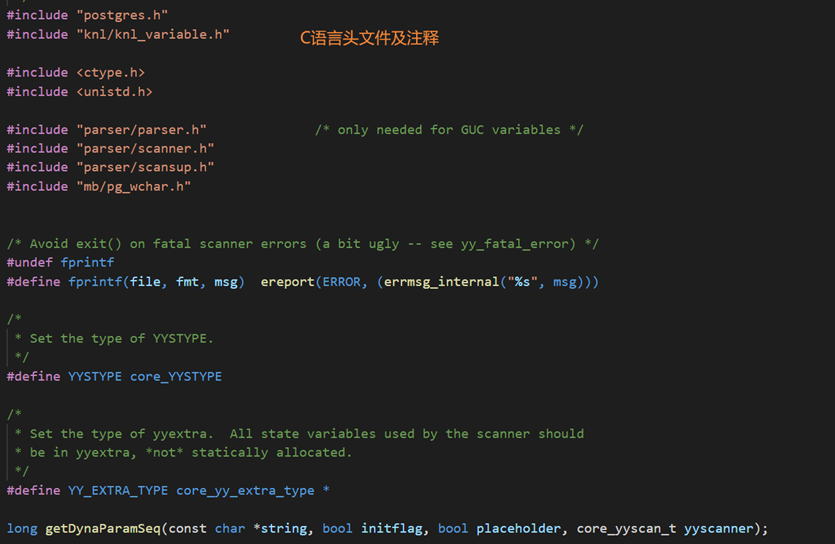

%option 此部分是 Flex（词法工具）支持的一些参数，通过%option 来设置

%option reentrant 可重入词法分析器：传统词法分析器只能一次处理一个输入流，所以很多变量都定义的为静态变量这样分析器才能记住上次分析的地方继而可以继续分析。但是不能同时处理多个输入流。为了解决这个问题引入了可重入词法分析器。通过参数 reentrant 来控制。

%option bison-bridge ：bison 桥模式

bison 的发展和 flex 的发展沟通并不是很密切，导致二者对 yyles 的调用参数不一致。所以在 flex 中提拱了桥模式，如果按%option bison-bridge 做了声明，那么在 flex 中 yylex 将被声明为 int yylex(YYSTYPE\* lvalp, yyscan_t scaninfo)，这样就兼容了 bison。

其它的读者可自行搜索。

词法规则制定：采用正则表达式规定可接受的字符组合

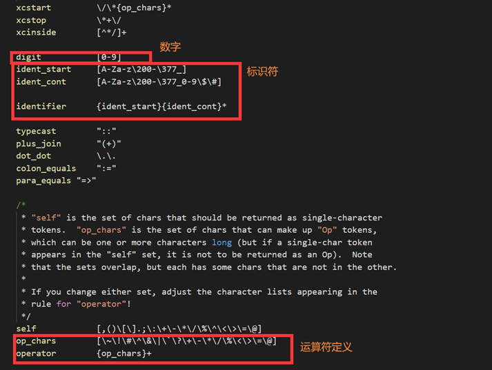

##### 规则段：

表示匹配到了某字符组合该执行什么动作：

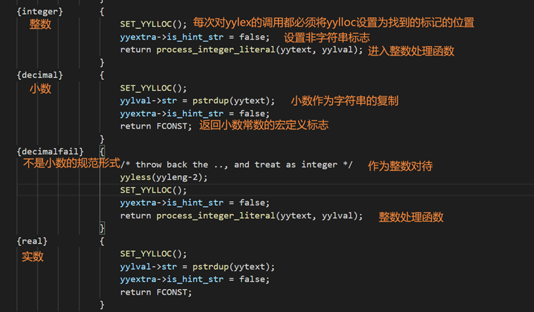

#### 七、语法解析部分：

**以词法分析器生成的单词符号序列作为输入,根据语言的语法规则识别出各种语法成分(如表达式、语句、程序段乃至整个程序等),并在分析过程中进行语法检查,检查所给单词符号序列是否是该语言的文法的一个句子。**

同样分为三段，定义段，规则段和代码段。也是通过%%做三个段的分割。源码文件为 gram.y, 最后通过 Bison 编译源文件生成 gram.c

- 定义段：中的代码将被原样 copy 到生成的文件 gram.c 中.其中包含头文件包含，结构体定义和函数声明等，与词法分析一致
- 规则段：主要是文法产生式，规定规约的规则，对于输入的 SQL 语句只要能规约到文法产生式顶层非终结符，则判断该 SQL 语句是语法合法的。在规约过程中顺便构建起语法分析树，为后面的语义分析做铺垫。

**总体流程**：

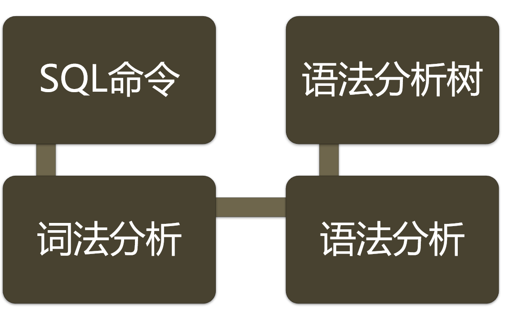

**具体流程**：

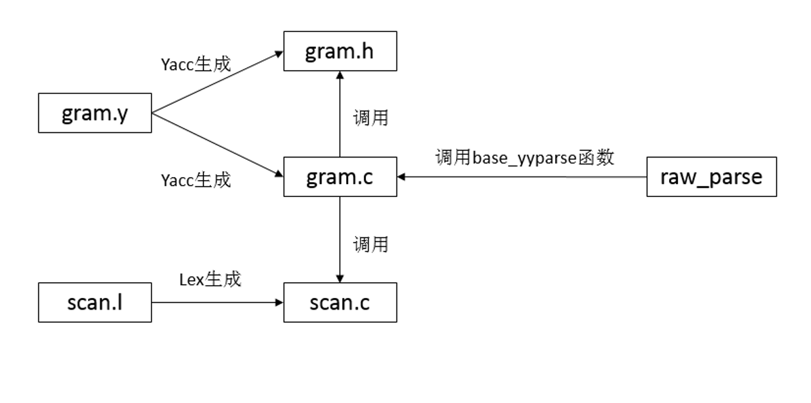

#### 八、语法解析代码举例：

##### 定义段：

基本设置：

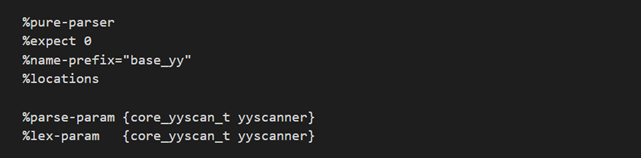

%pure-parser 声明此语法分析器是纯语法分析器。这样可以实现可重入。

%expect 0 ,意思是期待 0 个冲突。即不希望有任何冲突出现。

%name-prefix="base_yy" 代表生成的函数和变量名从 yy 改成 base_yy，同 flex，为了在一个产品里使用多个语法分析器，分析不同的数据类。

%locations 声明使用位置信息。

union 表示联合体：

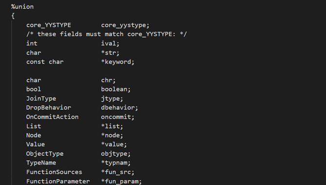

%union{} 定义 yylval 类型，在 flex 中通过 yylval 的返回匹配的值。

type 表示非终结符：

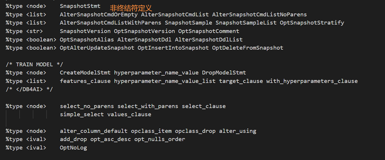

非终结符用于文法产生式，为生成语法分析树服务

优先级定义：

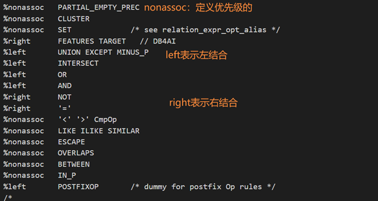

优先级和左右结合的定义可以解决一些语法上的矛盾。

具体文法产生式：

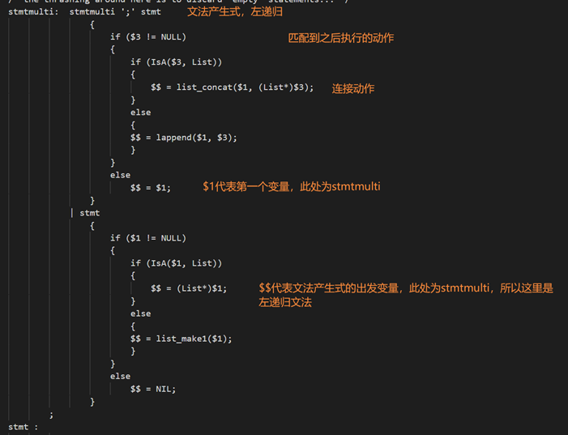

Opengauss 总的文法产生式极其复杂，这里只节选。

#### 九、具体案例

**SQL 语句：**

INSERT INTO films (code, title, did, date_prod, kind) VALUES ('T_601', 'Yojimbo', 106, '1961-06-16', 'Drama’);

**产生的函数调用：**

PostgresMain->exec_simple_query->pg_parse_query->raw_parser->base_yyparse(yyscanner)

词法匹配（SCAN.I)：

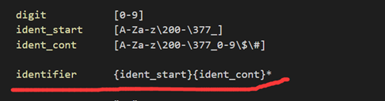

Identifier 可以匹配到 insert。

根据规则执行动作：

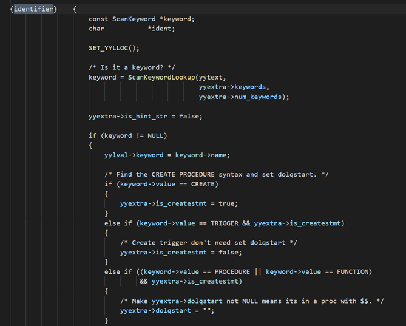

代码中 keywordopengauss 内置的关键字，像 insert 就是一个关键字 keyword。

可以看到一个判断是 keyword 非空即检测到关键字时，根据关键字不同类型执行动作。

在 yylex 返回 INSERT 这个 token.然后分析 gram.y 中这个 token 对应的规则 由于 flex 默认向前查看一个 token, 根据第二部可知第二个 token 为 INTO.在规则段中找到如下规则：

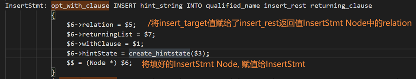

opt_with_clause 可以为空，并且后面跟着一个 INSERT INTO, 所以即匹配上这个规则。

**类似上面方法继续分析剩下的 SQL 语句**

结果放到 InsertStmt 中，后面继续根据以下规则做规约处理，由于在规则段中第一个出现的非终结符号，stmtblock 是我们要的结果。通过不断的规约即 reduce,最后的分析结果即剩下 stmtblock 这一个符号即开始符号，所以是匹配成功的。

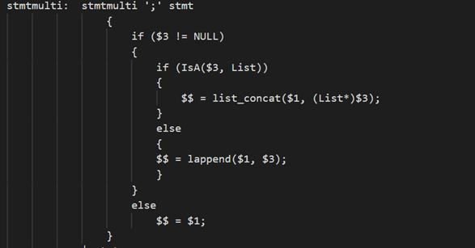
