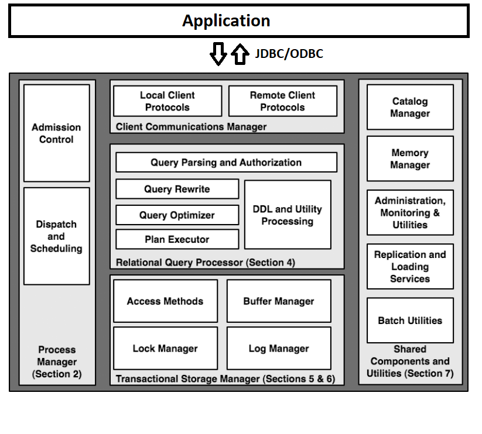

# **openGauss 和 PostgreSQL 的源码目录结构对比**

> 前言：openGauss 内核虽然源于 PostgreSQL，但是华为在多个维度进行了深度的改进。本文从源目录的组织结构入手来研究 openGauss，笔者在不断深入的研究中不禁惊叹于 openGauss 先进且合理的源码组织结构，这里面体现了华为对于数据库架构和技术的深刻理解，值得我们反复品味和学习！

从源码入手是研究一款开源数据库的重要方法之一，对源代码的理解可以从宏观和微观两个层面入手。为了避免陷入局部代码之中，第一步我们应该抛开微观层面上具体的代码和实现细节，从宏观层面上的目录和组织结构入手，来窥探整个数据库的架构和实现逻辑，以及开发人员在实现层面的考量。对源代码的全局结构有了清晰的认识之后，我们便可以对查询优化、存储、事务、进程管理、内存管理等各个功能模块的代码进行深入的研究。

openGauss 内核源于 PostgreSQL 9.2.4 版本，因此本文中我们通过对比的方式来探寻 openGauss 和 PostgreSQL 在源码目录和组织结构的异同。

## **1. GaussDB 为什么选择 PG？**

首先我们需要弄清楚 openGauss 的产品定位，以及它和 PostgreSQL 的关系，这有助于我们理解 openGauss 的整个源码体系和结构。openGauss 是华为于 2020 年 6 月开源的单机版 GaussDB。华为决定自主研发 GaussDB 时为什么选择了 PG，而不是其他的开源数据库如 MySQL，我们或许可以从 GaussDB 的发展历程中寻找答案。

GaussDB 并非是一个产品，而是一系列产品的统称，目前 GaussDB 产品线主要包括 GaussDB T (OLTP)和 GaussDB A (OLAP)。其中 GaussDB T 的前身是 GaussDB 100，是华为自 2007 年开始在自研内存数据库基础上全面改造而来的一款分布式数据库，此前华为由于在电信计费领域的需求而自主研发了一款内存数据库。GaussDB A 的前身是 GaussDB 200，是华为自 2011 年开始基于 PostgreSQL 9.2.4 自主研发的一款具备多模分析及混合负载能力的大规模并行处理分布式数据库，支持行列混合存储以及线程化，支持高达 2048 节点的集群规模，提供 PB(Petabyte)级数据分析能力、多模分析能力和实时处理能力。

openGauss 内核虽然源于 PostgreSQL，但华为在开发过程中结合企业级场景需求，通过 C++语言（PostgreSQL 是用 C 语言写的）对 80+%的数据库内核代码进行了重构，修改和新增了 70 万行核心代码。着重在整体架构、数据库内核三大引擎 (优化器、执行引擎、存储引擎)、事务、以及鲲鹏芯片等方面做了大量的深度优化。

例如，通过引入向量化引擎和编译执行引擎等从多个维度重构了执行引擎，通过列存及自适应压缩等全新重构了存储引擎。除了数据库内核，在高可用、数据库安全和 AI 特性方面，openGauss 数据库也做了极大的增强。PG11.3 版本数据库中共有 290 个数据库参数，而 openGauss 目前有 500 多个数据库参数，每个参数对应一个数据库内核功能，所以可以看到华为对 PG 的内核做了非常大的改造和增强。

做数据库内核开发的技术难度很大，哪怕开发团队对内核架构与机制的制定上出现了丝毫的问题，上线后都极有可能会出现后果严重。有时一旦确定项目无法进行下去，甚至可能需要推倒重来。所以基于一款已经成熟的开源数据库进行自主研发就是一个很好的选择。那为什么选择 PG 而不是在互联网公司已经得到广泛使用的 MySQL，可能是华为在调研分析后看中了 PG 各方面优秀的特性：

- **代码质量高**：作为学院派的代表，PG 的代码简洁、规范、结构清晰，非常适合从源码级进行二次研发。相比之下，修改 MySQL 的代码会困难很多。
- **功能完善强大**：PG 支持的数据类型丰富(多模能力)，SQL 语法完善(高级 SQL 特性)，查询优化性能强。以 JSON 支持为例，PG 从 2012 年的 9.2 版本就已经添加了对 JSON 数据类型的支持，相比之下 Oracle 从 2014 年发布 12c 才开始支持 JSON，而 MySQL 直到 2015 年发布 5.7.8 版本才开始原生支持 JSON。以 join 算法为例，PG 几乎支持所有的多表连接算法；以 SQL 为例，PG 支持大多数 SQL 语法，相比之下 MySQL 支持较弱；此外 PG 的查询优化处理能力，例如复杂子查询等都要强于 MySQL。
- **技术先进**：PG 号称是世界最先进的开源数据库，其先进性不仅体现在基本的存储、事务、查询处理等方面，更多的是体现在其新技术上，比如 JIT 查询计划的即时编译和外部表技术等。
- **扩展性强**：良好的扩展性使得 PG 非常适合进行二次开发，例如在 PG 基础架构之上引入 MPP 框架可以构建分布式数据仓库 GreenPlum（MySQL 基本不适合做数据仓库）；在 PG 上引入 OpenCypher 可以构建具备图数据存储和查询能力的多模数据库 AgensGraph；在 PG 架构上通过将数据自动按时间和空间分片可以构建时序数据库 Timescale。

我觉得 GaussDB 发展的 10 年历程说明华为选择 PG 是一个十分正确的选择。目前 PG 的用户增长迅速，生态发展的也比 MySQL 要好，这说明越来越多的公司和开发者都意识到 PG 的确是一款优秀的开源数据库。其实在早年间，也有一些公司曾在 MySQL 上进行自主研发，比如阿里巴巴之前在 MySQL 社区版的基础上做了大量的性能与功能的优化改进，自主研发了 AliSQL 用于支撑淘宝双十一等业务，但相比 PG 来说，这样二次研发的成功案例要少很多。

至此我们理清了 openGauss 和 PostgreSQL 的联系，接下来我们一起通过对比二者源代码的组织结构，来窥探二者在数据库架构和实现方面的异同，这样对比学习的方式有助于同时加深我们的二者的认识。

## **2. 源代码目录结构对比**

本文中我们进行对比的源代码版本分别是 PostgreSQL 9.2.4 (发布于 2013 年 4 月 4 日，截至 2020 年 7 月 9 日 PG 已更新到 14beat2 版本)和 openGauss 2.0.1 (截至 2020 年 7 月 9 日发布的最新版)。

进入 PostgreSQL 和 openGauss 的源码目录后，可以看到第一级目录下都有一个 src 目录，该目录就是数据库源代码目录。本文中我们重点关注 src 目录下的代码结构，因为 src 目录是整个数据库的核心代码。

### **2.1 数据库管理系统的架构和主要组件**

了解传统的关系数据库管理系统（RDBMS）的架构能帮助我们更好地理解源代码的各个模块和其组织结构，下图显示了一个 RDBMS 的架构和主要组件。



> 图片来源于经典论文：
> Hellerstein, J. M., Stonebraker, M., & Hamilton, J. (2007). [**Architecture of a Database System.**](https://www.nowpublishers.com/article/Details/DBS-002) Foundations and Trends® in Databases, 1(2), 141-259.

图中显示了一个 RDBMS 包含的 5 个主要的功能模块：

- 客户端通信管理器（Client Communications Manager）
- 进程管理器（Process Manager）
- 关系查询处理器（Relational Query Processor）
- 事务和存储管理器（Transactional Storage Manager）
- 共享组件和工具（Shared Components and Utilities）

考虑一个简单而典型的数据库查询应用实例-“查询某次航班的所有旅客名单”，这个操作所引发的的查询请求大致按如下方式进行处理：

1. 机场登机口的 PC 机（客户端）调用 API 与 DBMS 的客户端通信管理器（Client
   Communications Manager）建立网络连接；
1. 在收到客户端的请求后，DBMS 必须为之分配一个计算线程。系统必须确保该线程的数据以及控制输出是通过通信管理器与客户端连接的，这些工作由进程管理器（Process Manager）来管理。
1. 分配控制进程之后，接下来便可以通过关系查询处理器（Relational Query Processor）来处理查询了。该模块会检查用户是否有查询权限，然后将用户的 SQL 语句编译为查询计划，并将查询计划交给查询执行器来执行。
1. 在查询计划的底层，会有若干操作从数据库请求数据。这些操作通过事务和存储管理器（Transactional Storage Manager）读取数据并保证事务的“ACID”性质。此外还有一个缓冲管理器，用来控制内存缓冲区和磁盘之间的数据传输。
1. 最后，查询处理器将数据库的数据组织成结果元组，结果元组生成后被放入客户通信管理器的缓冲区中，然后该通信管理器将结果发送给调用者。

上述例子我们没有提到共享组件和工具（Shared Components and Utilities）， 但它们对于一个功能完整的 DBMS 是十分重要的，这些组件独立运行于任何查询，它们使数据库保持稳定性和整体性。比如目录管理器和内存管理器在传输数据时被作为工具来调用，在认证、解析以及查询优化过程中，查询处理器都会用到目录。同样，内存管理器也广泛应用于整个 DBMS 运行过程中的动态内存分配和释放。

### **2.2 src 目录结构对比**

```
PostgreSQL-9.2.4\src
├─backend (后端代码，包括解析器、优化器、执行器、存储、命令、进程等)
├─bin (psql等命令的代码)
├─include (头文件)
├─interfaces (前端代码)
├─makefiles (平台相关的make的设置值)
├─pl (存储过程语言的代码)
├─port (平台移植相关的代码)
├─template (平台相关的设置值)
├─test (测试脚本)
├─timezone (时区相关代码)
├─tools (开发工具和文档)
└─tutorial (教程)
```

```
openGauss-2.0.1\src
├─bin (gsql等命令的代码)
├─common (公共功能模块代码)
├─gausskernel (高斯内核代码)
├─include (头文件)
├─lib (库文件，包括)
├─makefiles (平台相关的make的设置值)
├─test (测试脚本)
└─tools (开发工具和文档)
```

与 PostgreSQL 相比，openGauss 在 src 目录下的组织方式有以下变化：

- 保留了 bin、include、makefiles、test 和 tools 这 5 个目录；
- 新建了**gausskernel**目录，用于存放整个**高斯内核**的代码，backend 目录下的 bootstrap、optimizer、executor、storage 等模块被移动到 gausskernel 目录下；
- 新建了**common**目录，用于存放**公共功能模块**的代码，interfaces、pl、port、template、timezone 和 tutorial 这 6 个目录的全部内容，以及 backend 目录的剩余内容（如 libpq、nodes、parser 等）被移动到 common 目录下。

接下来我们会对以上的变化进行详细的说明。

### **2.3 从 backend 到 common 和 gausskernel 的变化**

由于 PostgreSQL 采用 C/S(客户机/服务器)模式结构，客户端为前端(Frontend)，服务器端为后端(Backend)，所以 PostgreSQL 的 backend 目录是整个数据库服务的核心代码目录。

openGauss 对 PG 的 backend 目录进行了功能上的细化分类，将 optimizer、executor、storage 等高斯内核的核心功能组件移动到新建的 gausskernel 目录下，其他一些公共功能模块则被移动到新建的 common 目录下。

```
PostgreSQL-9.2.4\src
├─backend (后端源码目录)
│  ├─access (各种数据的存储访问方法，如支持堆、索引等数据存取)
│  ├─bootstrap (支持Bootstrap运行模式，用来创建初始的模板数据库)
│  ├─catalog (系统目录)
│  ├─commands (执行非计划查询的SQL命令，如创建表命令等)
│  ├─executor (执行器，执行生成的查询计划)
│  ├─foreign (FDW：Foreign Data Wrapper处理)
│  ├─lib (共同函数)
│  ├─libpq (处理与客户端通信库函数，几乎所有的模块都依赖它)
│  ├─main (主程序模块，负责将控制权转到Postmaster进程或Postgres进程)
│  ├─nodes (定义系统内部用到的节点、链表等结构，以及处理这些结构的函数)
│  ├─optimizer (优化器，根据查询树创建最优的查询路径和查询计划)
│  ├─parser (解析器，将SQL查询转化为内部查询树)
│  ├─po
│  ├─port (平台兼容性处理相关的函数)
│  ├─postmaster (监听用户请求的进程，并控制Postgres进程的启动和终止)
│  ├─regex (正规表达式库及相关函数)
│  ├─replication (流复制)
│  ├─rewrite (查询重写)
│  ├─snowball (全文检索相关)
│  ├─storage (存储管理，包括内存、磁盘、缓存等管理)
│  ├─tcop (Postgres服务进程的主要处理部分，调用parser、optimizer、executor和commands中的函数来执行客户端提交的查询)
│  ├─tsearch (全文检索)
│  └─utils (各种支持函数，如错误报告、各种初始化操作等)
```

```
openGauss-2.0.1\src
├─common (公共功能模块代码)
│  ├─backend
│  │  ├─catalog
│  │  ├─client_logic
│  │  ├─lib
│  │  ├─libpq
│  │  ├─nodes
│  │  ├─parser
│  │  ├─pgxc_single
│  │  ├─po
│  │  ├─port
│  │  ├─regex
│  │  ├─snowball
│  │  ├─tsearch
│  │  └─utils
│  ├─interfaces
│  ├─pgxc
│  ├─pl
│  ├─port
│  ├─template
│  ├─timezone
│  └─tutorial
```

```
openGauss-2.0.1\src
├─gausskernel (高斯内核)
│  ├─bootstrap
│  ├─cbb
│  ├─dbmind (AI4DB和DB4AI功能模块)
│  ├─optimizer
│  ├─process (进程和线程管理模块)
│  ├─runtime (执行器模块)
│  ├─security
│  └─storage
```

#### **(1) gausskernel 内核整体目录结构对比**

openGauss 对 gausskernel 内核部分代码进行了较大的变动，而内核又是数据库最核心最重要的部分，所以我们需要重点关注内核部分的源代码结构。PostgreSQL 中的内核代码都在 backend 目录下，而 openGauss 的内核代码则主要在 gausskernel 目录下（从 gausskernel 的名称就可以看出来）。

openGauss 之所以创建 gausskernel 目录，我想可能有以下几点原因：

1. 创建内核目录彰显了 openGauss 对于内核的重视，而不是像 PG 一样将所有的功能模块都放到 backend 目录下；
2. 突出华为在数据库内核方面所作的重大改进和优化工作；
3. 单独将内核部分代码单独提出来可以方便项目开发和后期代码维护。

gausskernel 在代码目录的组织结构上主要有以下变化：

1. 保持 bootstrap、optimizer 和 storage 这 3 个目录，但是这几个目录中所包含的内容发生了变化（后文会讲到）；
2. 新增了 cbb、dbmind 和 security 这 3 个目录，其中 dbmind 目录包含了人工智能和数据库结合的最新研究成果；
3. 新建 process 目录，原来 PG 中的 postmaster 目录被移动到 process 目录下作为子目录之一，说明华为在进程和线程管理方面做了很多改进；
4. 新建 runtime 目录，原来 PG 中的 executor 目录被移动到 runtime 目录下作为子目录之一，说明华为在执行器方面做了很多增强，比如增加了向量化执行引擎。

#### **(2) 公共组件 common 目录结构对比**

openGauss 将 PG 的 backend 目录的公共功能模块都统一移动到新建的 common 目录下，这样做的原因可能有两点：

1. openGauss 认为这些模块是数据库系统共有的公共组件或者功能模块，比如 PG 中 backend 目录下的 catalog、lib、libpq 等模块；
2. openGauss 基本都保留了这些模块的接口和公共函数代码，所以 openGauss 与现有的 PG 生态兼容性较好。openGauss 仅对这些代码做了适当优化，所以单独创建 common 目录可以和 gausskernel 这样修改较大的模块区分开来。

注意 openGauss 也有 backend 目录，但是该目录只保留了一些公用的功能模块，并且被移动到了 common 目录下。

#### **(3) optimizer 目录的变化**

```
PostgreSQL-9.2.4\src
├─backend
│  ├─commands
│  ├─optimizer
│  │  ├─geqo (遗传算法查询优化)
│  │  ├─path (使用parser的输出创建查询路径)
│  │  ├─plan (优化path输出生成查询计划)
│  │  ├─prep (处理特殊的查询计划)
│  │  └─util (优化器支持函数)
│  ├─rewrite
```

```
openGauss-2.0.1\src
├─gausskernel (高斯内核)
│  ├─optimizer
│  │  ├─commands
│  │  ├─geqo
│  │  ├─path
│  │  ├─plan
│  │  ├─prep
│  │  ├─rewrite
│  │  └─util
```

openGauss 在优化器目录中的变化主要是将 PG 中和 optimzier 同一目录级别的 commands 和 rewrite 移动到 optimzier 目录下，这说明 openGauss 将命令模块和查询重写模块归为优化器的一部分。

#### **(4) 从 postmaster 到 process 的变化**

在架构层面 PostgreSQL 是多进程架构，为了提高并发度，openGauss 将其进一步优化成了多线程架构，openGauss 属于单进程多线程模型的数据库。

```
PostgreSQL-9.2.4\src
├─backend
│  ├─postmaster
│  ├─tcop
```

```
openGauss-2.0.1\src
├─gausskernel
│  ├─process
│  │  ├─datasource
│  │  ├─globalplancache
│  │  ├─job
│  │  ├─main
│  │  ├─postmaster
│  │  ├─stream
│  │  ├─tcop
│  │  └─threadpool (线程池)
```

从上面的对比可以看出，openGauss 在 gausskernel 目录下新建了 process 目录，将 PG 的 postmaster 和 tcop 目录移动到 process 目录下，并且增加了很多的其他的功能模块，比如线程池 threadpool 模块等。

#### **(5) 从 executor 到 runtime 的变化**

```
PostgreSQL-9.2.4\src
├─backend
│  ├─executor
```

```
openGauss-2.0.1\src
├─gausskernel
│  ├─runtime
│  │  ├─codegen (代码生成)
│  │  │  ├─codegenutil
│  │  │  ├─executor
│  │  │  ├─llvmir (LLVM动态编译)
│  │  │  └─vecexecutor
│  │  ├─executor
│  │  └─vecexecutor (向量化执行引擎)
│  │      ├─vecnode
│  │      ├─vecprimitive
│  │      └─vectorsonic
```

从上面的对比可以看出，openGauss 在 gausskernel 目录下新建了 runtime 目录，将 PG 的 executor 目录移动到 runtime 目录下，并且增加了 codegen 和 vecexecutor 两个目录。codegen 目录中用到了业界流行的开源编译框架 LLVM，用于生成高性能的代码来进一步提升性能；vecexecutor 目录则包含了向量化执行引擎的相关代码，用于提升 SQL 引擎的计算性能。

代码生成和向量化执行是当前学术界和工业界用于提升 SQL 计算引擎性能的两种有效方法，而这两种方法在 openGauss 中都已经实现了。

#### **(6) access 目录的变化**

openGauss 将从 backend 目录下的 access 目录移动到 gausskernel/storag 目录下，这是因为对数据的访问是和数据库的存储结构密切相关的。数据一般存储在磁盘上的，所以数据在磁盘上组织形式决定了访问数据的效率，比如是堆文件还是顺序文件，以及读取时是顺序读取还是通过索引来读取。

```
PostgreSQL-9.2.4\src
├─backend
│  ├─access
│  │  ├─common (公共存取函数)
│  │  ├─gin
│  │  ├─gist (可自定义的存取方法)
│  │  ├─hash (哈希用于存取表)
│  │  ├─heap (堆用于存取表)
│  │  ├─index (索引存取表)
│  │  ├─nbtree (Lehman and Yao的btree管理算法)
│  │  ├─spgist
│  │  └─transam (事务管理器)
```

```
openGauss-2.0.1\src
├─gausskernel
│  └─storage
│      ├─access
│      │  ├─cbtree
│      │  ├─common
│      │  ├─dfs
│      │  ├─gin
│      │  ├─gist
│      │  ├─hash
│      │  ├─hbstore
│      │  ├─heap
│      │  ├─index
│      │  ├─nbtree
│      │  ├─obs
│      │  ├─psort
│      │  ├─redo
│      │  ├─rmgrdesc
│      │  ├─spgist
│      │  ├─table
│      │  └─transam
```

#### **(7) storage 目录的变化**

```
PostgreSQL-9.2.4\src
├─backend
│  ├─storage
│  │  ├─buffer (行存储共享缓冲区模块)
│  │  ├─file (文件操作和虚拟文件描述符模块)
│  │  ├─freespace (行存储空闲空间模块)
│  │  ├─ipc (进程间通信模块)
│  │  ├─large_object (大对象模块)
│  │  ├─lmgr (锁管理模块)
│  │  ├─page (页面模块)
│  │  └─smgr (存储介质管理模块)
```

```
openGauss-2.0.1\src
├─gausskernel
│  └─storage
│      ├─access
│      ├─buffer
│      ├─bulkload (外表批量导入模块)
│      ├─cmgr (列存储只读共享缓冲区模块)
│      ├─cstore (列存储访存模块)
│      ├─dfs (外表服务器连接模块)
│      ├─file
│      ├─freespace
│      ├─ipc
│      ├─large_object
│      ├─lmgr
│      ├─mot (内存引擎模块)
│      ├─page
│      ├─remote (备机页面修复模块)
│      ├─replication
│      └─smgr
```

从上面的对比可以看出，openGauss 在 storage 目录的变化主要包括：

- 新增了列存储相关的功能模块如 cmgr 和 cstore，这是 openGauss 相比 PG 的一大增强，通过增加列存储使得 openGauss 能适用于更多的场景；
- 新增了 mot 模块，mot 模块是 openGauss 引入的 MOT(Memory-Optimized Table)存储引擎，是 openGauss 数据库最先进的生产级特性，它针对多核和大内存服务器进行了优化，能为事务性工作负载提供更高的性能；
- 新增了外表功能的相关模块，如 dfs 和 bulkload 等；
- 新增了备机页面修复模块 remote；
- 将 replication 模块从 backend 目录移动到 storage 目录下；
- 保留了 buffer、file、freespace、ipc、large_object、lmgr、page 和 smgr 等 8 个模块。

#### **(8) security 目录：数据安全的保障**

```
openGauss-2.0.1\src
├─gausskernel
│  ├─security
│  │  ├─gs_policy
│  │  ├─iprange
│  │  └─keymanagement
```

openGauss 在 gausskernel 目录下新建了 security 目录，用于存放数据库安全的相关功能模块的代码，比如安全认证、角色管理、审计与追踪以及数据加密等模块的源代码。

#### **(9) dbmind 目录：数据库的 AI 大脑**

AI 与数据库结合是近年的研究热点，据我所知，即使最新版的 PostgreSQL 和 MySQL 目前仍然不具备这样的功能，可以说 openGauss 在这个领域走在了业界前列。AI 与数据库结合的相关源代码都在 dbmind 目录下。值得注意的是 dbmind 位于 gausskernel 下说明华为是将数据库的 AI 能力作为未来数据库内核的一种基础能力来进行构建的。

```
openGauss-2.0.1\src
├─gausskernel
│  ├─dbmind (AI4DB和DB4AI模块)
│  │  ├─deepsql (DB4AI: 库内AI算法)
│  │  │  └─madlib_modules (开源的MADlib机器学习框架)
│  │  └─tools (AI4DB工具集)
│  │      ├─anomaly_detection (数据库指标采集、预测与异常监控)
│  │      ├─index_advisor (索引推荐)
│  │      ├─predictor (AI查询时间预测)
│  │      ├─sqldiag (慢SQL诊断发现)
│  │      └─xtuner (参数调优与诊断)
```

AI 和数据库结合一般可分为 AI4DB 与 DB4AI 两个方向：

- **AI4DB**指利用 AI 技术来优化数据库的性能或者增强运维管理的能力，主要包括基于 AI 的自调优、自诊断、自安全、自运维、自愈等。openGauss 目前在 dbmind/tools 目录下已经提供了 5 个功能模块。
- **DB4AI**指打通数据库到人工智能应用的端到端流程，达到高性能和节约成本等目的。目前主要手段是将常用的机器学习算法封装为 SQL 语句，从而可以直接在 SQL 语句中调用机器学习算法，来充分发挥 openGauss 数据库高并行、列存储等优势。deepsql 目录实现了库内 AI 算法，目前已经支持 60 多个常用算法，主要通过开源的 MADlib 机器学习框架来实现。
