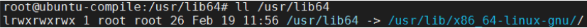
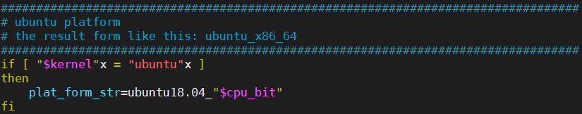
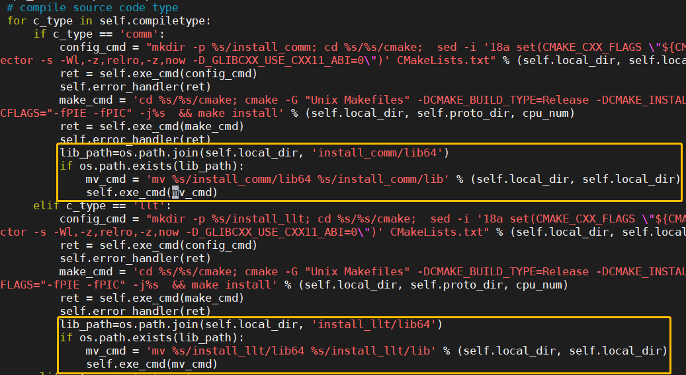
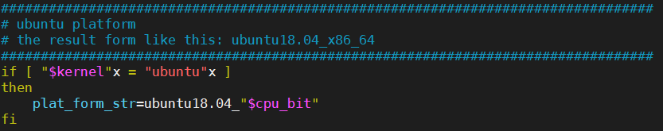
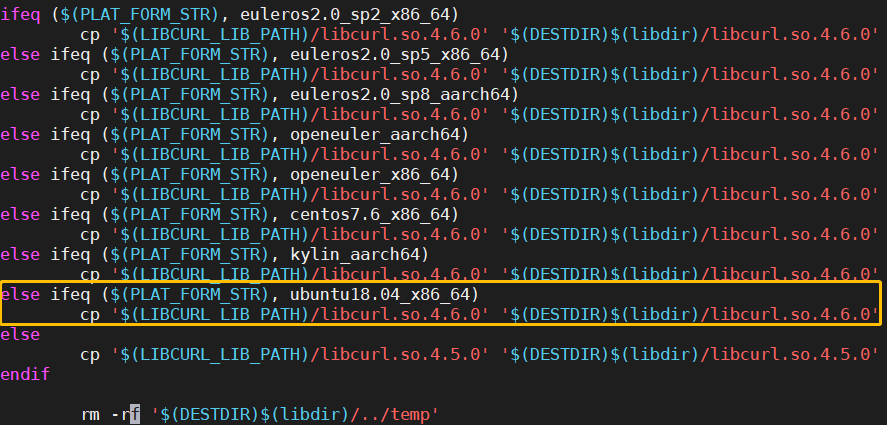
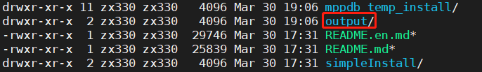
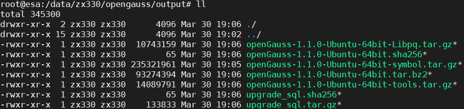

<!-- TOC -->

<!-- - [1. 环境描述](#1.环境描述)
  - [1.1.平台信息](#1.1.平台信息)
  - [1.2.编译版本](#1.2.编译版本)
  - [1.3.系统目录软链接](#1.3.系统目录软链接)
- [2. 编译三方库](#2.编译三方库)
  - [2.1.编译步骤综述](#2.1.编译步骤概述)
  - [2.2.依赖库](#2.2.依赖库)
  - [2.3.源码脚本修改](#2.3.源码脚本修改)
  - [2.4.三方库编译及结果](#2.4.三方库编译及结果)
- [3. 编译数据库](#3.编译数据库)
  - [3.1.准备 openGauss-server 源码以及代码修改](#3.1.准备openGauss-server源码以及代码修改)
  - [3.2.环境变量](#3.2.环境变量)
  - [3.3.数据库编译与打包](#3.3.数据库编译与打包)
- [4. 安装数据库](#4.安装数据库)
  - [4.1.编译安装](#4.1.编译安装)
  - [4.2.OM 安装](#4.2.OM安装)
- [5. 下载链接](#5.下载链接) -->

<!-- /TOC -->

# openGauss 数据库编译指导

openGauss 数据库的编译需要依赖许多三方库，在社区 `openGauss-third_party` 仓库中存放了主要的依赖，首先依赖特定的 gcc 版本编译完三方库后，就可使用已编译好的三方库来编译数据库。

## 1.环境描述

    针对X86平台Ubuntu系统下openGauss二进制安装包的编译作出指导，平台信息描述如下：

### 1.1.平台信息

<table>
<tbody>
    <tr>
        <td>架构</td>
        <td>x86_64 (通过uname -p命令查看)</td>
    </tr>
    <tr>
        <td>CPU</td>
        <td>Intel(R) Xeon(R) Gold 6266C CPU @ 3.00GHz (通过lscpu命令查看)</td>
    </tr>
    <tr>
        <td>硬盘</td>
        <td>40 + 100 (通过lscpu命令查)</td>
    </tr>
    <tr>
        <td>内存</td>
        <td>48G (通过lscpu命令查看)</td>
    </tr>
	<tr>
        <td>OS</td>
        <td>Ubuntu18.04.5 LTS (通过ls-release -a命令查看)</td>
    </tr>
</tbody>
</table>

### 1.2.编译版本

  <table>
<tbody>
    <tr>
        <td>openGauss-third-party</td>
        <td>社区仓库下载最新源码</td>
    </tr>
    <tr>
        <td>openGauss-server</td>
        <td>社区仓库master分支</td>
    </tr>
</tbody>
</table>

### 1.3.系统目录软链接

软链接 1：ln -s /usr/lib/x86_64-linux-gnu /usr/lib64/



软链接 2：ln -s /usr/lib64 /lib64


## 2.编译三方库

针对 `centos`和`openEuler`操作系统已经提供了编译好的二进制三方库，可直接使用社区提供的编译好的文件[openGauss-third_party_binarylibs.tar.gz](https://opengauss.obs.cn-south-1.myhuaweicloud.com/1.1.0/openGauss-third_party_binarylibs.tar.gz)。

针对 Ubuntu 操作系统，社区不提供编译好的三方库二进制文件，需用户自己编译，也可使用博客中已编译好的三方库二进制文件[openGauss-third_party_binarylibs.tar.gz](https://opengauss-beta.obs.cn-north-4.myhuaweicloud.com/binarylibs/binarylibs.tar.gz)。基于 Ubuntu 系统的三方库编译步骤如下：

### 2.1.编译步骤概述

(1) 编译 `gcc` 和 `cmake` \
(2) 下载三方库源码，修改脚本增加 Ubuntu 平台信息 \
(3) 在`openGauss-third_party/build` 下，运行 `sh build_all.sh` ，即可进行全量三方库的编译。\
 编译顺序为 `openssl` ， `buildtools` ， `platform` ， `dependency`\
(4) 编译完成后，编译结果在 `openGauss-third_party/output` 目录下。

### 2.2.依赖库

#### 2.2.1 依赖安装

<table>
<tbody>
    <tr>
        <td>依赖库</td>
        <td>Ubuntu对应安装版本</td>
    </tr>
    <tr>
        <td>libaio</td>
        <td>apt install libaio-dev</td>
    </tr>
    <tr>
        <td>ncurses</td>
        <td>apt install libncurses5-dev</td>
    </tr>
    <tr>
        <td>pam</td>
        <td>apt install libpam0g-dev</td>
    </tr>
	<tr>
        <td>libffi</td>
        <td>apt install libffi-dev</td>
    </tr>
	<tr>
        <td>libtool</td>
        <td>apt install libtool</td>
    </tr>
	<tr>
        <td>openssl</td>
        <td>apt install openssl</td>
    </tr>
	<tr>
        <td>rpm2cpio</td>
        <td>apt install rpm2cpio</td>
    </tr>
	<tr>
        <td>flex</td>
        <td>apt install flex</td>
    </tr>
	<tr>
        <td>bison</td>
        <td>apt install bison</td>
    </tr>
</tbody>
</table>

#### 2.2.2 特殊依赖

(1) gcc (推荐使用 `7.3.0` 版本)

    gcc编译请参照：[gcc编译指导](/zh/post/xingchen/gcc_compile/)

(2) cmake (cmake 推荐 `>=3.16`（如果系统中的 cmake 版本>=3.16 则直接使用系统自带 cmake 即可) \
 下载源码：`https://github.com/Kitware/CMake/releases` \
 解压源码：tar cmake-3.18.5.tar.gz \
 编译安装：../configure prefix=/usr/local/cmake318 (prefix 为安装路径) \
 make -j && make install -j \
 导入环境变量：
export CMAKE_PATH=/usr/local/cmake318
export LD_LIBRARY_PATH=$CMAKE_PATH/lib:$LD_LIBRARY_PATH
export PATH=$CMAKE_PATH/bin:$PATH

(3) python \
 安装：apt install python3 \
 `Tips`: 确保 python 命令链接的 Python 版本是 python3，通过 python --version 确定，如果不是 python3，可通过软链接修改：ln -s /usr/bin/python3.7 /usr/bin/python，修改之后再次通过 python --version 确定 python 版本

#### 2.2.3 其它依赖

(1) jemalloc 依赖 autoconf : apt install autoconf\
(2) libthrift 依赖 pkg-config : apt install pkg-config\
(3) etcd 依赖 golang : apt install golang\
(4) pljava 依赖 libkrb5-dev: apt install libkrb5-dev

### 2.3.源码脚本修改

(1) 修改 `openGauss-third_party/build/get_PlatForm_str.sh` 增加新的平台，如下图



`$kernel` 信息可以通过命令获取：

```
lsb_release -d | awk -F ' ' '{print $2}'| tr A-Z a-z
```

(2) 在以下三方依赖中, 在其 `build.py` 文件中增加 `ubuntu` 平台信息。

```
openGauss-third_party/dependency/fio/build.py
openGauss-third_party/dependency/iperf /build.py
openGauss-third_party/dependency/jemalloc/build.py
openGauss-third_party/dependency/kerberos/build.py
openGauss-third_party/dependency/libcgroup/build.py
openGauss-third_party/dependency/libedit/build.py
openGauss-third_party/dependency/nanomsg /build.py
openGauss-third_party/dependency/numactl/build.py
openGauss-third_party/dependency/openssl/build.py
openGauss-third_party/dependency/protobuf/build.py
```

在 `build.py/binary_parse` 函数中增加平台信息：

```
elif platform_str == 'ubuntu18.04_x86_64':
            binary_list.append(platform_str)
```

以下错误信息均是由于未增加平台信息引起：

```
Failed
[Error] the plat form is not supported!
[ERROR] Not supported platform type
```

(4) 在 ubuntu 系统中对三方库的特殊修改

`/openGauss-third_party/dependency/masstree/build.sh` 修改 rename 命令

    ```
    $PLATFORM = "$(bash $(pwd)/../../build/get_PlatForm_str.sh"
    If [ "$PLATFORM"x = "ubuntu18.04_x86_64"x ];then
        rename 's/\.cc/\.cpp/' $MASSTREE_MEGRED_SOURCES_DIR/*.cc
    else
        rename ".cc" ".cpp" $MASSTREE_MEGRED_SOURCES_DIR/*.cc
    fi
    ```

`/openGauss-third_party/dependency/snappy/build.sh` 修改 mv 命令

    ```
    LIB_PATH=install_comm/lib64
    if [ -d "$LIB_PATH" ];then
    mv install_comm/lib64 install_comm/lib
    fi
    ```

`/openGauss-third_party/dependency/zstd/build.sh` 修改 mv 命令

```
LIB_PATH=../../../../install_comm/lib64
if [ -d "$LIB_PATH" ];then
    mv  ../../../../install_comm/lib64/libzstd* ../../../../install_comm/lib/
fi
```

`/openGauss-third_party/dependency/parquet/build.sh` 修改 mv 命令

```
LIB_PATH=${LOCAL_DIR}/install_comm/lib64
if [ -d "$LIB_PATH" ]; then
    mv ${LOCAL_DIR}/install_comm/lib64 ${LOCAL_DIR}/install_comm/lib
fi
```

`openGauss-third_party/dependency/protobuf/build.py` 中的 build_component 函数，修改 mv_cmd 变量，如下图。



### 2.4.三方库编译及结果

(1) 进入到`openGauss-third_party/build`目录，运行 `sh build_all.sh`，全量编译三方库。
如果在编译 dependency 过程中，某一三方库编译有错误，可进入某一个三方库中单独编译，解决错误后，可以在`dependency/build/build_dependency.sh`中注释掉已经编译好的三方库，只编译还未编译成功的库，分组单独进行编译。

**_编译 dependency_**

```
cd openGauss-third_party/dependency/build/
sh build_dependency.sh
```

(2) 编译结果在 `openGauss-third_party/output` 之中。

将编译好的 `gmp mpfr mpc isl gcc` 目录拷贝到`openGauss-third_party/output/buildtools/${platform}/gcc7.3`下，output 目录即为完整的三方库二级制。将 output 目录拷贝出去，重命名为 binarylibs，便可以使用它进行数据库编译。

`Tips`: 对于学生，不建议自己编译三方库，可直接使用提供的三方库二进制包，ubuntu 三方库二进制包可在博客第 5 节中下载。

## 3.编译数据库

以下介绍如何进行 openGauss 在 ubuntu 系统上编译

### 3.1.准备 openGauss-server 源码以及代码修改

(1) 进入 `openGauss-server/src/get_PlatForm_str`，添加 ubuntu 平台信息，如下图。


`Tips`: 如果三方库要自己编译，请保持`openGauss-third_party/build/get_PlatForm_str.sh`和`openGauss-server/src/get_PlatForm_str`的平台信息一致。

(2) 进入 `openGauss-server/src/gausskernel/Makefile`，修改代码，如下图。



(3) 进入 `openGauss-server/build/script/mpp_package.sh`，添加 ubuntu 信息。

```
if [ X"$kernel" == X"centos" ]; then
    dist_version="CentOS"
elif [ X"$kernel" == X"openeuler" ]; then
    dist_version="openEuler"
elif [ X"$kernel" == X"euleros" ]; then
    dist_version="EulerOS"
elif [ X"$kernel" == X"kylin" ]; then
    dist_version="Kylin"
elif [ X"$kernel" == X"ubuntu" ]; then
    dist_version="Ubuntu"
else
    echo "We only support openEuler(aarch64), EulerOS(aarch64), CentOS, Kylin(aarch64) and Ubuntu(x86) platform."
    echo "Kernel is $kernel"
    exit 1
fi
```

(4) 进入 `openGauss-server/build/script/package_opengauss.sh`，添加 Ubuntu 信息。
同(3)添加信息一样

### 3.2.依赖库

建议使用从列出的操作系统安装盘或安装源中获取的以下依赖软件的默认安装包进行安装。如果不存在以下软件，请参考推荐的软件版本。

<table>
<tbody>
    <tr>
        <td>依赖库</td>
        <td>Ubuntu对应版本</td>
    </tr>
    <tr>
        <td>libaio</td>
        <td>0.3.110.-5ubuntu0.1</td>
    </tr>
    <tr>
        <td>ncurses</td>
        <td>apt install libncurses5-dev  版本6.1-1ubuntu1.18.04</td>
    </tr>
	<tr>
        <td>glibc</td>
        <td>2.27-3ubuntu1.3</td>
    </tr>
	<tr>
        <td>flex</td>
        <td>flex2.6.1</td>
    </tr>
	<tr>
        <td>bison</td>
        <td>bison3.5.3</td>
    </tr>
    <tr>
        <td>patch</td>
        <td>2.7.6</td>
    </tr>
    <tr>
        <td>lsb_release</td>
        <td>9.20170808ubuntu1</td>
    </tr>
    <tr>
        <td>lsb_release</td>
        <td>9.20170808ubuntu1</td>
    </tr>
    <tr>
        <td>cmake</td>
        <td>3.16以上版本</td>
    </tr>
</tbody>
</table>

查看版本方式：

```
    apt list | grep libaio-dev
    flex –version
    bison --version
    patch --version
    apt list | grep lsb
    glibc：ldd --version
```

`Tips`: flex2.6.1 和 bison3.5.3 版本对应，数据库编译才能成功

### 3.2.环境变量

将自己的 opengauss 源码包和 binarylibs 路径放入环境变量文件 gauss_env，内容如下:

导入环境变量：

```
export CODE_BASE=/usr2/compile/openGauss-server
export BINARYLIBS=/usr2/compile/binarylibs
export GAUSSHOME=$CODE_BASE/dest/
export GCC_PATH=$BINARYLIBS/buildtools/ubuntu18.04_x86_64/gcc7.3/
export CC=$GCC_PATH/gcc/bin/gcc
export CXX=$GCC_PATH/gcc/bin/g++
export LD_LIBRARY_PATH=$GAUSSHOME/lib:$GCC_PATH/gcc/lib64:$GCC_PATH/isl/lib:$GCC_PATH/mpc/lib/:$GCC_PATH/mpfr/lib/:$GCC_PATH/gmp/lib/:$LD_LIBRARY_PATH
export PATH=$GAUSSHOME/bin:$GCC_PATH/gcc/bin:$PATH
```

`Tips`: 环境变量里面一定要写 export，即使`echo $GCC_PATH`存在，也要写 export 才能真正导入路径

参数说明：
CODE_BASE 为 openGauss-server 源码目录；
BINARYLIBS 为第一步编译好的三方库二进制目录；
GAUSSHOME 为编译完成的目标文件路径；
GCC_PATH 二进制中，GCC 编译结果存放的路径，在三方库 `buildtools/ubuntu18.04_x86_64/`目录下；

### 3.3.数据库编译与打包

#### 3.3.1 手动编译

(1) 导入 3.2 节环境变量  
(2) 选择一个版本进行配置

```
debug版本：
./configure --gcc-version=7.3.0 CC=g++ CFLAGS='-O0' --prefix=$GAUSSHOME --3rd=$BINARYLIBS --enable-debug --enable-cassert --enable-thread-safety --without-zlib

release版本：

./configure --gcc-version=7.3.0 CC=g++ CFLAGS="-O2 -g3" --prefix=$GAUSSHOME --3rd=$BINARYLIBS --enable-thread-safety --with-readline --without-zlib

```

(3) `make -sj && make install –sj`

#### 3.3.2 一键编译

无需导入环境变量

```
sh build.sh -m release -3rd /usr2/compile/binarylibs
```

#### 3.3.1 二进制打包

无需导入环境变量

```
sh build.sh -m release -3rd /usr3/zxgauss/binarylibs -pkg （参数-pkg表示打包）
```

打包之后的结果在 `openGauss-server/output` 目录下，如下图：



在 `openGauss-server/output` 目录下，主要 tar 包如下图：



`Tips`: 三方库和数据库编译过程中出现的问题请参考：[编译问题解决](https://opengauss.org/zh/blogs/blogs.html?post/zhengxue/problem_solution/)

## 4.安装数据库

以下介绍如何进行 openGauss 在 ubuntu 系统上安装

### 4.1.编译安装

(1) 切换到普通用户 omm，导入 3.2 节环境变量  
(2) 选择一个版本进行配置

```
debug版本：
./configure --gcc-version=7.3.0 CC=g++ CFLAGS='-O0' --prefix=$GAUSSHOME --3rd=$BINARYLIBS --enable-debug --enable-cassert --enable-thread-safety --without-zlib

release版本：

./configure --gcc-version=7.3.0 CC=g++ CFLAGS="-O2 -g3" --prefix=$GAUSSHOME --3rd=$BINARYLIBS --enable-thread-safety --with-readline --without-zlib

```

(3) `make -sj && make install –sj`

(4) 初始化数据库

```
mkdir $data/dn1  (其中$data指数据目录)

gs_initdb $data/dn1 --nodename single_node -w "opengauss@123"
```

(5) 启动数据库

```
gaussdb -D $data/dn1 &
```

`Tips`：端口默认安装时 5432，如果启动端口占用，在$data/dn1/postgresql.conf 下文件中修改 port 参数。或者使用如下命令，指定端口启动：

```
gaussdb -D $data/dn1 & -p 12345
```

(6) 连接数据库

```
gsql -d postgres -p 12345 -r
```

### 4.2.OM 安装

(1) 下载 OM 包，放到指定目录`$ompackage`中，其中`$ompackage` 是用户自建目录，将 OM 安装包放入该目录下。OM 安装包可自己编译打包出包，或者可直接使用提供的 OM 安装包，OM 安装包可在博客第 5 节中下载。

```
mkdir -p $ompackage
tar -zvf openGauss-2.0.0-Ubuntu-64bit-all.tar.gz
chmod 755 -R $ompackage
```

(2) 准备 xml 文件，可参照官网安装文档：https://opengauss.org/zh/docs/2.0.0/docs/installation/%E5%88%9B%E5%BB%BAXML%E9%85%8D%E7%BD%AE%E6%96%87%E4%BB%B6.html

(3) 在 root 用户下进入`$ompackage/script `目录下

(4) 执行预安装

```
gs_preinstall -U omm -G omm -X clusterconfig.xml --sep-env-file=/usr/env
```

`Tips`：`"--sep-env-file"`参数是分离环境变量，目录可自定义。

(5) 切换到 omm，导入环境变量

```
su - omm
source /usr/env
```

(6) 执行安装

```
gs_install -X clusterconfig.xml
```

`Tips`：如有问题，安装细节请参照官网：https://opengauss.org/zh/docs/2.0.0/docs/installation/%E5%AE%89%E8%A3%85openGauss.html

## 5.下载链接

针对 `ubuntu18.04_x86_64` 系统，提供二进制包如下：

三方库二进制包: https://opengauss-beta.obs.cn-north-4.myhuaweicloud.com/binarylibs/binarylibs.tar.gz

OM 安装包：https://opengauss-beta.obs.cn-north-4.myhuaweicloud.com/binarylibs/openGauss-2.0.0-Ubuntu-64bit-all.tar.gz

JDBC 二进制包：https://opengauss-beta.obs.cn-north-4.myhuaweicloud.com/binarylibs/openGauss-2.0.0-JDBC.tar.gz

ODBC 二进制包：https://opengauss-beta.obs.cn-north-4.myhuaweicloud.com/binarylibs/GaussDB-Kernel-V500R001C20-UBUNTU-64bit-Odbc.tar.gz

**_Notice:提供的基于 ubuntu 系统的二进制文件包仅供于学习和使用，不推荐直接用于生产环境_**
