<!-- TOC -->

<!-- - [1. 编译三方库的问题解决](#1.编译三方库的问题解决)
- [2. 编译数据库的问题解决](#2.编译数据库的问题解决) -->

<!-- /TOC -->

# 1.编译三方库的问题解决

(1) python 没有找到
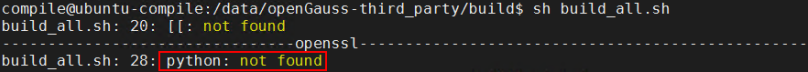
原因：输入命令`python`，发现是 python2 版本，需要 python3

解决：

```
rm -rf /usr/bin/python
ln -s /usr/bin/python3 /usr/bin/python
```

(2) 编译 libcgroup
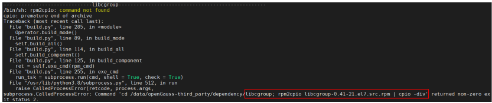
原因分析：去/data/openGauss-third_party/dependency/libcgroup 下执行该命令，提示信息：

```
Command 'rpm2cpip' not found, but can be installed with:
apt install rpm2cpio
```

解决：apt install rpm2cpio

(3) 编译 cJson

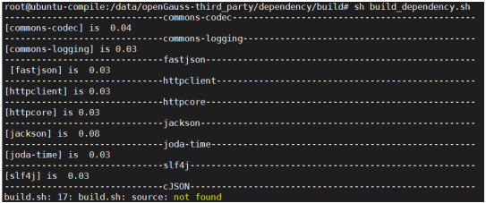

原因分析：source 没有找到，可能是因为 bash 的问题，用命令 ls -l `which sh` 查看发现是 dash，不是 bash，如下图：

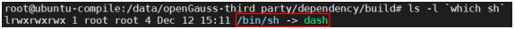

解决：sudo dpkg-reconfigure dash 重新配置 dash，选择 no 则是 bash

(4) 编译 cffi

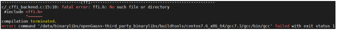

解决：安装 apt install libffi-dev，apt install libssl-dev，如果安装之后还报错误，换一个窗口执行

(5) 编译 masstree

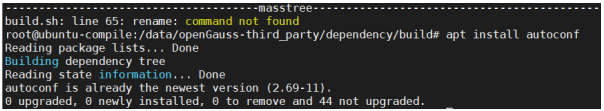

解决：apt install rename

(6) 编译 libthrift

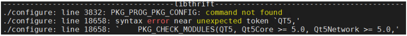

解决：apt install pkg-config

(7) 编译 libthrift

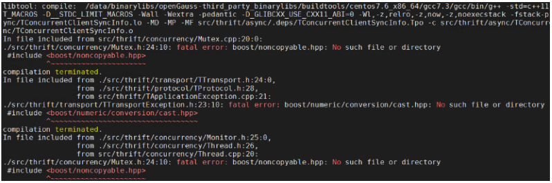

原因分析：依赖的问题，boost 要在 libthrift 之前编译，libthrift 编译依赖 boost

解决： 编译 libthrift 之前确保 boost、openSSL 已编译完成。

(8) 编译 parquet

出现关于 boost、zlib 包的问题

解决：parquet 依赖 boost、zlib，编译 arquet 之前确保 boost、zlib 已编译完成

(9) 编译 parquet

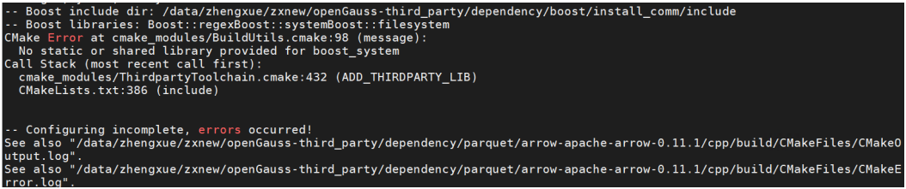

原因分析： 查看 log，发现 cmake 问题

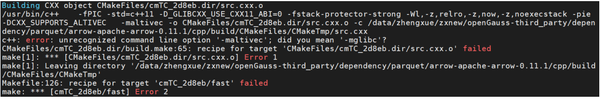

解决： 安装 cmake3.16 版本以上，并导入环境变量

(10) 编译 libxml2

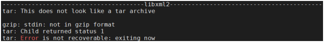

原因分析：用 file 命令（辨识文件类型：file 文件名），执行 `file libxml2-2.9.9.tar.gz`，如下图，发现包类型不对，包与社区源码的大小不一样，是因为包没有下载好。

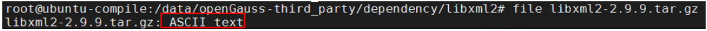

解决：用 root 用户重新 git clone，如果还是包大小不对，则去 gitee 仓库页面下载。

(11) 编译 pljava

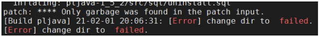

原因分析：同(10)一样

解决：root 用户重新 git clone，如果还是包大小不对，则去 gitee 仓库页面下载。

(12) 编译 pljava

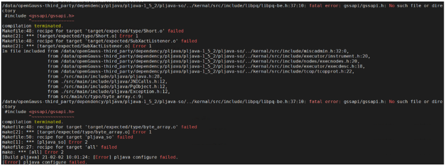

解决： apt install libkrb5-dev

(13)

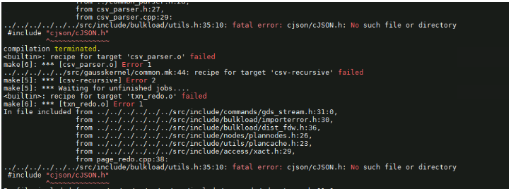

解决： apt install libjsoncpp-dev

(14)

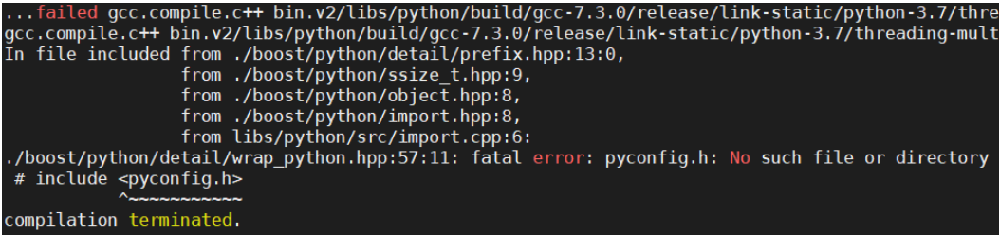

原因分析： 原因 1：查看是不是 python3
原因 2：查看：boost_1_72_0/tools/build/src/tools/python.jam，如下图：
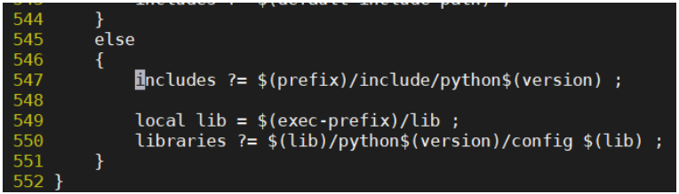

解决： 修改为 includes ?= $(prefix)/include/python$(version)m

# 2.编译数据库的问题解决

(1)

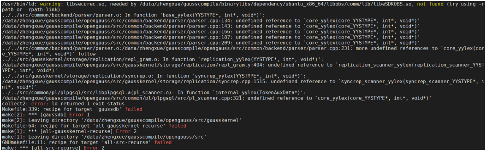

原因： felx 和 bison 版本不一致引起

解决： 需安装 flex 和 bison 对应版本，安装 flex2.6.1 和 bison3.5.3，并导入环境变量。
此错误一旦出现，安装 flex 和 bison 之后，make distclean 无法清除所有残留文件，再次编译会同样报错，建议重新下载源码编译。

(2)

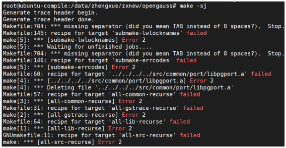

去掉 s，重新 make，可以看到详细信息

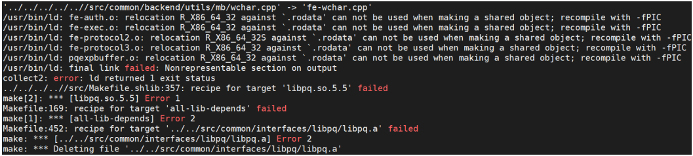

解决：安装 apt install libstdc++-8-dev，一定要 make clean 之后再重新编译

(3)

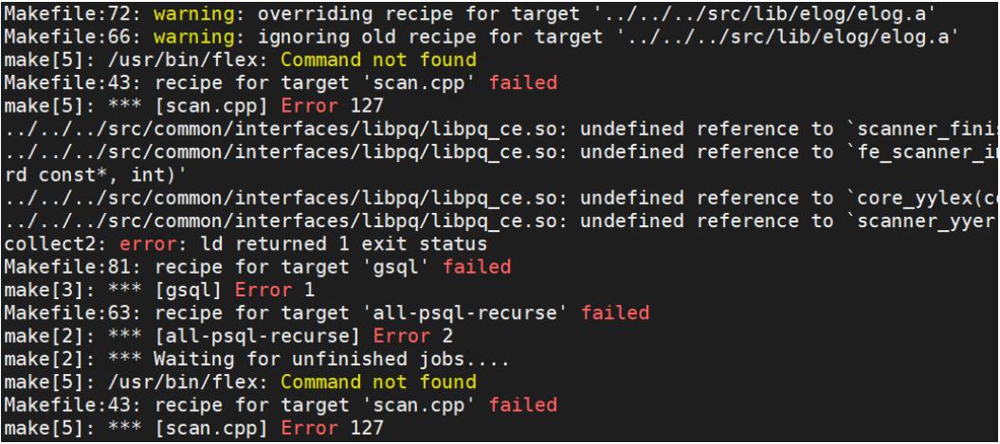

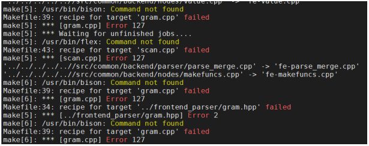

原因分析：编译中需要 usr/bin/flex
解决: apt install flex apt install bison

(4)

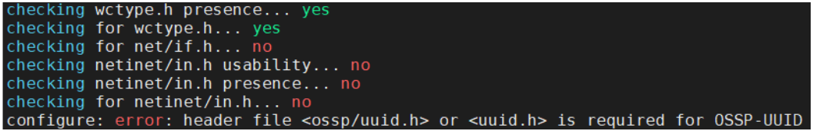

原因分析： 查看 config.log，如下图：

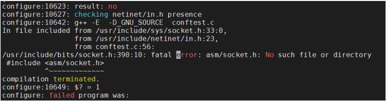

解决：

```
cd /usr/include
ln -s x86_64-linux-gnu/asm asm
```

(5)

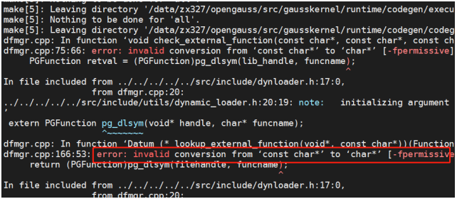

解决：apt install libedit-dev
