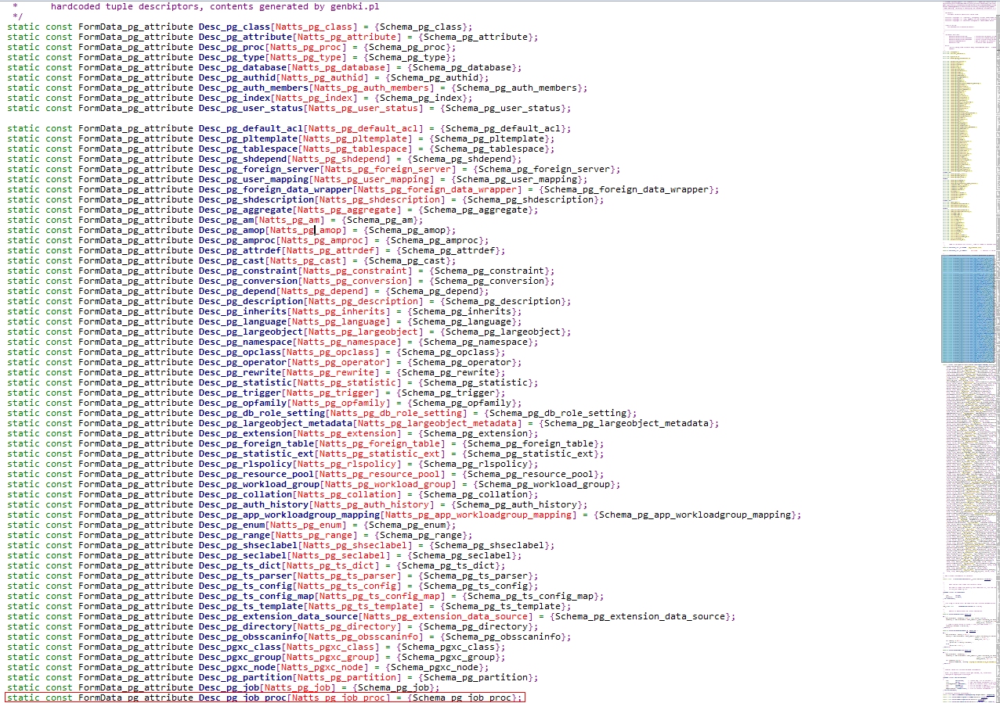
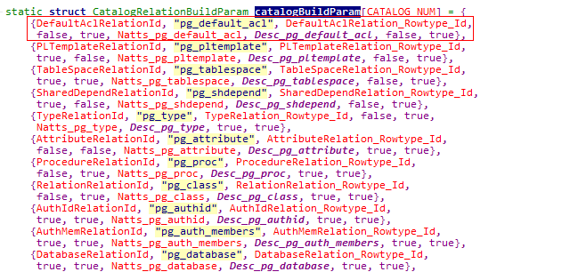
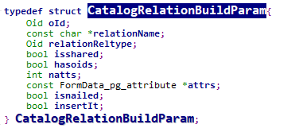
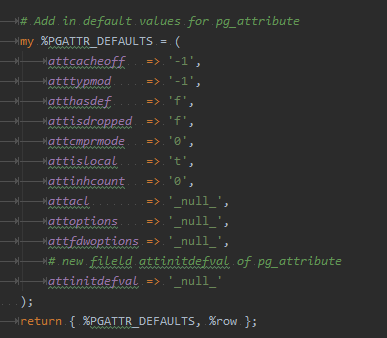
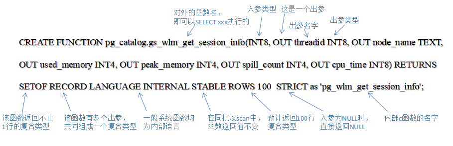

<!-- [TOC] -->

## 1. 概述

**重要提示**:

升级过程通过执行升级 sql 脚本实现系统表变更，这些脚本必须由开发人员在修改系统表的同时一并提供升级 sql 脚本，请将这些脚本代码提交至 openGauss-server/src/include/catalog/upgrade_sql 目录下，该目录结构如下所示。

### 1.1.升级目录介绍

```
src/include/catalog/upgrade_sql/
├── upgrade_catalog_maindb/                  -- 1.存放在首个数据库上执行的系统表变更sql文件（一般指postgres数据库）
	│├── upgrade_catalog_maindb_92_308.sql        -- 前置脚本
	│├── upgrade-post_catalog_maindb_92_308.sql   -- 后置脚本
├── upgrade_catalog_otherdb/                 -- 2.存放其它数据库系统上执行的系统表变更sql文件（一般指除postgres数据库之外的数据库）
	│├── upgrade_catalog_otherdb_92_308.sql       -- 前置脚本
	│├── upgrade-post_catalog_otherdb_92_308.sql  -- 后置脚本
├── rollback_catalog_maindb/                 -- 3.存放在首个数据库上执行的系统表变更失败回退所用sql文件
	│├── rollback_catalog_maindb_92_308.sql
	│├── rollback-post_catalog_maindb_92_308.sql
├── rollback_catalog_otherdb/                -- 4.存放其它数据库系统上执行的系统表变更失败回退所用sql文件
	│├── rollback_catalog_otherdb_92_308.sql
	│├── rollback-post_catalog_otherdb_92_308.sql
├── check_upgrade/                           -- 5.存放系统表变更完成之后校验变更是否成功的sql文件
	│├── check_upgrade_67_014.sql


```

<**问题集合**>

- 目录中的 5 类脚本分别是什么？

​ 第 1、第 2 类脚本是系统表变更脚本，第 3、第 4 类脚本是系统表变更的回退脚本，第 5 类是系统表变更的检查脚本，检查脚本由开发根据需要提交。

​ **切记切记切记！！！** 前 4 类必须要有

- 前置脚本和后置脚本的区别？

​ 执行对象不同，前置脚本在旧版本数据库上执行，后置脚本在新版本上执行

- 变更和回退脚本都各有两类，一类是 maindb，一类是 otherdb？

​ 是因为当要创建共享系统表或共享对象时，我们只需要在对第一个库执行变更脚本的过程中创建物理表文件或共享对象即可。我们通过 GUC 参数控制是否创建共享系统表的物理文件；我们只在第一个库的系统表变更脚本中添加共享对象的创建语句。因此，对于第一个库（maindb）和剩余的库（otherdb），系统表变更脚本会略有不同。除此以外，没有其它差别。对于回退脚本，亦是如此。

### 1.2.升级脚本文件命名规则

- 类型前缀为 upgrade_catalog_maindb、upgrade_catalog_oterdb、rollback_catalog_maindb、rollback_catalog_otherdb、check_upgrade、upgrade-post_catalog_maindb、upgrade-post_catalog_oterdb、rollback-post_catalog_maindb、rollback-post_catalog_otherdb 之一

- 脚本类型后缀是(文件 version.cfg 内核版本号的整数位)\_(文件 version.cfg 内核版本号的小数位).sql

  ```
  例如：文件version.cfg内容
       2.0.0                  --写入发布版本号
       92.298                 --内核版本号
       68362709               --最后一次提交号
  ```

  ```
  脚本命名：upgrade_catalog_maindb_92_298.sql
  ```

<**问题集合**>

- 想一想文件 version.cfg 从何而来？

  很神奇的是从内核源码打包生成 verion.cfg 文件。version.cfg 为开发合入本次代码之后的产品版本号，存在 build/script/package_internal.sh 的 read_mpp_version()函数中。

  < **不容易看到的额外扩展哦！！！**>：打包主要过程为 build.sh ---> package_internal.sh ---> read_mpp_version[写入发布版本号 2.0.0] ---> read_mpp_number[写入内核版本号 92.298]

- 什么时候 version.cfg 的内核版本号会修改？

​ 如果开发本次合入的代码不涉及系统表修改，那么不用修改内核版本号，继而打包的时候 version.cfg 文件中的内核版本号也不会改变；
​ 如果开发本次合入的代码修改了系统表，并且遵循升级约束，那么需要修改内核版本号(在内核源码中对内核版本号数值增加 0.001)，继而打包的时候 version.cfg 的数值会被修改，同时，请提交上述至少 4 类的系统表变更和回退脚本，打包的时候会以新的 version.cfg 来进行命名。

​ < **思维很混乱，需要急救，那开发到底需要做些什么呢！！！**>：如果开发本次合入的代码不涉及系统表修改，那么开发会很窃喜，因为什么都不用做@开发者。如果开发本次合入的代码修改了系统表，开发者可得长点心了，天降大任于你，必先使其暴跳如雷。此时是需要适配升级的，主要要做三件事，第 1，修改内核版本号，第 2，添加升级脚本，第 3，验证升级。

​ 预知更多，突破自己，请看下节分享-----------内核版本号

---

## 2.升级版本控制

### 2.1.内核版本号

在 openGauss-server/src/backend/utils/init/globals.cpp 中，定义常量 GRAND_VERSION_NUM 的定义值，该版本号标示内核代码实际对应的版本，该版本号为 uint32 型。

**￥-￥- 敲黑板，划重点啦@新秀开发者 -￥-￥**

首先，gaussdb 进程运行中，有一个全局变量 WorkingGrandVersionNum，用于标志 gaussdb 进程实际应该遵循的版本行为。

在正常情况下， WorkingGrandVersionNum 等于 GRAND_VERSION_NUM，

在升级过程中， WorkingGrandVersionNum 等于老版本的版本号（此时，应小于或等于新版本的 GRAND_VERSION_NUM ）。对于每一个后台线程，在启动时会将当时的 WorkingGrandVersionNum 赋值给 t_thrd.proc->workingVersionNum，表示数据库当前运行版本是什么。

<**后期通过内核代码详解版本号，这里会有新发现，敬请关注 shirley_zhengx**>

### 2.2 内核版本号前向兼容

内核版本号用于内核前向兼容时使用。主要使用的方法和场景如下：
1、**给系统表新增列**：假设包版本 2.0.0(内核版本号 29.298)，在 2.0.1 版本中（内核版本号 29.299）在系统表 pg_authid 后新增 1 列 parentid，通过 heap_open 和 heap_getattr 函数读取新增的列，如下 GetUserDataFromCatalog 函数中：

```c
/* Before GrandVersionNum 29298, pg_authid does not have following columns */
if (t_thrd.proc->workingVersionNum >= 29298) {
    Datum authidparentidDatum = heap_getattr(tup, Anum_pg_authid_rolparentid), pg_authid_des, &isNull);
}
```

2、**新增系统表**：通过内核版本号来避免在老版本模式下对新增系统的访问。例如新版本开发的定时任务功能中新增 pg_job 系统表，在老版本模式下，我们需要通过禁止定时任务特性的开启，以避免对新增系统表的访问。

```c
/* Before GrandVersionNum 29298, we do not support scheduled job */
if (IS_PGXC_COORDINATOR && PgJobSchdPID == 0 && pmState == PM_RUN && (job_queue_processes||start_job_scheduler) && t_thrd.proc->workingVersionNum >= 29298) {
    PgJobSchdPID = StartJobScheduler();
    if (PgjobSchdPID != 0) {
        start_job_scheduler = false;
        elog(LOG, "job scheduler started, pid=%lu", PgJobSchdPID)
    }
```

- [ ] **武林秘笈之内核版本号**：内核版本号保证新增系统表修改的前向兼容性

## 3.系统表变更--升级脚本撰写

### 3.1.GUC 参数说明

撰写系统表变更脚本时，会使用到一个 GUC 参数 inplace_upgrade_next_system_object_oids，用于对新增的系统对象指定 oid 。该 GUC 参数为 string 类型，根据不同的对象类型，该 GUC 参数具有不同的字段数量，各字段间以逗号隔开。具体用法如下：

1、系统表 table

| 对象类型 |        |   字段 1    | 字段 2             | 字段 3       | 字段 4         | 字段 5                    | 字段 6                            | 字段 7    |
| -------- | ------ | :---------: | ------------------ | ------------ | -------------- | ------------------------- | --------------------------------- | --------- |
| 系统表   | 取值   | IUO_CATALOG | true / false       | true / false | 0 - 16384      | 0 - 16384                 | 0 - 16384                         | 0 - 16384 |
| 涵义     | 表对象 | 是否共享表  | 是否创建物理表文件 | 表的 oid     | 复合类型的 oid | TOAST 表的 oid 若无则为 0 | TOAST 表索引表的 oid； 若无则为 0 |           |

**【共享表】**：系统表存在共享表之分，粗暴地理解就是：对于一个系统表 pg_table1(假设的系统表，实际上没有)，不同数据库(maindb,otherdb)都是共用这个系统表说明这个系统表是共享表，不同数据库有自己的这个系统表(maindb 有一个自己的 pg_table1，otherdb 有一个自己的 pg_table1)

2、索引表

| 对象类型 |      |   字段 1    | 字段 2       | 字段 3             | 字段 4 | 字段 5           | 字段 6            | 字段 7     |
| -------- | ---- | :---------: | ------------ | ------------------ | ------ | ---------------- | ----------------- | ---------- |
| 索引表   | 取值 | IUO_CATALOG | true / false | true / false       | 0      | 0                | 0                 | 0 - 16384  |
|          | 涵义 |   表对象    | 是否共享表   | 是否创建物理表文件 | 非主表 | 索引表无复合类型 | 索引表无 TOAST 表 | 索引表 oid |

3、函数 function

| 对象类型 |      |  字段 1  | 字段 2    | 字段 3 | 字段 4 | 字段 5 | 字段 6 | 字段 7 |
| -------- | ---- | :------: | --------- | ------ | ------ | ------ | ------ | ------ |
| 函数     | 取值 | IUO_PROC | 0 - 16384 |        |        |        |        |        |
|          | 涵义 | 函数对象 | 函数 oid  |        |        |        |        |        |

4、类型 type
| 对象类型 | | 字段 1 | 字段 2 | 字段 3 | 字段 4 | 字段 5 | 字段 6 | 字段 7 |
| -------- | ---- | :------: | --------- | ---------------------- | ------------------ | ----- | ----- | ----- |
| 类型 | 取值 | IUO_TYPE | 0 - 16384 | 0 - 16384 | b / p | | | |
| | 涵义 | 类型对象 | 类型 oid | 数组类型 oid；若无则为 0 | b:基础类型 p:伪类型 | | | |

5、其它通用类型

| 对象类型     |      |   字段 1    | 字段 2    | 字段 3 | 字段 4 | 字段 5 | 字段 6 | 字段 7 |
| ------------ | ---- | :---------: | --------- | ------ | ------ | ------ | ------ | ------ |
| 其它通用对象 | 取值 | IUO_GENERAL | 0 - 16384 |        |        |        |        |        |
|              | 涵义 |  一般对象   | 对象 oid  |        |        |        |        |        |

**温馨提示**:目前只显示支持表、函数和类型的显示 oid 指定，这三类对象也是开发人员最经常修改的；
另外，通用对象的 oid 指定是为了那些没有 DDL 语句支持的系统对象指定 oid，目前主要包括 pg_am，pg_amop，pg_amproc，pg_pltemplate 这几个表

### 3.2.系统表变更撰写顺序

**正向脚本**：

新增系统表 写在前置非 post 脚本中
新增函数 写在后置 post 脚本中
新增视图 写在后置 post 脚本中

其它新增系统对象请按依赖关系添加至系统表变更脚本中

**回滚脚本**：
删除视图 写在后置 post 脚本中
删除函数 写在后置 post 脚本中
删除系统表 写在前置非 post 脚本中

其它新增系统对象请按依赖关系（一般逆着正向脚本的顺序）添加至系统表回滚脚本中

### 3.3. 新增系统表

（以共享的系统表 pg_job 和索引表 pg_job_oid_index 为例）

- (1) 正向脚本：(对应 upgrade_catalog_maindb_xxx_xxx.sql 和 upgrade_catalog_otherdb_xxx_xxx.sql，两者内容几乎一样，只是 GUC 参数略有差异)

```
--第一步：设置GUC参数，指定oid和其它一些信息
SET LOCAL inplace_upgrade_next_system_object_oids = IUO_CATALOG, true, true, 9022, 3796, 0, 0;

--第二步：建表DDL语句
CREATE TABLE pg_catalog.pg_job
(
    job_id INT8 NOCOMPRESS NOT NULL,
    ……,
    --以上为定长列，以下为变长列
    interval TEXT NOCOMPRESS,
    ……
)  WITH OIDS TABLESPACE pg_global;

--第三步：设置GUC参数，指定索引表的oid和其它一些信息
SET LOCAL inplace_upgrade_next_system_object_oids = IUO_CATALOG, true, true, 0, 0, 0, 3453;

--第四步：建索引DDL语句
CREATE UNIQUE INDEX pg_job_oid_index ON pg_catalog.pg_job USING BTREE(oid OID_OPS);

--第五步：恢复GUC的默认参数
SET LOCAL inplace_upgrade_next_system_object_oids = IUO_CATALOG, false, true, 0, 0, 0, 0;

```

**温馨提示**： 1.如果一次增加了多张系统表，只需在最后恢复 GUC 的默认参数即可（但需要在新增视图之前）。

2.宏 CATALOG_NUM 数量加 1

3.由于系统表进行了硬编码的处理，所以新增系统表头文件中需要加入 BKI_SCHEMA_MACRO

4.在 relcache.cpp 文件开头加上新增系统表的 FormData_pg_attribute 数组，如下图所示，Schema_pg_job 为编译生成在 schemapg.h 中的数组，数组中存的是这张系统表在 pg_attribute 中的记录



5.在 relcache.cpp 文件 catalogBuildParam 数组中加入新增系统表的信息（按照其他系统表格式来加即可），按照 oid 升序的方式有序加入，如下图所示，各项意义如下图所示：





- (2) 回退脚本：（对应 rollback_catalog_maindb_xxx_xxx.sql 和 rollback_catalog_otherdb_xxx_xxx.sql，两者内容相同）

```
--第一步：删除索引表
DROP INDEX IF EXISTS pg_catalog.pg_job_oid_index;

--第二步：删除复合类型
DROP TYPE IF EXISTS pg_catalog.pg_job;

--第三步：删除主表
DROP TABLE IF EXISTS pg_catalog.pg_job;

```

**重点----回滚顺序**：若新增的是系统表附带 TOAST 表，那么回滚脚本中首先需要删除 TOAST 表的索引表、类型和 TOAST 表本身；然后再删除主表上的索引表、复合类型和主表本身

### 3.4.系统表追加列

由于系统表做了硬编码的处理，以后对系统表追加列无需再写升级和回滚脚本。

**特殊处理**：对于 pg_attribute 系统表追加列需要在 src/common/backend/catalog/genbki.pl 文件中对新增列的默认值进行赋值，如下图所示：



### 3.5.新增系统函数（以 gs_wlm_get_session_info 为例）

- (1) 正向脚本：(对应 upgrade_catalog_maindb_xxx_xxx.sql 和 upgrade_catalog_otherdb_xxx_xxx.sql，两者内容完全相同)



- (2) 回退脚本：（对应 rollback_catalog_maindb_xxx_xxx.sql 和 rollback_catalog_otherdb_xxx_xxx.sql，两者内容相同）

```
--第一步：删除函数
DROP FUNCTION IF EXISTS pg_catalog.gs_wlm_get_session_info(int8);
```

### 3.6.修改系统函数

一般，我们只建议修改函数的内部实现或出参名称，其它属性不建议修改，在这种情况下，只需要使用 CREATE OR REPLACE FUNCTION 语句就可以实现修改，写法与新增系统函数一样，只是增加了 OR REPLACE 关键字，并且可以不需要设置 GUC 参数；

如果确有需要更改其它属性，需要通过先删除、后新增的方式来创建。删除的时候，请带上 CASCADE 关键字

### 3.7 新增或修改系统视图

（1）新增系统视图

新增系统视图的 DDL 语句和 system_views.sql 中的完全一致
回退脚本使用 DROP VIEW IF EXISTS 语句即可

修改系统视图使用 CREATE OR REPLACE VIEW 语句，只能支持在原有系统视图最后增加列的修改方式；此时，回退脚本也使用 CREATE OR REPLACE VIEW 语句

若需要实现其它修改方式，只能先删除原视图，再重新创建。删除的时候，请带上 CASCADE 关键字

（2） 修改系统视图

### 3.8 新增系统类型

（以 event_trigger 为例）

- (1) 正向脚本：(对应 upgrade_catalog_maindb_xxx_xxx.sql 和 upgrade_catalog_otherdb_xxx_xxx.sql，两者内容完全相同)

```
--第一步：设置GUC参数，指定oid
SET LOCAL inplace_upgrade_next_system_object_oids = IUO_TYPE, 3838, 0, p;

--第二步：创建shell类型
CREATE TYPE pg_catalog.event_trigger;

-- 第三步：创建event_trigger类型的input和output函数
SET LOCAL inplace_upgrade_next_system_object_oids = IUO_PROC, 3594;
CREATE FUNCTION pg_catalog.event_trigger_in(cstring) RETURNS pg_catalog.event_trigger LANGUAGE INTERNAL IMMUATABLE AS 'event_trigger_in';
SET LOCAL inplace_upgrade_next_system_object_oids = IUO_PROC, 3595;
CREATE FUNCTION pg_catalog.event_trigger_out(pg_catalog.event_trigger) RETURNS CSTRING LANGUAGE INTERNAL IMMUTABLE STRICT AS 'event_trigger_out';

-- 第四步：再次创建该类型，完善所有信息
CREATE TYPE pg_catalog.event_trigger (input=event_trigger_in,output=event_trigger_out,internallength=4,passedbyvalue,CATEGORY=p);

```

- (2) 回退脚本：（对应 rollback_catalog_maindb_xxx_xxx.sql 和 rollback_catalog_otherdb_xxx_xxx.sql，两者内容相同）

```
--第一步：删除输入输出函数
DROP FUNCTION IF EXISTS pg_catalog.event_trigger_in(cstring);
DROP FUNCTION IF EXISTS pg_catalog.event_trigger_out(pg_catalog.event_trigger);

--第二步：删除类型
DROP FUNCTION IF EXISTS pg_catalog.event_trigger;

```

### 3.9.新增通用对象（无 DDL 语句支持的对象，以 pg_am 中新增一行记录为例）

- (1) 正向脚本：(对应 upgrade_catalog_maindb_xxx_xxx.sql 和 upgrade_catalog_otherdb_xxx_xxx.sql，pg_am 不是共享表，因此两者内容完全相同)

```
--第一步：创建插入记录的临时函数
CREATE OR REPLACE FUNCTION Insert_pg_am_temp()
RETURNS void
AS $$
DECLARE
row_name record;
query_str text;
query_str_nodes text;
BEGIN
query_str_nodes := 'SELECT node_name,node_host,node_port FROM pgxc_node';
FOR row_name IN EXECUTE(query_str_nodes) LOOP
query_str := 'EXECUTE DIRECT ON (' || row_name.node_name || ') ''insert into pg_am values ('''‘fake_btree'''',5,2,true,false,true,true,true,true,true,true,false,true,true,0,331,''''btbeginscan'''',''''btgettuple'''',''''btgetbitmap'''',''''btrescan'''',''''btendscan'''',''''btmarkpos'''',''''btrestrpos'''',''''btmerge'''',''''btbuild'''',''''btbuildempty'''',''''btbulkdelete'''',''''btvacuumcleanup'''',''''btcanreturn'''',''''btcostestimate'''',''''btoptions'''')''';
EXECUTE(query_str);
END LOOP;
return;
END; $$
LANGUAGE 'plpgsql';

--第二步：设置GUC参数，指定oid
SET LOCAL inplace_upgrade_next_system_object_oids = IUO_GENERAL, 5033;

-- 第三步：执行插入函数
SELECT Insert_pg_am_temp();

-- 第四步：删除临时函数
DROP FUNCTION Insert_pg_am_temp();

```

**@~@ 一些注意事项 @~@ **

```
1、所有对象的删除，请根据前述要求适当添加IF EXISTS关键字和CASCADE关键字；

2、如果某次代码提交涉及多个对象的新增和修改，请按照依赖关系排序；在回滚脚本中，需要逆序删除

3、包版本号和内核版本号，以及前向兼容性，请务必要注意

4、本地和门禁的fastcheck中，均已经集成就地升级
```
