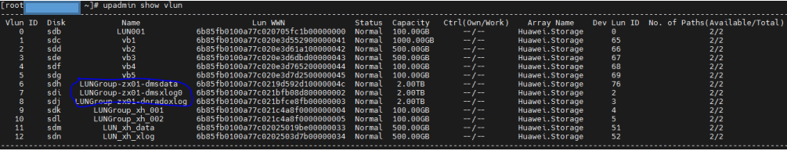
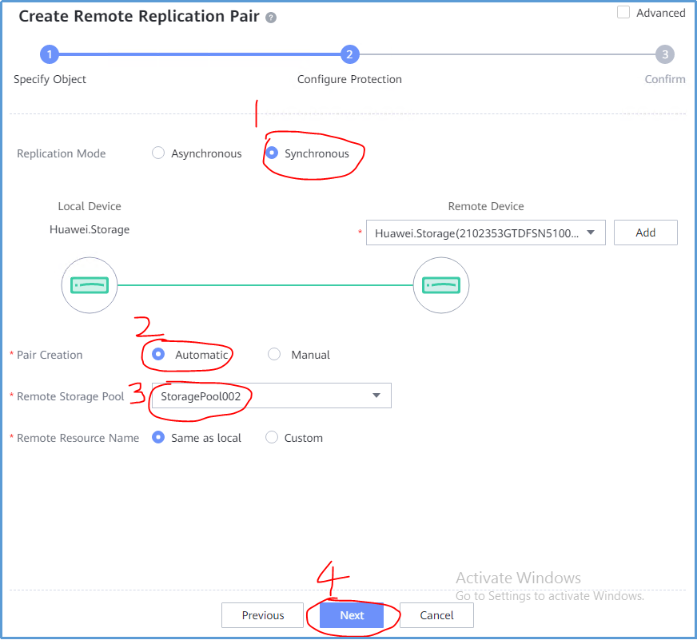
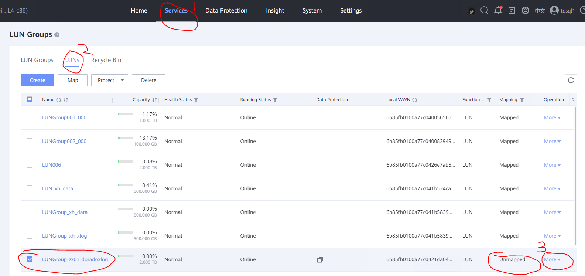
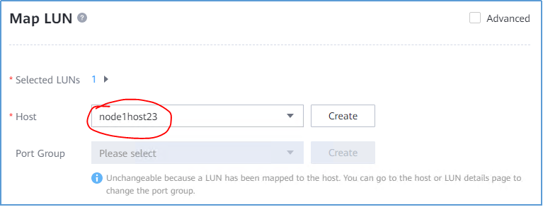
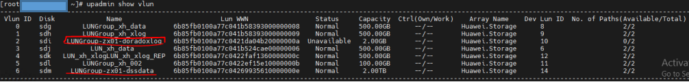

<!-- TOC -->
- [1. 环境描述](#1.环境描述)
  - [1.1.组网方式](#1.1.组网方式)
  - [1.2.环境配置](#1.2.环境配置)
- [2. 环境搭建](#2.环境搭建)
  - [2.1.创建lun](#2.1.创建lun)
  - [2.2.下载源码编译](#2.2.下载源码编译)
  - [2.3.环境变量](#2.3.环境变量) 
  - [2.4.dss配置-dd模拟](#2.4.dss配置-dd模拟)
  - [2.5.数据库部署](#2.5.数据库部署)
- [3. 主备集群功能验证](#3.主备集群功能验证)
  - [3.1.集群状态查询](#3.1.集群状态查询)
  - [3.2.主集群一写多读](#3.2.主集群一写多读)
  - [3.2.备集群只读](#3.2.备集群只读)

<!-- /TOC -->


# 资源池化支持同城dorado双集群部署(一)----dd模拟

资源池化支持同城dorado双集群部署方式：
(一) dd模拟(手动部署 + 无cm)
(二) cm模拟(手动部署dd模拟 + 有cm)
(三) 磁阵搭建(手动部署)
(四) 集群管理工具部署(om + cm)
          

## 1.环境描述

    针对dd模拟(手动部署+无cm)作出指导，环境描述如下：

### &nbsp;&nbsp;1.1.组网方式

<table>
<tbody>
    <tr>
        <td rowspan='2'>生产中心</td>
        <td rowspan='2'>主端</td>
        <td>业务计算节点0</td>
        <td rowspan='2'>主存储节点</td>
        <td rowspan='2'>Dorado</td>
    </tr>
        <td>业务计算节点1</td>
    <tr>
        <td rowspan='2'>容灾中心</td>
        <td rowspan='2'>备端</td>
        <td>业务计算节点0</td>
        <td rowspan='2'>备存储节点</td>
        <td rowspan='2'>Dorado</td>
    </tr>
        <td>业务计算节点1</td>
</tbody>
</table>

&emsp;**缺个图，后面补充哈！！！**

### &nbsp;&nbsp;1.2.环境配置

&emsp;支持存储远程复制

## 2. 环境搭建

针对资源池化双集群部署之《资源池化 dd 模拟搭建(手动部署) + dorado 同步复制》作出指导，无 cm 部署，环境搭建如下：

### &nbsp;&nbsp;2.1.创建 lun

(1) 主存储创建 lun 组和 lun
&emsp;主存储管控平台(DeviceManager)登录：https://主存储 ip:8088
&emsp;在管控平台上创建 lun 组和 lun，并映射到主机之后，在业务节点上查看挂好的 lun

(2) 主存储对应的业务计算节点上查看挂好的 lun

```
rescan-scsi-bus.sh       upadmin show vlun         lsscsi -is
```



lun 说明： LUNGroup-zx01-doradoxlog 指 dorado 同步复制需要的 lun(可以理解为共享盘，盘符/dev/sdj)，暂不关注 LUNGroup-zx01-dmsdata 和 LUNGroup-zx01-dmsxlog0，这两个是用于磁阵搭建资源池化集群

修改盘符属组

```
chown zx:zx /dev/sgj
```

(3) 创建同步复制对
&emsp; 在主存储管控平台(DeviceManager)登录：https://主存储 ip:8088
&emsp; data protection -> luns -> remote replication pairs(远程复制对) -> create ->选择主存储需要同步复制给备存储的 lun -> next
&emsp; 请原谅这里截图工具的搓，标记笔太难用了，画的蓝圈圈很丑但很个性！


选择同步 -> Automatic -> 备存储的存储池名称 -> next


(4) 备存储创建 lun 组和 lun
&emsp;备存储管控平台(DeviceManager)登录：https://备存储 ip:8088
&emsp;在管控平台上创建 lun 组，并映射到主机

由于第(3)步创建了远程复制对，会自动在备存储上创建同步复制对应的 lun，名字和主存储一致(即备存储上会有一样的 lun 名字为 LUNGroup-zx01-doradoxlog)，在备存储管控平台上查看如下图


(5) 备存储上的 lun 进行映射
方式 1：直接映射到业务计算节点上，不需要提前创建 lun 组，如果存在多个业务接待你需要映射到每一个业务节点上
选择 more -> Map -> node2host01 -> ok 将 dorado 同步复制功能需要的 lun 映射到备集群业务节点上


&emsp;@温馨提示@：node2host01 指为业务节点 ip 创建的机器名称，名字可自行定义

&emsp;方式 2：在 lun 组中添加该 lun，要提前创建 lun 组，直接会映射到 lun 组中的所有业务节点上

(6) 备存储对应的业务计算节点上查看挂好的 lun

```
rescan-scsi-bus.sh       upadmin show vlun         lsscsi -is
```



&emsp;lun 说明： LUNGroup-zx01-doradoxlog 指 dorado 同步复制需要的 lun(可以理解为共享盘，盘符/dev/sdi)

修改盘符属组

```
chown zx:zx /dev/sgi
```

### &nbsp;&nbsp;2.2.下载源码编译

&emsp;如果用已打包好的 openGauss-server 包则跳过该步骤，进行 2.3，如果修改代码开发中，则进行代码更新并编译，如下步骤：

(1) 下载三方库
&emsp;根据平台操作系统下载对应三方库，三方库下载地址：https://gitee.com/opengauss/openGauss-server 主页上 README.md 中查找需要的三方库 binarylibs

    获取master分支openEuler_x86系统对应的三方库

```
wget https://opengauss.obs.cn-south-1.myhuaweicloud.com/latest/binarylibs/openGauss-third_party_binarylibs_openEuler_x86_64.tar.gz
```

(2) 下载 cbb 并编译

```
git clone https://gitee.com/opengauss/CBB.git -b master cbb
cd CBB/build/linux/opengauss
sh build.sh -3rd $binarylibsDir -m Debug
```

&emsp;编译成功会自动将二进制放入三方库 openGauss-third_party_binarylibs_openEuler_x86_64/kernel/component 目录下
(3) 下载 dss 并编译

```
git clone https://gitee.com/opengauss/DSS.git -b master dss
cd CBB/build/linux/opengaussDSS
sh build.sh -3rd $binarylibsDir -m Debug
```

(4) 下载 dms 并编译

```
git clone https://gitee.com/opengauss/DMS.git -b master dms
cd CBB/build/linux/opengauss
sh build.sh -3rd $binarylibsDir -m Debug
```

(5) 下载 openGauss-server 并编译
&emsp;编译过程需要 cbb、dss、dms 的二进制，会从 openGauss-third_party_binarylibs_openEuler_x86_64/kernel/component 中获取

```
git clone https://gitee.com/opengauss/openGauss-server.git -b master openGauss-server
sh build.sh -3rd $binarylibsDir -m Debug
```

&emsp;编译完之后的二进制存放在 openGauss-server/mppdb_temp_install/目录下

### &nbsp;&nbsp;2.3.环境变量

由于机器资源不足，这里以一个业务计算服务器上部署一主一备为例
(1) 主集群主节点对应的 ss_env0

环境变量

```
export HOME=/opt/omm
export GAUSSHOME=${HOME}/openGauss-server/mppdb_temp_install/
export GAUSSLOG=${HOME}/cluster/gausslog0
export SS_DATA=${HOME}/cluster/ss_data
export DSS_HOME=${HOME}/cluster/ss_data/dss_home0
export LD_LIBRARY_PATH=$GAUSSHOME/lib:$LD_LIBRARY_PATH
export PATH=$GAUSSHOME/bin:$PATH
```

`Tips`: 环境变量里面一定要写 export，即使`echo $GCC_PATH`存在，也要写 export 才能真正导入路径

参数说明：
HOME 为用户自己创建的工作目录；
GAUSSHOME 为编译完成的目标文件路径，包含 openGauss 的 bin、lib 等；
GAUSSLOG 为运行时的日志目录，包含 dss、dms 等日志
SS_DATA 为共享存储的根目录，即 dss 相关配置的根目录
DSS_HOME 为 dssserver 配置对应的目录

(2) 主集群备节点对应的 ss_env1
环境变量

```
export HOME=/opt/omm
export GAUSSHOME=${HOME}/openGauss-server/mppdb_temp_install/
export GAUSSLOG=${HOME}/cluster/gausslog1
export SS_DATA=${HOME}/cluster/ss_data
export DSS_HOME=${HOME}/cluster/ss_data/dss_home1
export LD_LIBRARY_PATH=$GAUSSHOME/lib:$LD_LIBRARY_PATH
export PATH=$GAUSSHOME/bin:$PATH
```

(3) 备集群环境变量与主集群一样，存放在备集群的一个业务计算服务器上

### &nbsp;&nbsp;2.4.dss 配置-dd 模拟

配置两个节点的 dss，脚本 dss_autoscript.sh 如下：

dss_autoscript.sh

```
#!/bin/bash
source /opt/omm/ss_env0

DSS_HOME_ONE=${SS_DATA}/dss_home0
DSS_HOME_TWO=${SS_DATA}/dss_home1

function clean_dir()
{
    ps ux | grep dssserver | grep -v grep | awk -F ' ' '{print $2}' | xargs kill -9
    rm -rf ${SS_DATA}
    mkdir -p ${SS_DATA}
    rm -rf /opt/omm/cluster/*
}

function create_one_device()
{
    mkdir -p ${DSS_HOME_ONE}
    mkdir -p ${DSS_HOME_ONE}/cfg
    mkdir -p ${DSS_HOME_ONE}/log
    touch ${DSS_HOME_ONE}/cfg/dss_vg_conf.ini
    echo "data:${DSS_HOME_ONE}/dss-data" > ${DSS_HOME_ONE}/cfg/dss_vg_conf.ini
    echo "INST_ID = 0" > ${DSS_HOME_ONE}/cfg/dss_inst.ini
    echo "_LOG_BACKUP_FILE_COUNT = 128" >> ${DSS_HOME_ONE}/cfg/dss_inst.ini
    echo "_LOG_MAX_FILE_SIZE = 20M" >> ${DSS_HOME_ONE}/cfg/dss_inst.ini
    echo "LSNR_PATH = ${DSS_HOME_ONE}" >> ${DSS_HOME_ONE}/cfg/dss_inst.ini
    echo "_log_LEVEL = 255" >> ${DSS_HOME_ONE}/cfg/dss_inst.ini

    dd if=/dev/zero of=${DSS_HOME_ONE}/dss-data bs=100k count=1048576 >/dev/null 2>&1
}

function create_two_device()
{
    mkdir -p ${DSS_HOME_TWO}
    mkdir -p ${DSS_HOME_TWO}/cfg
    mkdir -p ${DSS_HOME_TWO}/log
    touch ${DSS_HOME_TWO}/cfg/dss_vg_conf.ini
    echo "data:${DSS_HOME_ONE}/dss-data" > ${DSS_HOME_TWO}/cfg/dss_vg_conf.ini
    echo "INST_ID = 1" > ${DSS_HOME_TWO}/cfg/dss_inst.ini
    echo "_LOG_BACKUP_FILE_COUNT = 128" >> ${DSS_HOME_TWO}/cfg/dss_inst.ini
    echo "_LOG_MAX_FILE_SIZE = 20M" >> ${DSS_HOME_TWO}/cfg/dss_inst.ini
    echo "LSNR_PATH = ${DSS_HOME_TWO}" >> ${DSS_HOME_TWO}/cfg/dss_inst.ini
    echo "_log_LEVEL = 255" >> ${DSS_HOME_TWO}/cfg/dss_inst.ini
}

function create_vg()
{
    echo ">dsscmd cv data ${DSS_HOME_ONE}/dss-data"
    dsscmd cv -g data -v ${DSS_HOME_ONE}/dss-data -s 2048 -D {DSS_HOME_ONE}
}

function start_dsserver()
{
    dssserver -D /opt/omm/cluster/ss_data/dss_home0 &
    sleep 1
    dssserver -D /opt/omm/cluster/ss_data/dss_home1 &
    sleep 1
}

if [ "$1" == "first_create" ]; then
    clean_dir
    create_one_device
    create_two_device
    create_vg
    start_dssserver
esle
    echo "Have dd, you can reset volume"
    reset_vg
fi

```

&emsp;@Notice Thing!@：主备集群都执行 dss_autoscript.sh 脚本配置 dss, 用户需要自行修改脚本中的/opt/omm/ss_env0 环境变量、DSS_HOME_ONE 和 DSS_HOME_TWO 目录，将其配置成自己的目录。

### &nbsp;&nbsp;2.5 数据库部署

#### &nbsp;&nbsp;&nbsp;2.5.1 主集群(生产中心)

&emsp;(1) 主集群主节点 0 初始化
&emsp;@Precondition!@：节点 0 对应的 dssserver 必须提前拉起，即 dsserver 进程存在

```
gs_initdb -D /opt/omm/cluster/dn0 --nodename=node1 -U omm -w opengauss@123 --vgname=+data --enable-dss --dms_url="0:10.10.10.10:4411,1:10.10.10.10:4412" -I 0 --socketpath='UDS:/opt/omm/cluster/ss_data/dss_home0/.dss_unix_d_socket' -d -n -g /dev/sdj
```

(2)配置主集群主节点 0
&emsp;postgresql.conf 文件

```
port = 44100
listen_addresses = 'localhost, 10.10.10.10'
ss_enable_reform = off
xlog_file_path = '/dev/sdj'
xlog_lock_file_path = '/opt/omm/cluster/dn0/redolog.lock'
cross_cluster_replconninfo1='localhost=10.10.10.10 localport=44100 remotehost=10.10.10.20 remoteport=44100'
cluster_run_mode = 'cluster_primary'
ha_module_debug = off
ss_log_level = 255
ss_log_backup_file_count = 100
ss_log_max_file_size = 1GB
```

&emsp;参数解释：

- ss_enable_reform dms reform 功能，没有 cm 的情况下，设置该参数为 off
- xlog_file_path
- xlog_lock_file_path 配置 dorado xlog lock 文件，不需要手动创建，启动时会自动创建
- cross_cluster_replconninfo1 配置 dorado 双集群复制连接通道
- cluster_run_mode 运行集群模式，是主集群，还是备集群

&emsp;pg_hba.conf 文件

```
host all omm 10.10.10.10/32 trust
host all omm 10.10.10.20/32 trust

host all all 10.10.10.10/32 sha256
host all all 10.10.10.20/32 sha256
```

(3)主集群备节点 1 初始化

```
gs_initdb -D /opt/omm/cluster/dn1 --nodename=node2 -U omm -w opengauss@123 --vgname=+data --enable-dss --dms_url="0:10.10.10.10:4411,1:10.10.10.10:4412" -I 1 --socketpath='UDS:/opt/omm/cluster/ss_data/dss_home1/.dss_unix_d_socket'
```

主集群备节点 1 配置参数
port = 48100
listen_addresses = 'localhost, 10.10.10.10'
ss_enable_reform = off
ss_log_level = 255
ss_log_backup_file_count = 100
ss_log_max_file_size = 1GB

(4)主集群启动

```
主节点0启动
gs_ctl start -D /opt/omm/cluster/dn0 -M primary


备节点1启动
gs_ctl start -D /opt/omm/cluster/dn0
```

#### &nbsp;&nbsp;&nbsp;2.5.2 备集群(容灾中心)

&emsp;(1) 备集群首备节点 0 初始化

```
gs_initdb -D /opt/omm/cluster/dn0 --nodename=node1 -U omm -w opengauss@123 --vgname=+data --enable-dss --dms_url="0:10.10.10.20:4411,1:10.10.10.20:4412" -I 0 --socketpath='UDS:/opt/omm/cluster/ss_data/dss_home0/.dss_unix_d_socket' -d -n -g /dev/sdi
```

&emsp;(2) 配置备集群首备节点 0

&emsp;postgresql.conf 文件

```
port = 44100
listen_addresses = 'localhost, 10.10.10.20'
ss_enable_reform = off
xlog_file_path = '/dev/sdi'
xlog_lock_file_path = '/opt/omm/cluster/dn0/redolog.lock'
cross_cluster_replconninfo1='localhost=10.10.10.20 localport=44100 remotehost=10.10.10.10 remoteport=44100'
cluster_run_mode = 'cluster_standby'
ha_module_debug = off
ss_log_level = 255
ss_log_backup_file_count = 100
ss_log_max_file_size = 1GB
```

&emsp;参数解释：

- ss_enable_reform
- xlog_file_path
- xlog_lock_file_path
- cross_cluster_replconninfo1
- cluster_run_mode

&emsp;pg_hba.conf 文件

```
host all omm 10.10.10.10/32 trust
host all omm 10.10.10.20/32 trust

host all all 10.10.10.10/32 sha256
host all all 10.10.10.20/32 sha256
```

&emsp;(3) 首备全量 build
&emsp; build 之前，主集群主节点 0 和备集群首备必须配置流复制相关参数(cross_cluster_replconninfo1 等)，即第(2)步必须在 build 之前操作

```
gs_ctl build -D /opt/omm/cluster/dn0 -b cross_cluster_full -g 0 --vgname=+data --enable-dss --socketpath='UDS:/opt/omm/cluster/ss_data/dss_home0/.dss_unix_d_socket' -q
```

参数解释：
+ -b cross_cluster_full
+ -g 0   指资源池化的节点0，表明是对节点0进行build
+ -q build成功后，不启动数据库

&emsp;(4)备集群从备节点 1 初始化
&emsp;@shirley_zhengx tell you in secret that is very important!@：备集群第一次初始化的时候，一定要初始化首备节点 0 并对首备做完 build 之后，再初始化备集群其它从备节点，即第(3)要在第(4)之前执行 @very very important!@：

```
gs_initdb -D /opt/omm/cluster/dn1 --nodename=node2 -U omm -w opengauss@123 --vgname=+data --enable-dss --dma-url="0:10.10.10.20:4411,1:10.10.10.20:4412" -I 1 --socketpath='UDS:/opt/omm/cluster/ss_data/dss_home1/.dss_unix_d_socket'
```

备集群从备节点 1 配置参数
port = 48100
listen_addresses = 'localhost, 10.10.10.20'
ss_enable_reform = off
ss_log_level = 255
ss_log_backup_file_count = 100
ss_log_max_file_size = 1GB

&emsp;(5)备集群启动

```
首备节点0启动
gs_ctl start -D /opt/omm/cluster/dn0 -M standby


从备节点1启动
gs_ctl start -D /opt/omm/cluster/dn0
```

## 3. 主备集群功能验证

### &nbsp;&nbsp;3.1.集群状态查询

```
主集群主节点0查询结果
gs_ctl query -D /opt/omm/cluster/dn0
[2023-04-03 19:29:20.472][1324519][][gs_ctl]: gs_ctl query ,datadir is /opt/omm/cluster/dn0
 HA state:
        local_role                     : Primary
        static_connections             : 1
        db_state                       : Normal
        detail_information             : Normal

 Senders info:
        sender_pid                     : 1324039
        local_role                     : Primary
        peer_role                      : StandbyCluster_Standby
        peer_state                     : Normal
        state                          : Streaming
        sender_sent_location           : 1/3049568
        sender_write_location          : 1/3049568
        sender_flush_location          : 1/3049568
        sender_replay_location         : 1/3049568
        receiver_received_location     : 1/3049568
        receiver_write_location        : 1/3049568
        receiver_flush_location        : 1/3049568
        receiver_replay_location       : 1/3049568
        sync_percent                   : 100%
        sync_state                     : Async
        sync_priority                  : 0
        sync_most_available            : Off
        channel                        : 10.10.10.10:44100-->10.10.10.20:42690

 Receiver info:
No information
```

```
主集群备节点1查询结果
gs_ctl query -D /opt/omm/cluster/dn1
[2023-04-03 19:29:20.472][2125915][][gs_ctl]: gs_ctl query ,datadir is /opt/omm/cluster/dn0
 HA state:
        local_role                     : Standby
        static_connections             : 0
        db_state                       : Normal
        detail_information             : Normal

 Senders info:
No information
 Receiver info:
No information
```

```
备集群首备节点0查询结果
gs_ctl query -D /opt/omm/cluster/dn0
[2023-04-03 19:29:20.472][2720317][][gs_ctl]: gs_ctl query ,datadir is /opt/omm/cluster/dn0
 HA state:
        local_role                     : Main Standby
        static_connections             : 1
        db_state                       : Normal
        detail_information             : Normal

 Senders info:
No information
 Receiver info:
        receiver_pid                   : 2720076
        local_role                     : Standby
        peer_role                      : Primary
        peer_state                     : Normal
        state                          : Normal
        sender_sent_location           : 1/3049568
        sender_write_location          : 1/3049568
        sender_flush_location          : 1/3049568
        sender_replay_location         : 1/3049568
        receiver_received_location     : 1/3049568
        receiver_write_location        : 1/3049568
        receiver_flush_location        : 1/3049568
        receiver_replay_location       : 1/3049568
        sync_percent                   : 100%
        channel                        : 10.10.10.20:39864<--10.10.10.10:44100
```

```
备集群从备节点1查询结果
gs_ctl query -D /opt/omm/cluster/dn1
[2023-04-03 19:29:20.472][2125915][][gs_ctl]: gs_ctl query ,datadir is /opt/omm/cluster/dn0
 HA state:
        local_role                     : Standby
        static_connections             : 0
        db_state                       : Normal
        detail_information             : Normal

 Senders info:
No information
 Receiver info:
No information
```

### &nbsp;&nbsp;3.2.主集群一写多读

```
主集群主节点0执行
gsql -d postgres -p 44100 -r
create table test01(id int) with(segment = on);
insert into test01 select generate_series(0,100);
```

```
主集群备节点1查询，可查询到主节点0创建的表和数据
gsql -d postgres -p 48100 -r
select * from test01;
```

### &nbsp;&nbsp;3.3.备集群只读

```
备集群首备节点0查询，可查询到主节点0创建的表和数据
gsql -d postgres -p 44100 -r
select * from test01;
```

```
备集群从备节点1查询，可查询到主节点0创建的表和数据
gsql -d postgres -p 48100 -r
select * from test01;
```


***Notice:不推荐直接用于生产环境***
***作者：Shirley_zhengx***
