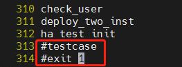

<!-- TOC -->
- [1. 环境描述](#1.环境描述)
  - [1.1.组网方式](#1.1.组网方式)
  - [1.2.环境配置](#1.2.环境配置)
- [2. 环境搭建](#2.环境搭建)
  - [2.1.创建lun](#2.1.创建lun)
  - [2.2.下载源码编译](#2.2.下载源码编译)
  - [2.3.环境变量](#2.3.环境变量) 
  - [2.4.dss配置-dd模拟](#2.4.dss配置-dd模拟)
  - [2.5.数据库部署](#2.5.数据库部署)
- [3. 主备集群功能验证](#3.主备集群功能验证)
  - [3.1.集群状态查询](#3.1.集群状态查询)
  - [3.2.主集群一写多读](#3.2.主集群一写多读)
  - [3.2.备集群只读](#3.2.备集群只读)

<!-- /TOC -->


# 资源池化支持同城dorado双集群部署(二)----cm模拟

资源池化支持同城dorado双集群部署方式：
(一) dd模拟(手动部署 + 无cm)
(二) cm模拟(手动部署dd模拟 + 有cm)
(三) 磁阵搭建(手动部署)
(四) 集群管理工具部署(om + cm)
          

## 1.环境描述

    针对cm模拟(手动部署dd模拟+有cm)作出指导，环境描述如下：

### &nbsp;&nbsp;1.1.组网方式

<table>
<tbody>
    <tr>
        <td rowspan='2'>生产中心</td>
        <td rowspan='2'>主端</td>
        <td>业务计算节点0</td>
        <td rowspan='2'>主存储节点</td>
        <td rowspan='2'>Dorado</td>
    </tr>
        <td>业务计算节点1</td>
    <tr>
        <td rowspan='2'>容灾中心</td>
        <td rowspan='2'>备端</td>
        <td>业务计算节点0</td>
        <td rowspan='2'>备存储节点</td>
        <td rowspan='2'>Dorado</td>
    </tr>
        <td>业务计算节点1</td>
</tbody>
</table>

**缺个图，后面补充哈！！！**

### &nbsp;&nbsp;1.2.环境配置

&emsp;支持存储远程复制

## 2. 环境搭建

针对资源池化双集群部署之《资源池化 cm 模拟搭建(手动部署 dd 模拟+有 cm) + dorado 同步复制》作出指导，模拟 cm 部署，环境搭建如下：

### &nbsp;&nbsp;2.1.创建 lun

(1) 主存储创建 lun 组和 lun
&emsp;主存储管控平台(DeviceManager)登录：https://主存储 ip:8088
&emsp;在管控平台上创建 lun 组和 lun，并映射到主机之后，在业务节点上查看挂好的 lun

(2) 主存储对应的业务计算节点上查看挂好的 lun

```
rescan-scsi-bus.sh       upadmin show vlun         lsscsi -is
```


lun 说明： LUNGroup-zx01-doradoxlog 指 dorado 同步复制需要的 lun(可以理解为共享盘，盘符/dev/sdj)，暂不关注 LUNGroup-zx01-dmsdata 和 LUNGroup-zx01-dmsxlog0，这两个是用于磁阵搭建资源池化集群

修改盘符属组

```
chown zx:zx /dev/sgj
```

(3) 创建同步复制对
&emsp; 在主存储管控平台(DeviceManager)登录：https://主存储 ip:8088
&emsp; data protection -> luns -> remote replication pairs(远程复制对) -> create ->选择主存储需要同步复制给备存储的 lun -> next
**请原谅这里截图工具的搓，标记笔太难用了，画的蓝圈圈很丑但很个性！**


选择同步 -> Automatic -> 备存储的存储池名称 -> next


(4) 备存储创建 lun 组和 lun
&emsp;备存储管控平台(DeviceManager)登录：https://备存储 ip:8088
&emsp;在管控平台上创建 lun 组，并映射到主机

由于第(3)步创建了远程复制对，会自动在备存储上创建同步复制对应的 lun，名字和主存储一致(即备存储上会有一样的 lun 名字为 LUNGroup-zx01-doradoxlog)，在备存储管控平台上查看如下图


(5) 备存储上的 lun 进行映射
方式 1：直接映射到业务计算节点上，不需要提前创建 lun 组，如果存在多个业务接待你需要映射到每一个业务节点上
选择 more -> Map -> node2host01 -> ok 将 dorado 同步复制功能需要的 lun 映射到备集群业务节点上


**@温馨提示@**：node2host01 指为业务节点 ip 创建的机器名称，名字可自行定义

&emsp;方式 2：在 lun 组中添加该 lun，要提前创建 lun 组，直接会映射到 lun 组中的所有业务节点上

(6) 备存储对应的业务计算节点上查看挂好的 lun

```
rescan-scsi-bus.sh       upadmin show vlun         lsscsi -is
```


&emsp;lun 说明： LUNGroup-zx01-doradoxlog 指 dorado 同步复制需要的 lun(可以理解为共享盘，盘符/dev/sdi)

修改盘符属组

```
chown zx:zx /dev/sgi
```

### &nbsp;&nbsp;2.2.下载源码编译

&emsp;需要重新编译代码，不能跳过该步骤，步骤如下：

(1) 下载三方库
&emsp;根据平台操作系统下载对应三方库，三方库下载地址：https://gitee.com/opengauss/openGauss-server 主页上 README.md 中查找需要的三方库 binarylibs

    获取master分支openEuler_x86系统对应的三方库

```
wget https://opengauss.obs.cn-south-1.myhuaweicloud.com/latest/binarylibs/openGauss-third_party_binarylibs_openEuler_x86_64.tar.gz
```

(2) 下载 cbb 并编译

```
git clone https://gitee.com/opengauss/CBB.git -b master cbb
cd cbb/build/linux/opengauss
sh build.sh -3rd $binarylibsDir -m Debug
```

&emsp;编译成功会自动将二进制放入三方库 openGauss-third_party_binarylibs_openEuler_x86_64/kernel/component 目录下

(3) 下载 dss 并编译

```
git clone https://gitee.com/opengauss/DSS.git -b master dss
cd dss/build/linux/opengaussDSS
sh build.sh -3rd $binarylibsDir -m DebugDsstest
```

(4) 下载 dms 并编译

```
git clone https://gitee.com/opengauss/DMS.git -b master dms

cd dms/build/linux/opengauss

sh build.sh -3rd $binarylibsDir -m DMSTest
```

(5) 下载 openGauss-server 并编译
&emsp;编译过程需要 cbb、dss、dms 的二进制，会从 openGauss-third_party_binarylibs_openEuler_x86_64/kernel/component 中获取

```
git clone https://gitee.com/opengauss/openGauss-server.git -b master openGauss-server

修改dms代码：vim src/gausskernel/storage/dss/fio_dss.cpp
int dss_set_server_status_wrapper()
{
    // return g_dss_device_op.dss_set_main_inst();
    return GS_SUCCESS;
}

sh build.sh -3rd $binarylibsDir -m Debug
```

&emsp;编译完之后的二进制存放在 openGauss-server/mppdb_temp_install/目录下

### &nbsp;&nbsp;2.3.环境变量

由于机器资源不足，这里以一个业务计算服务器上部署双集群，主备集群都是一主一备
(1) 主集群环境变量 ss_env0

环境变量

```
export HOME=/opt/omm
export GAUSSHOME=${HOME}/openGauss-server/mppdb_temp_install/
export LD_LIBRARY_PATH=$GAUSSHOME/lib:$LD_LIBRARY_PATH
export PATH=$GAUSSHOME/bin:$PATH
export DSS_HOME=/home/omm/ss_hatest/dss_home0
export CM_CONFIG_PATH=/opt/omm/openGauss-server/src/test/ss/cm_config.ini
```

`Tips`: 环境变量里面一定要写 export，即使`echo $GCC_PATH`存在，也要写 export 才能真正导入路径

参数说明：
GAUSSHOME 为编译完成的目标文件路径，包含openGauss的bin、lib等；
CM_CONFIG_PATH 用于主集群cm模拟部署下的集群内节点切换
目录/home/omm中omm指自己创建的用户

(2) 备集群环境变量ss_env1
```
export GAUSSHOME=/openGauss-server/mppdb_temp_install/
export LD_LIBRARY_PATH=$GAUSSHOME/lib:$LD_LIBRARY_PATH
export PATH=$GAUSSHOME/bin:$PATH
export DSS_HOME=/home/omm/ss_hatest1/dss_home0
export CM_CONFIG_PATH=/opt/omm/openGauss-server/src/test/ss/cm_config_standby.ini
```

### &nbsp;&nbsp;2.4.资源池化双集群部署

&emsp;通过源码中的 ha_test.sh 脚本搭建
&emsp;(1) 资源池化双集群 cm 模拟部署
&emsp;&emsp;注释 ha_test.sh 倒数 2 行



```
sh ha_test.sh dual_cluster
```

dssserver有可能存在端口冲突，执行sh ha_test.sh dual_cluster之前修改conf_start_dss_inst.sh脚本中dss端口
```
DSS_PORT_BASE=30000
```

数据库有可能存在端口冲突，执行sh ha_test.sh dual_cluster之前修改ha_test.sh脚本中数据库端口
```
PGPORT=(6600 6700)
STANDBY_PGPORT=(9600 9700)

nodedata_cfg="0:127.0.0.1:6611,1:127.0.0.1:6711"
standby_nodedata_cfg="0:127.0.0.1:9611,1:127.0.0.1:9711"
```
&emsp;ha_test.sh脚本适配了双集群模拟, 执行的时候带上dual_cluster就是双集群，不带就是单集群。脚本会自动将数据库拉起，执行完该脚本后，就相当于部署了2套独立的资源池化

&emsp;(2) 集群状态查询
因为是在一个机器上模拟双集群，所以开两个窗口，一个窗口导入主集群环境变量ss_env0，一个窗口导入备集群环境变量ss_env1
```
主集群节点0
[omm@nodename dn0]$ gs_ctl query -D /home/omm/ss_hatest/dn0
[2023-04-15 15:34:21.475][568656][][gs_ctl]: gs_ctl query ,datadir is /home/omm/ss_hatest/dn0
 HA state:
        local_role                     : Primary
        static_connections             : 1
        db_state                       : Normal
        detail_information             : Normal

 Senders info:
No information
 Receiver info:
No information

主集群备节点1
[omm@nodename dn1]$ gs_ctl query -D /home/omm/ss_hatest/dn1
[2023-04-15 15:34:21.475][568656][][gs_ctl]: gs_ctl query ,datadir is /home/omm/ss_hatest/dn1
 HA state:
        local_role                     : Standby
        static_connections             : 1
        db_state                       : Normal
        detail_information             : Normal

 Senders info:
No information
 Receiver info:
No information

备集群节点0
[omm@nodename dn0]$ gs_ctl query -D /home/omm/ss_hatest1/dn0
[2023-04-15 15:34:21.475][568656][][gs_ctl]: gs_ctl query ,datadir is /home/omm/ss_hatest1/dn0
 HA state:
        local_role                     : Primary
        static_connections             : 1
        db_state                       : Normal
        detail_information             : Normal

 Senders info:
No information
 Receiver info:
No information

备集群备节点1
[omm@nodename dn1]$ gs_ctl query -D /home/omm/ss_hatest1/dn1
[2023-04-15 15:34:21.475][568656][][gs_ctl]: gs_ctl query ,datadir is /home/omm/ss_hatest1/dn1
 HA state:
        local_role                     : Standby
        static_connections             : 1
        db_state                       : Normal
        detail_information             : Normal

 Senders info:
No information
 Receiver info:
No information

```

### &nbsp;&nbsp;2.5 资源池化双集群容灾搭建

#### &nbsp;&nbsp;2.5.1 手动容灾搭建

##### &nbsp;&nbsp;&nbsp;2.5.1.1 主集群(生产中心)
(1) 配置主集群主节点0的dorado容灾参数
&emsp;postgresql.conf文件
```
port = 6600
xlog_file_path = '/home/omm/ss_hatest/dorado_shared_disk'
xlog_lock_file_path = '/home/omm/ss_hatest/shared_lock_primary'
application_name = 'dn_master_0'
cross_cluster_replconninfo1='localhost=127.0.0.1 localport=6600 remotehost=127.0.0.1 remoteport=9600'
cross_cluster_replconninfo2='localhost=127.0.0.1 localport=6600 remotehost=127.0.0.1 remoteport=9700'
cluster_run_mode = 'cluster_primary'
ha_module_debug = off
ss_log_level = 255
ss_log_backup_file_count = 100
ss_log_max_file_size = 1GB
```

```
xlog_file_size = 68719476736
```

**pg_hba.conf 文件**

```
host all omm 10.10.10.10/32 trust
host all omm 10.10.10.20/32 trust

host all all 10.10.10.10/32 sha256
host all all 10.10.10.20/32 sha256
```

(2) 配置主集群备节点1的dorado容灾参数
&emsp;postgresql.conf文件
```
port = 6700
xlog_file_path = '/home/omm/ss_hatest/dorado_shared_disk'
xlog_lock_file_path = '/home/omm/ss_hatest/shared_lock_primary'
application_name = 'dn_master_1'
cross_cluster_replconninfo1='localhost=127.0.0.1 localport=6700 remotehost=127.0.0.1 remoteport=9600'
cross_cluster_replconninfo2='localhost=127.0.0.1 localport=6700 remotehost=127.0.0.1 remoteport=9700'
cluster_run_mode = 'cluster_primary'
ha_module_debug = off
ss_log_level = 255
ss_log_backup_file_count = 100
ss_log_max_file_size = 1GB
```

(3) 以primary模式重启主集群主节点0
```
gs_ctl start -D /home/omm/ss_hatest/dn0 -M primary
```
执行build前一定要给主集群主节点0配置容灾参数并以primary模式重启主集群主节点0
如果是cm模拟方式，可以不用指定-M参数，reform会自动识别模式

(4) 启动主集群备节点1

```
gs_ctl start -D /home/omm/ss_hatest/dn0
```

##### &nbsp;&nbsp;&nbsp;2.5.1.2 备集群(容灾中心)

(1) 配置备集群首备节点 0 的容灾参数
**postgresql.conf 文件**

```
port = 9600
xlog_file_path = '/home/omm/ss_hatest/dorado_shared_disk'
xlog_lock_file_path = '/home/omm/ss_hatest/shared_lock_standby'
application_name = 'dn_standby_0'
cross_cluster_replconninfo1='localhost=127.0.0.1 localport=9600 remotehost=127.0.0.1 remoteport=6600'
cross_cluster_replconninfo2='localhost=127.0.0.1 localport=9600 remotehost=127.0.0.1 remoteport=6700'
cluster_run_mode = 'cluster_standby'
ha_module_debug = off
ss_log_level = 255
ss_log_backup_file_count = 100
ss_log_max_file_size = 1GB
```

**pg_hba.conf 文件**

```
host all omm 10.10.10.10/32 trust
host all omm 10.10.10.20/32 trust

host all all 10.10.10.10/32 sha256
host all all 10.10.10.20/32 sha256
```

(2) 执行 build
必须先执行 build，否则首备节点 0 会报错是无效值，原因是因为备集群第一次初始化启动部署的时候，是资源池化的单机 normal 模式，一直为 0，当主集群主节点 0

```
gs_ctl build -D /home/zx/ss_hatest1/dn0 -b cross_cluster_full -g 0 --vgname=+data --enable-dss --socketpath='UDS:/home/zx/ss_hatest1/dss_home0/.dss_unix_d_socket' -q
```

(3) 配置备集群从备节点1的容灾参数
&emsp;postgresql.conf文件
```
port = 9700
xlog_file_path = '/home/zx/ss_hatest/dorado_shared_disk'
xlog_lock_file_path = '/home/zx/ss_hatest/shared_lock_standby'
application_name = 'dn_standby_1'
cross_cluster_replconninfo1='localhost=127.0.0.1 localport=9700 remotehost=127.0.0.1 remoteport=6600'
cross_cluster_replconninfo2='localhost=127.0.0.1 localport=9700 remotehost=127.0.0.1 remoteport=6700'
cluster_run_mode = 'cluster_standby'
ha_module_debug = off
ss_log_level = 255
ss_log_backup_file_count = 100
ss_log_max_file_size = 1GB
```

(4) 以standby模式重启备集群首备节点0
```
gs_ctl start -D /home/omm/ss_hatest1/dn0 -M standby
```
如果是cm模拟方式，可以不用指定-M参数，reform会自动识别模式

(5) 以standby模式重启备集群从备节点1
```
gs_ctl start -D /home/omm/ss_hatest1/dn0
```

#### &nbsp;&nbsp;2.5.2 自动化容灾搭建

同 2.5.1 手动容灾搭建效果一致，只是用 shell 脚本自动化执行

```
cd openGauss_server/src/test/ss/dual_cluster_single_shared_storage

sh standby_full_build_reconnect.sh
```

#### &nbsp;&nbsp;&nbsp;2.5.3 主备集群查询

(1) 主集群主节点

```
[omm@nodename dn0]$ gs_ctl query -D /home/omm/ss_hatest/dn0
[2023-04-18 09:38:34.397][1498175][][gs_ctl]: gs_ctl query ,datadir is /home/omm/ss_hatest/dn0
 HA state:
        local_role                     : Primary
        static_connections             : 2
        db_state                       : Normal
        detail_information             : Normal

 Senders info:
        sender_pid                     : 1456376
        local_role                     : Primary
        peer_role                      : StandbyCluster_Standby
        peer_state                     : Normal
        state                          : Streaming
        sender_sent_location           : 2/5C8
        sender_write_location          : 2/5C8
        sender_flush_location          : 2/5C8
        sender_replay_location         : 2/5C8
        receiver_received_location     : 2/5C8
        receiver_write_location        : 2/5C8
        receiver_flush_location        : 2/5C8
        receiver_replay_location       : 2/5C8
        sync_percent                   : 100%
        sync_state                     : Async
        sync_priority                  : 0
        sync_most_available            : Off
        channel                        : 127.0.0.1:6600-->127.0.0.1:43350

 Receiver info:
No information
```

(2) 主集群备节点

```
[omm@nodename pg_log]$ gs_ctl query -D /home/omm/ss_hatest/dn1
[2023-04-18 11:42:09.475][2857388][][gs_ctl]: gs_ctl query ,datadir is /home/omm/ss_hatest/dn1
 HA state:
        local_role                     : Standby
        static_connections             : 0
        db_state                       : Normal
        detail_information             : Normal

 Senders info:
No information
 Receiver info:
No information
```

(3) 备集群首备节点

```
备集群首备
[omm@nodename pg_log]$ gs_ctl query -D /home/omm/ss_hatest1/dn0
[2023-04-18 11:33:09.288][2760315][][gs_ctl]: gs_ctl query ,datadir is /home/omm/ss_hatest1/dn0
 HA state:
        local_role                     : Main Standby
        static_connections             : 2
        db_state                       : Normal
        detail_information             : Normal

 Senders info:
No information
 Receiver info:
        receiver_pid                   : 1901181
        local_role                     : Standby
        peer_role                      : Primary
        peer_state                     : Normal
        state                          : Normal
        sender_sent_location           : 2/5C8
        sender_write_location          : 2/5C8
        sender_flush_location          : 2/5C8
        sender_replay_location         : 2/5C8
        receiver_received_location     : 2/5C8
        receiver_write_location        : 2/5C8
        receiver_flush_location        : 2/5C8
        receiver_replay_location       : 2/5C8
        sync_percent                   : 100%
        channel                        : 127.0.0.1:41952<--127.0.0.1:6600
```

(4) 备集群从备节点

```
[omm@nodename pg_log]$ gs_ctl query -D /home/omm/ss_hatest1/dn1
[2023-04-18 11:42:09.475][2857388][][gs_ctl]: gs_ctl query ,datadir is /home/omm/ss_hatest1/dn1
 HA state:
        local_role                     : Standby
        static_connections             : 0
        db_state                       : Normal
        detail_information             : Normal

 Senders info:
No information
 Receiver info:
No information
```

## 3. 主备集群功能验证

### &nbsp;&nbsp;3.1.集群状态查询

```
主集群主节点0查询结果
gs_ctl query -D /opt/omm/cluster/dn0
[2023-04-03 19:29:20.472][1324519][][gs_ctl]: gs_ctl query ,datadir is /opt/omm/cluster/dn0
 HA state:
        local_role                     : Primary
        static_connections             : 2
        db_state                       : Normal
        detail_information             : Normal

 Senders info:
        sender_pid                     : 1324039
        local_role                     : Primary
        peer_role                      : StandbyCluster_Standby
        peer_state                     : Normal
        state                          : Streaming
        sender_sent_location           : 1/3049568
        sender_write_location          : 1/3049568
        sender_flush_location          : 1/3049568
        sender_replay_location         : 1/3049568
        receiver_received_location     : 1/3049568
        receiver_write_location        : 1/3049568
        receiver_flush_location        : 1/3049568
        receiver_replay_location       : 1/3049568
        sync_percent                   : 100%
        sync_state                     : Async
        sync_priority                  : 0
        sync_most_available            : Off
        channel                        : 10.10.10.10:44100-->10.10.10.20:42690

 Receiver info:
No information
```

```
主集群备节点1查询结果
gs_ctl query -D /opt/omm/cluster/dn1
[2023-04-03 19:29:20.472][2125915][][gs_ctl]: gs_ctl query ,datadir is /opt/omm/cluster/dn0
 HA state:
        local_role                     : Standby
        static_connections             : 0
        db_state                       : Normal
        detail_information             : Normal

 Senders info:
No information
 Receiver info:
No information
```

```
备集群首备节点0查询结果
gs_ctl query -D /opt/omm/cluster/dn0
[2023-04-03 19:29:20.472][2720317][][gs_ctl]: gs_ctl query ,datadir is /opt/omm/cluster/dn0
 HA state:
        local_role                     : Main Standby
        static_connections             : 2
        db_state                       : Normal
        detail_information             : Normal

 Senders info:
No information
 Receiver info:
        receiver_pid                   : 2720076
        local_role                     : Standby
        peer_role                      : Primary
        peer_state                     : Normal
        state                          : Normal
        sender_sent_location           : 1/3049568
        sender_write_location          : 1/3049568
        sender_flush_location          : 1/3049568
        sender_replay_location         : 1/3049568
        receiver_received_location     : 1/3049568
        receiver_write_location        : 1/3049568
        receiver_flush_location        : 1/3049568
        receiver_replay_location       : 1/3049568
        sync_percent                   : 100%
        channel                        : 10.10.10.20:39864<--10.10.10.10:44100
```

```
备集群从备节点1查询结果
gs_ctl query -D /opt/omm/cluster/dn1
[2023-04-03 19:29:20.472][2125915][][gs_ctl]: gs_ctl query ,datadir is /opt/omm/cluster/dn0
 HA state:
        local_role                     : Standby
        static_connections             : 0
        db_state                       : Normal
        detail_information             : Normal

 Senders info:
No information
 Receiver info:
No information
```

### &nbsp;&nbsp;3.2.主集群一写多读

```
主集群主节点0执行
gsql -d postgres -p 44100 -r
create table test01(id int) with(segment = on);
insert into test01 select generate_series(0,100);
```

```
主集群备节点1查询，可查询到主节点0创建的表和数据
gsql -d postgres -p 48100 -r
select * from test01;
```

### &nbsp;&nbsp;3.3.备集群只读

```
备集群首备节点0查询，可查询到主节点0创建的表和数据
gsql -d postgres -p 44100 -r
select * from test01;
```

```
备集群从备节点1查询，可查询到主节点0创建的表和数据
gsql -d postgres -p 48100 -r
select * from test01;
```

常用命令
(1) 查看 pg_control 文件

```
pg_controldata -I 0 --enable-dss --socketpath=UDS:$DSS_HOME/.dss_unix_d_socket +data
```


***Notice:不推荐直接用于生产环境***
***作者：Shirley_zhengx***
