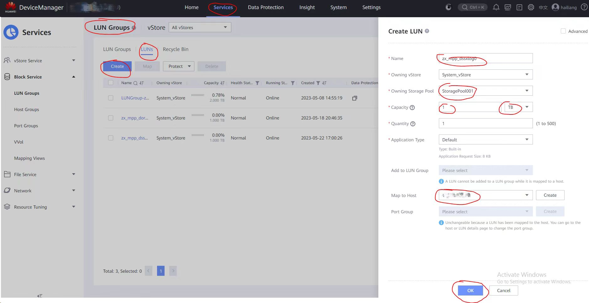
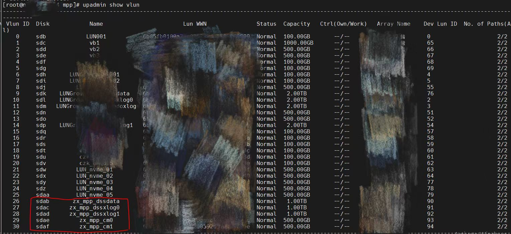
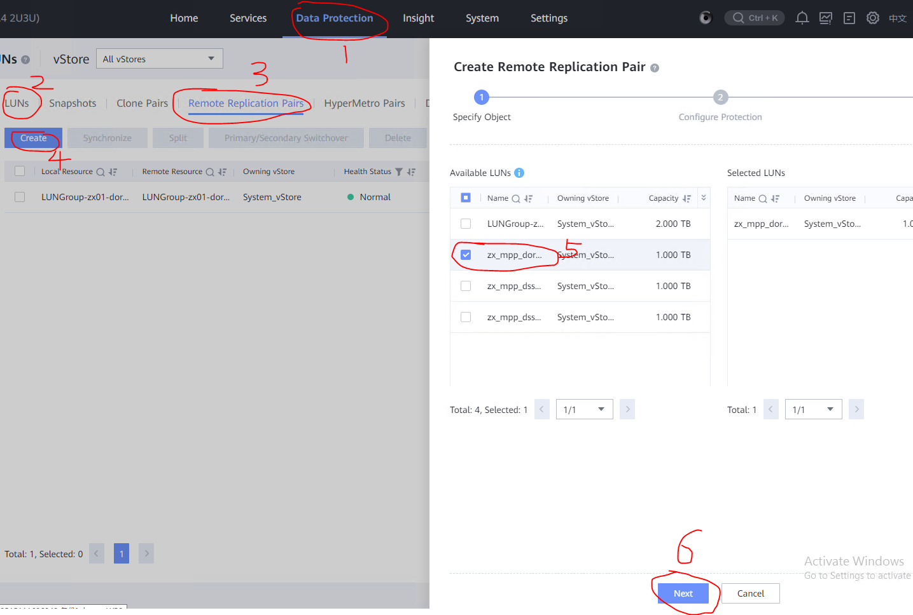
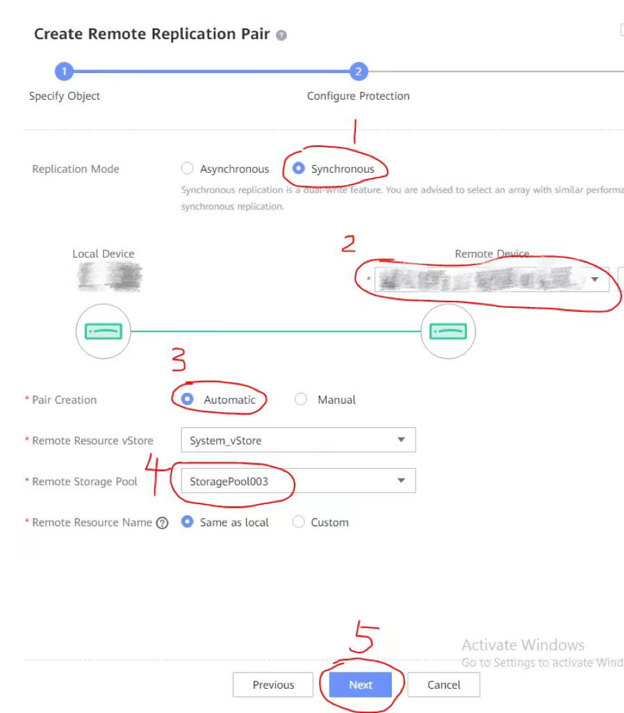
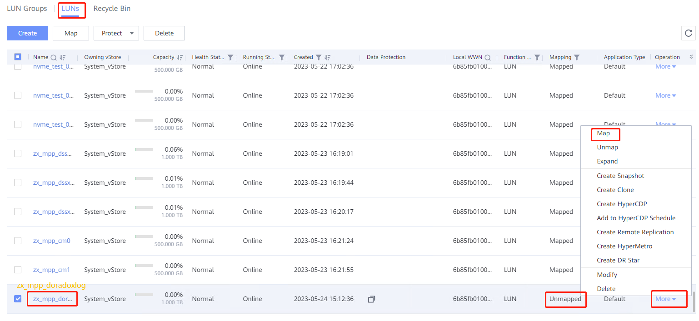
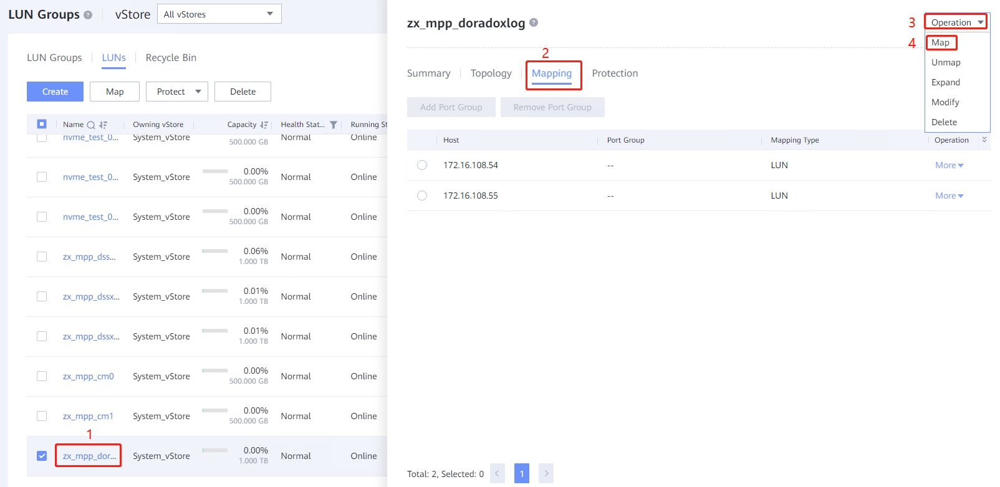

资源池化支持同城 dorado 双集群部署方式：

- (一) dd 模拟(手动部署 + 无 cm)
- (二) cm 模拟(手动部署 dd 模拟 + 有 cm)
- (三) 磁阵搭建(手动部署)
- (四) 集群管理工具部署(om + cm)

## 1.环境描述

    针对磁阵搭建(手动部署)作出指导，环境描述如下：

### &nbsp;&nbsp;1.1.组网方式

<table>
<tbody>
    <tr>
        <td rowspan='2'>生产中心</td>
        <td rowspan='2'>主端</td>
        <td>业务计算节点0</td>
        <td rowspan='2'>主存储</td>
        <td rowspan='2'>Dorado</td>
    </tr>
        <td>业务计算节点1</td>
    <tr>
        <td rowspan='2'>容灾中心</td>
        <td rowspan='2'>备端</td>
        <td>业务计算节点0</td>
        <td rowspan='2'>备存储</td>
        <td rowspan='2'>Dorado</td>
    </tr>
        <td>业务计算节点1</td>
</tbody>
</table>

举例说明：

<table>
<tbody>
    <tr>
        <td rowspan='2'>生产中心</td>
        <td rowspan='2'>主端</td>
        <td>业务计算节点0：10.10.10.10</td>
        <td rowspan='2'>主存储：144.144.144.44</td>
        <td rowspan='2'>Dorado</td>
    </tr>
        <td>业务计算节点1：10.10.10.20</td>
    <tr>
        <td rowspan='2'>容灾中心</td>
        <td rowspan='2'>备端</td>
        <td>业务计算节点0：20.20.20.10</td>
        <td rowspan='2'>备存储：144.144.144.45</td>
        <td rowspan='2'>Dorado</td>
    </tr>
        <td>业务计算节点1：20.20.20.20</td>
</tbody>
</table>

&emsp;**缺个图，后面补充哈！！！**

### &nbsp;&nbsp;1.2.环境配置

&emsp;支持存储远程复制

## 2. 环境搭建

针对资源池化双集群部署之《资源池化 om 集群管理工具部署 + dorado 同步复制》作出指导，环境搭建如下：

### &nbsp;&nbsp;2.1.创建 lun

(1) 主存储创建 lun
&emsp;主存储管控平台(DeviceManager)登录：https://主存储 ip:8088，例如对应 1.1 章节表格就是：https://144.144.144.44:8088
&emsp;在管控平台上创建 lun 组和 lun，并映射到主机之后，在业务节点上查看挂好的 lun

- (1.1)创建主机
  在存储管控平台上，业务计算节点都称之为主机
- (1.2)创建 lun 组
  由于 lun 需要映射，当有多个业务计算节点(主机)，则可以通过创建 lun 组，将主机加入到 lun 组中，每次闯将 lun 的时候，只需要将 lun 加入到 lun 组中，则自动会映射到主机组中包含的所有业务计算节点 ip(主机)
- (1.3)创建 lun
  如下图所示:

  步骤：Services -> LUN Groups -> LUN -> Create

映射到业务节点的方式一：
在图中 Map to Host 选择业务节点 ip (例如 1.1 章节表格中主存储对应的业务计算节点 0 的 ip:10.10.10.10)

映射到业务节点的方式二：
在图中 Add to LUN Group 选择(1.2)创建的 lun 组，lun 组有对应的主机组，会自动映射到主机组中包含的所有业务计算节点 ip(例如 1.1 章节表格中主存储对应的业务计算节点 0 的 ip:10.10.10.10 和业务计算节点 1 的 ip:10.10.10.20)

(2) 主存储对应的业务计算节点上查看挂好的 lun

```
rescan-scsi-bus.sh       upadmin show vlun         lsscsi -is
```
 


lun 说明： 这里显示的是 om 部署资源池化需要用的 lun，zx_mpp_dssdata 是资源池化主集群的数据盘(盘符/dev/sdab)，zx_mpp_dssxlog0 是资源池化主集群节点 0 对应的 xlog 盘(盘符/dev/sdac)，zx_mpp_dssxlog0 是资源池化主集群节点 1 对应的 xlog 盘(盘符/dev/sdad)，zx_mpp_cm0 是资源池化主集群 cm 对应的 votingDiskPath 盘(盘符/dev/sdae)，zx_mpp_cm0 是资源池化主集群 cm 对应的 shareDiskDir 盘(盘符/dev/sdaf)

修改盘符属组

```
chown mpp:mpp /dev/sdab
chown mpp:mpp /dev/sdac
chown mpp:mpp /dev/sdad
chown mpp:mpp /dev/sdae
chown mpp:mpp /dev/sdaf
```

`Tips`: 主机组包含的主机节点都需要修改属组，全部修改

(3) 主存储创建 dorado 同步复制的 lun
主存储上创建的 dorado 同步复制的 lun，步骤同(1.2)一样，lun 名称是 zx_mpp_doradoxlog。盘符/dev/sdm

```
执行upadmin show vlun查看：
Vlun ID  Disk            Name
12        sdm      zx_mpp_doradoxlog
```

(4) 在备存储上同样操作执行上面步骤(1)和(2)，不操作步骤(3)
&emsp;备存储管控平台(DeviceManager)登录：https://备存储 ip:8088，例如对应 1.1 章节表格就是：https://144.144.144.45:8088
执行步骤(1)和(2)，备存储上不用操作步骤(3)，可以在建立远程同步复制的时候自动创建，在《2.4.3 建立容灾关系》章节中介绍。

### &nbsp;&nbsp;2.2.下载源码编译

&emsp;如果用已打包好的 openGauss-server 包则跳过该步骤，进行 2.3，如果修改代码开发中，则进行代码更新并编译，如下步骤：

(1) 下载三方库
&emsp;根据平台操作系统下载对应三方库，三方库下载地址：https://gitee.com/opengauss/openGauss-server 主页上 README.md 中查找需要的三方库 binarylibs

获取 master 分支 openEuler_x86 系统对应的三方库

```
wget https://opengauss.obs.cn-south-1.myhuaweicloud.com/latest/binarylibs/openGauss-third_party_binarylibs_openEuler_x86_64.tar.gz
```

(2) 下载 cbb 并编译

```
git clone https://gitee.com/opengauss/CBB.git -b master cbb
cd CBB/build/linux/opengauss
sh build.sh -3rd $binarylibsDir -m Debug
```

&emsp;编译成功会自动将二进制放入三方库 openGauss-third_party_binarylibs_openEuler_x86_64/kernel/component 目录下
(3) 下载 dss 并编译

```
git clone https://gitee.com/opengauss/DSS.git -b master dss
cd CBB/build/linux/opengaussDSS
sh build.sh -3rd $binarylibsDir -m Debug
```

(4) 下载 dms 并编译

```
git clone https://gitee.com/opengauss/DMS.git -b master dms
cd CBB/build/linux/opengauss
sh build.sh -3rd $binarylibsDir -m Debug
```

(5) 下载 openGauss-server 并编译
&emsp;编译过程需要 cbb、dss、dms 的二进制，会从 openGauss-third_party_binarylibs_openEuler_x86_64/kernel/component 中获取

```
git clone https://gitee.com/opengauss/openGauss-server.git -b master openGauss-server
sh build.sh -3rd $binarylibsDir -m Debug
```

&emsp;编译完之后的二进制存放在 openGauss-server/mppdb_temp_install/目录下

### &nbsp;&nbsp;2.3.环境准备

由于机器资源不足，这里部署一主一备为例
(1) 二进制包准备
创建一个自己用户的目录，例如/opt/mpp，将已编好的包或者发布包拷贝放至/opt/mpp/gauss_package 目录下，包含 om、cm、server 的二进制
如下所示：

```
[root@node1 gauss_package]# ll
总用量 413236
-rw-r--r--  1 mpp mpp   6980293  5月 23 15:03 openGauss-5.1.0-openEuler-64bit-cm.tar.gz
-rw-r--r--  1 mpp mpp  18591448  5月 23 15:25 openGauss-5.1.0-openEuler-64bit-Libpq.tar.gz
-rw-r--r--  1 mpp mpp        65  5月 23 15:04 openGauss-5.1.0-openEuler-64bit-om.sha256
-rw-r--r--  1 mpp mpp  11055254  5月 23 15:04 openGauss-5.1.0-openEuler-64bit-om.tar.gz
-rw-r--r--  1 mpp mpp        65  5月 23 15:25 openGauss-5.1.0-openEuler-64bit.sha256
-rw-r--r--  1 mpp mpp 347317866  5月 23 15:25 openGauss-5.1.0-openEuler-64bit.tar.bz2
-rw-r--r--  1 mpp mpp  38680532  5月 23 15:25 openGauss-5.1.0-openEuler-64bit-tools.tar.gz
-rw-------  1 mpp mpp        65  5月 23 15:25 upgrade_sql.sha256
-rw-------  1 mpp mpp    493901  5月 23 15:25 upgrade_sql.tar.gz
-rw-r--r--  1 mpp mpp        32  5月 23 15:02 version.cfg
```

(2) 准备 xml 文件
/opt/mpp/1p1s.xml 文件配置一主一备资源池化集群

```
<?xml version="1.0" encoding="UTF-8"?>
<ROOT>
    <!-- openGauss整体信息 -->
    <CLUSTER>
        <!-- 数据库名称 -->
        <PARAM name="clusterName" value="sbss" />
        <!-- 数据库节点名称(hostname) -->
        <PARAM name="nodeNames" value="node1,node2" />
        <!-- 数据库安装目录-->
        <PARAM name="gaussdbAppPath" value="/opt/mpp/install/app" />
        <!-- 日志目录-->
        <PARAM name="gaussdbLogPath" value="/opt/mpp/install/log" />
        <!-- 临时文件目录-->
        <PARAM name="tmpMppdbPath" value="/opt/mpp/install/tmp"/>
        <!-- 数据库工具目录-->
        <PARAM name="gaussdbToolPath" value="/opt/mpp/install/tool" />
        <!-- 数据库core文件目录-->
        <PARAM name="corePath" value="/opt/mpp/install/corefile"/>
        <!-- 节点IP，与数据库节点名称列表一一对应 -->
        <PARAM name="backIp1s" value="10.10.10.10,10.10.10.20"/>
        <PARAM name="clusterType" value="single-inst"/>
                <PARAM name="GaussVT" value="Fusion"/>
                <PARAM name="enable_dss" value="on"/>
                <PARAM name="dss_home" value="/opt/mpp/install/dss_home"/>
                <PARAM name="dss_vg_info" value="data:/dev/sdab,log0:/dev/sdac,log1:/dev/sdad"/>
                <PARAM name="votingDiskPath" value="/dev/sdae"/>
                <PARAM name="shareDiskDir" value="/dev/sdaf"/>
                <PARAM name="ss_dss_vg_name" value="data"/>
                <PARAM name="dss_ssl_enable" value="on"/>
    </CLUSTER>
    <!-- 每台服务器上的节点部署信息 -->
    <DEVICELIST>
        <!-- 节点1上的部署信息 -->
        <DEVICE sn="node1">
            <PARAM name="name" value="node1"/>
            <PARAM name="azName" value="AZ1"/>
            <PARAM name="azPriority" value="1"/>
            <PARAM name="backIp1" value="10.10.10.10"/>
            <PARAM name="sshIp1" value="10.10.10.10"/>

                        <PARAM name="cmDir" value="/opt/mpp/install/cm"/>
                        <PARAM name="cmsNum" value="1"/>
                        <PARAM name="cmServerPortBase" value="27000"/>
                        <PARAM name="cmServerListenIp1" value="10.10.10.10,10.10.10.20"/>
                        <PARAM name="cmServerlevel" value="1"/>
                        <PARAM name="cmServerRelation" value="node1,node2"/>

                        <PARAM name="dataNum" value="1"/>
                        <PARAM name="dataPortBase" value="15400"/>
                        <PARAM name="dataNode1" value="/opt/mpp/install/data/dn,node2,/opt/mpp/install/data/dn"/>
        </DEVICE>

        <!-- 节点2上的节点部署信息，其中“name”的值配置为主机名称 -->
                        <DEVICE sn="node2">
            <PARAM name="name" value="node2"/>
            <PARAM name="azName" value="AZ1"/>
            <PARAM name="azPriority" value="1"/>
            <PARAM name="backIp1" value="10.10.10.20"/>
            <PARAM name="sshIp1" value="10.10.10.20"/>
            <PARAM name="cmDir" value="/opt/mpp/install/cm"/>
        </DEVICE>
    </DEVICELIST>
</ROOT>
```

`Tips`: 用户需要修改节点名称、节点 IP、目录、盘符、端口号

### &nbsp;&nbsp;2.4.om 部署双集群

#### &nbsp;&nbsp;&nbsp;2.4.1 主集群(生产中心)

&emsp;(1) 解压 om 包

```
su - root
cd /opt/mpp/gauss_package
tar -zxvf openGauss-x.x.x-openEuler-64bit-all.tar.gz
tar -zxvf openGauss-x.x.x-openEuler-64bit-om.tar.gz
```

&emsp;(2)执行预安装

```
cd script
./gs_preinstall -U mpp -G mpp -X /opt/mpp/1p1s.xml --sep-env-file=/home/mpp/ss_env
```

&emsp;参数解释：

- sep-env-file 分离环境变量

(3)执行安装

```
su - mpp
source /home/mpp/ss_env
gs_install -X /opt/mpp/1p1s.xml --dorado_config=/dev/sdm
```

--dorado_config 传入参数对应 2.1 章节步骤(3)，主存储上创建的 dorado 同步复制 lun 的盘符

(4)查看主集群状态

```
[mpp@node1 dn_6001]$ cm_ctl query -Cvidp
[  CMServer State   ]

node           node_ip         instance                           state
-------------------------------------------------------------------------
1  node1 10.10.10.10   1    /opt/mpp/install/cm/cm_server Primary
2  node2 10.10.10.20   2    /opt/mpp/install/cm/cm_server Standby


[ Defined Resource State ]

node           node_ip         res_name instance  state
---------------------------------------------------------
1  node1 10.10.10.10   dms_res  6001      OnLine
2  node2 10.10.10.20   dms_res  6002      OnLine
1  node1 10.10.10.10   dss      20001     OnLine
2  node2 10.10.10.20   dss      20002     OnLine

[   Cluster State   ]

cluster_state   : Normal
redistributing  : No
balanced        : Yes
current_az      : AZ_ALL

[  Datanode State   ]

node           node_ip         instance                             state            | node           node_ip         instance                             state
------------------------------------------------------------------------------------------------------------------------------------------------------------------------------
1  node1 10.10.10.10   6001 25400  /opt/mpp/install/data/dn P Primary Normal | 2  node2 10.10.10.20   6002 25400  /opt/mpp/install/data/dn S Standby Normal

```

#### &nbsp;&nbsp;&nbsp;2.4.2 备集群(容灾中心)

需要提前做《2.1.创建 lun》 和 《2.3.环境准备》

&emsp;(1) 解压 om 包

```
su - root
cd /opt/mpp/gauss_package
tar -zxvf openGauss-x.x.x-openEuler-64bit-all.tar.gz
tar -zxvf openGauss-x.x.x-openEuler-64bit-om.tar.gz
```

&emsp;(2)执行预安装

```
cd script
./gs_preinstall -U mpp -G mpp -X /opt/mpp/1p1s.xml --sep-env-file=/home/mpp/ss_env
```

(3)执行安装

```
gs_install -X /opt/mpp/1p1s.xml
```

(4)查看备集群状态

```

[mpp@node2 dn_6002]$ cm_ctl query -Cvidp
[  CMServer State   ]

node           node_ip         instance                           state
-------------------------------------------------------------------------
1  node1 20.20.20.10   1    /opt/mpp/install/cm/cm_server Primary
2  node2 20.20.20.20   2    /opt/mpp/install/cm/cm_server Standby


[ Defined Resource State ]

node           node_ip         res_name instance  state
---------------------------------------------------------
1  node1 20.20.20.10   dms_res  6001      OnLine
2  node2 20.20.20.20   dms_res  6002      OnLine
1  node1 20.20.20.10   dss      20001     OnLine
2  node2 20.20.20.20   dss      20002     OnLine

[   Cluster State   ]

cluster_state   : Normal
redistributing  : No
balanced        : Yes
current_az      : AZ_ALL

[  Datanode State   ]

node           node_ip         instance                             state            | node           node_ip         instance                             state
------------------------------------------------------------------------------------------------------------------------------------------------------------------------------
1  node1 20.20.20.10   6001 25400  /opt/mpp/install/data/dn P Primary Normal | 2  node2 20.20.20.20   6002 25400  /opt/mpp/install/data/dn S Standby Normal
```

#### &nbsp;&nbsp;&nbsp;2.4.3 建立容灾关系

(1) 主集群(生产中心)配置参数，每个节点都配置
&emsp;节点 0 的 postgresql.conf 文件

```
xlog_file_path = '/dev/sdm'
xlog_lock_file_path = '/home/mpp/install/shared_lock_primary'
application_name = 'dn_master_0'
cross_cluster_replconninfo1='localhost=10.10.10.10 localport=25400 remotehost=20.20.20.10 remoteport=25400'
cross_cluster_replconninfo2='localhost=10.10.10.10 localport=25400 remotehost=20.20.20.20 remoteport=25400'
cluster_run_mode = 'cluster_primary'
ha_module_debug = off
ss_log_level = 255
ss_log_backup_file_count = 100
ss_log_max_file_size = 1GB
```

&emsp;节点 1 的 postgresql.conf 文件

```
xlog_file_path = '/dev/sdm'
xlog_lock_file_path = '/home/mpp/install/shared_lock_primary'
application_name = 'dn_master_1'
cross_cluster_replconninfo1='localhost=10.10.10.20 localport=25400 remotehost=20.20.20.10 remoteport=25400'
cross_cluster_replconninfo2='localhost=10.10.10.20 localport=25400 remotehost=20.20.20.20 remoteport=25400'
cluster_run_mode = 'cluster_primary'
ha_module_debug = off
ss_log_level = 255
ss_log_backup_file_count = 100
ss_log_max_file_size = 1GB
```

(2) 重启主集群，查询主集群状态

```
cm_ctl start
cm_ctl query -Cvidp
```

(3) 登录主管控平台，配置同步复制

&emsp; 在主存储管控平台(DeviceManager)登录：https://主存储 ip:8088
&emsp; data protection -> luns -> remote replication pairs(远程复制对) -> create ->选择主存储需要同步复制给备存储的 lun -> next
&emsp; 请原谅这里截图工具的搓，标记笔太难用了，画的蓝圈圈很丑但很个性！
 

图中第 5 步选择主存储上创建的 dorado 同步复制的 lun，lun 名称是 zx_mpp_doradoxlog

选择同步 -> Automatic -> 备存储的存储池名称 -> next
 


最后会显示 successful，表示成功

(4) 登录备管控平台，映射到备集群
&emsp; 在备存储管控平台(DeviceManager)登录：https://备存储 ip:8088
在备存储上做映射方式一：
&emsp; Services -> LUNs -> zx_mpp_doradoxlog -> More -> Map -> 选择备存储对应的业务计算节点 ip(例如 1.1 章节表格中的 20.20.20.10)


选择第(3)中和主存储做了远程复制对的 lun，名称是 zx_mpp_doradoxlog

在备存储上做映射方式二：
Services -> LUNs -> 双击 zx_mpp_doradoxlog -> Mapping -> Operation -> map -> 择备存储对应的业务计算节点 0 的 ip(例如 1.1 章节表格中的 20.20.20.10)
再次点击 Operation -> map -> 择备存储对应的业务计算节点 1 的 ip(例如 1.1 章节表格中的 20.20.20.20)


在业务计算节点上查看 lun 情况：

```
[root@node1 mpp]# upadmin show vlun
--------------------------------------------------------------------------
 Vlun ID  Disk            Name          Lun WWN     Status   Capacity
   31     sdag     zx_mpp_doradoxlog    65fdfg      Normal    1.00TB
--------------------------------------------------------------------------
```

修改属组

```
chown mpp:mpp /dev/sdag
```

(5) 备集群(容灾中心)配置数据库参数，每个节点都配置
&emsp;节点 0 的 postgresql.conf 文件

```
xlog_file_path = '/dev/sdag'
xlog_lock_file_path = '/home/mpp/install/shared_lock_standby'
application_name = 'dn_standby_0'
cross_cluster_replconninfo1='localhost=20.20.20.10 localport=25400 remotehost=10.10.10.10 remoteport=25400'
cross_cluster_replconninfo2='localhost=20.20.20.10 localport=25400 remotehost=10.10.10.20 remoteport=25400'
cluster_run_mode = 'cluster_standby'
ha_module_debug = off
ss_log_level = 255
ss_log_backup_file_count = 100
ss_log_max_file_size = 1GB
```

&emsp;节点 1 的 postgresql.conf 文件

```
xlog_file_path = '/dev/sdag'
xlog_lock_file_path = '/home/mpp/install/shared_lock_standby'
application_name = 'dn_standby_1'
cross_cluster_replconninfo1='localhost=20.20.20.20 localport=25400 remotehost=10.10.10.10 remoteport=25400'
cross_cluster_replconninfo2='localhost=20.20.20.20 localport=25400 remotehost=10.10.10.20 remoteport=25400'
cluster_run_mode = 'cluster_standby'
ha_module_debug = off
ss_log_level = 255
ss_log_backup_file_count = 100
ss_log_max_file_size = 1GB
```

(6) 停备集群对首备进行 build
方式一

```
# 设置该参数后，执行cm_ctl stop，dss不会被踢出集群
cm_ctl set --param --server -k delay_arbitrate_max_cluster_timeout=0

# kill cm_server 等待om_monitor重新拉起cm_server，使修改的参数生效
kill cm_server

# 先停从备，防止首备先停发生failover
cm_ctl stop -n 2 -I 6002
cm_ctl stop -n 1 -I 6001cm_server

# 执行build命令，首备节点的dssserver进程必须正常
gs_ctl build -D /opt/mpp/install/data/dn -b cross_cluster_full -g 0 --vgname=+data --enable-dss --socketpath='UDS:/opt/mpp/install/dss_home/.dss_unix_d_socket' -q

# 设置该参数后，执行cm_ctl stop，dss不会被踢出集群
cm_ctl set --param --server -k delay_arbitrate_max_cluster_timeout=10

# kill cm_server 等待om_monitor重新拉起cm_server，使修改的参数生效
kill cm_server
```

方式二

```
# 停止备集群
cm_ctl stop

# 在首备节点导入dss维护环境变量，导入该环境可以在cm部署的情况下手动拉起dssserver
export DSS_MAINTAIN=TRUE

# 拉起首备dsserver
dsserver -D  /opt/mpp/install/dss_home &

# 执行build命令，首备节点的dssserver进程必须正常
gs_ctl build -D /opt/mpp/install/data/dn -b cross_cluster_full -g 0 --vgname=+data --enable-dss --socketpath='UDS:/opt/mpp/install/dss_home/.dss_unix_d_socket' -q
```

首备就是指备集群中还没有建立容灾关系之前，显示 primary 的节点，即为首备节点，对其进行 build

(7) 备集群(容灾中心)配置 cm 参数
配置下列参数，用于区分集群模式，cm 会根据不同集群模式进行状态校验

```
cm_ctl set --param --server -k backup_open=1
cm_ctl set --param --agent -k agent_backup_open=1
```

参数说明：
backup_open=1，agent_backup_open=1 使用 dorado 介质的集群转双集群备集群
backup_open=0，agent_backup_open=0 资源池化单集群

(7) 重启备集群

```
cm_ctl start
```

(8) 步骤(5)~(7)自动化脚本

```
#!/bin/bash

source /home/mpp/ss_env

#stop standby cluster
echo "stop standby cluster."
cm_ctl stop

#assign parameter to main standby
echo "assign parameter to main standby."
gs_guc set -N node1 -D /opt/mpp/install/data/dn -c "xlog_file_path = '/dev/sdk'"
gs_guc set -N node1 -D /opt/mpp/install/data/dn -c "xlog_lock_file_path = '/opt/mpp/install/shared_lock_standby.lock"
gs_guc set -N node1 -D /opt/mpp/install/data/dn -c "application_name = 'dn_standby_0'"
gs_guc set -N node1 -D /opt/mpp/install/data/dn -c "cross_cluster_replconninfo1='localhost=172.16.108.54 localport=25400 remotehost=172.16.108.23 remoteport=44100'"
gs_guc set -N node1 -D /opt/mpp/install/data/dn -c "cluster_run_mode = 'cluster_standby'"
gs_guc set -N node1 -D /opt/mpp/install/data/dn -c "ha_module_debug = off"
gs_guc set -N node1 -D /opt/mpp/cluster/dn0 -h "host    all             all             172.16.108.23/32        trust"


#assign parameter to standby
echo "assign parameter to standby."
gs_guc set -N node2 -D /opt/mpp/install/data/dn -c "xlog_file_path = '/dev/sdc'"
gs_guc set -N node2 -D /opt/mpp/install/data/dn -c "xlog_lock_file_path = '/opt/mpp/install/shared_lock_standby.lock'"
gs_guc set -N node2 -D /opt/mpp/install/data/dn -c "application_name = 'dn_standby_1'"
gs_guc set -N node2 -D /opt/mpp/install/data/dn -c "cross_cluster_replconninfo1='localhost=172.16.108.55 localport=25400 remotehost=172.16.108.23 remoteport=44100'"
gs_guc set -N node2 -D /opt/mpp/install/data/dn -c "cluster_run_mode = 'cluster_standby'"
gs_guc set -N node2 -D /opt/mpp/install/data/dn -c "ha_module_debug = off"
gs_guc set -N node2 -D /opt/mpp/cluster/dn0 -h "host    all             all             172.16.108.23/32        trust"

#start dssserver
export DSS_MAINTAIN=TRUE
dssserver -D /opt/mpp/install/dss_home &

#build
#gs_ctl build -D /opt/mpp/install/data/dn -b cross_cluster_full -g 0 --vgname=+data --enable-dss --socketpath='UDS:/opt/mpp/install/dss_home/.dss_unix_d_socket' -q


#assign cm parameter
echo "assign cm parameter to all node."
cm_ctl set --param --server -k backup_open=1
cm_ctl set --param --agent -k agent_backup_open=1
```

(9) 查询状态
主集群使用 cm_ctl query -Cvidp 查询出来同第步一样
备集群查询结果如下，备集群节点 0 从没有建立容灾关系时的 primary 变成建立容灾关系之后的 Main Standby

```
[mpp@node2 dn_6002]$ cm_ctl query -Cvidp
[  CMServer State   ]

node           node_ip         instance                           state
-------------------------------------------------------------------------
1  node1 20.20.20.10   1    /opt/mpp/install/cm/cm_server Primary
2  node2 20.20.20.20   2    /opt/mpp/install/cm/cm_server Standby


[ Defined Resource State ]

node           node_ip         res_name instance  state
---------------------------------------------------------
1  node2 20.20.20.10   dms_res  6001      OnLine
2  node2 20.20.20.20   dms_res  6002      OnLine
1  node2 20.20.20.10   dss      20001     OnLine
2  node2 20.20.20.20   dss      20002     OnLine

[   Cluster State   ]

cluster_state   : Normal
redistributing  : No
balanced        : Yes
current_az      : AZ_ALL

[  Datanode State   ]

node           node_ip         instance                             state            | node           node_ip         instance                             state
------------------------------------------------------------------------------------------------------------------------------------------------------------------------------
1  node1 20.20.20.10   6001 25400  /opt/mpp/install/data/dn P Main Standby Normal | 2  node2 20.20.20.20   6002 25400  /opt/mpp/install/data/dn S Standby Normal
```

---

**_Notice:不推荐直接用于生产环境_**

**_作者：Shirley_zhengx_**
