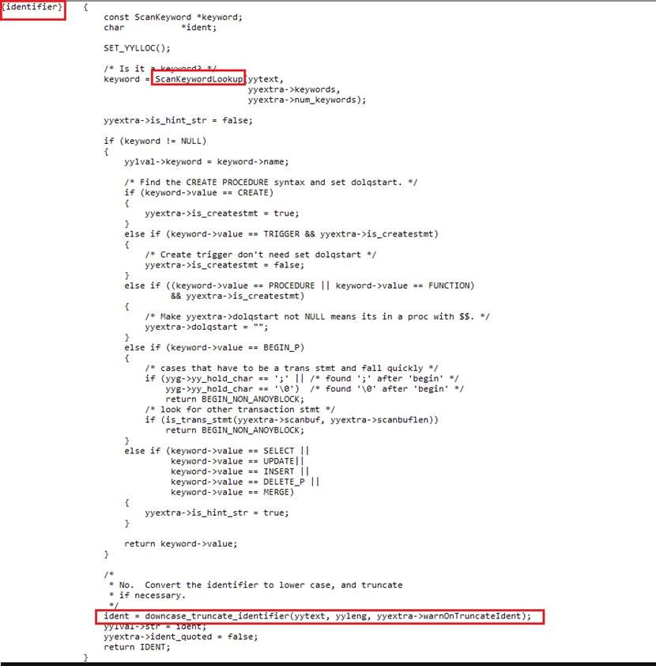
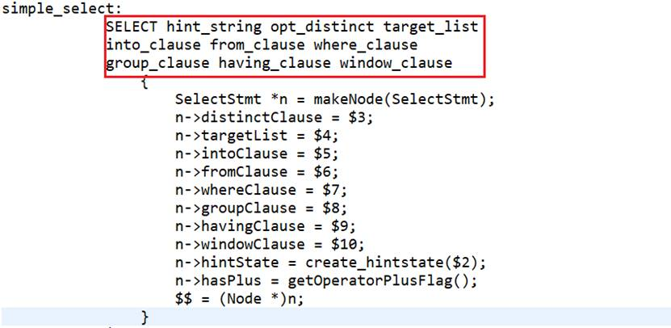
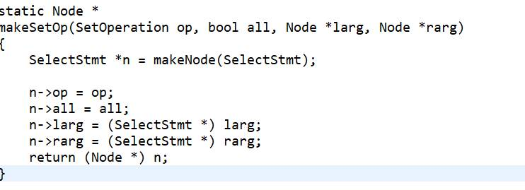
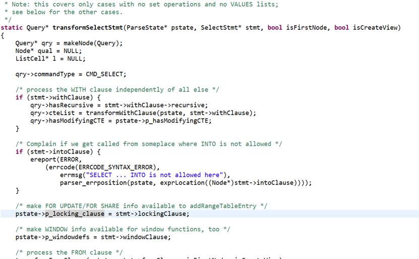
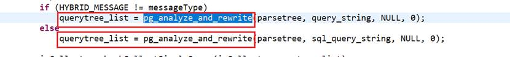
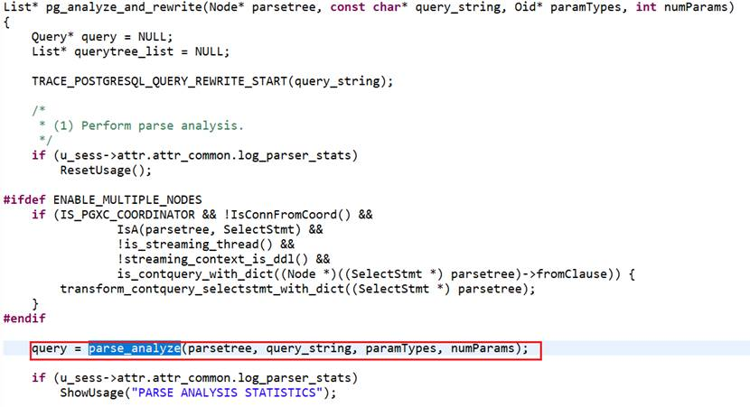
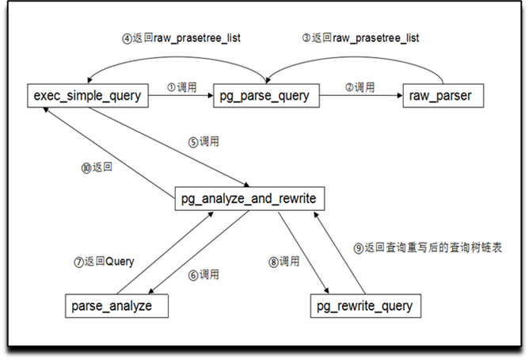

一、首先在虚拟机装入 centos 系统

参考链接

[openGauss——VMware 安装 | C1everF0x's Blog](https://c1everf0x.github.io/2021/04/10/openGauss——VMware安装/)

创建用户


安装好后查看系统的版本




二、网络配置

点一下安装位置然后点完成退出来，默认设置就行，再点 “网络和主机名”，打开以太网的开关

主机名字自己定一个，ip 地址也要记住，两个信息都要记住。


问题一：虚拟机能够 ping 通过主机、主机 ping 不通虚拟机。

参考链接：

https://blog.csdn.net/weixin_43837229/article/details/94733475?utm_medium=distribute.pc_relevant.none-task-blog-2~default~baidujs_title~default-1.control&spm=1001.2101.3001.4242

虚拟机能够 ping 通过主机



本机 ping 虚拟机 ip，无法通信


解决方式：

在本机查看虚拟机 ip，和虚拟机本身的 ip 不符合


以 win10 为例，`打开电脑设置=》网络和 lnelnternet=》网络和共享中心=》更高适配器设置`，找到如下虚拟机



右键点击属性，找到


右键点击属性，找到


这时不管是主机 ping 虚拟机还是虚拟机 ping 主机都通了

实验结果：


问题二 ：ssh 连接不了

失败：


经过查询资料问题解决，主要是使用 ssh 命令并不代表开启了 ssh 服务器，我们通常在 powershell 中直接使用的 ssh 命令其实是 win10 专业版默认开启了 OpenSSH 客户端（OpenSSH Client），而现在想要远程 ssh 登录到 win10，则需要开启 ssh 服务端。

解决步骤：

1、打开设置——应用，找到可选功能，点击进入


2、在可选功能页面，点击添加功能，找到 OpenSSH 服务器并安装


3、接下来启动 sshserver 服务，按 win+r 打开运行，输入 services.msc，并回车键打开



4、在服务中找到 `OpenSSH SSH Server` 和 `OpenSSH Authentication Agent` 两个服务，启动它们并右键——属性，设置为自动启动


成功


问题三：ssh 服务器拒绝了密码，请再试一次


虚拟机用 ssh 连接自己可以连接上，但是主机的 ssh 连接不上虚拟机。并且密码正确。

在查找多种解决办法，经过多次尝试都没有用处的情况下，我准备换一种方式。

最终解决办法：

利用容器安装 OpenGauss 数据库：

1、安装 curl

​ `sudo apt install curl`

2、安装 docker

​ `curl -fsSL https://get.docker.com | bash -s docker --mirror Aliyun`

3、运行 opengauss 镜像

​ `sudo docker run --name opengauss --privileged=true -d -p 5432:5432 -e GS_PASSWORD=Enmo@123 enmotech/opengauss:latest`

4、进入容器

​ `sudo docker exec -it opengauss bash`

5、连接数据库 ,切换到 omm 用户 ，用 gsql 连接到数据库



第二次启动镜像.

先启动容器，然后进入 shell

1、必须先启动容器

`sudo docker start “容器 ID”`

2、然后使用下边的命令进入 shell

`sudo docker exec -it “容器 ID” bash`

3、将主机的文件复制到容器里

`sudo docker cp 主机目录 容器 ID:容器目录`

如果要编辑里边的配置文件，例如编辑 nginx 的配置文件，docker 容器里没有默认的编辑工具，需要安装

`sudo apt-get update`

`sudo apt-get install vim`

也可以通过替换的方式，编辑文件

```
sudo docker cp <container>:/path/to/file.ext . // 复制出来修改

sudo docker cp file.ext <container>:/path/to/file.ext //修改完复制回去
```

4、编辑完容器之后，将改动嵌入到镜像里，因为下次更新站点的话，是首先更新镜像，然后创建新容器的

sudo docker commit 容器 ID 镜像名称



使用：

连接成功


