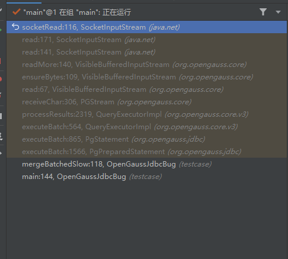
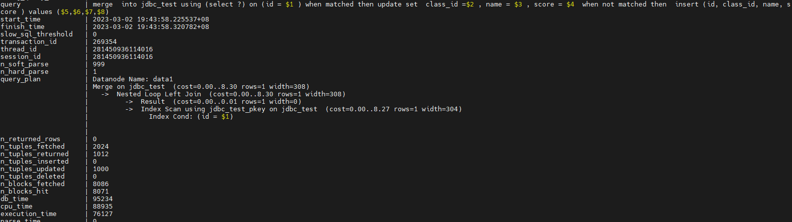

# opengauss-jdbc 问题整理

## 问题 1 jdbc 批量执行 insert 语句时返回结果不符合 Spring jpa 预期

**问题描述：**

jdbc 执行查询时，可以使用`preparestatment.executeBatch()`方法批量执行一组 sql 语句，该方法返回为`int[]`int 型数组变量，含义是批量执行的每个 sql 语句更新的数据行数。通过 spiring jpa 批量执行相同格式的语句时（例如`insert into table1 values (?, ?, ? , ?)`，批量执行 5 次 ），预期返回的 int 型数组值为`[1, 1, 1, 1, 1]`，实际返回结果为`[5, 0, 0, 0, 0]`，与预期部分，导致如下报错：

```
Caused by: org.springframework.orm.jpa.JpaSystemException: Batch update returned unexpected row count from update [0]; actual row count: XX; expected: 1; nested exception is org.hibernate.jdbc.BatchedTooManyRowsAffectedException: Batch update returned unexpected row count from update [0]; actual row count: XX; expected: 1
 at org.springframework.orm.jpa.vendor.HibernateJpaDialect.convertHibernateAccessException(HibernateJpaDialect.java:331)
```

**问题原因：**

jdbc 自身的优化机制，使用 executeBatch 批量执行 sql 时，如果批量执行 sql 格式相同，jdbc 默认会将多个 sql 合成一个执行，所以返回结果为`[5, 0, 0, 0, 0]`。

**解决办法：**

在连接串配置`batchMode=off`，所有 sql 分别执行，返回结果为`[1, 1, 1, 1, 1]`。

## 问题2 数据类型不匹配时查询速度慢的问题

**问题描述：**

jdbc创建一个主键为id的表。
```
create table jdbc_test (id int primary key, class_id int, name varchar(128), score number(10,2));
```
基于如下sql构造PrepareStatement，分别使用setInt()和setBigDecimal插入主键，sql执行实现相差明显。其中使用setInt()插入主键的比较快，使用setBigDecimal()插入主键的比较慢。
```
"merge  into " + tableName + " using (select 1) on (id = ? ) when matched then update set class_id =? , name = ? , score = ? when not matched then insert (id, class_id, name, score ) values (?,?,?,?)"
```
两种sql各执行1000次的耗时对比
```
使用int创建表，并准备数据
mergeBatchedFast,mergeCount:1000,cost:100 ms
mergeBatchedSlow,mergeCount:1000,cost:20733 ms
```

**分析过程：**
抓取jdbc堆栈，发现jdbc主要卡在等待socket响应的地方，判断sql执行过慢为内核原因。



在postgresql.conf添加如下配置
```
x log_min_duration_statement = 0
track_stmt_stat_level = 'L2,L2'
```
执行`select * from dbe_perf.statement_history;`对比两个sql的查询计划。执行较快的sql的查询计划中，使用的是索引扫描。执行较慢的sql的查询计划中，使用的是全表扫描。




**问题原因：**

jdbc_test表的主键是int类型，主键数据类型与输入数据类型不一致时，会导致索引失效。merge into执行时有join操作，在查询时，执行慢的sql使用numeric类型的数据检索，导致索引失效，所以使用全表扫描，执行时间较长。执行快的sql则使用的是索引扫描，执行时间短。

## 问题3 jdbc负载均衡功能适用范围相关说明及用例

1. **负载均衡功能的已有算法分类**：openGauss目前主要使用autoBalance实现负载均衡功能，包括："roundrobin"(轮询模式), "leastconn"（最小连接模式）， "shuffle"（随机模式）, "priority roundrobin"（带优先级的最小连接模式）。这些算法的主要实现思路是，在开发者通过在URL串上配置多个ip、port的方式连接主备集群时，在每次创建连接时，基于特定的负载均衡算法，对URL串上的数据库节点做优先级排序，优先在高优先级的节点上建连，使得连接均匀分散在各节点上。其中：
   * roundrobin（轮询模式）：通过该URL串连续创建连接时，根据固定顺序依次在URL串的各个节点上循环创建连接。
   * leastconn（最小链接模式）：JDBC在客户端内存里维护各节点通过该URL串创建的连接数，通过该URL串创建连接时，优先选择连接数少的节点创建连接。
   * shuffle（随机模式）：通过该URL串连续创建连接时，每次随机选择URL串中的节点创建连接。
   * priority roundrobin（带优先级的最小连接模式）：取值为"priority[n]", 与roundrobin相似，但是优先对前n个节点做轮询建连。
2. **负载均衡功能的适用范围**：
   * openGauss的负载均衡功能是基于连接的负载均衡功能，旨在基于特定算法在创建连接时将连接分散到URL串上的各节点上，与连接或数据库节点的实际运行压力无关。
   * roundrobin、leastconn、priority roundrobin三种模式的生效范round围是对单个进程内的同一集群的连接做负载均衡，如果同一个程序内有多个配置了相同autoBalance参数和相同数据库节点的URL串，JDBC会对通过这些URL串创建的连接统一做负载均衡。
3. **负载均衡功能与targetSeverType的配合方式**：
   在主备场景下，主节点可读可写，备节点可读不可写，如果连接主备集群时配置了autoBalance，并且业务中有写操作，有可能因为执行写操作的连接被创建在了备节点而报错。针对这种场景，可以将autoBalance和targetServerType配合使用，targetServerType可以控制只在主节点或者备节点上创建连接，并且targetServerType优先级高于autoBalance。以roundrobin为例，针对不同业务使用不同的URL串配置。
   ```
   jdbc:opengauss://node1,node2,node3/database?autoBalance=roundrobin&targetServerType=master
   jdbc:opengauss://node1,node2,node3/database?autoBalance=roundrobin&targetServerType=slave
   ```