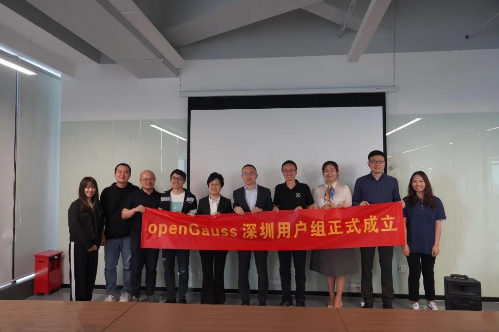
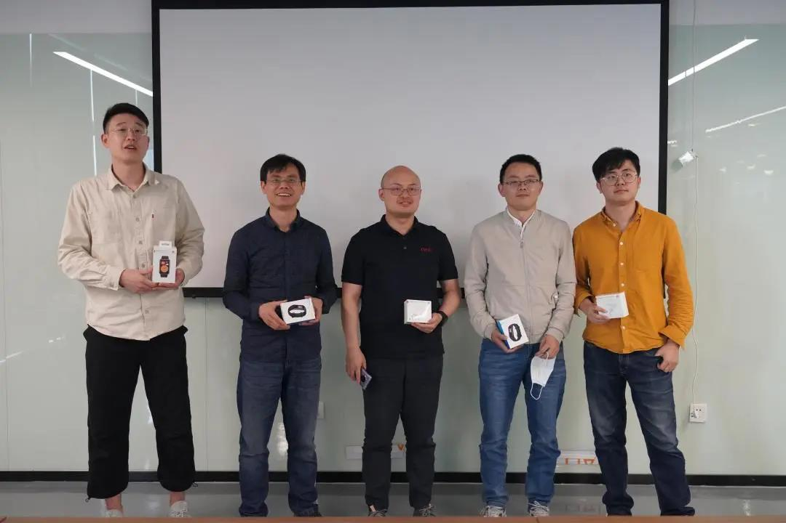

3 月 26 日，由 openGauss 社区和海量数据共同举办的 openGauss Meetup 在深圳国际开源谷顺利举行，同时 openGauss 首个城市用户组也正式成立。

### 深圳城市用户组人员名单：

<table class="meetup20210326">
	<tr>
	    <th>角色</th>
	    <th>姓名</th>
	    <th>公司</th>
	    <th>职位</th>  
	</tr>
	<tr>
	    <td>Organizer</td>
	    <td>李景娥</td>
	    <td>海量数据</td>
	    <td>大湾区企业客户部总经理</td>
	</tr>
	<tr>
	    <td rowspan="5">Ambassador</td>
	    <td>林根</td>
	    <td>海量数据</td>
	    <td>大湾区技术总监</td>
	</tr>
	<tr>
	    <td>田文罡</td>
	    <td>华为</td>
	    <td>openGauss架构师</td>
	</tr>
	<tr>
	    <td>李思昊</td>
	    <td>华为</td>
	    <td>CCF委员</td>
	</tr>
	<tr>
	    <td>熊小军</td>
	    <td>华为</td>
	    <td>openGauss布道师</td>
	</tr>
    <tr>
	    <td>周俊</td>
	    <td>视源股份</td>
	    <td>数据运维部门经理</td>
	</tr>
	<tr>
	    <td rowspan="2">Member</td>
	    <td>朱彬</td>
	    <td>华为</td>
	    <td>深圳产品经理</td>
	</tr>
    <tr>
	    <td>王铭玥</td>
	    <td>海量数据</td>
	    <td>产品发展部</td>
	</tr>
	
</table>

\*此表名单于 2021 年 3 月 26 日更新

此外，来自多个企业的技术专家分享了他们在数据库领域的实践和思考。

openGauss 城市用户组，英文名称：openGauss User Group，简称 oGUG. 是 openGauss 用户发起的以城市为组织单位的社群组织，聚集对开源关系型数据库管理系统 openGauss 认同或使用的企事业单位、社会组织、个人开发者。

oGUG 致力于构建一个开放、多元、包容的 openGauss 城市用书交流社区，鼓励当地任何企事业单位、社会组织、个人开发者在该社区内开展技术讨论、开拓新思路和实践新方案。

oGUG 由 Organizer、Ambassador、Member 三种角色构成。

Organizer: 整体统筹和规划区域 openGauss 发展方向及计划，并跟进与把控整体进度。

Ambassador:专注于帮助他人了解或使用 openGauss，并代表用户优化产品体验，增进其他用户对 openGauss 的了解。

Member: 根据运营计划，配合 oGUG 的日常运营，以用户身份积极参加活动，产出技术内容，积极推广 openGauss.

如果你也想成为 oGUG 的一员，欢迎扫描下方二维码进行报名。

此外，来自多个企业的技术专家分享了他们在数据库领域的实践和思考。

openGauss 数据库领域项目总监蔡亚杰进行了开场致辞，介绍了 openGauss 当前技术和商业进展，也号召广大开发者和 DBV 共同加入到 openGauss 社区中，共同实践、共同创新，提出更有竞争力，更符合企业级的 openGauss 特性。

<video id="my-video" class="video-js" controls preload="auto" width="100%" poster="./1.png">
    <source src="https://learningvideo.obs.ap-southeast-1.myhuaweicloud.com:443/%E6%B7%B1%E5%9C%B3Meetup/%E5%BC%80%E5%9C%BA%E8%87%B4%E8%BE%9E-%E8%94%A1%E4%BA%9A%E6%9D%B0.mp4">您的浏览器不支持video标签。
</video>
openGauss数据库领域项目总监蔡亚杰

本次活动也得到了深圳国际开源谷的支持，深圳国际开源谷的运营负责人刘跃峰发表了欢迎致辞。欢迎各个开源的企业能够入驻开源谷，共同打造开源生态。

<video id="my-video" class="video-js" controls preload="auto" width="100%" poster="./2.jpg">
    <source src="https://learningvideo.obs.ap-southeast-1.myhuaweicloud.com:443/%E6%B7%B1%E5%9C%B3Meetup/%E6%AC%A2%E8%BF%8E%E8%87%B4%E8%BE%9E-%E5%88%98%E8%B7%83%E5%B3%B0.mp4">您的浏览器不支持video标签。
</video>
深圳国际开源谷运营负责人刘跃峰

openGauss 技术委员会成员周平高为大家带来“openGauss 多核优化技术解读”，介绍了 openGauss 在多核优化的设计、实现、规划等技术发展历程。

<video id="my-video" class="video-js" controls preload="auto" width="100%" poster="./3.png">
    <source src="https://learningvideo.obs.ap-southeast-1.myhuaweicloud.com:443/%E6%B7%B1%E5%9C%B3Meetup/%E5%91%A8%E5%B9%B3%E9%AB%98.mp4">您的浏览器不支持video标签。
</video>
openGauss技术委员会成员周平高

海量数据高级软件研发工程师石青带来“openGauss 数据库透明加密原理介绍及代码解读”，主要介绍了围绕 AES 及 SM4 加解密算法、秘钥生成及校验、数据透明加解密过程等技术原理及代码实现等精彩内容。

<video id="my-video" class="video-js" controls preload="auto" width="100%" poster="./4.png">
    <source src="https://learningvideo.obs.ap-southeast-1.myhuaweicloud.com:443/%E6%B7%B1%E5%9C%B3Meetup/%E7%9F%B3%E9%9D%92.mp4">您的浏览器不支持video标签。
</video>
海量数据高级软件研发工程师

宝兰德售前总监詹年科带来议题“从 Java 中间件 jdbc 客户端看数据库”。典型 IT 系统中，中间件负责信息处理，数据库负责信息存储。众多的在线系统中集中式的数据库系统通常会成为整体业务的性能关键点。从中间件的角度来看，会使用到哪些常见关键技术来提升数据库资源使用效率和性能呢？本次议题分享中为大家带来详细介绍。

<video id="my-video" class="video-js" controls preload="auto" width="100%" poster="./5.png">
    <source src="https://learningvideo.obs.ap-southeast-1.myhuaweicloud.com:443/%E6%B7%B1%E5%9C%B3Meetup/%E8%A9%B9%E5%B9%B4%E7%A7%91.mp4">您的浏览器不支持video标签。
</video>
宝兰德售前总监詹年科

openGauss 数据库内核工程师阙鸣健分享了“openGauss 鲲鹏多核优化实践”，介绍鲲鹏平台下 openGauss 数据库性能面临的问题以及如何一步步通过性能优化手段来消除瓶颈，达到 2P->4P TP 场景性能稳步提升。

<video id="my-video" class="video-js" controls preload="auto" width="100%" poster="./6.png">
    <source src="https://learningvideo.obs.ap-southeast-1.myhuaweicloud.com:443/%E6%B7%B1%E5%9C%B3Meetup/%E9%98%99%E9%B8%A3%E5%BB%BA.mp4">您的浏览器不支持video标签。
</video>
openGauss数据库内核工程师阙鸣健

最后为大家带来技术分享的是来自视源股份系统运维部经理周俊，带来议题“基于数据库流计算技术的最佳应用实践”，主要分享基于流计算，实现异地多工厂生产数据实时计算、监控预警及决策的应用实践。

<video id="my-video" class="video-js" controls preload="auto" width="100%" poster="./7.png">
    <source src="https://learningvideo.obs.ap-southeast-1.myhuaweicloud.com:443/%E6%B7%B1%E5%9C%B3Meetup/%E5%91%A8%E4%BF%8A.mp4">您的浏览器不支持video标签。
</video>
视源股份系统运维部经理周俊

在分享交流结束后，为了感谢各位小伙伴对本次活动的支持与参与，我们进行了抽奖环节，有 5 位幸运儿抽到我们送出的华为手表、华为无线耳机、华为荣耀手环，这里再次祝贺各位获奖的朋友。

openGauss Meetup 通过打造一个自由、活跃的前沿技术交流空间，定期邀请业内专家分享和探讨数据库领域的前瞻性技术思考与经验，共同构建一个能够融合多元化技术架构的企业级开源数据库社区。我们下次再见！
