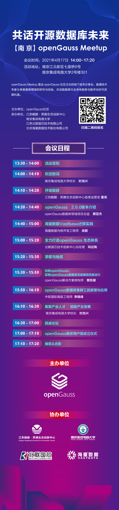
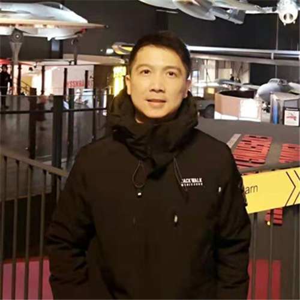

---
title: '南京openGauss Meetup'
time: '2021/04/17'
date: '2021-04-17'
category: 'events'
tags: '会议'
label: '线下'
location: '南京'
img: '/category/events/2021-04-17/poster.png'
img_mobile: '/category/events/2021-04-17/poster.png'
link: '/zh/events/2021-04-17/meetup.html'
author: 'openGauss'
summary: ''
---

### 活动信息

活动主题：共话开源数据库未来

主办方：openGauss 社区

承办方： 江苏鲲鹏•昇腾生态创新中心、南京集成电路大学、江苏北联国芯技术有限公司、北京海量数据技术股份有限公司、中软国际有限公司

时间：2021 年 4 月 17 日（周六）14:00-17:20

地点：南京江北新区人力资源服务产业园 南京集成电路大学 报告厅

### 会议议程：

<strong>欢迎致词 | 南京集成电路大学校长 时龙兴 </strong>

<strong>开场致辞 江苏鲲鹏•昇腾生态创新中心首席运营官 董亮</strong>

<strong>openGauss2.0.0 版本介绍 | openGauss 数据库领域项目总监 蔡亚杰</strong>

讲师简介：openGauss 数据库领域项目总监，华为 10 年数据库研发经验

议题简介：介绍 openGauss2.0.0 版本的新特性及原理。

<strong>玩转 openGauss，实现 openGauss 数据库无故障高性能运行 | openGauss 解决方案架构师 黄凯耀</strong>

讲师简介：曾任 Oracle 公司产品管理部门性能架构师，在数据库应用系统架构优化、OLTP 高并发与高效率优化、OLAP 高可扩展性优化上积累了丰富的实践经验和系统的方法论。曾任华为 2012 实验室容灾与数据库可靠性专家，对于容灾多活架构及关键技术有深入研究。目前担任 openGauss 解决方案架构师，构建 openGauss 端到端的解决方案竞争力。

议题简介：数据库的可管理性是企业级数据库的基础必备能力。本演讲介绍 openGauss 中可管理性相关的技术，包括 WDR(Workload Diagnosis Report)诊断报告, 一键式收集诊断信息， 慢 SQL 诊断等关键特性及其实战应用。

<strong>海量数据 Vastbase 迁移实践 | 海量数据内核开发工程师 余鹏</strong>

讲师简介：毕业于中科院计算所，先后就职于阿里巴巴、Teradata 中国研发中心，专注于数据库内核技术

议题简介：主要介绍基于 openGauss 商业定制版数据库--Vastbase 对 Oracle 的特性兼容

<strong>全力打造 openGauss 生态体系 | 北联国芯技术创新中心总经理 邓近陶</strong>

议题简介：华为使能之下，全力打造 openGauss 生态体系。

<strong>openGauss 数据库集群工具原理与应用 | 中软国际高级工程师 李臻峰</strong>

讲师简介：91 年毕业于电子科技大学物理电子就是专业，98 年考入南京航空航天大学研究生，研究方向数据库与软件工程。2001 年进入华为，先后从事过 S8016 交换机测试、位置业务、IDEA 业务开发、总体组性能专项、分布式数据库服务中间件研发等工作。在华为的最后几年与数据库结下不解之缘，17 年从华为内部退休后进入中软，一直负责数据库相关工作。擅长领域包括分布式系统设计、性能设计、数据库研发与应用。

议题简介：GGHK（GaussDB Group Housekeeper）是 2020 年我们自研开发的一个工具，定位于为 openGauss 数据库提供集群管理能力，为 openGauss 集群实现自动化的高可用主备节点管理，并实现浮动 IP，为 openGauss 集群对外呈现统一的 IP 服务，给用户提供了故障时备份的解决方案，并使得用户通过浮动 IP 访问 openGauss 数据库集群就像使用单实体数据库一样简单方便。本演讲主要介绍工具需要解决的问题、解决问题的方法、后续的发展思路、以及工具的使用。希望通过本演讲帮助大家了解和使用 GGHK 工具，并通过本工具助力 openGauss 数据库在生产中的应用。

### 报名链接

### 活动彩蛋

参会有礼：参与此次活动即可获得 openGauss 定制雨伞一把。

互动有礼：与讲师积极互动均还可获得《openGauss 数据库核心技术》书籍一本。

抽奖有礼：本次活动设有现场抽奖环节，一等奖 freebuds3*1 位，二等奖 freelace*2 位，三等奖华为电动牙刷\*3 位。

<strong>希望本次活动能帮助你更加了解 openGauss，融入 openGauss 大家庭，期待能与你在校园相遇！</strong>
