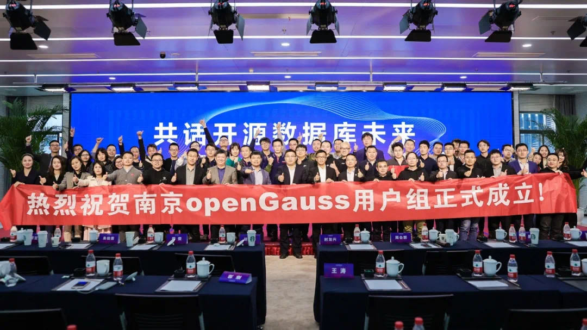
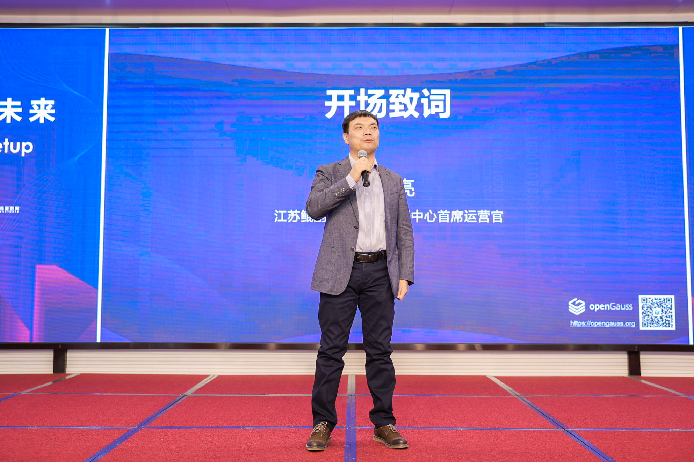
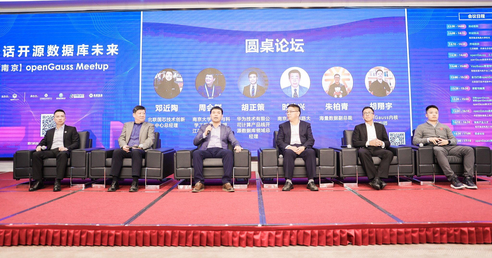
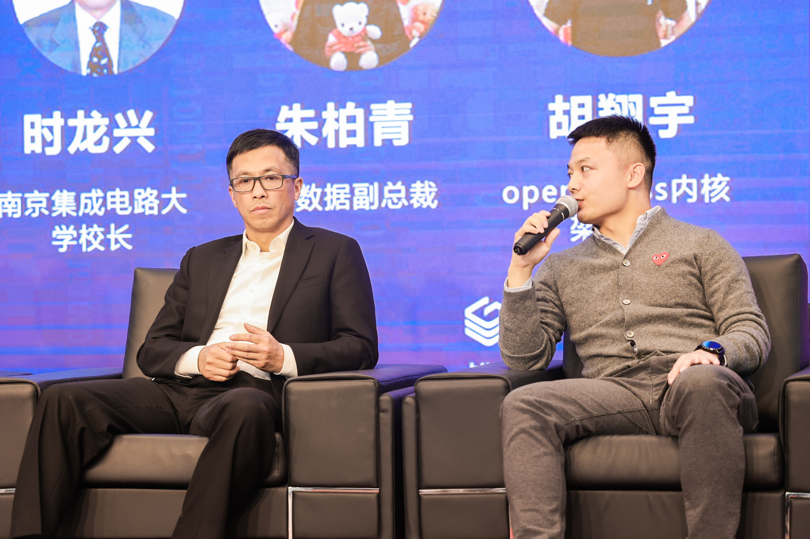

---
title: '集结产学研力量，openGauss南京用户组正式成立'
time: '2021/04/16'
date: '2021-04-16'
category: 'events'
tags: '会议'
label: '线下'
location: '南京'
img: '/category/events/2021-04-18/banner.jpg'
img_mobile: '/category/events/2021-04-18/banner.jpg'
link: '/zh/events/2021-04-18/meetup.html'
author: 'openGauss'
summary: ''
---

<video id="my-video" class="video-js" controls preload="auto" width="100%" >
    <source src="https://learningvideo.obs.myhuaweicloud.com:443/openGauss%E5%8D%97%E4%BA%ACMeetup/openGauss%E5%8D%97%E4%BA%ACMeetup-%E8%A7%86%E9%A2%91.mp4">您的浏览器不支持video标签。
</video>

4 月 17 日，由 openGauss 社区主办，江苏鲲鹏·昇腾生态创新中心、南京集成电路大学、江苏北联国芯技术有限公司、北京海量数据技术股份有限公司、中软国际有限公司合办的【南京】openGauss Meetup 活动在南京集成电路大学顺利举行，同时 openGauss 南京用户组也正式成立。

此次 Meetup 可谓大咖云集，东南大学首席教授、南京集成电路大学校长时龙兴校长，南京大学地球与科学工程学院周会群教授、南京江北新区产业技术研创园党工委副书记、江苏北联国芯技术有限公司负责人周荣，海量数据副总裁朱柏青，江苏鲲鹏.昇腾生态创新中心首席运营官董亮，北联国芯技术创新中心负责人邓近陶等领导和专家出席了本次活动。

此次活动引了来自多个领域的 63 家公司的朋友参与，线上直播触达人数达一万三千余次，是第一次真正“产、学、研、用”全生态链广泛参与的城市级 Meetup，是 openGauss 社区发展过程中的一个重要历史节点。下面将对本次活动进行回顾。

活动开始，东南大学首席教授、南京集成电路大学校长时龙兴作为东道主发表了欢迎致辞，并对 openGauss Meetup 的举办表示祝贺。时校长表示，数据库在自主可控的同时，也必须兼顾软硬适配的发展性能 ，只有这样才能构成良好的生态，才是真正支撑我们信息产业高质量发展的基础。此外，时校长对 openGauss 产业生态的打造也表示非常期待，希望未来 openGauss 与南京集成电路大学能够达成深度战略合作，成为产教（产业与人才培养）融合的一个示范平台。

<video id="my-video" class="video-js" controls preload="auto" width="100%" poster="./时龙兴欢迎致辞.jpg">
    <source src="https://learningvideo.obs.myhuaweicloud.com:443/openGauss%E5%8D%97%E4%BA%ACMeetup/%E5%8D%97%E4%BA%AC%E9%9B%86%E6%88%90%E7%94%B5%E8%B7%AF%E5%A4%A7%E5%AD%A6%E6%97%B6%E9%BE%99%E5%85%B4%E6%AC%A2%E8%BF%8E%E8%87%B4%E8%AF%8D.mp4">您的浏览器不支持video标签。
</video>东南大学首席教授、南京集成电路大学校长时龙兴

作为南京用户组的 Organizer，江苏鲲鹏、昇腾生态创新中心的首席运营官董亮发表了相关致辞。“江苏鲲鹏、昇腾生态创新中心自运营一年多以来，在各个行业领域应用生态都逐渐体系化，目前已经聚集了一批基于开源软件的相关企业，多次联合产、学、研各方力量展开密切合作，将来也将持续推进包括 openGauss 等开源基础软件在内的一些生态建设。

<video id="my-video" class="video-js" controls preload="auto" width="100%" poster="./董亮.jpg">
    <source src="https://learningvideo.obs.myhuaweicloud.com:443/openGauss%E5%8D%97%E4%BA%ACMeetup/%E8%91%A3%E4%BA%AE%E8%87%B4%E8%AF%8D.mp4">您的浏览器不支持video标签。
</video>江苏鲲鹏、昇腾生态创新中心首席运营官董亮

随后，openGauss 数据库领域总经理胡正策发表了开场致辞。他就 openGauss 的产品定位以及社区进展做了相关分享，他表示，此次活动作为首次集合产学研用整个全产业链的城市级的 Meetup 盛会，是 openGauss 社区发展历史上的一个关键节点，意义非凡。

openGauss数据库领域总经理胡正策

openGauss 作为一款面向企业和应用场景的企业级开源关系型数据库，openGauss 自 2020 年 6 月份开源到今年 3 月，openGauss 发布了第一个 Release 版本，在高性能、高可靠、高安全等方面都有了重大的突破，不仅发布了最好的单机性能内核，同时还支持原创的多地多中心的高可用能力，还发布了业界首个全密态的数据库。

正策总表示：“一个数据库的生态打造是任重道远的，需要我们全产业链联合所有的产学研力量。目前 openGauss 社区进展喜人，社区开发者达到 1200 名，社区用户达到 12000+，已经触达了全国 38 个国家的 311 个城市，社区下载量达到 14 万次，不仅有 6 个企业基于 openGauss 发布了商业发行版，同时也有像中国电信、深信服、北京超图、民生银行等各行各业的头部企业加入到 openGauss 社区，共同为中国的数据库社区建设而努力。”

其后，来自各个企业的专家为大家做了一系列分享。

openGauss 数据库领域项目总监蔡亚杰带来 openGauss 的版本介绍。就 openGauss 的高性能、高安全、高可靠、智能运维等特性做了详细的介绍，同时也发布 openGauss2021 年的版本规划，欢迎大家到 openGauss 社区下载体验。

<video id="my-video" class="video-js" controls preload="auto" width="100%" poster="./蔡亚杰.jpg">
    <source src="https://learningvideo.obs.myhuaweicloud.com:443/openGauss%E5%8D%97%E4%BA%ACMeetup/%E8%94%A1%E4%BA%9A%E6%9D%B0-openGauss%E7%89%88%E6%9C%AC%E4%BB%8B%E7%BB%8D.mp4">您的浏览器不支持video标签。
</video>openGauss数据库领域项目总监蔡亚杰

作为 openGauss 的合作伙伴，海量数据基于对 openGauss 核心架构的深刻理解，深度结合各行业应用场景特点和需求，历经多年匠心打磨，推出企业级关系型数据库 Vastbase。此次，海量数据内核开发工程师余鹏就为大家带来“海量数据 Vastbase 迁移实践”的主题分享，对 Vastbase 的兼容技术做了深入的讲解，同时还为大家介绍了 Exbase 迁移工具以及相关的迁移实践。

<video id="my-video" class="video-js" controls preload="auto" width="100%" poster="./余鹏.jpg">
    <source src="https://learningvideo.obs.myhuaweicloud.com:443/openGauss%E5%8D%97%E4%BA%ACMeetup/%E6%B5%B7%E9%87%8F%E6%95%B0%E6%8D%AE-%E4%BD%99%E9%B9%8F.mp4">您的浏览器不支持video标签。
</video>海量数据内核开发工程师余鹏

同步 openGauss 社区的蓬勃发展，北联国芯在智能制造、运维服务、技术创新、生态集群等方面也已与 openGauss 社区展开紧密合作，共同构建产业生态。基于此，北联国芯技术创新中心负责人邓近陶为大家做了关于“全力打造 openGauss 生态体系”的相关分享，目前正在布局借助北联国芯服务器，联合 openGauss 数据库，打造 Database all in one 高性能、高可靠的数据库一体机。同时，集成以北联云为数字底座，充分发挥 openGauss 高性能数据处理能力为各种应用场景提供高效的数据服务。

<video id="my-video" class="video-js" controls preload="auto" width="100%" poster="./邓近陶.jpg">
    <source src="https://learningvideo.obs.myhuaweicloud.com:443/openGauss%E5%8D%97%E4%BA%ACMeetup/%E5%8C%97%E8%81%94%E5%9B%BD%E8%8A%AF-%E9%82%93%E8%BF%91%E9%99%B6.mp4">您的浏览器不支持video标签。
</video>北联国芯技术创新中心总经理邓近陶

数据库的可管理性是企业级数据库的基础必备能力，基于此，openGauss 解决方案架构师黄凯耀为大家带来关于如何玩转 openGauss，实现 openGauss 数据库无故障高性能运行的相关分享。为我们介绍了 openGauss 可管理性相关技术，包括 WDR(Workload Diagnosis Report) 诊断报告，一键式收集诊断信息，慢 SQL 诊断等关键特性及其实战应用。

<video id="my-video" class="video-js" controls preload="auto" width="100%" poster="./黄凯耀.jpg">
    <source src="https://learningvideo.obs.myhuaweicloud.com:443/openGauss%E5%8D%97%E4%BA%ACMeetup/%E5%8D%8E%E4%B8%BA-%E9%BB%84%E5%87%AF%E8%80%80.mp4">您的浏览器不支持video标签。
</video>openGauss解决方案架构师黄凯耀

之后，为大家带来分享的是有着资深数据库技术经验的中软国际高级工程师李臻峰。他的分享主题是“openGauss 数据库集群工具原理与应用”，正如他的题目，他主要为我们介绍了 GGHK（openGauss Group Housekeeper，openGauss 数据库提供集群管理能力的一个工具。）需要解决的问题、解决问题的方法、后续发展思路以及工具的使用等。希望帮助大家了解和使用 GGHK 工具，并通过本工具助力 openGauss 数据库在生产中的应用。

<video id="my-video" class="video-js" controls preload="auto" width="100%" poster="./李臻峰.jpg">
    <source src="https://learningvideo.obs.myhuaweicloud.com:443/openGauss%E5%8D%97%E4%BA%ACMeetup/%E4%B8%AD%E8%BD%AF%E5%9B%BD%E9%99%85-%E6%9D%8E%E8%87%BB%E5%B3%B0.mp4">您的浏览器不支持video标签。
</video>中软国际高级工程师李臻峰

最后，东南大学首席教授、南京集成电路大学校长时龙兴为大家做了关于“集聚产业人才，赋能产业发展”的相关分享。南京集成电路大学以培养复合型产业人才为定位，成为产教融合的示范平台。与传统高校取长补短，以机制创新、相互补充的方式，解决当前人才培养难点，促进地方产业发展，是高校人才培养的重要补充，是企业选拔人才的重要来源。

分享结束后，集聚产、学、研、用的大咖圆桌会谈将本次盛会推上了高潮。

（出席本次圆桌论坛的嘉宾从左到右分别是：北联国芯技术创新中心负责人邓近陶，南京大学地球与科学工程学院周会群教授，openGauss数据库领域总经理胡正策，南京江北新区产业技术研创园党工委副书记周荣，海量数据副总裁朱柏青，openGauss内核架构师胡翔宇）

在圆桌论坛讨论环节，各位专家和行业大咖就《数据库行业未来发展》，《鲲鹏产业以及数据库产业发展》《未来软件行业人才培养》《openGauss 未来规划》等话题纷纷发表了自己的看法。

就如何看待数据库行业未来发展，openGauss 数据库领域总经理胡正策表示：“我们真正缺乏的是数据库核心技术，国外数据库占据国内市场大半江山，关键命脉掌握在别人手中，我们需要真正把内核技术提升起来。同时，针对国内众多数据库厂商技术路线分散的情况，我们需要团结一切力量，发展一个强有力的社区，打造强竞争力的企业级数据库。”

在谈到关于鲲鹏产业以及数据产业发展时，江北新区产业技术研创园党工委副书记、江苏北联国芯技术有限公司负责人周荣呼吁：现在国内外大量产生数据，给我们数据库带来很多机会，以江北新区为例，布局打造电子信息产业生态，打造数据库使用的生态环境，立志成为一个旗帜，一个标杆。希望大家通过 openGauss 开源数据库壮大自己的力量，为我们的民族事业做贡献。

海量数据副总裁朱柏青也表示：对开源数据库以及鲲鹏产业的未来发展前景充满期待。选择鲲鹏路线，非常认可鲲鹏芯片的发展潜力，有朝一日定将与 Intel 芯片并驾齐驱，基于 openGauss 做商业发行版，是综合各方情况综合考虑的结果。海量数据已经结合各行业应用场景推出了 vastbase，高可用企业级数据库已获得企业广泛认可。

南京大学地球与科学工程学院教授周会群表示：“数据库的应用领域远远不止企业，在科研及工程领域也少不了数据库的支持，过去科学研究领域与数据库应用领域有一些鸿沟，但是现在大家都知道数据是一种非常重要的资产，从用好数据到把数据真正变成一种资产，关键取决于我们如何管理这些数据，管理这些平台上生长出来的各种应用。”

北联国芯技术创新中心负责人邓近陶指出：鲲鹏生态体系的建设，不仅仅是需要硬件的支持、开源软件的支持，同时也需要在研究上面做一些分析。当前，国家也在大力提倡工业的信息化，我们可以基于此背景，融合软件、硬件、芯片、中间件，全力打造一个数字化的生态体系。

最后，openGauss 内核架构师胡翔宇就 openGauss 未来规划为大家做了一个简简要分享。随着数据模型和业务负载的变化，数据管理系统的架构和功能也需要有针对性的发展和进步。目前 openGauss 在功能上瞄准 OLTP 和 OLAP 的关系模型和负载，同时也关注其它诸如时序、图、稀疏数据等模型和 IOT、云原生等场景。openGauss 不仅会在性能、安全、南北向兼容等内核能力上持续突破和领先，也会在架构上支持新的场景。更重要的是，这些技术和方案都会开源到社区，和所有开发者与伙伴分享。

**随着 openGauss 社区的蓬勃发展，openGauss 的生态构建也正在如火如荼进行中，openGauss 将持续全面友好开放，携手伙伴共同打造全球领先的企业级开源关系型数据库。希望此次论坛的举办能带给业内人士更多的启发，带动更多相关产业投入到开源产业链的建设中来。**
