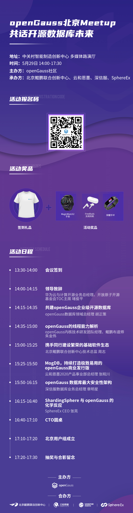

---
title: 'openGauss Meetup 北京站报名开启'
time: '2021/05/29'
date: '2021-05-29'
category: 'events'
tags: '会议'
label: '线下'
location: '北京'
img: '/category/events/2021-05-29/banner.png'
img_mobile: '/category/events/2021-05-29/banner.png'
link: '/zh/events/2021-05-29/meetup.html'
author: 'openGauss'
summary: ''
---

### 活动介绍

随着开源开放的理念兴起，openGauss 在众多领域商业应用，众多机构积极拥抱开源，坚持开放共享。

由 openGauss 社区主办，北京鲲鹏联合创新中心、云和恩墨、深信服、SphereEx 联合举办的 openGauss 北京 Meetup 将于 5 月 29 日（周六）在北京进行，本次活动邀请众多 openGauss 技术专家、生态建设伙伴、商业实践伙伴、数据安全领域专家进行议题分享，共同探讨开源数据库的未来，聚焦 openGauss 运营进展、安全、商业实践、基础设施等热门话题，为社区发展注入创新活力，实现共建、共享、共治

### 活动详情

主办方：openGauss 社区

合办方： 北京鲲鹏联合创新中心、云和恩墨、深信服、SphereEx

时间：2021 年 5 月 29 日（周六）14:00-17:10

主题：openGauss 北京 Meetup 共话开源数据库未来

地点：北京市中关村智能制造创新中心多媒体路演厅

### 会议议程：

### 演讲嘉宾：

<strong>领导致词 | 华为云与计算开源业务总经理、开放原子开源基金会 TOC 主席 堵俊平 </strong>

<strong>共建 openGauss 企业级开源数据库 openGauss 数据库领域总经理 胡正策 </strong>

<strong>openGauss 的线程能力解析 | openGauss 内核技术研发团队经理 鲲鹏布道师 朱金伟</strong>

讲师简介：7 年数据库内核研发经历，擅长优化器、执行器、数据库安全、存储相关技术。

议题简介：数据库性能取决于多方面因素的综合考虑，而执行性能主要取决于单线程/进程的执行能力，LLVM 动态编译技术压榨单线程能力，SMP 并行执行技术压缩多线程协同能力，共同构建 openGauss 并行执行架构。

<strong>携手同行建设繁荣的基础软件生态 | 北京鲲鹏联合创新中心技术总监 周志</strong>

讲师简介：为中国区鲲鹏生态发展部架构师、北京鲲鹏联合创新中心 FAEleader，从事 10+年 IT 行业产品解决方案设计、项目管理等工作经验

议题简介：最强的智是众智，最大的力是合力。通过开源的方式把华为多年来构建的操作系统、数据库等能力开放出来，和伙伴共同构建生态，加速基础软件关键技术的创新突破。

<strong>MogDB，持续打造极致易用的 openGauss 商业发行版 | 云和恩墨 2020 产品事业部总经理 张皖川</strong>

讲师简介：曾就读于威斯康星大学（麦迪逊分校），获数学博士、计算机硕士学位。先后加入 IBM、百度云数据库团队，在数据库内核、存储、高可用、列存/向量化执行等领域有丰富的研发经验。2020 年加入云和恩墨，现负责企业级数据库 MogDB 的研发。

议题简介：作为社区的首批核心成员，云和恩墨积极投入社区贡献，依托 openGauss 内核发布了企业级数据库 MogDB，并已成功落地国有大型银行的核心交易系统，解决了金融核心系统面临的高并发条件下性能、稳定性、高可用保障及扩展能力的挑战。本次演讲将着重介绍刚刚发布的 MogDB 2.0 的特色功能，并分享成功案例的实践经验。

<strong>携手同行建设繁荣的基础软件生态 | 深信服数据库业务总经理 章明星</strong>

讲师简介：博士毕业于清华大学，在多个 国际顶级会议和期刊上发表论文 20 余篇，获得 ACM SIGSOFT 杰出论文奖，IEEE TCSC、ACM SIGOPS 等多个组织颁发的优博奖项等奖励。当前担任深信服数据库业务总经理，公司技术委员会委员，先后主导 SAVE、安全大数据平台、数据库等项目孵化。

议题简介：最强的智是众智，最大的力是合力。通过开源的方式把华为多年来构建的操作系统、数据库等能力开放出来，和伙伴共同构建生态，加速基础软件关键技术的创新突破。

<strong>ShardingSphere 与 OpenGauss 的化学反应 | SphereEx CEO 张亮</strong>

讲师简介：SphereEx 公司创始人，曾任京东科技架构专家，当当架构部总监。Apache ShardingSphere，ElasticJob 创始人 & 项目管理委员会主席，热爱开源。擅长以 Java 为主分布式架构，推崇优雅代码，热爱技术分享，曾多次在技术大会中担任出品人和分享嘉宾。曾出版书籍《未来架构——从服务化到云原生》。

议题简介：Apache ShardingSphere 作为 Database Plus 产品，可以适配多种数据库并为其带来增量价值。本次分享将介绍联合使用 Apache ShardingSphere 与 OpenGauss 所产生的化学反应，打开数据库领域合作的大门。

### 报名链接

### 活动彩蛋

伴手礼：参与此次活动前 100 名即可获得 openGauss 定制 T 恤一件

互动有礼：与讲师积极互动均还可获得《openGauss 数据库核心技术》书籍一本。

抽奖有礼：本次活动设有现场抽奖环节，一等奖华为运动手表*1，二等奖华为无线耳机*2 位，三等奖荣耀运动手环\*3 位。

<strong>希望本次活动能帮助你更加了解 openGauss，融入 openGauss 大家庭，期待能与你相遇！</strong>
