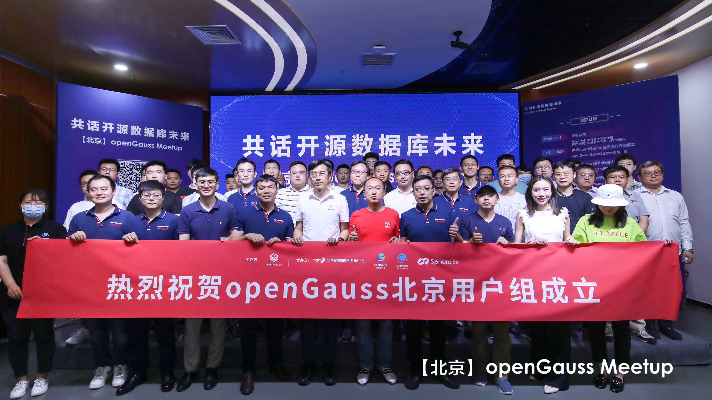
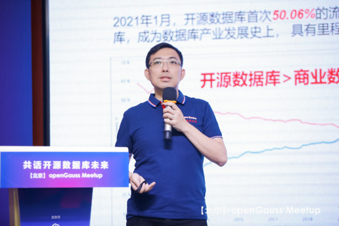
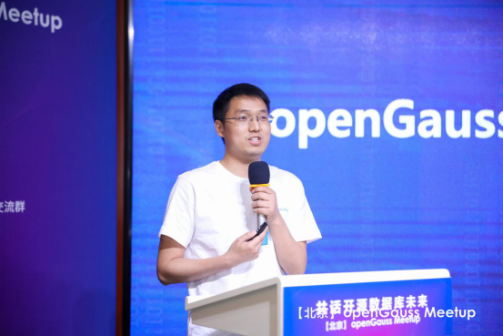
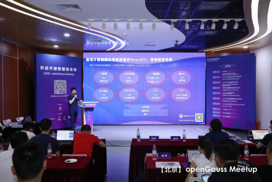
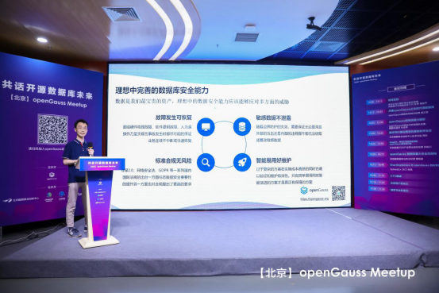
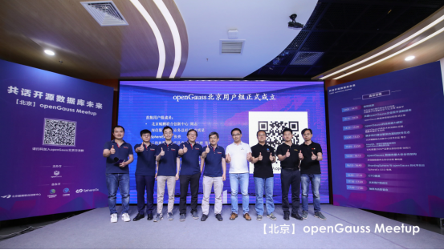

---
title: 'openGauss北京Meetup成功举办，“产学研用”合力共建主流根社区'
time: '2021/05/31'
date: '2021-05-31'
category: 'events'
tags: '会议'
label: '线下'
location: '北京'
img: '/category/events/2021-05-31/banner.jpg'
img_mobile: '/category/events/2021-05-31/banner.jpg'
link: '/zh/events/2021-05-31/meetup.html'
author: 'openGauss'
summary: ''
---

<video id="my-video" class="video-js" controls preload="auto" width="100%" >
    <source src="https://learningvideo.obs.myhuaweicloud.com:443/%E5%8C%97%E4%BA%ACMeetup%20/QQ%E8%A7%86%E9%A2%9120210531170709.mp4 ">您的浏览器不支持video标签。
</video>

5 月 29 日，由 openGauss 社区主办，北京鲲鹏联合创新中心、云和恩墨、深信服、SphereEx 合力承办的“【北京】openGauss Meetup”活动在北京海淀区中关村智能制造创新中心成功举行。此次活动邀请了著名高校学者、openGauss 资深专家、生态建设伙伴、商业实践伙伴、软硬件行业伙伴，在 openGauss 的创新特性、商用应用与实践、学术创新、生态构建、数据库开源行业动态及未来趋势进行了精彩分享和充分讨论，在“产学研用”合力共建数据库主流根社区上达成一致意见，并正式成立 openGauss 北京用户组。

**openGauss北京用户组正式成立**

**此次活动是“openGauss 生态全国行”系列活动的关键一站，吸引了来自北京地区各个行业的 42+家企业的近百名专家和开发者踊跃参与，在线观看超过 5000 人次，是又一次真正“产、学、研、用”全生态链广泛参与的城市级 Meetup，也是 openGauss 社区发展过程中的另一个重要历史节点。**

此次 Meetup 可谓大咖云集，华为云与计算开源业务总经理、开放原子开源基金会 TOC 主席堵俊平，华为计算产品线鲲鹏计算副总裁江大勇、华为计算产品线 openGauss 数据库产品总经理胡正策，云和恩墨创始人、总经理、ACDU 理事长、鲲鹏 MVP 盖国强，清华大学数据库组副研究员张勇，SphereEx CEO 张亮，云和恩墨 2020 产品事业部总经理张皖川，深信服数据库业务总经理章明星，openGauss 内核技术研发团队经理、openGauss 布道师朱金伟，北京鲲鹏联合创新中心技术总监周志等领导和专家出席了本次活动。

活动开始，华为云与计算开源业务总经理、开放原子开源基金会 TOC 主席堵俊平致辞，对 openGauss 北京 Meetup 的举办表示祝贺。堵俊平表示："万物互联、万物感知、万物智能时代，驱动数据库创新，同时开源驱动数据库产业创新发展、中国转变为开源贡献者。华为深度参与多个开源基金会，贡献各大开源社区。华为坚持“硬件开放，软件开源，使能伙伴，发展人才”繁荣基础软件生态的商业策略，开源企业级数据库 openGauss，openGauss 社区持续开放社区治理架构，与合作伙伴、用户、开发者等共建、共享、共治，共同打造主流数据库开源社区。"

**华为云与计算开源业务总经理、开放原子开源基金会 TOC 主席 堵俊平**

随后，华为计算产品线 openGauss 数据库产品总经理胡正策以“共建企业级开源数据库”为主题发表相关分享，他表示："当前国内数据库市场百花齐放，关键还是要构建基础根技术，openGauss 源于十余年市场充分锤炼，具有领先的高性能、高安全、高可用、易运维等内核能力。当前 openGauss 已经有 6 家合作伙伴推出商业发行版，已在多个国计民生行业完成商业落地，实现核心系统技术升级；同时已经有超过 30+来自各大行业的头部企业签署协议加入 openGauss 社区，在不远的将来，更多的伙伴会推出面向各自细分领域的商业发行版和解决方案；openGauss 社区下载量已经突破 18 万次，遍及 52 个国家，349 个城市。同时 openGauss 社区还和生态伙伴一起打造面向场景的竞争力解决方案，商业数据库迁移、开源数据库迁移、分布式水平扩展、存算分离等解决方案将会陆续推出；同时 openGauss 仍然会持续在企业级内核能力上创新和突破，在 2021 年下半年，将会按规划陆续推出基于 Paxos 协议的多地多中心高可用、In-place Update 引擎等多个重量级特性，再次为业界数据库技术的发展贡献力量。"

**华为计算产品线 openGauss 数据库产品总经理 胡正策**

数据库性能取决于多方面因素的综合考虑，而执行性能主要取决于单线程、进程的执行能力，openGauss 内核技术研发团队经理、openGauss 布道师朱金伟从内核技术层面带来了 openGauss 的线程能力解析的分享。详细解析了面向未来众核架构，openGauss 通过 SMP 线程并行计算技术以及 LLVM 动态编译技术，实现多线程能力的 scale-up 和 scale-out。同时也表示 openGauss 未来将往更智能、更安全、更高效的技术方向持续演进。

**openGauss 内核技术研发团队经理、openGauss 布道师 朱金伟**

此次活动的顺利开展，也得益于北京鲲鹏联合创新中心的大力帮助，北京鲲鹏联合创新中心已聚集一批基于开源软件的相关企业，联合产学研各方力量，积极推动 openGauss 的生态建设。北京鲲鹏联合创新中心技术总监周志带来了“携手同行建设繁荣的基础软件生态”的精彩分享。议题围绕鲲鹏技术构建基础软硬件生态，以根深促叶茂，基础软硬件创新，使能应用生态百花齐放。他也期望与社区同仁一起拥抱鲲鹏计算产业，共创行业新价值。

**北京鲲鹏联合创新中心技术总监 周志**

作为 openGauss 的合作伙伴，云和恩墨基于对 openGauss 核心架构的深刻理解，深度结合各行业应用场景特点和需求，历经多年匠心打磨，推出企业级关系型数据库 MogDB。云和恩墨 2020 产品事业部总经理张皖川为大家带来“持续打造最易用的 openGauss 商业发行版”的主题分享，对 MogDB 的技术架构做了深入的讲解，同时还为大家介绍了云和恩墨大力回馈 openGauss 社区以及 MogDB 在金融行业的商业落地实践。

**云和恩墨 2020 产品事业部总经理 张皖川**

数据安全遵从木桶原理，一方面，如不能构建环环相扣的整体安全架构，单点的安全问题可能会导致系统性的安全事故；另一方面，缺乏巡检和维护的情况下，再完善的架构也难以避免老化。为了解决这一问题，深信服结合 openGauss 企业级的内生安全特性和自身长年的安全积累，共同设计和提出了 openGauss 数据库最大安全性架构。通过对数据流转全生命周期的风险进行全面分析和治理，实现数据库安全架构的全面升级，为用户带来细粒度权限控制、全密态、智能安全治理、端到端业务连续等全新优势。深信服数据库业务总经理章明星博士当前带领深信服数据库团队，快速推出了基于 openGauss 内核的“信服数据库”商业发行版。此次，章总以安全为主题为大家带来了 openGauss 数据库最大安全性架构的分享。

**深信服数据库业务总经理 章明星**

SphereEx 创立来源于 ShardingSphere 核心研发团队，是一家致力于构建新型分布式数据基础设施的公司，秉承开源、共享、生态、平台理念，致力数据领域前沿技术创新。此次 Meetup 上 SphereEx CEO 张亮为大家介绍 Apache ShardingSphere 与 openGauss 所产生的化学反应，张亮表示：“ShardingSphere 作为 openGauss 的开源分布式数据库解决方案，将持续助力于 openGauss 满足千行百业广大客户分布式场景需求。目前 SphereEx 公司正着力于 ShardingSphere 和 openGauss 更好地对接和联合优化，使其在高性能的基础之上，增加水平扩展的分布式能力。ShardingSphere 将完全兼容 openGauss 协议，透明化用户使用。在 ShardingSphere 未来的规划中，会不断尝试将其各方面的能力与 openGauss 相结合，使整个数据库产品在水平扩展之外，在数据库灰度迁移和升级、数据安全、压测数据导流、分布式治理等能力上进一步提升。”

**SphereEx CEO 张亮**

本次活动除了各位领导、专家带来的行业洞察、技术分享和实践案例之外，还进行了圆桌论坛环节。

**圆桌论坛**

出席本次圆桌论坛的嘉宾从左到右分别是：北京鲲鹏联合创新中心技术总监周志，清华大学数据库组副研究员张勇，云和恩墨创始人、总经理、ACDU 理事长、鲲鹏 MVP 盖国强，华为计算产品线 openGauss 数据库产品总经理胡正策， SphereEx CEO 张亮，深信服数据库业务总经理章明星。各位专家和行业大咖就《数据库行业未来发展》，《鲲鹏产业以及数据库产业发展》，《openGauss 未来规划》等话题纷纷发表了自己的独到见解，大家一致认为要把数据库这个基础软件生态要做好，离不开产业界、学术界的合力攻坚，从国计民生行业数据库应用的最紧迫问题和长远需求出发，大家一起进行原创性、引领性的技术攻关，构建数据库根技术，打造数据库根社区和主流生态。

本次 Meetup 的最后环节是 openGauss 北京用户组成立仪式。openGauss User Group，简称 oGUG，是一个让开发者就 openGauss 技术特性、最佳实践、运营进展等方向交流的公益性本地社区。oGUG 由 Organizer 、Member、Ambassador 三种角色构成:

. Organizer：整体统筹和规划发展方向及计划，并跟进与把控整体进度。

. Member：根据运营计划，配合 oGUG 的日常运营，以用户身份积极参加活动，产出技术内容，积极推广 openGauss。

. Ambassador：通过布道的方式帮助他人了解或使用 openGauss，并代表用户优化产品体验，增进其他用户对 openGauss 的了解。

**openGauss 北京用户组首批成员分别是：**

北京鲲鹏联合创新中心 周志

深信服数据库业务总经理 章明星

SphereEx CEO 张亮

云和恩墨 2020 产品事业部总经理 张皖川

云和恩墨战略市场部总经理 王潇

云和恩墨恩墨学院产品培训总监 姜殿斌

海量数据产品发展部经理 余江

宝兰德售前总监 詹年科

更多精彩回顾，敬请欣赏：https://gallery.vphotos.cn/vphotosgallery/index.html?vphotowechatid=E803C2FDCB2DDE9A5EB7B42750D4A824&gallery_source_code=0&toHash=&authType=1#/gallery

**扫码申请加入 openGauss 用户组**

随着 openGauss 社区的蓬勃发展，openGauss 的生态构建也正在如火如荼进行中，openGauss 将持续全面友好开放，携手伙伴共同打造全球领先的企业级开源关系型数据库，共建美好开源数据库未来。
